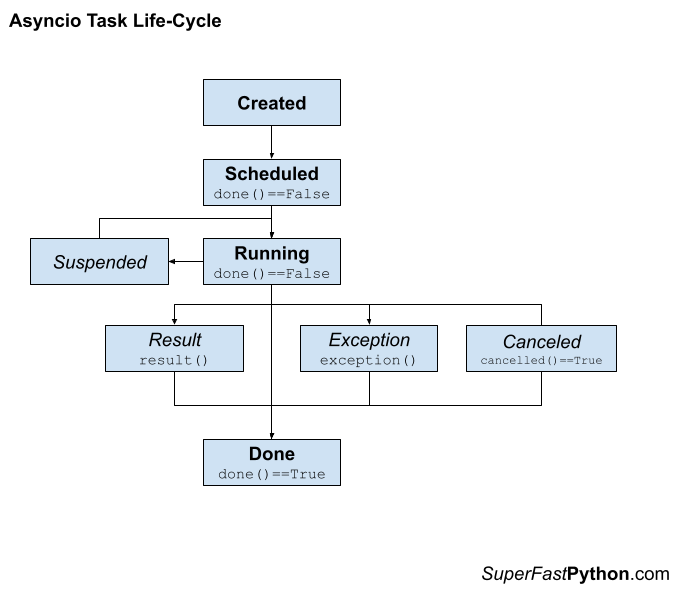

# Python Asyncio: 完整指南

**Python Asyncio: The Complete Guide**

=== "英文"

    **Asyncio** allows us to use asynchronous programming with coroutine-based concurrency in Python.

    Although asyncio has been available in Python for many years now, it remains one of the most interesting and yet one of the most frustrating areas of Python.

    It is just plain hard to get started with asyncio for new developers.

    This guide provides a detailed and comprehensive(全面的) review of asyncio in Python, including how to define, create and run coroutines, what is asynchronous programming, what is non-blocking-io, concurrency primitives(原始并发) used with coroutines, common questions, and best practices.

    This is a massive 29,000+ word guide. You may want to bookmark it so you can refer to it as you develop your concurrent programs.

    Let’s dive in.

=== "中文"

    **Asyncio** 允许我们在 Python 中使用基于协程的并发的异步编程。

    尽管 asyncio 已经在 Python 中使用很多年了，但它仍然是 Python 中最有趣但也是最令人沮丧的领域之一。

    对于新开发人员来说，开始使用 asyncio 非常困难。

    本指南对 Python 中的 asyncio 进行了详细而全面的回顾，包括如何定义、创建和运行协程、什么是异步编程、什么是非阻塞 io、与协程一起使用的并发原语、 常见问题和最佳实践。

    这是一本超过 29,000 字的海量指南。 您可能需要为其添加书签，以便在开发并发程序时可以参考它。

    让我们深入了解一下。

## 1. 什么是异步编程

**1. What is Asynchronous Programming**

=== "英文"

    Asynchronous programming is a programming paradigm that does not block.

    Instead, requests and function calls are issued and executed somehow in the background at some future time. This frees the caller to perform other activities and handle the results of issued calls at a later time when results are available or when the caller is interested.

    Let’s get a handle on asynchronous programming before we dive into asyncio.

=== "中文"

    异步编程是一种不会阻塞的编程范式。

    相反，请求和函数调用会在将来的某个时间在后台以某种方式抛出和执行。 这使得调用者可以自由地执行其他活动，并在稍后当结果可用或调用者感兴趣时处理抛出的待执行任务。

    在深入了解 asyncio 之前，让我们先了解一下异步编程。

### 1.1 异步任务

**1.1 Asynchronous Tasks**

=== "英文"

    Asynchronous means not at the same time, as opposed to synchronous or at the same time.

    > asynchronous: not simultaneous or concurrent in time
    >
    > — [MERRIAM-WEBSTER DICTIONARY](https://www.merriam-webster.com/dictionary/asynchronous)
    
    When programming, [asynchronous](https://en.wikipedia.org/wiki/Asynchrony_(computer_programming)) means that the action is requested, although not performed at the time of the request. It is performed later.

    > Asynchronous: Separate execution streams that can run concurrently in any order relative to each other are asynchronous.
    >
    > — PAGE 265, [THE ART OF CONCURRENCY](https://amzn.to/3TkCuwX), 2009.
    
    For example, we can make an asynchronous function call.

    This will issue the request to make the function call and will not wait around for the call to complete. We can choose to check on the status or result of the function call later.

    - **Asynchronous Function Call**: Request that a function is called at some time and in some manner, allowing the caller to resume and perform other activities.

    The function call will happen somehow and at some time, in the background, and the program can perform other tasks or respond to other events.

    This is key. We don’t have control over how or when the request is handled, only that we would like it handled while the program does other things.

    Issuing an asynchronous function call often results in some handle on the request that the caller can use to check on the status of the call or get results. This is often called a future.

    - **Future**: A handle on an asynchronous function call allowing the status of the call to be checked and results to be retrieved.

    The combination of the asynchronous function call and future together is often referred to as an asynchronous task. This is because it is more elaborate than a function call, such as allowing the request to be canceled and more.

    - **Asynchronous Task**: Used to refer to the aggregate of an asynchronous function call and resulting future.

=== "中文"

    异步意味着不在同一时刻, 与同步或同时相对.

    > 异步(asynchronous): 时间上不同一时刻或同时进行。
    >
    > — [MERRIAM-WEBSTER DICTIONARY](https://www.merriam-webster.com/dictionary/asynchronous)
    
    编程时，[异步(asynchronous)](https://en.wikipedia.org/wiki/Asynchrony_(computer_programming)) 意味着请求操作，尽管在请求时并未执行。 这是稍后执行的。

    > 异步(Asynchronous): 可以以相对于彼此的任何顺序同时运行的单独执行流是异步的。
    >
    > — PAGE 265, [并发的艺术](https://amzn.to/3TkCuwX), 2009.
    
    例如，我们可以进行异步函数调用。

    这将发出进行函数调用的请求，并且不会等待调用完成。 我们可以选择稍后检查函数调用的状态或结果。

    - **异步函数调用(Asynchronous Function Call)**: 请求在某个时间以某种方式调用某个函数，从而允许调用者恢复并执行其他活动。
    
    函数调用将以某种方式在某个时间在后台发生，并且程序可以执行其他任务或响应其他事件。

    这是关键。 我们无法控制如何或何时处理请求，只是我们希望在程序执行其他操作时处理它。

    发出异步函数调用通常会产生请求的某些句柄，调用者可以使用该句柄检查调用的状态或获取结果。 这通常被称为未来(future)。

    - **Future**: 异步函数调用的句柄，允许检查调用的状态并检索结果。

    异步函数调用和 future 的组合通常称为异步任务。 这是因为它比函数调用更复杂，例如允许取消请求等等。

    - **异步任务(Asynchronous Task)**: 用于指异步函数调用和结果 future 的聚合。

### 1.2 异步编程

**1.2 Asynchronous Programming**

=== "英文"

    Issuing asynchronous tasks and making asynchronous function calls is referred to as asynchronous programming.

    > So what is asynchronous programming? It means that a particular long-running task can be run in the background separate from the main application. Instead of blocking all other application code waiting for that long-running task to be completed, the system is free to do other work that is not dependent on that task. Then, once the long-running task is completed, we’ll be notified that it is done so we can process the result.
    >
    > — PAGE 3, [PYTHON CONCURRENCY WITH ASYNCIO](https://amzn.to/3Cz7Zh6), 2022.

    - **Asynchronous Programming**: The use of asynchronous techniques, such as issuing asynchronous tasks or function calls.

    Asynchronous programming is primarily used with non-blocking I/O, such as reading and writing from socket connections with other processes or other systems.

    > In non-blocking mode, when we write bytes to a socket, we can just fire and forget the write or read, and our application can go on to perform other tasks.
    >
    > — PAGE 18, [PYTHON CONCURRENCY WITH ASYNCIO](https://amzn.to/3Cz7Zh6), 2022.

    Non-blocking I/O is a way of performing I/O where reads and writes are requested, although performed asynchronously. The caller does not need to wait for the operation to complete before returning.

    The read and write operations are performed somehow (e.g. by the underlying operating system or systems built upon it), and the status of the action and/or data is retrieved by the caller later, once available, or when the caller is ready.

    - **Non-blocking I/O**: Performing I/O operations via asynchronous requests and responses, rather than waiting for operations to complete.

    As such, we can see how non-blocking I/O is related to asynchronous programming. In fact, we use non-blocking I/O via asynchronous programming, or non-blocking I/O is implemented via asynchronous programming.

    The combination of non-blocking I/O with asynchronous programming is so common that it is commonly referred to by the shorthand of [asynchronous I/O](https://en.wikipedia.org/wiki/Asynchronous_I/O).

    - **Asynchronous I/O**: A shorthand that refers to combining asynchronous programming with non-blocking I/O.

    Next, let’s consider asynchronous programming support in Python.

=== "中文"

    发出异步任务和进行异步函数调用称为异步编程。

    > 那么什么是异步编程呢？ 这意味着特定的长时间运行的任务可以在与主应用程序分开的后台运行。 系统不会阻塞所有其他应用程序代码等待该长时间运行的任务完成，而是可以自由地执行不依赖于该任务的其他工作。 然后，一旦长时间运行的任务完成，我们就会收到通知，以便我们可以处理结果。
    >
    > — PAGE 3, [PYTHON CONCURRENCY WITH ASYNCIO](https://amzn.to/3Cz7Zh6), 2022.

    - **异步编程(Asynchronous Programming)**: 使用异步技术，例如发出异步任务或函数调用。

    异步编程主要用于非阻塞 I/O，例如从与其他进程或其他系统的套接字连接进行读写。

    > 在非阻塞模式下，当我们向套接字写入字节时，我们可以直接触发并忘记写入或读取，并且我们的应用程序可以继续执行其他任务。
    >
    > — PAGE 18, [PYTHON CONCURRENCY WITH ASYNCIO](https://amzn.to/3Cz7Zh6), 2022.

    非阻塞 I/O 是一种执行 I/O 的方式，其中请求读取和写入，但异步执行。 调用者无需等待操作完成即可返回。

    读取和写入操作以某种方式执行（例如，通过底层操作系统或构建在其上的系统），并且操作和/或数据的状态稍后由调用者检索，一旦可用，或者当调用者准备好时。

    - **非阻塞 I/O(Non-blocking I/O)**: 通过异步请求和响应执行 I/O 操作，而不是等待操作完成。

    因此，我们可以看到非阻塞 I/O 与异步编程的关系。 事实上，我们通过异步编程来使用非阻塞I/O，或者说非阻塞I/O是通过异步编程来实现的。

    非阻塞 I/O 与异步编程的结合非常常见，因此通常简称为[异步 I/O](https://en.wikipedia.org/wiki/Asynchronous_I/O)。

    - **异步I/O(Asynchronous I/O)**: 一种简写，指将异步编程与非阻塞 I/O 相结合。

    接下来，让我们研究一下 Python 中的异步编程支持。

### 1.3 Python 异步编程

**1.3 Asynchronous Programming in Python**

=== "英文"

    Broadly, asynchronous programming in Python refers to making requests and not blocking to wait for them to complete.
    
    We can implement asynchronous programming in Python in various ways, although a few are most relevant for Python concurrency.
    
    The first and obvious example is the [asyncio](https://docs.python.org/3/library/asyncio.html) module. This module directly offers an asynchronous programming environment using the async/await syntax and non-blocking I/O with sockets and subprocesses.
    
    > asyncio is short for asynchronous I/O. It is a Python library that allows us to run code using an asynchronous programming model. This lets us handle multiple I/O operations at once, while still allowing our application to remain responsive.
    >
    > — PAGE 3, [PYTHON CONCURRENCY WITH ASYNCIO](https://amzn.to/3Cz7Zh6), 2022.
    
    It is implemented using coroutines that run in an event loop that itself runs in a single thread.
    
    - **Asyncio**: An asynchronous programming environment provided in Python via the asyncio module.
    
    More broadly, Python offers threads and processes that can execute tasks asynchronously.
    
    For example, one thread can start a second thread to execute a function call and resume other activities. The operating system will schedule and execute the second thread at some time and the first thread may or may not check on the status of the task, manually.
    
    > Threads are asynchronous, meaning that they may run at different speeds, and any thread can halt for an unpredictable duration at any time.
    >
    > — PAGE 76, [THE ART OF MULTIPROCESSOR PROGRAMMING](https://amzn.to/3CC82J2), 2020.
    
    More concretely, Python provides executor-based thread pools and process pools in the [**ThreadPoolExecutor**](https://superfastpython.com/threadpoolexecutor-in-python/) and [**ProcessPoolExeuctor**](https://superfastpython.com/processpoolexecutor-in-python/) classes.
    
    These classes use the same interface and support asynchronous tasks via the **submit()** method that returns a **Future** object.
    
    > The concurrent.futures module provides a high-level interface for asynchronously executing callables. The asynchronous execution can be performed with threads, using ThreadPoolExecutor, or separate processes, using ProcessPoolExecutor.
    >
    > — [CONCURRENT.FUTURES — LAUNCHING PARALLEL TASKS](https://docs.python.org/3/library/concurrent.futures.html)
    
    The [multiprocessing](https://docs.python.org/3/library/multiprocessing.html) module also provides pools of workers using processes and threads in the [Pool](https://superfastpython.com/multiprocessing-pool-python/) and [ThreadPool](https://superfastpython.com/threadpool-python/) classes, forerunners to the **ThreadPoolExecutor** and **ProcessPoolExeuctor** classes.
    
    The capabilities of these classes are described in terms of worker execution tasks asynchronously. They explicitly provide synchronous (blocking) and asynchronous (non-blocking) versions of each method for executing tasks.
    
    For example, one may issue a one-off function call synchronously via the **apply()** method or asynchronously via the **apply_async()** method.
    
    > A process pool object which controls a pool of worker processes to which jobs can be submitted. It supports asynchronous results with timeouts and callbacks and has a parallel map implementation.
    >
    > — [MULTIPROCESSING — PROCESS-BASED PARALLELISM](https://docs.python.org/3/library/multiprocessing.html)
    
    There are other aspects of asynchronous programming in Python that are less strictly related to Python concurrency.
    
    For example, Python processes receive or handle signals asynchronously. Signals are fundamentally asynchronous events sent from other processes.
    
    This is primarily supported by the [**signal**](https://docs.python.org/3/library/signal.html) module.
    
    Now that we know about asynchronous programming, let’s take a closer look at asyncio.
    
    Run your loops using all CPUs, [download my FREE book](https://superfastpython.com/plip-incontent) to learn how.

=== "中文"

    从广义上讲，Python 中的异步编程是指发出请求而不是阻塞等待请求完成。
    
    我们可以通过多种方式在 Python 中实现异步编程，尽管其中一些与 Python 并发性最相关。
    
    第一个明显的例子是 [asyncio](https://docs.python.org/3/library/asyncio.html) 模块。 该模块使用 async/await 语法以及带有套接字和子进程的非阻塞 I/O 直接提供异步编程环境。
    
    > asyncio 是异步 I/O 的缩写。 它是一个 Python 库，允许我们使用异步编程模型运行代码。 这让我们可以同时处理多个 I/O 操作，同时仍然允许我们的应用程序保持响应能力。
    >
    > — PAGE 3, [PYTHON CONCURRENCY WITH ASYNCIO](https://amzn.to/3Cz7Zh6), 2022.
    
    它是使用在事件循环中运行的协程实现的，事件循环本身在单个线程中运行。
    
    - **Asyncio**: Python 通过 asyncio 模块提供的异步编程环境。
    
    更广泛地说，Python 提供了可以异步执行任务的线程和进程。
    
    例如，一个线程可以启动第二个线程来执行函数调用并恢复其他活动。 操作系统将在某个时间调度并执行第二个线程，第一个线程可能会也可能不会手动检查任务的状态。
    
    > 线程是异步的，这意味着它们可能以不同的速度运行，并且任何线程都可能随时停止不可预测的持续时间。
    >
    > — PAGE 76, [THE ART OF MULTIPROCESSOR PROGRAMMING](https://amzn.to/3CC82J2), 2020.

    更具体地说，Python 在 [**ThreadPoolExecutor**](https://superfastpython.com/threadpoolexecutor-in-python/) 和 [**ProcessPoolExeuctor**](https://superfastpython.com/processpoolexecutor-in-python/) 类中提供了基于执行器的线程池和进程池。
    
    这些类使用相同的接口，并通过返回 **Future** 对象的 **submit()** 方法支持异步任务。
    
    > Concurrent.futures 模块为异步执行可调用对象提供了一个高级接口。 异步执行可以使用 ThreadPoolExecutor 通过线程执行，也可以使用 ProcessPoolExecutor 通过单独的进程执行。
    >
    > — [CONCURRENT.FUTURES — LAUNCHING PARALLEL TASKS](https://docs.python.org/3/library/concurrent.futures.html)
    
    [multiprocessing](https://docs.python.org/3/library/multiprocessing.html) 模块还提供使用 [Pool](https://superfastpython.com/multiprocessing-pool-python/) 和 [ThreadPool](https://superfastpython.com/threadpool-python/) 类中的进程和线程的工作线程池，这些类是 **ThreadPoolExecutor** 和 **ProcessPoolExeuctor** 类的前置运行器。

    这些类的功能是根据异步执行任务来描述的。 它们明确提供用于执行任务的每个方法的同步（阻塞）和异步（非阻塞）版本。
    
    例如，可以通过 **apply()** 方法同步发出一次性函数调用，或通过 **apply_async()** 方法异步发出一次性函数调用。
    
    > 一个进程池对象，它控制可以向其提交作业的工作进程池。 它支持带有超时和回调的异步结果，并具有并行映射实现。
    >
    > — [MULTIPROCESSING — PROCESS-BASED PARALLELISM](https://docs.python.org/3/library/multiprocessing.html)
    
    Python 中的异步编程还有其他方面与 Python 并发性的关系不太严格。
    
    例如，Python 进程异步接收或处理信号。 信号本质上是从其他进程发送的异步事件。
    
    这主要由 [**signal**](https://docs.python.org/3/library/signal.html) 模块支持。
    
    现在我们了解了异步编程，让我们仔细看看 asyncio。
    
    要使用所有 CPU 运行事件循环，可以[下载我的免费书](https://superfastpython.com/plip-incontent) 以了解如何操作。

## 2. Asyncio 是什么

**2. What is Asyncio**

=== "英文"

    Broadly, asyncio refers to the ability to implement asynchronous programming in Python using coroutines.
    
    Specifically, it refers to two elements:
    
    1. The addition of the **“asyncio”** module to the Python standard library in Python 3.4.
    2. The addition of **async/await** expressions to the Python language in Python 3.5.

    Together, the module and changes to the language facilitate the development of Python programs that support coroutine-based concurrency, non-blocking I/O, and asynchronous programming.
    
    > Python 3.4 introduced the asyncio library, and Python 3.5 produced the async and await keywords to use it palatably. These new additions allow so-called asynchronous programming.
    > 
    > — PAGE VII, [USING ASYNCIO IN PYTHON](https://amzn.to/3MQC92E), 2020.

    Let’s take a closer look at these two aspects of asyncio, starting with the changes to the language.

=== "中文"

    广义上，asyncio 是指在 Python 中使用协程实现异步编程的能力。
    
    具体来说，它指的是两个要素：
    
    1. Python 3.4 中向 Python 标准库添加了 **“asyncio”** 模块。
    2. Python 3.5 中向 Python 语言添加了 **async/await** 表达式。

    该模块的增加以及对语言的更改共同促进了支持基于协程的并发、非阻塞 I/O 和异步编程的 Python 程序的开发。
    
    > Python 3.4 引入了 asyncio 库，Python 3.5 生成了 async 和await 关键字以方便地使用它。 这些新增功能允许所谓的异步编程。
    >
    > — PAGE VII, [USING ASYNCIO IN PYTHON](https://amzn.to/3MQC92E), 2020.

    让我们从语言的变化开始，仔细看看 asyncio 的这两个方面。

### 2.1 对 Python 进行更改以添加对协程的支持

**2.1 Changes to Python to add Support for Coroutines**

=== "英文"

    The Python language was changed to accommodate asyncio with the addition of expressions and types.
    
    More specifically, it was changed to support coroutines as first-class concepts. In turn, coroutines are the unit of concurrency used in asyncio programs.
    
    A coroutine is a function that can be suspended and resumed.
    
    > coroutine: Coroutines are a more generalized form of subroutines. Subroutines are entered at one point and exited at another point. Coroutines can be entered, exited, and resumed at many different points.
    > 
    > — [PYTHON GLOSSARY](https://docs.python.org/3/glossary.html#term-coroutine)

    A coroutine can be defined via the [**“async def”**](https://superfastpython.com/asyncio-async-def/) expression. It can take arguments and return a value, just like a function.
    
    For example:
    
    ```python
    # define a coroutine
    async def custom_coro():
        # ...
    ```

    Calling a coroutine function will create a coroutine object, this is a new class. It does not execute the coroutine function.
    
    ```python
    ...
    # create a coroutine object
    coro = custom_coro()
    ```

    A coroutine can execute another coroutine via the await expression.
    
    This suspends the caller and schedules the target for execution.
    
    ```python
    ...
    # suspend and schedule the target
    await custom_coro()
    ```

    An asynchronous iterator is an iterator that yields awaitables.
    
    > asynchronous iterator: An object that implements the \_\_aiter\_\_() and \_\_anext\_\_() methods. \_\_anext\_\_ must return an awaitable object. async for resolves the awaitables returned by an asynchronous iterator’s \_\_anext\_\_() method until it raises a StopAsyncIteration exception.
    >
    > — [PYTHON GLOSSARY](https://docs.python.org/3/glossary.html)
    
    An asynchronous iterator can be traversed using the [**“async for”**](https://superfastpython.com/asyncio-async-for/) expression.
    
    ```python
    ...
    # traverse an asynchronous iterator
    async for item in async_iterator:
        print(item)
    ```
    
    This does not execute the for-loop in parallel.
    
    Instead, the calling coroutine that executes the for loop will suspend and internally await each awaitable yielded from the iterator.
    
    An asynchronous context manager is a context manager that can await the enter and exit methods.
    
    > An asynchronous context manager is a context manager that is able to suspend execution in its enter and exit methods.
    >
    > — [ASYNCHRONOUS CONTEXT MANAGERS AND “ASYNC WITH”](https://peps.python.org/pep-0492/#asynchronous-context-managers-and-async-with)

    The [**“async with”**](https://superfastpython.com/asyncio-async-with/) expression is for creating and using asynchronous context managers.
    
    The calling coroutine will suspend and await the context manager before entering the block for the context manager, and similarly when leaving the context manager block.
    
    These are the sum of the major changes to Python language to support coroutines.
    
    Next, let’s look at the asyncio module.

=== "中文"

    Python 语言已进行更改，以通过添加表达式和类型来适应 asyncio。
    
    更具体地说，它被更改为支持协程作为一流概念。 反过来，协程是异步程序中使用的并发单位。
    
    协程是一个可以暂停和恢复的函数。
    
    > **协程**(coroutine): 协程是更通用的子例程形式。 子程序在某一点进入并在另一点退出。 协程可以在许多不同的点进入、退出和恢复。
    > 
    > — [PYTHON GLOSSARY](https://docs.python.org/3/glossary.html#term-coroutine)

    协程可以通过 [**“async def”**](https://superfastpython.com/asyncio-async-def/) 表达式来定义。 它可以接受参数并返回一个值，就像函数一样。
    
    例如:
    
    ```python
    # 定义一个协程
    async def custom_coro():
        # ...
    ```

    调用协程函数会创建一个协程对象，这是一个新类。 它不执行协程函数。
    
    ```python
    ...
    # 创建一个协程对象
    coro = custom_coro()
    ```

    一个协程可以通过 await 表达式执行另一个协程。
    
    这会挂起调用者并安排目标执行。
    
    ```python
    ...
    # 暂停并安排目标
    await custom_coro()
    ```

    异步迭代器是产生可等待对象的迭代器。
    
    > **异步迭代器**（asynchronous iterator）: 实现 \_\_aiter\_\_() 和 \_\_anext\_\_() 方法的对象。 \_\_anext\_\_ 必须返回一个可等待的对象。 async for 解析异步迭代器的 \_\_anext\_\_() 方法返回的等待对象，直到引发 StopAsyncIteration 异常。
    >
    > — [PYTHON GLOSSARY](https://docs.python.org/3/glossary.html)
    
    可以使用 [**“async for”**](https://superfastpython.com/asyncio-async-for/) 表达式遍历异步迭代器。
    
    ```python
    ...
    # 遍历异步迭代器
    async for item in async_iterator:
        print(item)
    ```
    
    这不会并行执行 for 循环。
    
    相反，执行 for 循环的调用协程**将挂起并在内部等待迭代器生成的每个可等待项**。
    
    异步上下文管理器是可以等待进入和退出方法的上下文管理器。
    
    > 异步上下文管理器是能够在其进入和退出方法中暂停执行的上下文管理器。
    >
    > — [ASYNCHRONOUS CONTEXT MANAGERS AND “ASYNC WITH”](https://peps.python.org/pep-0492/#asynchronous-context-managers-and-async-with)

    [**“async with”**](https://superfastpython.com/asyncio-async-with/) 表达式用于创建和使用异步上下文管理器。
    
    在进入上下文管理器块之前，调用协程将挂起并等待上下文管理器，在离开上下文管理器块时也是如此。
    
    这些是 Python 语言为支持协程而进行的主要更改的总和。
    
    接下来，让我们看看 asyncio 模块。

### 2.2 asyncio 模块

**2.2 The asyncio Module**

=== "英文"

    The **“asyncio”** module provides functions and objects for developing coroutine-based programs using the asynchronous programming paradigm.
    
    Specifically, it supports non-blocking I/O with subprocesses (for executing commands) and with streams (for TCP socket programming).
    
    > asyncio is a library to write concurrent code using the async/await syntax.
    >
    > — [ASYNCIO — ASYNCHRONOUS I/O](https://docs.python.org/3/library/asyncio.html)
    
    Central to the asyncio module is the event loop.
    
    This is the mechanism that runs a coroutine-based program and implements cooperative multitasking between coroutines.
    
    > The event loop is the core of every asyncio application. Event loops run asynchronous tasks and callbacks, perform network IO operations, and run subprocesses.
    >
    > — [ASYNCIO EVENT LOOP](https://docs.python.org/3/library/asyncio-eventloop.html)
    
    The module provides both a high-level and low-level API.
    
    The high-level API is for us Python application developers. The low-level API is for framework developers, not us, in most cases.
    
    Most use cases are satisfied using the high-level API that provides utilities for working with coroutines, streams, synchronization primitives, subprocesses, and queues for sharing data between coroutines.
    
    The lower-level API provides the foundation for the high-level API and includes the internals of the event loop, transport protocols, policies, and more.
    
    > … there are low-level APIs for library and framework developers
    >
    > — [ASYNCIO — ASYNCHRONOUS I/O](https://docs.python.org/3/library/asyncio.html)
    
    Now that we know what asyncio is, broadly, and that it is for Asynchronous programming.
    
    Next, let’s explore when we should consider using asyncio in our Python programs.
    
    **Confused by the asyncio module API?**
    
    Download my FREE [PDF cheat sheet](https://marvelous-writer-6152.ck.page/d29b7d8dfb)

=== "中文"

    **“asyncio”**模块提供了使用异步编程范例开发基于协程的程序的函数和对象。
    
    具体来说，它支持带有子进程（用于执行命令）和流（用于 TCP 套接字编程）的非阻塞 I/O。
    
    > asyncio 是一个使用 async/await 语法编写并发代码的库。
    >
    > — [ASYNCIO — ASYNCHRONOUS I/O](https://docs.python.org/3/library/asyncio.html)
    
    asyncio 模块的核心是**事件循环**。
    
    这是运行基于协程的程序并实现协程之间协作多任务的机制。
    
    > **事件循环**是每个异步应用程序的核心。 事件循环运行异步任务和回调、执行网络 IO 操作并运行子进程。
    >
    > — [ASYNCIO EVENT LOOP](https://docs.python.org/3/library/asyncio-eventloop.html)
    
    该模块提供高级和低级 API。
    
    高级 API 适合我们 Python 应用程序开发人员。 在大多数情况下，低级 API 是为框架开发人员提供的，而不是我们。
    
    大多数用例都可以使用高级 API 来满足，该 API 提供了用于处理协程、流、同步基元、子进程和队列以在协程之间共享数据的实用程序。
    
    较低级别的 API 为高级 API 提供基础，包括事件循环、传输协议、策略等的内部结构。
    
    > … 有供库和框架开发人员使用的低级 API
    >
    > — [ASYNCIO — ASYNCHRONOUS I/O](https://docs.python.org/3/library/asyncio.html)
    
    现在我们大致了解了 asyncio 是什么，并且它用于异步编程。
    
    接下来，让我们探讨一下何时应该考虑在 Python 程序中使用 asyncio。
    
    **对 asyncio 模块 API 感到困惑吗？**
    
    下载我的免费 [PDF 备忘单](https://marvelous-writer-6152.ck.page/d29b7d8dfb)

## 3. Asyncio 在什么时候使用

**3. When to Use Asyncio**

=== "英文"

    Asyncio, broadly, is new, popular, much discussed, and exciting.
    
    Nevertheless, there is a lot of confusion over when it should be adopted in a project.
    
    When should we use asyncio in Python?

=== "中文"

    从广义上讲，Asyncio 是新的、流行的、讨论较多且令人兴奋的。
    
    然而，对于何时应该在项目中采用它存在很多困惑。
    
    我们什么时候应该在Python中使用asyncio？

### 3.1 使用Python Asyncio的原因

**3.1 Reasons to Use Asyncio in Python**

=== "英文"

    There are perhaps 3 top-level reasons to use asyncio in a Python project.
    
    They are:
    
    Use asyncio in order to adopt coroutines in your program.
    Use asyncio in order to use the asynchronous programming paradigm.
    Use asyncio in order to use non-blocking I/O.

=== "中文"

    在 Python 项目中使用 asyncio 可能有 3 个最重要的原因。
    
    他们是:
    
    1. 使用 asyncio 以便在程序中采用协程。
    2. 使用 asyncio 以便使用异步编程范例。
    3. 使用 asyncio 以便使用非阻塞I/O。

#### 3.1.1 原因 1: 使用协程

**3.1.1 Reason 1: To Use Coroutines**

=== "英文"

    We may choose to use asyncio because we want to use coroutines.
    
    We may want to use coroutines because we can have many more concurrent coroutines in our program than concurrent threads.
    
    Coroutines are another unit of concurrency, like threads and processes.
    
    Thread-based concurrency is provided by the threading module and is supported by the underlying operating system. It is suited to blocking I/O tasks such reading and writing from files, sockets, and devices.
    
    Process-based concurrency is provided by the multiprocessing module and is also supported by the underlying operating system, like threads. It is suited to CPU-bound tasks that do not require much inter-process communication, such as compute tasks.
    
    Coroutines are an alternative that is provided by the Python language and runtime (standard interpreter) and further supported by the asyncio module. They are suited to non-blocking I/O with subprocesses and sockets, however, blocking I/O and CPU-bound tasks can be used in a simulated non-blocking manner using threads and processes under the covers.
    
    This last point is subtle and key. Although we can choose to use coroutines for the capability for which they were introduced into Python, non-blocking, we may in fact use them with any tasks. Any program written with threads or processes can be rewritten or instead written using coroutines if we so desire.
    
    Threads and processes achieve multitasking via the operating system that chooses which threads and processes should run, when, and for how long. The operating switches between threads and processes rapidly, suspending those that are not running and resuming those granted time to run. This is called preemptive multitasking.
    
    Coroutines in Python provide an alternative type of multitasking called cooperating multitasking.
    
    A coroutine is a subroutine (function) that can be suspended and resumed. It is suspended by the await expression and resumed once the await expression is resolved.
    
    This allows coroutines to cooperate by design, choosing how and when to suspend their execution.
    
    It is an alternate, interesting, and powerful approach to concurrency, different from thread-based and process-based concurrency.
    
    This alone may make it a reason to adopt it for a project.
    
    Another key aspect of coroutines is that they are lightweight.
    
    They are more lightweight than threads. This means they are faster to start and use less memory. Essentially a coroutine is a special type of function, whereas a thread is represented by a Python object and is associated with a thread in the operating system with which the object must interact.
    
    As such, we may have thousands of threads in a Python program, but we could easily have tens or hundreds of thousands of coroutines all in one thread.
    
    We may choose coroutines for their scalability.

=== "中文"

    我们可能会选择使用 asyncio，因为我们想使用协程。
    
    我们可能想要使用协程，因为我们的程序中可以有比并发线程更多的并发协程。
    
    协程是另一个并发单元，就像线程和进程一样。
    
    基于线程的并发由线程模块提供，并由底层操作系统支持。 它适合阻塞 I/O 任务，例如从文件、套接字和设备读取和写入。
    
    基于进程的并发性由多处理模块提供，并且也受到底层操作系统（如线程）的支持。 它适用于不需要太多进程间通信的 CPU 密集型任务，例如计算任务。
    
    协程是由 Python 语言和运行时（标准解释器）提供的替代方案，并由 asyncio 模块进一步支持。 它们适用于带有子进程和套接字的非阻塞 I/O，但是，阻塞 I/O 和 CPU 密集型任务可以在幕后使用线程和进程以模拟非阻塞方式使用。
    
    最后一点是微妙而关键的。 尽管我们可以选择使用协程来实现 Python 中引入的非阻塞功能，但实际上我们可以将它们用于任何任务。 如果我们愿意，任何使用线程或进程编写的程序都可以重写或使用协程编写。
    
    线程和进程通过操作系统选择哪些线程和进程应该运行、何时运行以及运行多长时间来实现多任务处理。 操作在线程和进程之间快速切换，暂停那些未运行的线程和进程，并恢复那些授予时间运行的线程和进程。 这称为抢占式多任务处理。
    
    Python 中的协程提供了另一种多任务处理类型，称为**协作多任务处理**(cooperating multitasking)。
    
    协程是可以暂停和恢复的子例程（函数）。 它由 await 表达式挂起，并在 await 表达式解析后恢复。
    
    这允许协程通过设计进行合作，选择如何以及何时暂停执行。
    
    它是一种替代的、有趣的、强大的并发方法，不同于基于线程和基于进程的并发。
    
    仅此一点就可以成为在项目中采用它的理由。
    
    协程的另一个关键方面是它们是轻量级的。
    
    它们比线程更轻量。 这意味着它们的启动速度更快并且使用的内存更少。 本质上，协程是一种特殊类型的函数，而线程则由 Python 对象表示，并与操作系统中必须与该对象交互的线程相关联。
    
    因此，**Python 程序中可能有数千个线程，但我们可以轻松地将数万或数十万个协程集中在一个线程中。**
    
    我们可能会因为协程的可扩展性而选择它们。

#### 3.1.2 原因 2: 使用异步编程

**3.1.2 Reason 2: To Use Asynchronous Programming**

=== "英文"

    We may choose to use asyncio because we want to use asynchronous programming in our program.
    
    That is, we want to develop a Python program that uses the asynchronous programming paradigm.
    
    Asynchronous means not at the same time, as opposed to synchronous or at the same time.
    
    When programming, asynchronous means that the action is requested, although not performed at the time of the request. It is performed later.
    
    Asynchronous programming often means going all in and designing the program around the concept of asynchronous function calls and tasks.
    
    Although there are other ways to achieve elements of asynchronous programming, full asynchronous programming in Python requires the use of coroutines and the asyncio module.
    
    > It is a Python library that allows us to run code using an asynchronous programming model.
    >
    > — PAGE 3, [PYTHON CONCURRENCY WITH ASYNCIO](https://amzn.to/3Cz7Zh6), 2022.
    
    We may choose to use asyncio because we want to use the asynchronous programming module in our program, and that is a defensible reason.
    
    To be crystal clear, this reason is independent of using non-blocking I/O. Asynchronous programming can be used independently of non-blocking I/O.
    
    As we saw previously, coroutines can execute non-blocking I/O asynchronously, but the asyncio module also provides the facility for executing blocking I/O and CPU-bound tasks in an asynchronous manner, simulating non-blocking under the covers via threads and processes.

=== "中文"

    我们可能会选择使用asyncio，因为我们想在我们的程序中使用异步编程。
    
    也就是说，我们要开发一个使用异步编程范式的Python程序。
    
    异步意味着不同时，与同步或同时相对。
    
    编程时，异步意味着请求操作，但未在请求时执行。 这是稍后执行的。
    
    异步编程通常意味着围绕异步函数调用和任务的概念全力以赴并设计程序。
    
    尽管还有其他方法可以实现异步编程的元素，但 Python 中的完全异步编程需要使用协程和 asyncio 模块。
    
    > 它是一个 Python 库，允许我们使用异步编程模型运行代码。
    >
    > — PAGE 3, [PYTHON CONCURRENCY WITH ASYNCIO](https://amzn.to/3Cz7Zh6), 2022.
    
    我们可能会选择使用asyncio，因为我们想在我们的程序中使用异步编程模块，这是一个有道理的理由。
    
    明确地说，这个原因与使用非阻塞 I/O 无关。 异步编程可以独立于非阻塞 I/O 使用。
    
    正如我们之前所看到的，协程可以异步执行非阻塞 I/O，但 asyncio 模块还提供了以异步方式执行阻塞 I/O 和 CPU 密集型任务的工具，通过线程和 流程。

#### 3.1.3 原因 3: 使用非阻塞I/O

**3.1.3 Reason 3: To Use Non-Blocking I/O**

=== "英文"

    We may choose to use asyncio because we want or require non-blocking I/O in our program.
    
    Input/Output or I/O for short means reading or writing from a resource.
    
    Common examples include:
    
    - Hard disk drives: Reading, writing, appending, renaming, deleting, etc. files.
    - Peripherals: mouse, keyboard, screen, printer, serial, camera, etc.
    - Internet: Downloading and uploading files, getting a webpage, querying RSS, etc.
    - Database: Select, update, delete, etc. SQL queries.
    - Email: Send mail, receive mail, query inbox, etc.
    
    These operations are slow, compared to calculating things with the CPU.
    
    The common way these operations are implemented in programs is to make the read or write request and then wait for the data to be sent or received.
    
    As such, these operations are commonly referred to as blocking I/O tasks.
    
    The operating system can see that the calling thread is blocked and will context switch to another thread that will make use of the CPU.
    
    This means that the blocking call does not slow down the entire system. But it does halt or block the thread or program making the blocking call.
    
    You can learn more about blocking calls in the tutorial:
    
    - [Thread Blocking Call in Python](https://superfastpython.com/thread-blocking-call-in-python/)
    
    Non-blocking I/O is an alternative to blocking I/O.
    
    It requires support in the underlying operating system, just like blocking I/O, and all modern operating systems provide support for some form of non-blocking I/O.
    
    Non-blocking I/O allows read and write calls to be made as asynchronous requests.
    
    The operating system will handle the request and notify the calling program when the results are available.
    
    - **Non-blocking I/O**: Performing I/O operations via asynchronous requests and responses, rather than waiting for operations to complete.
    
    As such, we can see how non-blocking I/O is related to asynchronous programming. In fact, we use non-blocking I/O via asynchronous programming, or non-blocking I/O is implemented via asynchronous programming.
    
    The combination of non-blocking I/O with asynchronous programming is so common that it is commonly referred to by the shorthand of asynchronous I/O.
    
    - **Asynchronous I/O**: A shorthand that refers to combining asynchronous programming with non-blocking I/O.
    T
    he asyncio module in Python was added specifically to add support for non-blocking I/O with subprocesses (e.g. executing commands on the operating system) and with streams (e.g. TCP socket programming) to the Python standard library.
    
    We could simulate non-blocking I/O using threads and the asynchronous programming capability provided by Python thread pools or thread pool executors.
    
    The asyncio module provides first-class asynchronous programming for non-blocking I/O via coroutines, event loops, and objects to represent non-blocking subprocesses and streams.
    
    We may choose to use asyncio because we want to use asynchronous I/O in our program, and that is a defensible reason.

=== "中文"

    我们可能会选择使用 asyncio，因为我们希望或需要在程序中使用非阻塞 I/O。
    
    输入/输出或简称 I/O 表示从资源中读取或写入。
    
    常见的例子包括：
    
    - 硬盘驱动器：读取、写入、追加、重命名、删除等文件。
    - 外设：鼠标、键盘、屏幕、打印机、串口、摄像头等。
    - 互联网：下载和上传文件、获取网页、查询RSS等。
    - 数据库：查询、更新、删除等SQL查询。
    - 电子邮件：发送邮件、接收邮件、查询收件箱等。
    
    与使用 CPU 进行计算相比，这些操作速度很慢。
    
    在程序中实现这些操作的常见方式是发出读或写请求，然后等待数据发送或接收。
    
    因此，这些操作通常称为阻塞 I/O 任务。
    
    操作系统可以看到调用线程被阻塞，并将上下文切换到另一个将使用 CPU 的线程。
    
    这意味着阻塞调用不会减慢整个系统的速度。 但它确实会停止或阻止进行阻塞调用的线程或程序。
    
    这意味着阻塞调用不会减慢整个系统的速度。 但它确实会停止或阻止进行阻塞调用的线程或程序。
    
    - [Python 中的线程阻塞调用](https://superfastpython.com/thread-blocking-call-in-python/)
    
    非阻塞 I/O 是阻塞 I/O 的替代方案。
    
    它需要底层操作系统的支持，就像阻塞 I/O 一样，所有现代操作系统都提供对某种形式的非阻塞 I/O 的支持。
    
    非阻塞 I/O 允许将读取和写入调用作为异步请求进行。
    
    操作系统将处理请求并在结果可用时通知调用程序。
    
    - **非阻塞 I/O**：通过异步请求和响应执行 I/O 操作，而不是等待操作完成。
    
    因此，我们可以看到非阻塞 I/O 与异步编程的关系。 事实上，我们通过异步编程来使用非阻塞I/O，或者说非阻塞I/O是通过异步编程来实现的。
    
    非阻塞 I/O 与异步编程的结合非常常见，因此通常简称为异步 I/O。
    
    - **异步 I/O**：一种简写，指的是异步编程与非阻塞 I/O 的结合。
    
    Python 中的 asyncio 模块是专门为 Python 标准库添加对带有子进程（例如在操作系统上执行命令）和流（例如 TCP 套接字编程）的非阻塞 I/O 的支持而添加的。
    
    我们可以使用线程以及Python线程池或线程池执行器提供的异步编程功能来模拟非阻塞I/O。
    
    asyncio 模块通过协程、事件循环和对象来表示非阻塞子进程和流，为非阻塞 I/O 提供一流的异步编程。
    
    我们可能会选择使用 asyncio，因为我们想在程序中使用异步 I/O，这是一个合理的理由。

### 3.2 使用Asyncio的其他原因

**3.2 Other Reasons to Use Asyncio**

=== "英文"

    Ideally, we would choose a reason that is defended in the context of the requirements of the project.
    
    Sometimes we have control over the function and non-functional requirements and other times not. In the cases we do, we may choose to use asyncio for one of the reasons listed above. In the cases we don’t, we may be led to choose asyncio in order to deliver a program that solves a specific problem.
    
    Some other reasons we may use asyncio include:
    
    1. Use asyncio because someone else made the decision for you.
    2. Use asyncio because the project you have joined is already using it.
    3. Use asyncio because you want to learn more about it.
    
    We don’t always have full control over the projects we work on.
    
    It is common to start a new job, new role, or new project and be told by the line manager or lead architect of specific design and technology decisions.
    
    Using asyncio may be one of these decisions.
    
    We may use asyncio on a project because the project is already using it. You must use asyncio, rather than you choose to use asyncio.
    
    A related example might be the case of a solution to a problem that uses asyncio that you wish to adopt.
    
    For example:
    
    - Perhaps you need to use a third-party API and the code examples use asyncio.
    - Perhaps you need to integrate an existing open-source solution that uses asyncio.
    - Perhaps you stumble across some code snippets that do what you need, yet they use asyncio.
    
    For lack of alternate solutions, asyncio may be thrust upon you by your choice of solution.
    
    Finally, we may choose asyncio for our Python project to learn more about.
    
    You may scoff, “what about the requirements?”
    
    You may choose to adopt asyncio just because you want to try it out and it can be a defensible reason.
    
    Using asyncio in a project will make its workings concrete for you.

=== "中文"

    理想情况下，我们会选择一个在项目要求的背景下得到辩护的理由。
    
    有时我们可以控制函数和非函数需求，有时则不能。 在这种情况下，出于上述原因之一，我们可能会选择使用 asyncio。 在我们不这样做的情况下，我们可能会选择 asyncio 来交付解决特定问题的程序。
    
    我们可能使用 asyncio 的其他一些原因包括：
    
    1. 使用 asyncio 因为其他人已经为你做出了决定。
    2. 使用 asyncio，因为您加入的项目已经在使用它。
    3. 使用 asyncio 因为您想了解更多有关它的信息。
    
    我们并不总是能够完全控制我们所从事的项目。
    
    开始一项新工作、新角色或新项目并由直线经理或首席架构师告知具体设计和技术决策是很常见的。
    
    使用 asyncio 可能是这些决定之一。
    
    我们可能在项目上使用 asyncio，因为该项目已经在使用它。 你必须使用asyncio，而不是你选择使用asyncio。
    
    一个相关的示例可能是使用您希望采用的 asyncio 解决问题的情况。
    
    例如：
    
    - 也许您需要使用第三方 API，并且代码示例使用 asyncio。
    - 也许您需要集成使用 asyncio 的现有开源解决方案。
    - 也许您偶然发现一些代码片段可以满足您的需要，但它们使用 asyncio。
    
    由于缺乏替代解决方案，asyncio 可能会因您选择的解决方案而强加给您。
    
    最后，我们可以为我们的Python项目选择asyncio来了解更多。

    你可能会嘲笑，“那要求呢？”

    您可能选择采用 asyncio 只是因为您想尝试一下，并且这是一个合理的理由。

    在项目中使用 asyncio 将使您的工作更加具体。

### 3.3 Asyncio在什么时候不适用

**3.3 When to Not Use Asyncio**

=== "英文"

    We have spent a lot of time on reasons why we should use asyncio.
    
    It is probably a good idea to spend at least a moment on why we should not use it.
    
    One reason to not use asyncio is that you cannot defend its use using one of the reasons above.
    
    This is not foolproof. There may be other reasons to use it, not listed above.
    
    But, if you pick a reason to use asyncio and the reason feels thin or full of holes for your specific case. Perhaps asyncio is not the right solution.
    
    I think the major reason to not use asyncio is that it does not deliver the benefit that you think it does.
    
    There are many misconceptions about Python concurrency, especially around asyncio.
    
    For example:
    
    - Asyncio will work around the global interpreter lock.
    - Asyncio is faster than threads.
    - Asyncio avoids the need for mutex locks and other synchronization primitives.
    - Asyncio is easier to use than threads.
    
    These are all false.
    
    Only a single coroutine can run at a time by design, they cooperate to execute. This is just like threads under the GIL. In fact, the GIL is an orthogonal concern and probably irrelevant in most cases when using asyncio.
    
    Any program you can write with asyncio, you can write with threads and it will probably be as fast or faster. It will also probably be simpler and easier to read and interpret by fellow developers.
    
    Any concurrency failure mode you might expect with threads, you can encounter with coroutines. You must make coroutines safe from deadlocks and race conditions, just like threads.
    
    Another reason to not use asyncio is that you don’t like asynchronous programming.
    
    Asynchronous programming has been popular for some time now in a number of different programming communities, most notably the JavaScript community.
    
    It is different from procedural, object-oriented, and functional programming, and some developers just don’t like it.
    
    No problem. If you don’t like it, don’t use it. It’s a fair reason.
    
    You can achieve the same effect in many ways, notably by sprinkling a few asynchronous calls in via thread or process executors as needed.
    
    Now that we are familiar with when to use asyncio, let’s look at coroutines in more detail.

=== "中文"

    我们花了很多时间来解释为什么应该使用 asyncio。
    
    至少花一点时间来解释为什么我们不应该使用它可能是个好主意。

    不使用 asyncio 的原因之一是您无法使用上述原因之一来捍卫它的使用。

    这并不是万无一失的。 可能还有其他未在上面列出的原因使用它。

    但是，如果您选择使用 asyncio 的原因，并且对于您的具体情况来说，这个原因感觉很薄弱或充满漏洞。 也许 asyncio 不是正确的解决方案。

    我认为不使用 asyncio 的主要原因是它没有提供您认为的好处。

    关于 Python 并发，尤其是 asyncio，存在许多误解。
    
    例如:
    
    - Asyncio 将解决全局解释器锁问题。
    - 异步比线程更快。
    - Asyncio 避免了对互斥锁和其他同步原语的需要。
    - Asyncio 比线程更容易使用。
    
    这些都是假的。
    
    按照设计，一次只能运行一个协程，它们协作执行。 这就像 GIL 下的线程一样。 事实上，GIL 是一个正交问题，在大多数情况下使用 asyncio 时可能是不相关的。
    
    任何可以使用 asyncio 编写的程序，都可以使用线程编写，并且速度可能会一样快，甚至更快。 它也可能会更简单、更容易被其他开发人员阅读和解释。

    您可能会在线程中遇到任何并发故障模式，您可能会在协程中遇到这种情况。 您必须使协程免受死锁和竞争条件的影响，就像线程一样。

    不使用 asyncio 的另一个原因是您不喜欢异步编程。
    
    异步编程在许多不同的编程社区（尤其是 JavaScript 社区）中已经流行了一段时间。
    
    它不同于过程式、面向对象和函数式编程，有些开发人员就是不喜欢它。

    没问题。 如果您不喜欢它，请不要使用它。 这是一个合理的理由。

    您可以通过多种方式实现相同的效果，特别是根据需要通过线程或进程执行器进行一些异步调用。

    现在我们已经熟悉了何时使用 asyncio，让我们更详细地了解一下协程。

## 4. Python 中的协程

**4. Coroutines in Python**

=== "英文"

    Python provides first-class coroutines with a **“coroutine”** type and new expressions like **“async def”** and **“await“**.
    
    It provides the **“asyncio”** module for running coroutines and developing asynchronous programs.
    
    In this section, we will take a much closer look at coroutines.

=== "中文"

    Python 提供了一流的协程，具有 **“coroutine”** 类型和新表达式，例如 **“async def”** 和 **“await”**。
    
    它提供了**“asyncio”**模块来运行协程和开发异步程序。

    在本节中，我们将更仔细地了解协程。

### 4.1 什么是协程

**4.1 What is a Coroutine**

=== "英文"

    A [coroutine is a function](https://en.wikipedia.org/wiki/Coroutine) that can be suspended and resumed.
    
    It is often defined as a generalized subroutine.
    
    A subroutine can be executed, starting at one point and finishing at another point. Whereas, a coroutine can be executed then suspended, and resumed many times before finally terminating.
    
    Specifically, coroutines have control over when exactly they suspend their execution.
    
    This may involve the use of a specific expression, such as an “await” expression in Python, like a yield expression in a Python generator.
    
    > A coroutine is a method that can be paused when we have a potentially long-running task and then resumed when that task is finished. In Python version 3.5, the language implemented first-class support for coroutines and asynchronous programming when the keywords async and await were explicitly added to the language.
    >
    > — PAGE 3, [PYTHON CONCURRENCY WITH ASYNCIO](https://amzn.to/3ENILNs), 2022.
    
    A coroutine may suspend for many reasons, such as executing another coroutine, e.g. awaiting another task, or waiting for some external resources, such as a socket connection or process to return data.
    
    Coroutines are used for concurrency.
    
    > Coroutines let you have a very large number of seemingly simultaneous functions in your Python programs.
    >
    > — PAGE 267, [EFFECTIVE PYTHON](https://amzn.to/3eClkfe), 2019.
    
    Many coroutines can be created and executed at the same time. They have control over when they will suspend and resume, allowing them to cooperate as to when concurrent tasks are executed.
    
    This is called [cooperative multitasking](https://en.wikipedia.org/wiki/Cooperative_multitasking) and is different from the multitasking typically used with threads called preemptive multitasking tasking.
    
    > … in order to run multiple applications concurrently, processes voluntarily yield control periodically or when idle or logically blocked. This type of multitasking is called cooperative because all programs must cooperate for the scheduling scheme to work.
    >
    > — [COOPERATIVE MULTITASKING, WIKIPEDIA](https://en.wikipedia.org/wiki/Cooperative_multitasking)
    
    Preemptive multitasking involves the operating system choosing what threads to suspend and resume and when to do so, as opposed to the tasks themselves deciding in the case of cooperative multitasking.
    
    Now that we have some idea of what a coroutine is, let’s deepen this understanding by comparing them to other familiar programming constructs.

=== "中文"

    协程是一个可以[暂停和恢复的函数](https://en.wikipedia.org/wiki/Coroutine)。
    
    它通常被定义为广义子例程。
    
    可以执行子例程，从一点开始并在另一点结束。 然而，协程可以执行然后挂起，并在最终终止之前恢复多次。

    具体来说，协程可以控制何时暂停执行。

    这可能涉及特定表达式的使用，例如Python中的“await”表达式，就像Python生成器中的yield表达式一样。
    
    > 协程是一种可以在我们有可能长时间运行的任务时暂停并在该任务完成时恢复的方法。 在Python 3.5版本中，当关键字async和await被显式添加到语言中时，该语言实现了对协程和异步编程的一流支持。
    >
    > — PAGE 3, [PYTHON CONCURRENCY WITH ASYNCIO](https://amzn.to/3ENILNs), 2022.
    
    协程可能会因多种原因而挂起，例如执行另一个协程，例如 等待另一个任务，或者等待一些外部资源，例如套接字连接或进程返回数据。
    
    协程用于并发。
    
    > 协程让您可以在 Python 程序中拥有大量看似同时存在的函数。
    >
    > — PAGE 267, [EFFECTIVE PYTHON](https://amzn.to/3eClkfe), 2019.
    
    可以同时创建和执行许多协程。 它们可以控制何时挂起和恢复，从而允许它们在执行并发任务时进行合作。
    
    这称为“协作多任务处理”(https://en.wikipedia.org/wiki/Cooperative_multitasking)，与通常与线程一起使用的多任务处理（称为抢占式多任务处理）不同。
    
    > … 为了同时运行多个应用程序，进程会定期或在空闲或逻辑阻塞时自愿放弃控制权。 这种类型的多任务处理称为协作，因为所有程序都必须协作才能使调度方案发挥作用。
    >
    > — [COOPERATIVE MULTITASKING, WIKIPEDIA](https://en.wikipedia.org/wiki/Cooperative_multitasking)
    
    抢占式多任务处理涉及操作系统选择要挂起和恢复的线程以及何时执行，而不是在协作多任务处理的情况下由任务本身决定。
    
    现在我们已经了解了什么是协程，让我们通过将它们与其他熟悉的编程结构进行比较来加深理解。

### 4.2 协程与例程和子例程

**4.2 Coroutine vs Routine and Subroutine**

=== "英文"

    A “routine” and “subroutine” often refer to the same thing in modern programming.
    
    Perhaps more correctly, a routine is a program, whereas a [subroutine is a function](https://en.wikipedia.org/wiki/Function_(computer_programming)) in the program.
    
    A routine has subroutines.
    
    It is a discrete module of expressions that is assigned a name, may take arguments and may return a value.
    
    - **Subroutine**: A module of instructions that can be executed on demand, typically named, and may take arguments and return a value. also called a function
    
    A subroutine is executed, runs through the expressions, and returns somehow. Typically, a subroutine is called by another subroutine.
    
    A coroutine is an extension of a subroutine. This means that a subroutine is a special type of a coroutine.
    
    A coroutine is like a subroutine in many ways, such as:
    
    - They both are discrete named modules of expressions.
    - They both can take arguments, or not.
    - They both can return a value, or not.
    
    The main difference is that it chooses to suspend and resume its execution many times before returning and exiting.
    
    Both coroutines and subroutines can call other examples of themselves. A subroutine can call other subroutines. A coroutine executes other coroutines. However, a coroutine can also execute other subroutines.
    
    When a coroutine executes another coroutine, it must suspend its execution and allow the other coroutine to resume once the other coroutine has completed.
    
    This is like a subroutine calling another subroutine. The difference is the suspension of the coroutine may allow any number of other coroutines to run as well.
    
    This makes a coroutine calling another coroutine more powerful than a subroutine calling another subroutine. It is central to the cooperating multitasking facilitated by coroutines.

=== "中文"

    在现代编程中，“例程”和“子例程”通常指同一事物。
    
    也许更正确的是，例程是一个程序，而子例程是程序中的一个函数。

    例程有子例程。

    它是一个离散的表达式模块，被分配了一个名称，可以接受参数并且可以返回一个值。
    
    - **子例程(Subroutine)**: A module of instructions that can be executed on demand, typically named, and may take arguments and return a value. also called a function
    
    执行子例程，运行表达式，然后以某种方式返回。 通常，一个子例程被另一个子例程调用。
    
    协程是子程序的扩展。 这意味着子例程是一种特殊类型的协程。

    协程在很多方面都类似于子例程，例如：
    
    - 它们都是离散的命名表达式模块。
    - 他们都可以接受争论，也可以不接受争论。
    - 它们都可以返回值，也可以不返回值。
    
    主要区别在于，它在返回和退出之前多次选择暂停和恢复执行。
    
    协程和子例程都可以调用它们自己的其他示例。 一个子程序可以调用其他子程序。 协程执行其他协程。 然而，协程也可以执行其他子例程。

    当一个协程执行另一个协程时，它必须暂停执行，并在另一个协程完成后允许另一个协程恢复。

    这就像一个子例程调用另一个子例程。 不同之处在于协程的挂起可能允许任意数量的其他协程运行。

    这使得调用另一个协程的协程比调用另一个子例程的子例程更强大。 它是协程促进的协作多任务处理的核心。

### 4.3 协程与生成器

**4.3 Coroutine vs Generator**

=== "英文"

    A generator is a special function that can suspend its execution.
    
    > generator: A function which returns a generator iterator. It looks like a normal function except that it contains yield expressions for producing a series of values usable in a for-loop or that can be retrieved one at a time with the next() function.
    > 
    > — [PYTHON GLOSSARY](https://docs.python.org/3/glossary.html)
    
    A generator function can be defined like a normal function although it uses a yield expression at the point it will suspend its execution and return a value.
    
    A generator function will return a generator iterator object that can be traversed, such as via a for-loop. Each time the generator is executed, it runs from the last point it was suspended to the next yield statement.
    
    > generator iterator: An object created by a generator function. Each yield temporarily suspends processing, remembering the location execution state (including local variables and pending try-statements). When the generator iterator resumes, it picks up where it left off (in contrast to functions which start fresh on every invocation).
    > 
    > — [PYTHON GLOSSARY](https://docs.python.org/3/glossary.html)
    
    A coroutine can suspend or yield to another coroutine using an “await” expression. It will then resume from this point once the awaited coroutine has been completed.
    
    > Using this paradigm, an await statement is similar in function to a yield statement; the execution of the current function gets paused while other code is run. Once the await or yield resolves with data, the function is resumed.
    > 
    > — PAGE 218, [HIGH PERFORMANCE PYTHON](https://amzn.to/3rY7cQE), 2020.
    
    We might think of a generator as a special type of coroutine and cooperative multitasking used in loops.
    
    > Generators, also known as semicoroutines, are a subset of coroutines.
    > 
    > — [COROUTINE, WIKIPEDIA](https://en.wikipedia.org/wiki/Coroutine).
    
    Before coroutines were developed, generators were extended so that they might be used like coroutines in Python programs.
    
    This required a lot of technical knowledge of generators and the development of custom task schedulers.
    
    > To implement your own concurrency using generators, you first need a fundamental insight concerning generator functions and the yield statement. Specifically, the fundamental behavior of yield is that it causes a generator to suspend its execution. By suspending execution, it is possible to write a scheduler that treats generators as a kind of “task” and alternates their execution using a kind of cooperative task switching.
    >
    > — PAGE 524, **PYTHON COOKBOOK**, 2013.
    
    This was made possible via changes to the generators and the introduction of the **“yield from”** expression.
    
    These were later deprecated in favor of the modern async/await expressions.

=== "中文"

    生成器是一个可以暂停其执行的特殊函数。
    
    > generator: 返回生成器迭代器的函数。 它看起来像一个普通函数，只不过它包含用于生成一系列可在 for 循环中使用的值的yield 表达式，或者可以使用 next() 函数一次检索一个值。
    > 
    > — [PYTHON GLOSSARY](https://docs.python.org/3/glossary.html)
    
    生成器函数可以像普通函数一样定义，尽管它在暂停执行并返回值时使用了yield 表达式。
    
    生成器函数将返回一个可以遍历的生成器迭代器对象，例如通过 for 循环。 每次执行生成器时，它都会从最后一个暂停点运行到下一个yield 语句。
    
    > generator iterator: 由生成器函数创建的对象。 每个yield都会暂时挂起处理，记住位置执行状态（包括局部变量和挂起的try语句）。 当生成器迭代器恢复时，它会从上次停止的地方继续（与每次调用时重新开始的函数相反）。
    > 
    > — [PYTHON GLOSSARY](https://docs.python.org/3/glossary.html)
    
    协程可以使用 **“await”** 表达式挂起或屈服于另一个协程。 一旦等待的协程完成，它将从此时开始恢复。
    
    > 使用这种范例，await 语句在功能上类似于yield 语句； 当其他代码运行时，当前函数的执行会暂停。 一旦 await 或 yield 解析出数据，该函数就会恢复。
    > 
    > — PAGE 218, [HIGH PERFORMANCE PYTHON](https://amzn.to/3rY7cQE), 2020.
    
    我们可以将生成器视为循环中使用的特殊类型的协程和协作多任务处理。
    
    > 生成器，也称为半协程，是协程的子集。
    > 
    > — [COROUTINE, WIKIPEDIA](https://en.wikipedia.org/wiki/Coroutine).
    
    在开发协程之前，生成器已被扩展，以便它们可以像 Python 程序中的协程一样使用。
    
    这需要大量的生成器技术知识和自定义任务调度程序的开发。
    
    > 要使用生成器实现您自己的并发，您首先需要对生成器函数和yield 语句有基本的了解。 具体来说，yield 的基本行为是它导致生成器暂停其执行。 通过暂停执行，可以编写一个调度程序，将生成器视为一种“任务”，并使用一种协作任务切换来交替执行它们。
    >
    > — PAGE 524, [**PYTHON COOKBOOK**](https://amzn.to/3D002li), 2013.
    
    这是通过对生成器的更改和引入 **“yield from”** 表达式实现的。
    
    这些后来被弃用，取而代之的是现代的 **async/await** 表达式。

### 4.4 协程与任务

**4.4 Coroutine vs Task**

=== "英文"

    A subroutine and a coroutine may represent a “task” in a program.
    
    However, in Python, there is a specific object called an [asyncio.Task](https://docs.python.org/3/library/asyncio-task.html#asyncio.Task) object.
    
    > A Future-like object that runs a Python coroutine. […] Tasks are used to run coroutines in event loops.
    >
    > — ASYNCIO TASK OBJECT
    
    A coroutine can be wrapped in an **asyncio.Task** object and executed independently, as opposed to being executed directly within a coroutine. The **Task** object provides a handle on the asynchronously execute coroutine.
    
    - **Task**: A wrapped coroutine that can be executed independently.
    
    This allows the wrapped coroutine to execute in the background. The calling coroutine can continue executing instructions rather than awaiting another coroutine.
    
    A **Task** cannot exist on its own, it must wrap a coroutine.
    
    Therefore a **Task** is a coroutine, but a coroutine is not a task.
    
    You can learn more about **asyncio.Task** objects in the tutorial:

=== "中文"

    子例程和协程可以代表程序中的“任务”。
    
    但是，在 Python 中，有一个称为 [asyncio.Task](https://docs.python.org/3/library/asyncio-task.html#asyncio.Task) 对象的特定对象。
    
    > 运行 Python 协程的类似 Future 的对象。 [...] 任务用于在事件循环中运行协程。
    >
    > — ASYNCIO TASK OBJECT
    
    协程可以包装在 **asyncio.Task** 对象中并独立执行，而不是直接在协程内执行。 **Task** 对象提供异步执行协程的句柄。
    
    - **Task**: 可以独立执行的包装协程。
    
    这允许包装的协程在后台执行。 调用协程可以继续执行指令，而不是等待另一个协程。
    
    **任务**不能单独存在，它必须包装一个协程。

    因此，**任务**是协程，但协程不是任务。

    您可以在教程中了解有关 **asyncio.Task** 对象的更多信息：

### 4.5 协程与线程

**4.5 Coroutine vs Thread**

=== "英文"

    A coroutine is more lightweight than a thread.
    
    - Thread: heavyweight compared to a coroutine
    - Coroutine: lightweight compared to a thread.
    
    A coroutine is defined as a function.
    
    A thread is an object created and managed by the underlying operating system and represented in Python as a **threading.Thread** object.
    
    - **Thread**: Managed by the operating system, represented by a Python object.
    
    This means that coroutines are typically faster to create and start executing and take up less memory. Conversely, threads are slower than coroutines to create and start and take up more memory.
    
    > The cost of starting a coroutine is a function call. Once a coroutine is active, it uses less than 1 KB of memory until it’s exhausted.
    > 
    > — PAGE 267, [EFFECTIVE PYTHON](https://amzn.to/3eClkfe), 2019.
    
    Coroutines execute within one thread, therefore a single thread may execute many coroutines.
    
    > Many separate async functions advanced in lockstep all seem to run simultaneously, mimicking the concurrent behavior of Python threads. However, coroutines do this without the memory overhead, startup and context switching costs, or complex locking and synchronization code that’s required for threads.
    >
    > — PAGE 267, [EFFECTIVE PYTHON](https://amzn.to/3eClkfe), 2019.
    
    You can learn more about threads in the guide:
    
    - [Python Threading: The Complete Guide](https://superfastpython.com/threading-in-python/)

=== "中文"

    协程比线程更轻量。
    
    - Thread: 与协程相比重量级
    - Coroutine: 与线程相比轻量级。
    
    协程被定义为一个函数。
    
    线程是由底层操作系统创建和管理的对象，在 Python 中表示为 **threading.Thread** 对象。
    
    - **Thread**: 由操作系统管理，由Python对象表示。
    
    这意味着协程的创建和开始执行速度通常更快，并且占用的内存更少。 相反，线程的创建和启动速度比协程慢，并且占用更多内存。
    
    > 启动协程的成本是函数调用。 一旦协程处于活动状态，它就会使用不到 1 KB 的内存，直到耗尽为止。
    > 
    > — PAGE 267, [EFFECTIVE PYTHON](https://amzn.to/3eClkfe), 2019.
    
    协程在一个线程内执行，因此单个线程可以执行多个协程。
    
    > 许多单独的异步函数似乎都是同时运行的，模仿了 Python 线程的并发行为。 然而，协程可以做到这一点，无需内存开销、启动和上下文切换成本，也无需线程所需的复杂锁定和同步代码。
    >
    > — PAGE 267, [EFFECTIVE PYTHON](https://amzn.to/3eClkfe), 2019.
    
    您可以在指南中了解有关线程的更多信息：
    
    - [Python Threading: 完整指南](https://superfastpython.com/threading-in-python/)

### 4.6 协程与进程

**4.6 Coroutine vs Process**

=== "英文"

    A coroutine is more lightweight than a process.
    
    In fact, a thread is more lightweight than a process.
    
    A process is a computer program. It may have one or many threads.
    
    A Python process is in fact a separate instance of the Python interpreter.
    
    Processes, like threads, are created and managed by the underlying operating system and are represented by a **multiprocessing.Process** object.
    
    - **Process**: Managed by the operating system, represented by a Python object.
    
    This means that coroutines are significantly faster than a process to create and start and take up much less memory.
    
    A coroutine is just a special function, whereas a Process is an instance of the interpreter that has at least one thread.
    
    You can learn more about Python processes in the guide:
    
    - [Python Multiprocessing: The Complete Guide](https://superfastpython.com/multiprocessing-in-python/)

=== "中文"

    协程比进程更轻量。
    
    事实上，线程比进程更轻量。
    
    进程是一个计算机程序。 它可能有一个或多个线程。
    
    Python 进程实际上是 Python 解释器的一个单独实例。

    进程与线程一样，由底层操作系统创建和管理，并由 **multiprocessing.Process** 对象表示。
    
    - **Process**: 由操作系统管理，由Python对象表示。
    
    这意味着协程的创建和启动速度明显快于进程，并且占用的内存也少得多。
    
    协程只是一种特殊函数，而进程是至少具有一个线程的解释器的实例。

    您可以在指南中了解有关 Python 进程的更多信息：
    
    - [Python Multiprocessing: 完整指南](https://superfastpython.com/multiprocessing-in-python/)

### 4.7 Python 何时添加了协程

**4.7 When Were Coroutines Added to Python**

=== "英文"

    Coroutines extend generators in Python.
    
    Generators have slowly been migrating towards becoming first-class coroutines for a long time.
    
    We can explore some of the major changes to Python to add coroutines, which we might consider a subset of the probability addition of asyncio.
    
    New methods like **send()** and **close()** were added to generator objects to allow them to act more like coroutines.
    
    These were added in Python 2.5 and described in [PEP 342](https://peps.python.org/pep-0342/).
    
    > This PEP proposes some enhancements to the API and syntax of generators, to make them usable as simple coroutines.
    >
    > — [PEP 342 – COROUTINES VIA ENHANCED GENERATORS](https://peps.python.org/pep-0342/)
    
    Later, allowing generators to emit a suspension exception as well as a stop exception described in [PEP 334](https://peps.python.org/pep-0334/).
    
    > This PEP proposes a limited approach to coroutines based on an extension to the iterator protocol. Currently, an iterator may raise a StopIteration exception to indicate that it is done producing values. This proposal adds another exception to this protocol, SuspendIteration, which indicates that the given iterator may have more values to produce, but is unable to do so at this time.
    > 
    > — [PEP 334 – SIMPLE COROUTINES VIA SUSPENDITERATION](https://peps.python.org/pep-0334/)
    
    The vast majority of the capabilities for working with modern coroutines in Python via the asyncio module were described in [PEP 3156](https://peps.python.org/pep-3156/), added in Python 3.3.
    
    > This is a proposal for asynchronous I/O in Python 3, starting at Python 3.3. Consider this the concrete proposal that is missing from PEP 3153. The proposal includes a pluggable event loop, transport and protocol abstractions similar to those in Twisted, and a higher-level scheduler based on yield from (PEP 380). The proposed package name is asyncio.
    >
    > — [PEP 3156 – ASYNCHRONOUS IO SUPPORT REBOOTED: THE “ASYNCIO” MODULE](https://peps.python.org/pep-3156/)
    
    A second approach to coroutines, based on generators, was added to [Python 3.4](https://docs.python.org/3.4/library/asyncio-task.html) as an extension to Python generators.
    
    A coroutine was defined as a function that used the **@asyncio.coroutine** decorator.
    
    Coroutines were executed using an asyncio event loop, via the asyncio module.
    
    A coroutine could suspend and execute another coroutine via the **“yield from”** expression
    
    For example:
    
    ```python
    # define a custom coroutine in Python 3.4
    @asyncio.coroutine
    def custom_coro():
        # suspend and execute another coroutine
        yield from asyncio.sleep(1)
    ```
    
    The **“yield from”** expression was defined in [**PEP 380**](https://peps.python.org/pep-0380/).
    
    > A syntax is proposed for a generator to delegate part of its operations to another generator. This allows a section of code containing ‘yield’ to be factored out and placed in another generator.
    >
    > — [PEP 380 – SYNTAX FOR DELEGATING TO A SUBGENERATOR](https://peps.python.org/pep-0380/)
    
    The **“yield from”** expression is still available for use in generators, although is a deprecated approach to suspending execution in coroutines, in favor of the [**“await”** expression.](https://docs.python.org/3/reference/expressions.html#yield-expressions)
    
    > Note: Support for generator-based coroutines is deprecated and is removed in Python 3.11. Generator-based coroutines predate async/await syntax. They are Python generators that use yield from expressions to await on Futures and other coroutines.
    >
    > — [ASYNCIO COROUTINES AND TASKS](https://docs.python.org/3/library/asyncio-task.html)
    
    We might say that coroutines were added as first-class objects to Python in version 3.5.
    
    This included changes to the Python language, such as the **“async def“**, **“await“**, **“async with“**, and **“async for”** expressions, as well as a coroutine type.
    
    These changes were described in [PEP 492](https://peps.python.org/pep-0492/).
    
    > It is proposed to make coroutines a proper standalone concept in Python, and introduce new supporting syntax. The ultimate goal is to help establish a common, easily approachable, mental model of asynchronous programming in Python and make it as close to synchronous programming as possible.
    >
    > — [PEP 492 – COROUTINES WITH ASYNC AND AWAIT SYNTAX](https://peps.python.org/pep-0492/)
    
    Now that we know what a coroutine is, let’s take a closer look at how to use them in Python.
    
    **Overwheled by the python concurrency APIs?**
    
    Find relief, download my FREE [Python Concurrency Mind Maps](https://marvelous-writer-6152.ck.page/8f23adb076)

=== "中文"

    协程扩展了 Python 中的生成器。
    
    长期以来，生成器一直在慢慢地朝着成为一流协程的方向发展。

    我们可以探索 Python 的一些主要变化来添加协程，我们可以将其视为 asyncio 概率添加的子集。

    像 **send()** 和 **close()** 这样的新方法被添加到生成器对象中，以允许它们更像协程。

    这些是在 Python 2.5 中添加的，并在 [PEP 342](https://peps.python.org/pep-0342/) 中进行了描述.
    
    > 此 PEP 对生成器的 API 和语法提出了一些增强，使它们可以用作简单的协程。
    >
    > — [PEP 342 – COROUTINES VIA ENHANCED GENERATORS](https://peps.python.org/pep-0342/)
    
    随后，允许生成器发出[PEP 334](https://peps.python.org/pep-0334/)中描述的暂停异常和停止异常.
    
    > 该 PEP 提出了一种基于迭代器协议扩展的有限协程方法。 目前，迭代器可能会引发 StopIteration 异常来指示它已完成生成值。 该提案为此协议添加了另一个例外，SuspendIteration，它表明给定的迭代器可能有更多的值要生成，但目前无法这样做。
    > 
    > — [PEP 334 – SIMPLE COROUTINES VIA SUSPENDITERATION](https://peps.python.org/pep-0334/)
    
    通过 asyncio 模块在 Python 中使用现代协程的绝大多数功能在 [PEP 3156](https://peps.python.org/pep-3156/) 中进行了描述，并在 Python 3.3 中添加。
    
    > 这是从 Python 3.3 开始的 Python 3 中异步 I/O 的提案。 考虑一下 PEP 3153 中缺少的具体提案。该提案包括可插入事件循环、类似于 Twisted 中的传输和协议抽象，以及基于 (PEP 380) 产量的更高级别调度程序。 建议的包名称是 asyncio。
    >
    > — [PEP 3156 – ASYNCHRONOUS IO SUPPORT REBOOTED: THE “ASYNCIO” MODULE](https://peps.python.org/pep-3156/)
    
    基于生成器的第二种协程方法已添加到 [Python 3.4](https://docs.python.org/3.4/library/asyncio-task.html) 作为 Python 生成器的扩展。
    
    协程被定义为使用 **@asyncio.coroutine** 装饰器的函数。

    协程是通过 asyncio 模块使用 asyncio 事件循环执行的。

    协程可以通过 **“yield from”** 表达式挂起并执行另一个协程

    例如：
    
    ```python
    # 在 Python 3.4 中定义自定义协程
    @asyncio.coroutine
    def custom_coro():
        # 挂起并执行另一个协程
        yield from asyncio.sleep(1)
    ```
    
    **“yield from”** 表达式在 [**PEP 380**](https://peps.python.org/pep-0380/) 中定义。
    
    > 为生成器提出了一种语法，将其部分操作委托给另一个生成器。 这允许将包含“yield”的代码部分分解出来并放置在另一个生成器中。
    >
    > — [PEP 380 – SYNTAX FOR DELEGATING TO A SUBGENERATOR](https://peps.python.org/pep-0380/)
    
    **“yield from”** 表达式仍然可在生成器中使用，尽管它是一种已弃用的在协程中暂停执行的方法，有利于 [**“await”** 表达式。](https://docs .python.org/3/reference/expressions.html#yield-expressions)
    
    > 注意：对基于生成器的协程的支持已被弃用并在 Python 3.11 中删除。 基于生成器的协程早于 async/await 语法。 它们是Python生成器，使用yield from表达式来等待Futures和其他协程。
    >
    > — [ASYNCIO COROUTINES AND TASKS](https://docs.python.org/3/library/asyncio-task.html)
    
    我们可以说协程是在 3.5 版本中作为一流对象添加到 Python 中的。
    
    这包括对 Python 语言的更改，例如 **“async def”**、**“await”**、**“async with”** 和 **“async for”** 表达式 作为协程类型。
    
    这些更改在 [PEP 492](https://peps.python.org/pep-0492/) 中进行了描述。
    
    > 建议使协程成为Python中一个适当的独立概念，并引入新的支持语法。 最终目标是帮助在 Python 中建立一个通用的、易于理解的异步编程思维模型，并使其尽可能接近同步编程。
    >
    > — [PEP 492 – COROUTINES WITH ASYNC AND AWAIT SYNTAX](https://peps.python.org/pep-0492/)
    
    现在我们知道了什么是协程，让我们仔细看看如何在 Python 中使用它们。
    
    **被 python 并发 API 淹没了吗？**
    
    寻求解脱，下载我的免费 [Python 并发思维导图](https://marvelous-writer-6152.ck.page/8f23adb076)

## 5. 定义、创建和运行协程

**5. Define, Create and Run Coroutines**

=== "英文"

    We can define coroutines in our Python programs, just like defining new subroutines (functions).
    
    Once defined, a coroutine function can be used to create a coroutine object.
    
    The **“asyncio”** module provides tools to run our coroutine objects in an event loop, which is a runtime for coroutines.

=== "中文"

    我们可以在 Python 程序中定义协程，就像定义新的子例程（函数）一样。
    
    一旦定义，协程函数就可以用来创建协程对象。

    **“asyncio”**模块提供了在事件循环中运行协程对象的工具，事件循环是协程的运行时。

### 5.1 如何定义协程

**5.1 How to Define a Coroutine**

=== "英文"

    A coroutine can be defined via the **“async def”** expression.
    
    This is an extension of the **“def”** expression for defining subroutines.
    
    It defines a coroutine that can be created and returns a coroutine object.
    
    For example:
    
    ```python
    # define a coroutine
    async def custom_coro():
        # ...
    ```
    
    A coroutine defined with the **“async def”** expression is referred to as a “coroutine function“.
    
    > coroutine function: A function which returns a coroutine object. A coroutine function may be defined with the async def statement, and may contain await, async for, and async with keywords.
    >
    > — PYTHON GLOSSARY
    
    A coroutine can then use coroutine-specific expressions within it, such as **await**, **async for**, and **async with**.
    
    > Execution of Python coroutines can be suspended and resumed at many points (see coroutine). await expressions, async for and async with can only be used in the body of a coroutine function.
    >
    > — COROUTINE FUNCTION DEFINITION
    
    For example:
    
    ```python
    # define a coroutine
    async def custom_coro():
        # await another coroutine
        await asyncio.sleep(1)
    ```

=== "中文"

    协程可以通过 **“async def”** 表达式来定义。
    
    这是用于定义子例程的 **“def”** 表达式的扩展。

    它定义了一个可以创建的协程并返回一个协程对象。

    例如：
    
    ```python
    # 定义一个协程
    async def custom_coro():
        # ...
    ```
    
    使用 **“async def”** 表达式定义的协程被称为“协程函数”。
    
    > 协程函数：返回协程对象的函数。 协程函数可以使用 async def 语句来定义，并且可以包含await、async for 和async with 关键字。
    >
    > — [PYTHON GLOSSARY](https://docs.python.org/3/glossary.html)
    
    然后，协程可以在其中使用协程特定的表达式，例如 **await**、**async for** 和 **async with**。
    
    > Python 协程的执行可以在许多点暂停和恢复（请参阅协程）。 wait 表达式、async for 和 async with 只能在协程函数体中使用。
    >
    > — [COROUTINE FUNCTION DEFINITION](https://docs.python.org/3/reference/compound_stmts.html#async-def)
    
    例如：
    
    ```python
    # 定义一个协程
    async def custom_coro():
        # 等待另一个协程
        await asyncio.sleep(1)
    ```

### 5.2 如何创建协程

**5.2 How to Create a Coroutine**

=== "英文"

    Once a coroutine is defined, it can be created.
    
    This looks like calling a subroutine.
    
    For example:
    
    ```python
    ...
    # create a coroutine
    coro = custom_coro()
    ```
    
    This does not execute the coroutine.
    
    It returns a [“coroutine” object](https://docs.python.org/3/reference/datamodel.html#coroutines).
    
    > You can think of a coroutine function as a factory for coroutine objects; more directly, remember that calling a coroutine function does not cause any user-written code to execute, but rather just builds and returns a coroutine object.
    >
    > — PAGE 516, [PYTHON IN A NUTSHELL](https://amzn.to/3TazSBW), 2017.
    
    A **“coroutine”** Python object has methods, such as **send()** and **close()**. It is a type.
    
    We can demonstrate this by creating an instance of a coroutine and calling the **type()** built-in function in order to report its type.
    
    For example:
    
    ```python
    # SuperFastPython.com
    # check the type of a coroutine
     
    # define a coroutine
    async def custom_coro():
        # await another coroutine
        await asyncio.sleep(1)
     
    # create the coroutine
    coro = custom_coro()
    # check the type of the coroutine
    print(type(coro))
    ```
    
    Running the example reports that the created coroutine is a “coroutine” class.
    
    We also get a RuntimeError because the coroutine was created but never executed, we will explore that in the next section.
    
    ```text
    <class 'coroutine'>
    sys:1: RuntimeWarning: coroutine 'custom_coro' was never awaited
    ```
    
    A coroutine object is an awaitable.
    
    This means it is a Python type that implements the **\_\_await\_\_()** method.
    
    > An awaitable object generally implements an **\_\_await\_\_()** method. Coroutine objects returned from async def functions are awaitable.
    >
    > — [AWAITABLE OBJECTS](https://docs.python.org/3/reference/datamodel.html#coroutines)
    
    You can learn more about awaitables in the tutorial:
    
    - [What is an Asyncio Awaitable in Python](https://superfastpython.com/asyncio-awaitable)

=== "中文"

    一旦定义了协程，就可以创建它。
    
    这看起来就像调用一个子例程。

    例如：
    
    ```python
    ...
    # 创建一个协程
    coro = custom_coro()
    ```
    
    这不会执行协程。
    
    它返回一个[“coroutine”对象](https://docs.python.org/3/reference/datamodel.html#coroutines)。
    
    > 您可以将协程函数视为协程对象的工厂； 更直接地，请记住调用协程函数不会导致任何用户编写的代码执行，而只是构建并返回一个协程对象。
    >
    > — PAGE 516, [PYTHON IN A NUTSHELL](https://amzn.to/3TazSBW), 2017.
    
    **“协程”** Python 对象具有方法，例如 **send()** 和 **close()**。 它是一种类型。
    
    我们可以通过创建协程实例并调用 **type()** 内置函数来报告其类型来演示这一点。

    例如：
    
    ```python
    # SuperFastPython.com
    # 检查协程的类型
     
    # 定义协程
    async def custom_coro():
        # 等待另一个协程
        await asyncio.sleep(1)
     
    # 创建协程
    coro = custom_coro()
    # 检查协程的类型
    print(type(coro))
    ```
    
    运行示例报告创建的协程是一个“协程”类。
    
    我们还会得到一个运行时错误，因为协程已创建但从未执行，我们将在下一节中探讨这一点。
    
    ```text
    <class 'coroutine'>
    sys:1: RuntimeWarning: coroutine 'custom_coro' was never awaited
    ```
    
    协程对象是一个等待对象。
    
    这意味着它是实现 **\_\_await\_\_()** 方法的 Python 类型。
    
    > 可等待对象通常实现 **\_\_await\_\_()** 方法。 从 async def 函数返回的协程对象是可等待的。
    >
    > — [AWAITABLE OBJECTS](https://docs.python.org/3/reference/datamodel.html#coroutines)
    
    您可以在教程中了解有关可等待的更多信息：
    
    - [Python 中的 Asyncio Awaitable 是什么](https://superfastpython.com/asyncio-awaitable)

### 5.3 Python中如何运行协程

**5.3 How to Run a Coroutine From Python**

=== "英文"

    Coroutines can be defined and created, but they can only be executed within an event loop.
    
    > The event loop is the core of every asyncio application. Event loops run asynchronous tasks and callbacks, perform network IO operations, and run subprocesses.
    >
    > — [ASYNCIO EVENT LOOP](https://docs.python.org/3/library/asyncio-eventloop.html)
    
    The event loop that executes coroutines, manages the cooperative multitasking between coroutines.
    
    > Coroutine objects can only run when the event loop is running.
    >
    > — PAGE 517, [PYTHON IN A NUTSHELL](https://amzn.to/3TazSBW), 2017.
    
    The typical way to start a coroutine event loop is via the [asyncio.run()](https://docs.python.org/3/library/asyncio-task.html#asyncio.run) function.
    
    This function takes one coroutine and returns the value of the coroutine. The provided coroutine can be used as the entry point into the coroutine-based program.
    
    For example:
    
    ```python
    # SuperFastPython.com
    # example of running a coroutine
    import asyncio
    # define a coroutine
    async def custom_coro():
        # await another coroutine
        await asyncio.sleep(1)
     
    # main coroutine
    async def main():
        # execute my custom coroutine
        await custom_coro()
     
    # start the coroutine program
    asyncio.run(main())
    ```
    
    ```

    Now that we know how to define, create, and run a coroutine, let’s take a moment to understand the event loop.

=== "中文"

    可以定义和创建协程，但它们只能在事件循环内执行。
    
    > 事件循环是每个异步应用程序的核心。 事件循环运行异步任务和回调、执行网络 IO 操作并运行子进程。
    >
    > — [ASYNCIO EVENT LOOP](https://docs.python.org/3/library/asyncio-eventloop.html)
    
    执行协程的事件循环管理协程之间的协作多任务处理。
    
    > 协程对象只能在事件循环运行时运行。
    >
    > — PAGE 517, [PYTHON IN A NUTSHELL](https://amzn.to/3TazSBW), 2017.
    
    启动协程事件循环的典型方法是通过 [asyncio.run()](https://docs.python.org/3/library/asyncio-task.html#asyncio.run) 函数。
    
    该函数采用一个协程并返回该协程的值。 提供的协程可以用作基于协程的程序的入口点。
    
    例如：
    
    ```python
    # SuperFastPython.com
    # 运行协程的示例
    import asyncio
    # 定义一个协程
    async def custom_coro():
        # 等待另一个协程
        await asyncio.sleep(1)
     
    # 主协程
    async def main():
        # 执行我的自定义协程
        await custom_coro()
     
    # 启动协程程序
    asyncio.run(main())
    ```

    现在我们知道如何定义、创建和运行协程，让我们花点时间来了解事件循环。

## 6. 事件循环是什么

**6. What is the Event Loop**

=== "英文"

    The heart of asyncio programs is the event loop.
    
    In this section, we will take a moment to look at the asyncio event loop.

=== "中文"

    异步程序的核心是事件循环。
    
    在本节中，我们将花一些时间来了解异步事件循环。

### 6.1 Asyncio 的事件循环是什么

**6.1 What is the Asyncio Event Loop**

=== "英文"

    The event loop is an environment for executing coroutines in a single thread.
    
    > asyncio is a library to execute these coroutines in an asynchronous fashion using a concurrency model known as a single-threaded event loop.
    >
    > — PAGE 3, [PYTHON CONCURRENCY WITH ASYNCIO](https://amzn.to/3VVaq59), 2022.
    
    The event loop is the core of an asyncio program.
    
    It does many things, such as:
    
    1. Execute coroutines.
    2. Execute callbacks.
    3. Perform network input/output.
    4. Run subprocesses.
    
    > The event loop is the core of every asyncio application. Event loops run asynchronous tasks and callbacks, perform network IO operations, and run subprocesses.
    > 
    > — [ASYNCIO EVENT LOOP](https://docs.python.org/3/library/asyncio-eventloop.html)
    
    Event loops are a common design pattern and became very popular in recent times given their use in JavaScript.
    
    > JavaScript has a runtime model based on an event loop, which is responsible for executing the code, collecting and processing events, and executing queued sub-tasks. This model is quite different from models in other languages like C and Java.
    >
    > — [THE EVENT LOOP, MOZILLA.](https://developer.mozilla.org/en-US/docs/Web/JavaScript/EventLoop)
    
    The event loop, as its name suggests, is a loop. It manages a list of tasks (coroutines) and attempts to progress each in sequence in each iteration of the loop, as well as perform other tasks like executing callbacks and handling I/O.
    
    The **“asyncio”** module provides functions for accessing and interacting with the event loop.
    
    This is not required for typical application development.
    
    Instead, access to the event loop is provided for framework developers, those that want to build on top of the asyncio module or enable asyncio for their library.
    
    > Application developers should typically use the high-level asyncio functions, such as asyncio.run(), and should rarely need to reference the loop object or call its methods.
    >
    > — [ASYNCIO EVENT LOOP](https://docs.python.org/3/library/asyncio-eventloop.html)
    
    The asyncio module provides a low-level API for getting access to the current event loop object, as well as a suite of methods that can be used to interact with the event loop.
    
    The low-level API is intended for framework developers that will extend, complement and integrate asyncio into third-party libraries.
    
    We rarely need to interact with the event loop in asyncio programs, in favor of using the high-level API instead.
    
    Nevertheless, we can briefly explore how to get the event loop.

=== "中文"

    事件循环是在单线程中执行协程的环境。
    
    > asyncio 是一个使用称为单线程事件循环的并发模型以异步方式执行这些协程的库。
    >
    > — PAGE 3, [PYTHON CONCURRENCY WITH ASYNCIO](https://amzn.to/3VVaq59), 2022.
    
    事件循环是 asyncio 程序的核心。
    
    它可以做很多事情，例如：
    
    1. 执行协程。
    2. 执行回调。
    3. 执行网络输入/输出。
    4. 运行子进程。
    
    > 事件循环是每个异步应用程序的核心。 事件循环运行异步任务和回调、执行网络 IO 操作并运行子进程。
    > 
    > — [ASYNCIO EVENT LOOP](https://docs.python.org/3/library/asyncio-eventloop.html)
    
    事件循环是一种常见的设计模式，并且由于它们在 JavaScript 中的使用，近年来变得非常流行。
    
    > JavaScript 有一个基于事件循环的运行时模型，它负责执行代码、收集和处理事件以及执行排队的子任务。 该模型与 C 和 Java 等其他语言中的模型有很大不同。
    >
    > — [THE EVENT LOOP, MOZILLA.](https://developer.mozilla.org/en-US/docs/Web/JavaScript/EventLoop)
    
    事件循环，顾名思义，就是一个循环。 它管理任务（协程）列表，并尝试在循环的每次迭代中按顺序执行每个任务，以及执行其他任务，例如执行回调和处理 I/O。
    
    **“asyncio”**模块提供了访问事件循环并与之交互的功能。
    
    这对于典型的应用程序开发来说不是必需的。

    相反，为框架开发人员提供对事件循环的访问，这些开发人员希望在 asyncio 模块之上构建或为其库启用 asyncio。
    
    > 应用程序开发人员通常应使用高级 asyncio 函数，例如 asyncio.run()，并且很少需要引用循环对象或调用其方法。
    >
    > — [ASYNCIO EVENT LOOP](https://docs.python.org/3/library/asyncio-eventloop.html)
    
    asyncio 模块提供了一个低级 API，用于访问当前事件循环对象，以及一套可用于与事件循环交互的方法。
    
    低级 API 旨在供框架开发人员扩展、补充 asyncio 并将其集成到第三方库中。

    我们很少需要与 asyncio 程序中的事件循环进行交互，而是使用高级 API。

    尽管如此，我们还是可以简单探讨一下如何获取事件循环。

### 6.2 事件循环如何获取和启动

**6.2 How To Start and Get An Event Loop**

=== "英文"

    The typical way we create an event loop in asyncio applications is via the **asyncio.run()** function.
    
    > This function always creates a new event loop and closes it at the end. It should be used as a main entry point for asyncio programs, and should ideally only be called once.
    >
    > — [ASYNCIO COROUTINES AND TASKS](https://docs.python.org/3/library/asyncio-task.html)
    
    The function takes a coroutine and will execute it to completion.
    
    We typically pass it to our main coroutine and run our program from there.
    
    There are low-level functions for creating and accessing the event loop.
    
    The [asyncio.new_event_loop()](https://docs.python.org/3/library/asyncio-eventloop.html#asyncio.new_event_loop) function will create a new event loop and return access to it.
    
    > Create and return a new event loop object.
    >
    > — [ASYNCIO EVENT LOOP](https://docs.python.org/3/library/asyncio-eventloop.html)
    
    For example:
    
    ```python
    ...
    # create and access a new asyncio event loop
    loop = asyncio.new_event_loop()
    ```
    
    We can demonstrate this with a worked example.
    
    In the example below we will create a new event loop and then report its details.
    
    ```python
    # SuperFastPython.com
    # example of creating an event loop
    import asyncio
     
    # create and access a new asyncio event loop
    loop = asyncio.new_event_loop()
    # report defaults of the loop
    print(loop)
    ```
    
    Running the example creates the event loop, then reports the details of the object.
    
    We can see that in this case the event loop has the type **_UnixSelectorEventLoop** and is not running, but is also not closed.
    
    ```text
    <_UnixSelectorEventLoop running=False closed=False debug=False>
    ```
    
    If an asyncio event loop is already running, we can get access to it via the asyncio.get_running_loop() function.
    
    > Return the running event loop in the current OS thread. If there is no running event loop a RuntimeError is raised. This function can only be called from a coroutine or a callback.
    >
    > — [ASYNCIO EVENT LOOP](https://docs.python.org/3/library/asyncio-eventloop.html)
    
    For example:
    
    ```python
    ...
    # access he running event loop
    loop = asyncio.get_running_loop()
    ```
    
    There is also a function for getting or starting the event loop called [asyncio.get_event_loop()](https://docs.python.org/3/library/asyncio-eventloop.html#asyncio.get_event_loop), but it was deprecated in Python 3.10 and should not be used.

=== "中文"

    我们在异步应用程序中创建事件循环的典型方法是通过 **asyncio.run()** 函数。
    
    > 该函数总是创建一个新的事件循环并在最后关闭它。 它应该用作 asyncio 程序的主要入口点，并且最好只调用一次。
    >
    > — [ASYNCIO COROUTINES AND TASKS](https://docs.python.org/3/library/asyncio-task.html)
    
    该函数采用一个协程并将其执行直至完成。
    
    我们通常将其传递给我们的主协程并从那里运行我们的程序。
    
    有一些低级函数用于创建和访问事件循环。
    
    [asyncio.new_event_loop()](https://docs.python.org/3/library/asyncio-eventloop.html#asyncio.new_event_loop) 函数将创建一个新的事件循环并返回对其的访问权限。
    
    > 创建并返回一个新的事件循环对象。
    >
    > — [ASYNCIO EVENT LOOP](https://docs.python.org/3/library/asyncio-eventloop.html)
    
    例如：
    
    ```python
    ...
    # 创建并访问新的异步事件循环
    loop = asyncio.new_event_loop()
    ```
    
    我们可以用一个有效的例子来证明这一点。
    
    在下面的示例中，我们将创建一个新的事件循环，然后报告其详细信息。
    
    ```python
    # SuperFastPython.com
    # 创建事件循环的示例
    import asyncio
     
    # 创建并访问新的异步事件循环
    loop = asyncio.new_event_loop()
    # 报告循环的默认值
    print(loop)
    ```
    
    运行该示例将创建事件循环，然后报告对象的详细信息。
    
    我们可以看到，在这种情况下，事件循环的类型为 **_UnixSelectorEventLoop** 并且没有运行，但也没有关闭。
    
    ```text
    <_UnixSelectorEventLoop running=False closed=False debug=False>
    ```
    
    如果 asyncio 事件循环已经在运行，我们可以通过 [asyncio.get_running_loop()](https://docs.python.org/3/library/asyncio-eventloop.html#asyncio.get_running_loop) 函数访问它。
    
    > 返回当前操作系统线程中正在运行的事件循环。 如果没有正在运行的事件循环，则会引发 RuntimeError。 该函数只能从协程或回调中调用。
    >
    > — [ASYNCIO EVENT LOOP](https://docs.python.org/3/library/asyncio-eventloop.html)
    
    例如：
    
    ```python
    ...
    # 访问正在运行的事件循环
    loop = asyncio.get_running_loop()
    ```
    
    还有一个用于获取或启动事件循环的函数，称为 [asyncio.get_event_loop()](https://docs.python.org/3/library/asyncio-eventloop.html#asyncio.get_event_loop)，但已弃用 在 Python 3.10 中，不应使用。

### 6.3 事件循环对象是什么

**6.3 What is an Event Loop Object**

=== "英文"

    An event loop is implemented as a Python object.
    
    The event loop object defines how the event loop is implemented and provides a common API for interacting with the loop, defined on the [AbstractEventLoop](https://github.com/python/cpython/blob/3.10/Lib/asyncio/events.py#L204) class.
    
    There are [different implementations](https://docs.python.org/3/library/asyncio-eventloop.html#event-loop-implementations) of the event loop for different platforms.
    
    For example, Windows and Unix-based operations systems will implement the event loop in different ways, given the different underlying ways that non-blocking I/O is implemented on these platforms.
    
    The [SelectorEventLoop](https://docs.python.org/3/library/asyncio-eventloop.html#asyncio.SelectorEventLoop) type event loop is the default on Unix-based operating systems like Linux and macOS.
    
    The [ProactorEventLoop](https://docs.python.org/3/library/asyncio-eventloop.html#asyncio.ProactorEventLoop) type event loop is the default on Windows.
    
    Third-party libraries may implement their own event loops to optimize for specific features.

=== "中文"

    事件循环作为 Python 对象实现。
    
    事件循环对象定义了事件循环的实现方式，并提供了与循环交互的通用 API，定义在 [AbstractEventLoop](https://github.com/python/cpython/blob/3.10/Lib/asyncio/events.py#L204) 类。

    不同平台的事件循环有[不同的实现](https://docs.python.org/3/library/asyncio-eventloop.html#event-loop-implementations)。

    例如，基于 Windows 和 Unix 的操作系统将以不同的方式实现事件循环，因为这些平台上实现非阻塞 I/O 的底层方式不同。

    [SelectorEventLoop](https://docs.python.org/3/library/asyncio-eventloop.html#asyncio.SelectorEventLoop) 类型事件循环是基于 Unix 的操作系统（如 Linux 和 macOS）上的默认设置。

    [ProactorEventLoop](https://docs.python.org/3/library/asyncio-eventloop.html#asyncio.ProactorEventLoop) 类型事件循环是 Windows 上的默认设置。

    第三方库可以实现自己的事件循环来优化特定功能。

### 6.4 为什么要访问事件循环

**6.4 Why Get Access to The Event Loop**

=== "英文"

    Why would we want access to an event loop outside of an asyncio program?
    
    There are many reasons why we may want access to the event loop from outside of a running asyncio program.
    
    For example:
    
    1. To monitor the progress of tasks.
    2. To issue and get results from tasks.
    3. To fire and forget one-off tasks.
    
    An asyncio event loop can be used in a program as an alternative to a thread pool for coroutine-based tasks.
    
    An event loop may also be embedded within a normal asyncio program and accessed as needed.
    
    Now that we know a little about the event loop, let’s look at asyncio tasks.

=== "中文"

    为什么我们想要访问 asyncio 程序之外的事件循环？
    
    我们可能希望从正在运行的 asyncio 程序外部访问事件循环的原因有很多。

    例如：
    
    1. 监控任务的进展情况。
    2. 发出任务并获取结果。
    3. 解雇并忘记一次性任务。
    
    异步事件循环可以在程序中用作基于协程的任务的线程池的替代方案。
    
    事件循环也可以嵌入到普通的异步程序中并根据需要进行访问。

    现在我们对事件循环有了一些了解，让我们看看异步任务。

## 7. Asyncio 任务的创建和运行

**7. Create and Run Asyncio Tasks**

=== "英文"

    You can create Task objects from coroutines in asyncio programs.
    
    Tasks provide a handle on independently scheduled and running coroutines and allow the task to be queried, canceled, and results and exceptions to be retrieved later.
    
    The asyncio event loop manages tasks. As such, all coroutines become and are managed as tasks within the event loop.
    
    Let’s take a closer look at asyncio tasks.

=== "中文"

    您可以从 asyncio 程序中的协程创建任务对象。
    
    任务提供独立调度和运行的协程的句柄，并允许查询、取消任务以及稍后检索结果和异常。

    asyncio 事件循环管理任务。 因此，所有协程都成为事件循环中的任务并作为任务进行管理。

    让我们仔细看看异步任务。

### 7.1 Asyncio 任务是什么

**7.1 What is an Asyncio Task**

=== "英文"

    A Task is an object that schedules and independently runs an asyncio coroutine.
    
    It provides a handle on a scheduled coroutine that an asyncio program can query and use to interact with the coroutine.
    
    > A Task is an object that manages an independently running coroutine.
    >
    > — [PEP 3156 – ASYNCHRONOUS IO SUPPORT REBOOTED: THE “ASYNCIO” MODULE](https://peps.python.org/pep-3156/)
    
    A task is created from a coroutine. It requires a coroutine object, wraps the coroutine, schedules it for execution, and provides ways to interact with it.
    
    A task is executed independently. This means it is scheduled in the asyncio event loop and will execute regardless of what else happens in the coroutine that created it. This is different from executing a coroutine directly, where the caller must wait for it to complete.
    
    > Tasks are used to schedule coroutines concurrently. When a coroutine is wrapped into a Task with functions like asyncio.create_task() the coroutine is automatically scheduled to run soon
    >
    > — [COROUTINES AND TASKS](https://docs.python.org/3/library/asyncio-task.html)
    
    The [asyncio.Task](https://docs.python.org/3/library/asyncio-task.html#task-object) class extends the [asyncio.Future](https://docs.python.org/3/library/asyncio-future.html#asyncio.Future) class and an instance are awaitable.
    
    A Future is a lower-level class that represents a result that will eventually arrive.
    
    > A Future is a special low-level awaitable object that represents an eventual result of an asynchronous operation.
    >
    > — [COROUTINES AND TASKS](https://docs.python.org/3/library/asyncio-task.html)
    
    Classes that extend the Future class are often referred to as Future-like.
    
    > A Future-like object that runs a Python coroutine.
    > 
    > — [COROUTINES AND TASKS](https://docs.python.org/3/library/asyncio-task.html)
    
    Because a Task is awaitable it means that a coroutine can wait for a task to be done using the await expression.
    
    For example:
    
    ```python
    ...
    # wait for a task to be done
    await task
    ```
    
    Now that we know what an asyncio task is, let’s look at how we might create one.

=== "中文"

    任务是一个调度并独立运行异步协程的对象。
    
    它提供了预定协程的句柄，asyncio 程序可以查询该句柄并使用该句柄与协程进行交互。
    
    > 任务是管理独立运行的协程的对象。
    >
    > — [PEP 3156 – ASYNCHRONOUS IO SUPPORT REBOOTED: THE “ASYNCIO” MODULE](https://peps.python.org/pep-3156/)
    
    任务是从协程创建的。 它需要一个协程对象，包装协程，安排其执行，并提供与其交互的方法。
    
    任务是独立执行的。 这意味着它被调度在 asyncio 事件循环中，并且无论创建它的协程中发生了什么，它都会执行。 这与直接执行协程不同，调用者必须等待它完成。
    
    > 任务用于同时调度协程。 当协程被包装到具有 asyncio.create_task() 等函数的任务中时，协程会自动安排很快运行
    >
    > — [COROUTINES AND TASKS](https://docs.python.org/3/library/asyncio-task.html)
    
    [asyncio.Task](https://docs.python.org/3/library/asyncio-task.html#task-object) 类扩展了 [asyncio.Future](https://docs.python.org/ 3/library/asyncio-future.html#asyncio.Future) 类和实例是可等待的。
    
    Future 是一个较低级别的类，代表最终将到达的结果。

    > Future 是一种特殊的低级可等待对象，它表示异步操作的最终结果。
    >
    > — [COROUTINES AND TASKS](https://docs.python.org/3/library/asyncio-task.html)
    
    扩展 Future 类的类通常被称为类 Future 类。
    
    > 运行 Python 协程的类似 Future 的对象。
    > 
    > — [COROUTINES AND TASKS](https://docs.python.org/3/library/asyncio-task.html)
    
    因为任务是可等待的，这意味着协程可以使用等待表达式等待任务完成。
    
    例如：
    
    ```python
    ...
    # 等待任务完成
    await task
    ```
    
    现在我们知道什么是异步任务，让我们看看如何创建一个异步任务。

### 7.2 怎么创建任务

**7.2 How to Create a Task**

=== "英文"

    A task is created using a provided coroutine instance.
    
    Recall that a coroutine is defined using the async def expression and looks like a function.
    
    For example:
    
    ```python
    # define a coroutine
    async def task_coroutine():
        # ...
    ```
    
    A task can only be created and scheduled within a coroutine.
    
    There are two main ways to create and schedule a task, they are:
    
    1. Create Task With High-Level API (preferred)
    2. Create Task With Low-Level API
    
    Let’s take a closer look at each in turn.

=== "中文"

    使用提供的协程实例创建任务。
    
    回想一下，协程是使用 async def 表达式定义的，看起来像一个函数。

    例如：
    
    ```python
    # 定义协程
    async def task_coroutine():
        # ...
    ```
    
    任务只能在协程内创建和调度。
    
    创建和计划任务有两种主要方法，它们是：
    
    1. 使用高级 API 创建任务（首选）
    2. 使用低级 API 创建任务
    
    让我们依次仔细看看每一个。

#### 7.2.1 使用高级 API 创建任务

**7.2.1 Create Task With High-Level API**

=== "英文"

    A task can be created using the [asyncio.create_task()](https://docs.python.org/3/library/asyncio-task.html#asyncio.create_task) function.
    
    The **asyncio.create_task()** function takes a coroutine instance and an optional name for the task and returns an **asyncio.Task** instance.
    
    For example:
    
    ```python
    ...
    # create a coroutine
    coro = task_coroutine()
    # create a task from a coroutine
    task = asyncio.create_task(coro)
    ```
    
    This can be achieved with a compound statement on a single line.
    
    For example:
    
    ```python
    ...
    # create a task from a coroutine
    task = asyncio.create_task(task_coroutine())
    ```
    
    This will do a few things:
    
    1. Wrap the coroutine in a Task instance.
    2. Schedule the task for execution in the current event loop.
    3. Return a Task instance
    
    The task instance can be discarded, interacted with via methods, and awaited by a coroutine.
    
    This is the preferred way to create a Task from a coroutine in an asyncio program.

=== "中文"

    可以使用 [asyncio.create_task()](https://docs.python.org/3/library/asyncio-task.html#asyncio.create_task) 函数创建任务。
    
    **asyncio.create_task()** 函数采用协程实例和任务的可选名称，并返回 **asyncio.Task** 实例。

    例如：
    
    ```python
    ...
    # 创建一个协程
    coro = task_coroutine()
    # 从协程创建任务
    task = asyncio.create_task(coro)
    ```
    
    这可以通过单行上的复合语句来实现。
    
    例如：
    
    ```python
    ...
    # 从协程创建任务
    task = asyncio.create_task(task_coroutine())
    ```
    
    这将做一些事情：
    
    1. 将协程包装在 Task 实例中。
    2. 安排任务在当前事件循环中执行。
    3. 返回一个任务实例
    
    任务实例可以被丢弃，通过方法进行交互，并由协程等待。
    
    这是从 asyncio 程序中的协程创建任务的首选方法。

### 7.2.2 使用低级 API 创建任务

**7.2.2 Create Task With Low-Level API**

=== "英文"

    A task can also be created from a coroutine using the lower-level asyncio API.
    
    The first way is to use the [asyncio.ensure_future()](https://docs.python.org/3/library/asyncio-future.html#asyncio.ensure_future) function.
    
    This function takes a **Task**, **Future**, or **Future-like** object, such as a coroutine, and optionally the loop in which to schedule it.
    
    If a loop is not provided, it will be scheduled in the current event loop.
    
    If a coroutine is provided to this function, it is wrapped in a Task instance for us, which is returned.
    
    For example:
    
    ```python
    ...
    # create and schedule the task
    task = asyncio.ensure_future(task_coroutine())
    ```
    
    Another low-level function that we can use to create and schedule a Task is the [loop.create_task()](https://docs.python.org/3/library/asyncio-eventloop.html#asyncio.loop.create_task) method.
    
    This function requires access to a specific event loop in which to execute the coroutine as a task.
    
    We can acquire an instance to the current event loop within an asyncio program via the [asyncio.get_event_loop()](https://docs.python.org/3/library/asyncio-eventloop.html#asyncio.get_event_loop) function.
    
    This can then be used to call the **create_task()** method to create a **Task** instance and schedule it for execution.
    
    For example:
    
    ```python
    ...
    # get the current event loop
    loop = asyncio.get_event_loop()
    # create and schedule the task
    task = loop.create_task(task_coroutine())
    ```

=== "中文"

    还可以使用较低级别的 asyncio API 从协程创建任务。
    
    第一种方法是使用 [asyncio.ensure_future()](https://docs.python.org/3/library/asyncio-future.html#asyncio.ensure_future) 函数。

    此函数采用 **Task**、**Future** 或 **Future-like** 对象，例如协程，以及（可选）用于调度它的循环。

    如果没有提供循环，它将被安排在当前的事件循环中。

    如果为该函数提供了一个协程，它将被包装在一个 Task 实例中并返回。

    例如：
    
    ```python
    ...
    # 创建并安排任务
    task = asyncio.ensure_future(task_coroutine())
    ```
    
    我们可以用来创建和调度任务的另一个低级函数是 [loop.create_task()](https://docs.python.org/3/library/asyncio-eventloop.html#asyncio.loop.create_task方法。
    
    此函数需要访问特定的事件循环，在其中将协程作为任务执行。

    我们可以通过 [asyncio.get_event_loop()](https://docs.python.org/3/library/asyncio-eventloop.html#asyncio.get_event_loop) 函数获取 asyncio 程序中当前事件循环的实例。

    然后可以使用它来调用 **create_task()** 方法来创建 **Task** 实例并安排其执行。

    例如：
    
    ```python
    ...
    # 获取当前事件循环
    loop = asyncio.get_event_loop()
    # 创建并安排任务
    task = loop.create_task(task_coroutine())
    ```

### 7.3 何时运行任务？

**7.3 When Does a Task Run?**

=== "英文"

    A common question after creating a task is when does it run?
    
    This is a good question.
    
    Although we can schedule a coroutine to run independently as a task with the **create_task()** function, it may not run immediately.
    
    In fact, the task will not execute until the event loop has an opportunity to run.
    
    This will not happen until all other coroutines are not running and it is the task’s turn to run.
    
    For example, if we had an asyncio program with one coroutine that created and scheduled a task, the scheduled task will not run until the calling coroutine that created the task is suspended.
    
    This may happen if the calling coroutine chooses to sleep, chooses to await another coroutine or task, or chooses to await the new task that was scheduled.
    
    For example:
    
    ```python
    ...
    # create a task from a coroutine
    task = asyncio.create_task(task_coroutine())
    # await the task, allowing it to run
    await task
    ```
    
    You can learn more about how to create asyncio tasks in the tutorial:
    
    - [How to Create Asyncio Tasks in Python](https://superfastpython.com/asyncio-create-task/)
    
    Now that we know what a task is and how to schedule them, next, let’s look at how we may use them in our programs.

=== "中文"

    创建任务后的一个常见问题是它何时运行？
    
    这是一个很好的问题。

    虽然我们可以使用 **create_task()** 函数安排协程作为任务独立运行，但它可能不会立即运行。

    事实上，直到事件循环有机会运行时，任务才会执行。

    直到所有其他协程都没有运行并且轮到任务运行时，才会发生这种情况。

    例如，如果我们有一个 asyncio 程序，其中一个协程创建并计划了一项任务，则计划的任务将不会运行，直到创建该任务的调用协程被挂起。

    如果调用协程选择休眠、选择等待另一个协程或任务、或者选择等待已安排的新任务，则可能会发生这种情况。

    例如：
    
    ```python
    ...
    # 从协程创建任务
    task = asyncio.create_task(task_coroutine())
    # 等待任务，允许其运行
    await task
    ```
    
    您可以在教程中了解有关如何创建异步任务的更多信息：
    
    - [如何在 Python 中创建异步任务](https://superfastpython.com/asyncio-create-task/)
    
    现在我们知道什么是任务以及如何安排它们，接下来，让我们看看如何在程序中使用它们。

## 8. 使用和查询任务

**8. Work With and Query Tasks**

=== "英文"

    Tasks are the currency of asyncio programs.
    
    In this section, we will take a closer look at how to interact with them in our programs.

=== "中文"

    任务是 asyncio 程序的货币。
    
    在本节中，我们将仔细研究如何在程序中与它们交互。

### 8.1 任务的生命周期

**8.1 Task Life-Cycle**

=== "英文"

    An asyncio Task has a life cycle.
    
    Firstly, a task is created from a coroutine.
    
    It is then scheduled for independent execution within the event loop.
    
    At some point, it will run.
    
    While running it may be suspended, such as awaiting another coroutine or task. It may finish normally and return a result or fail with an exception.
    
    Another coroutine may intervene and cancel the task.
    
    Eventually, it will be done and cannot be executed again.
    
    We can summarize this life-cycle as follows:
    
    1. Created
    2. Scheduled
        1. Canceled
    3. Running
        1. Suspended
        2. Result
        3. Exception
        4. Canceled
    4. Done
    
    Note that Suspended, Result, Exception, and Canceled are not states per se, they are important points of transition for a running task.
    
    The diagram below summarizes this life cycle showing the transitions between each phase.
    
    
    
    You can learn more about the asyncio task life-cycle in the tutorial:
    
    - [Asyncio Task Life-Cycle](https://superfastpython.com/asyncio-task-life-cycle/)
    
    Now that we are familiar with the life cycle of a task from a high level, let’s take a closer look at each phase.

=== "中文"

    异步任务有生命周期。
    
    首先，从协程创建任务。

    然后它被安排在事件循环内独立执行。

    在某个时刻，它会运行。

    运行时它可能会被挂起，例如等待另一个协程或任务。 它可能正常完成并返回结果，也可能因异常而失败。

    另一个协程可能会干预并取消任务。

    最终，它会完成，并且无法再次执行。

    我们可以将这个生命周期总结如下：
    
    1. 被创建
    2. 被调度
        1. 被取消
    3. 执行
        1. 挂起
        2. 执行结果
        3. 发生异常
        4. 被取消
    4. 执行完毕
    
    请注意，暂停、结果、异常和取消本身并不是状态，它们是正在运行的任务的重要转换点。
    
    下图总结了这个生命周期，显示了每个阶段之间的转换。
    
    
    
    您可以在教程中了解有关 asyncio 任务生命周期的更多信息：
    
    - [Asyncio 任务生命周期](https://superfastpython.com/asyncio-task-life-cycle/)
    
    现在我们已经从高层次上熟悉了任务的生命周期，让我们仔细看看每个阶段。

### 8.2 如何检查任务的状态

**8.2 How to Check Task Status**

=== "英文"

    After a Task is created, we can check the status of the task.
    
    There are two statuses we might want to check, they are:
    
    - Whether the task is done.
    - Whether the task was canceled.
    
    Let’s take a closer look at each in turn.

=== "中文"

    创建任务后，我们可以查看任务的状态。
    
    我们可能想要检查两种状态，它们是：
    
    - 任务是否完成。
    - 任务是否被取消。
    
    让我们依次仔细看看每一个。

#### 8.2.1 检查任务是否完成

**8.2.1 Check if a Task is Done**

=== "英文"

    We can check if a task is done via the [done()](https://docs.python.org/3/library/asyncio-task.html#asyncio.Task.done) method.
    
    The method returns **True** if the task is done, or **False** otherwise.
    
    For example:
    
    ```python
    ...
    # check if a task is done
    if task.done():
        # ...
    ```
    
    A task is done if it has had the opportunity to run and is now no longer running.
    
    A task that has been scheduled is not done.
    
    Similarly, a task that is running is not done.
    
    A task is done if:
    
    - The coroutine finishes normally.
    - The coroutine returns explicitly.
    - An unexpected error or exception is raised in the coroutine
    - The task is canceled.

=== "中文"

    我们可以通过 [done()](https://docs.python.org/3/library/asyncio-task.html#asyncio.Task.done) 方法检查任务是否完成。
    
    如果任务完成，该方法返回 **True**，否则返回 **False**。

    例如：
    
    ```python
    ...
    # 检查任务是否完成
    if task.done():
        # ...
    ```
    
    如果任务曾经有机会运行但现在不再运行，则该任务已完成。
    
    已安排的任务未完成。

    同样，正在运行的任务也没有完成。

    如果满足以下条件，则任务已完成：
    
    - 协程正常结束。
    - 协程显式返回。
    - 协程中出现意外错误或异常
    - 任务被取消。

#### 8.2.2 检查任务是否被取消

**8.2.2 Check if a Task is Canceled**

=== "英文"

    We can check if a task is canceled via the [cancelled()](https://docs.python.org/3/library/asyncio-task.html#asyncio.Task.cancelled) method.
    
    The method returns **True** if the task was canceled, or **False** otherwise.
    
    For example:
    
    ```python
    ...
    # check if a task was canceled
    if task.cancelled():
        # ...
    ```
    
    A task is canceled if the **cancel()** method was called on the task and completed successfully, e..g **cancel()** returned **True**.
    
    A task is not canceled if the **cancel()** method was not called, or if the **cancel()** method was called but failed to cancel the task.

=== "中文"

    我们可以通过 [cancelled()](https://docs.python.org/3/library/asyncio-task.html#asyncio.Task.cancelled) 方法检查任务是否被取消。
    
    如果任务被取消，该方法返回 **True**，否则返回 **False**。

    例如：
    
    ```python
    ...
    # 检查任务是否被取消
    if task.cancelled():
        # ...
    ```
    
    如果对任务调用 **cancel()** 方法并成功完成，则任务将被取消，例如 **cancel()** 返回 **True**。
    
    如果未调用 **cancel()** 方法，或者调用 **cancel()** 方法但取消任务失败，则不会取消任务。

### 8.3 如何获取任务结果

**8.3 How to Get Task Result**

=== "英文"

    We can get the result of a task via the [result()](https://docs.python.org/3/library/asyncio-task.html#asyncio.Task.result) method.
    
    This returns the return value of the coroutine wrapped by the **Task** or **None** if the wrapped coroutine does not explicitly return a value.
    
    For example:
    
    ```python
    ...
    # get the return value from the wrapped coroutine
    value = task.result()
    ```
    
    If the coroutine raises an unhandled error or exception, it is re-raised when calling the **result()** method and may need to be handled.
    
    For example:
    
    ```python
    ...
    try:
        # get the return value from the wrapped coroutine
        value = task.result()
    except Exception:
        # task failed and there is no result
    ```
    
    If the task was canceled, then a **CancelledError** exception is raised when calling the **result()** method and may need to be handled.
    
    For example:
    
    ```python
    ...
    try:
        # get the return value from the wrapped coroutine
        value = task.result()
    except asyncio.CancelledError:
        # task was canceled
    ```
    
    As such, it is a good idea to check if the task was canceled first.
    
    For example:
    
    ```python
    ...
    # check if the task was not canceled
    if not task.cancelled():
        # get the return value from the wrapped coroutine
        value = task.result()
    else:
        # task was canceled
    ```
    
    If the task is not yet done, then an **InvalidStateError** exception is raised when calling the **result()** method and may need to be handled.
    
    For example:
    
    ```python
    ...
    try:
        # get the return value from the wrapped coroutine
        value = task.result()
    except asyncio.InvalidStateError:
        # task is not yet done
    ```
    
    As such, it is a good idea to check if the task is done first.
    
    For example:
    
    ```python
    ...
    # check if the task is not done
    if not task.done():
        await task
    # get the return value from the wrapped coroutine
    value = task.result()
    ```

=== "中文"

    我们可以通过 [result()](https://docs.python.org/3/library/asyncio-task.html#asyncio.Task.result) 方法获取任务的结果。

    这将返回由 **Task** 包装的协程的返回值，如果包装的协程未显式返回值，则返回 **None**。

    例如：

    ```python
    ...
    # 从包装的协程中获取返回值
    value = task.result()
    ```
    
    如果协程引发未处理的错误或异常，则在调用 **result()** 方法时会重新引发，并且可能需要处理。
    
    例如：

    ```python
    ...
    try:
        # 从包装的协程中获取返回值
        value = task.result()
    except Exception:
        # 任务失败，没有结果
    ```
    
    如果任务被取消，则在调用 **result()** 方法时会引发 **CancelledError** 异常，并且可能需要处理。
    
    例如：

    ```python
    ...
    try:
        # 从包装的协程中获取返回值
        value = task.result()
    except asyncio.CancelledError:
        # 任务被取消
    ```
    
    因此，最好先检查任务是否被取消。
    
    例如：

    ```python
    ...
    # 检查任务是否未被取消
    if not task.cancelled():
        # 从包装的协程中获取返回值
        value = task.result()
    else:
        # 任务被取消
    ```
    
    如果任务尚未完成，则在调用 **result()** 方法时会引发 **InvalidStateError** 异常，并且可能需要处理。
    
    例如：

    ```python
    ...
    try:
        # 从包装的协程中获取返回值
        value = task.result()
    except asyncio.InvalidStateError:
        # 任务尚未完成
    ```
    
    因此，最好先检查任务是否已完成。
    
    例如：

    ```python
    ...
    # 检查任务是否未完成
    if not task.done():
        await task
    # 从包装的协程中获取返回值
    value = task.result()
    ```

### 8.4 如何获取任务异常

**8.4 How to Get Task Exception**

=== "英文"

    A coroutine wrapped by a task may raise an exception that is not handled.
    
    This will cancel the task, in effect.
    
    We can retrieve an unhandled exception in the coroutine wrapped by a task via the [exception()](https://docs.python.org/3/library/asyncio-task.html#asyncio.Task.exception) method.
    
    For example:
    
    ```python
    ...
    # get the exception raised by a task
    exception = task.exception()
    ```
    
    If an unhandled exception was not raised in the wrapped coroutine, then a value of None is returned.
    
    If the task was canceled, then a CancelledError exception is raised when calling the exception() method and may need to be handled.
    
    For example:
    
    ```python
    ...
    try:
        # get the exception raised by a task
        exception = task.exception()
    except asyncio.CancelledError:
        # task was canceled
    ```
    
    As such, it is a good idea to check if the task was canceled first.
    
    For example:
    
    ```python
    ...
    # check if the task was not canceled
    if not task.cancelled():
        # get the exception raised by a task
        exception = task.exception()
    else:
        # task was canceled
    ```
    
    If the task is not yet done, then an InvalidStateError exception is raised when calling the exception() method and may need to be handled.
    
    For example:
    
    ```python
    ...
    try:
        # get the exception raised by a task
        exception = task.exception()
    except asyncio.InvalidStateError:
        # task is not yet done
    ```
    
    As such, it is a good idea to check if the task is done first.
    
    For example:
    
    ```python
    ...
    # check if the task is not done
    if not task.done():
        await task
    # get the exception raised by a task
    exception = task.exception()
    ```

=== "中文"

    由任务包装的协程可能会引发未处理的异常。
    
    实际上，这将取消任务。

    我们可以通过 [Exception()](https://docs.python.org/3/library/asyncio-task.html#asyncio.Task.exception)方法在任务包装的协程中检索未处理的异常。

    例如：

    ```python
    ...
    # 获取任务引发的异常
    exception = task.exception()
    ```
    
    如果包装的协程中未引发未处理的异常，则返回 **None** 值。
    
    如果任务被取消，则调用 **Exception()** 方法时会引发 **CancelledError** 异常，并且可能需要处理。

    例如：

    ```python
    ...
    try:
        # 获取任务引发的异常
        exception = task.exception()
    except asyncio.CancelledError:
        # 任务被取消
    ```
    
    因此，最好先检查任务是否被取消。
    
    例如：

    ```python
    ...
    # 检查任务是否未被取消
    if not task.cancelled():
        # 获取任务引发的异常
        exception = task.exception()
    else:
        # 任务被取消
    ```
    
    如果任务尚未完成，则在调用 **exception()** 方法时会引发 **InvalidStateError** 异常，并且可能需要进行处理。
    
    例如：

    ```python
    ...
    try:
        # 获取任务引发的异常
        exception = task.exception()
    except asyncio.InvalidStateError:
        # 任务尚未完成
    ```

    因此，最好先检查任务是否已完成。
    
    例如：

    ```python
    ...
    # 检查任务是否未完成
    if not task.done():
        await task
    # 获取任务引发的异常
    exception = task.exception()
    ```

### 8.5 如何取消任务

**8.5 How to Cancel a Task**

=== "英文"

    We can cancel a scheduled task via the [cancel()](https://docs.python.org/3/library/asyncio-task.html#asyncio.Task.cancel) method.
    
    The cancel method returns **True** if the task was canceled, or **False** otherwise.
    
    For example:
    
    ```python
    ...
    # cancel the task
    was_cancelled = task.cancel()
    ```
    
    If the task is already done, it cannot be canceled and the **cancel()** method will return **False** and the task will not have the status of canceled.
    
    The next time the task is given an opportunity to run, it will raise a **CancelledError** exception.
    
    If the **CancelledError** exception is not handled within the wrapped coroutine, the task will be canceled.
    
    Otherwise, if the **CancelledError** exception is handled within the wrapped coroutine, the task will not be canceled.
    
    The **cancel()** method can also take a message argument which will be used in the content of the **CancelledError**.

=== "中文"

    我们可以通过 [cancel()](https://docs.python.org/3/library/asyncio-task.html#asyncio.Task.cancel) 方法取消计划任务。
    
    如果任务被取消，则取消方法返回 **True**，否则返回 **False**。

    例如：
    
    ```python
    ...
    # 取消任务
    was_cancelled = task.cancel()
    ```
    
    如果任务已经完成，则无法取消，**cancel()**方法将返回**False**，并且任务不会处于已取消状态。
    
    下次任务有机会运行时，它将引发 **CancelledError** 异常。

    如果在包装的协程中未处理 **CancelledError** 异常，则任务将被取消。

    否则，如果在包装的协程中处理 **CancelledError** 异常，则任务将不会被取消。

    **cancel()** 方法还可以采用消息参数，该参数将在 **CancelledError** 的内容中使用。

### 8.6 如何在任务中使用回调

**8.6 How to Use Callback With a Task**

=== "英文"

    We can add a done callback function to a task via the [add_done_callback()](https://docs.python.org/3/library/asyncio-task.html#asyncio.Task.add_done_callback) method.
    
    This method takes the name of a function to call when the task is done.
    
    The callback function must take the **Task** instance as an argument.
    
    For example:
    
    ```python
    # done callback function
    def handle(task):
        print(task)
     
    ...
    # register a done callback function
    task.add_done_callback(handle)
    ```
    
    Recall that a task may be done when the wrapped coroutine finishes normally when it returns, when an unhandled exception is raised or when the task is canceled.
    
    The **add_done_callback()** method can be used to add or register as many done callback functions as we like.
    
    We can also remove or de-register a callback function via the [**remove_done_callback()**](https://docs.python.org/3/library/asyncio-task.html#asyncio.Task.remove_done_callback) function.
    
    For example:
    
    ```python
    ...
    # remove a done callback function
    task.remove_done_callback(handle)
    ```

=== "中文"

    我们可以通过 [add_done_callback()](https://docs.python.org/3/library/asyncio-task.html#asyncio.Task.add_done_callback) 方法向任务添加完成回调函数。
    
    此方法采用任务完成时要调用的函数的名称。

    回调函数必须将 **Task** 实例作为参数。

    例如：
    
    ```python
    # 完成回调函数
    def handle(task):
        print(task)
     
    ...
    # 注册完成回调函数
    task.add_done_callback(handle)
    ```
    
    回想一下，当包装的协程正常完成、返回、引发未处理的异常或取消任务时，任务就可以完成。
    
    **add_done_callback()** 方法可用于**添加或注册任意数量的完成回调函数**。

    我们还可以通过 [**remove_done_callback()**](https://docs.python.org/3/library/asyncio-task.html#asyncio.Task.remove_done_callback) 函数**删除或取消注册回调函数** 。

    例如：
    
    ```python
    ...
    # 删除已完成的回调函数
    task.remove_done_callback(handle)
    ```

### 8.7 如何设置任务名称

**8.7 How to Set the Task Name**

=== "英文"

    A task may have a name.
    
    This name can be helpful if multiple tasks are created from the same coroutine and we need some way to tell them apart programmatically.
    
    The name can be set when the task is created from a coroutine via the **“name”** argument.
    
    For example:
    
    ```python
    ...
    # create a task from a coroutine
    task = asyncio.create_task(task_coroutine(), name='MyTask')
    ```
    
    The name for the task can also be set via the [set_name()](https://docs.python.org/3/library/asyncio-task.html#asyncio.Task.set_name) method.
    
    For example:
    
    ```python
    ...
    # set the name of the task
    task.set_name('MyTask')
    ```
    
    We can retrieve the name of a task via the **get_name()** method.
    
    For example:
    
    ```python
    ...
    # get the name of a task
    name = task.get_name()
    ```
    
    You can learn more about checking the status of tasks in the tutorial:
    
    - [How to Check Asyncio Task Status](https://superfastpython.com/asyncio-task-status/)

=== "中文"

    任务可能有一个名称。
    
    如果从同一个协程创建多个任务并且我们需要某种方法以编程方式区分它们，那么这个名称会很有帮助。

    当从协程创建任务时，可以通过 **“name”** 参数设置名称。

    例如：
    
    ```python
    ...
    # 从协程创建任务
    task = asyncio.create_task(task_coroutine(), name='MyTask')
    ```
    
    任务的名称也可以通过 [set_name()](https://docs.python.org/3/library/asyncio-task.html#asyncio.Task.set_name) 方法设置。
    
    例如：
    
    ```python
    ...
    # 设置任务名称
    task.set_name('MyTask')
    ```
    
    我们可以通过 **get_name()** 方法检索任务的名称。
    
    例如：
    
    ```python
    ...
    # 获取任务的名称
    name = task.get_name()
    ```
    
    您可以在教程中了解有关检查任务状态的更多信息：
    
    - [如何检查 Asyncio 任务状态](https://superfastpython.com/asyncio-task-status/)

## 9. 当前正在运行的任务

**9. Current and Running Tasks**

=== "英文"

    We can introspect tasks running in the asyncio event loop.
    
    This can be achieved by getting an **asyncio.Task** object for the currently running task and for all tasks that are running.

=== "中文"

    我们可以内省在 asyncio 事件循环中运行的任务。
    
    这可以通过获取当前正在运行的任务和所有正在运行的任务的 **asyncio.Task** 对象来实现。

### 9.1 如何获取当前任务

**9.1 How to Get the Current Task**

=== "英文"

    We can get the current task via the [asyncio.current_task()](https://docs.python.org/3/library/asyncio-task.html#asyncio.current_task) function.
    
    This function will return a **Task** object for the task that is currently running.
    
    For example:
    
    ```python
    ...
    # get the current task
    task = asyncio.current_task()
    ```
    
    This will return a **Task** object for the currently running task.
    
    This may be:
    
    - The main coroutine passed to **asyncio.run()**.
    - A task created and scheduled within the asyncio program via **asyncio.create_task()**.
    
    A task may create and run another coroutine (e.g. not wrapped in a task). Getting the current task from within a coroutine will return a **Task** object for the running task, but not the coroutine that is currently running.
    
    Getting the current task can be helpful if a coroutine or task requires details about itself, such as the task name for logging.
    
    We can explore how to get a **Task** instance for the main coroutine used to start an asyncio program.
    
    The example below defines a coroutine used as the entry point into the program. It reports a message, then gets the current task and reports its details.
    
    This is an important first example, as it highlights that all coroutines can be accessed as tasks within the asyncio event loop.
    
    The complete example is listed below.
    
    ```python
    # SuperFastPython.com
    # example of getting the current task from the main coroutine
    import asyncio
     
    # define a main coroutine
    async def main():
        # report a message
        print('main coroutine started')
        # get the current task
        task = asyncio.current_task()
        # report its details
        print(task)
     
    # start the asyncio program
    asyncio.run(main())
    ```
    
    Running the example first creates the main coroutine and uses it to start the asyncio program.
    
    The **main()** coroutine runs and first reports a message.
    
    It then retrieves the current task, which is a **Task** object that represents itself, the currently running coroutine.
    
    It then reports the details of the currently running task.
    
    We can see that the task has the default name for the first task, ‘Task-1‘ and is executing the **main()** coroutine, the currently running coroutine.
    
    This highlights that we can use the **asyncio.current_task()** function to access a **Task** object for the currently running coroutine, that is automatically wrapped in a **Task** object.
    
    ```text
    main coroutine started
    <Task pending name='Task-1' coro=<main() running at ...> cb=[_run_until_complete_cb() at ...]>
    ```
    
    You can learn more about getting the current task in the tutorial:
    
    - [How to Get the Current Asyncio Task in Python](https://superfastpython.com/asyncio-current-task/)

=== "中文"

    我们可以通过 [asyncio.current_task()](https://docs.python.org/3/library/asyncio-task.html#asyncio.current_task) 函数获取当前任务。
    
    此函数将为当前正在运行的任务返回一个 **Task** 对象。

    例如：
    
    ```python
    ...
    # 获取当前任务
    task = asyncio.current_task()
    ```
    
    这将为当前正在运行的任务返回一个 **Task** 对象。
    
    这可能是：
    
    - 主协程传递给 **asyncio.run()**。
    - 通过 **asyncio.create_task()** 在 asyncio 程序中创建和调度的任务。
    
    任务可以创建并运行另一个协程（例如，不包含在任务中）。 从协程中获取当前任务将返回正在运行的任务的 **Task** 对象，但不是当前正在运行的协程。
    
    如果协程或任务需要有关其自身的详细信息（例如用于记录的任务名称），则获取当前任务会很有帮助。
    
    我们可以探索如何为用于启动 asyncio 程序的主协程获取 **Task** 实例。

    下面的示例定义了一个用作程序入口点的协程。 它报告一条消息，然后获取当前任务并报告其详细信息。

    这是一个重要的第一个示例，因为它强调了所有协程都可以作为异步事件循环中的任务进行访问。

    下面列出了完整的示例。
    
    ```python
    # SuperFastPython.com
    # 从主协程获取当前任务的示例
    import asyncio
     
    # 定义一个主协程
    async def main():
        # 报告消息
        print('main coroutine started')
        # 获取当前任务
        task = asyncio.current_task()
        # 报告其详细信息
        print(task)
     
    # 启动异步程序
    asyncio.run(main())
    ```
    
    运行该示例首先创建主协程并使用它来启动 asyncio 程序。
    
    **main()** 协程运行并首先报告一条消息。

    然后它检索当前任务，这是一个代表其自身（当前正在运行的协程）的 **Task** 对象。

    然后它报告当前正在运行的任务的详细信息。

    我们可以看到该任务具有第一个任务的默认名称“Task-1”，并且正在执行 **main()** 协程，即当前正在运行的协程。

    这强调了我们可以使用 **asyncio.current_task()** 函数来访问当前运行的协程的 **Task** 对象，该对象自动包装在 **Task** 对象中。
    
    ```text
    main coroutine started
    <Task pending name='Task-1' coro=<main() running at ...> cb=[_run_until_complete_cb() at ...]>
    ```
    
    您可以在教程中了解有关获取当前任务的更多信息：
    
    - [如何在 Python 中获取当前的 Asyncio 任务](https://superfastpython.com/asyncio-current-task/)

### 9.2 如何获取所有任务

**9.2 How to Get All Tasks**

=== "英文"

    We may need to get access to all tasks in an asyncio program.
    
    This may be for many reasons, such as:
    
    - To introspect the current status or complexity of the program.
    - To log the details of all running tasks.
    - To find a task that can be queried or canceled.
    
    We can get a set of all scheduled and running (not yet done) tasks in an asyncio program via the **asyncio.all_tasks()** function.
    
    For example:
    
    ```python
    ...
    # get all tasks
    tasks = asyncio.all_tasks()
    ```
    
    This will return a set of all tasks in the asyncio program.
    
    It is a set so that each task is only represented once.
    
    A task will be included if:
    
    - The task has been scheduled but is not yet running.
    - The task is currently running (e.g. but is currently suspended)
    
    The set will also include a task for the currently running task, e.g. the task that is executing the coroutine that calls the **asyncio.all_tasks()** function.
    
    Also, recall that the **asyncio.run()** method that is used to start an asyncio program will wrap the provided coroutine in a task. This means that the set of all tasks will include the task for the entry point of the program.
    
    We can explore the case where we have many tasks within an asyncio program and then get a set of all tasks.
    
    In this example, we first create 10 tasks, each wrapping and running the same coroutine.
    
    The main coroutine then gets a set of all tasks scheduled or running in the program and reports their details.
    
    The complete example is listed below.
    
    ```python
    # SuperFastPython.com
    # example of starting many tasks and getting access to all tasks
    import asyncio
     
    # coroutine for a task
    async def task_coroutine(value):
        # report a message
        print(f'task {value} is running')
        # block for a moment
        await asyncio.sleep(1)
     
    # define a main coroutine
    async def main():
        # report a message
        print('main coroutine started')
        # start many tasks
        started_tasks = [asyncio.create_task(task_coroutine(i)) for i in range(10)]
        # allow some of the tasks time to start
        await asyncio.sleep(0.1)
        # get all tasks
        tasks = asyncio.all_tasks()
        # report all tasks
        for task in tasks:
            print(f'> {task.get_name()}, {task.get_coro()}')
        # wait for all tasks to complete
        for task in started_tasks:
            await task
     
    # start the asyncio program
    asyncio.run(main())
    ```
    
    Running the example first creates the main coroutine and uses it to start the asyncio program.
    
    The **main()** coroutine runs and first reports a message.
    
    It then creates and schedules 10 tasks that wrap the custom coroutine,
    
    The **main()** coroutine then blocks for a moment to allow the tasks to begin running.
    
    The tasks start running and each reports a message and then sleeps.
    
    The **main()** coroutine resumes and gets a list of all tasks in the program.
    
    It then reports the name and coroutine of each.
    
    Finally, it enumerates the list of tasks that were created and awaits each, allowing them to be completed.
    
    This highlights that we can get a set of all tasks in an asyncio program that includes both the tasks that were created as well as the task that represents the entry point into the program.
    
    ```python
    main coroutine started
    task 0 is running
    task 1 is running
    task 2 is running
    task 3 is running
    task 4 is running
    task 5 is running
    task 6 is running
    task 7 is running
    task 8 is running
    task 9 is running
    > Task-9, <coroutine object task_coroutine at 0x10e186e30>
    > Task-2, <coroutine object task_coroutine at 0x10e184e40>
    > Task-11, <coroutine object task_coroutine at 0x10e186f10>
    > Task-7, <coroutine object task_coroutine at 0x10e186d50>
    > Task-4, <coroutine object task_coroutine at 0x10e185700>
    > Task-10, <coroutine object task_coroutine at 0x10e186ea0>
    > Task-8, <coroutine object task_coroutine at 0x10e186dc0>
    > Task-5, <coroutine object task_coroutine at 0x10e186ab0>
    > Task-1, <coroutine object main at 0x10e1847b0>
    > Task-3, <coroutine object task_coroutine at 0x10e184f90>
    > Task-6, <coroutine object task_coroutine at 0x10e186ce0>
    ```
    
    You can learn more about getting all tasks. in the tutorial:
    
    - [How to Get All Asyncio Tasks in Python](https://superfastpython.com/asyncio-all-tasks/)
    
    Next, we will explore how to run many coroutines concurrently.

=== "中文"

    我们可能需要访问 asyncio 程序中的所有任务。
    
    这可能有多种原因，例如：

    - 反思程序的当前状态或复杂性。
    - 记录所有正在运行的任务的详细信息。
    - 查找可查询或取消的任务。

    我们可以通过 **asyncio.all_tasks()** 函数获取 asyncio 程序中所有已计划和正在运行（尚未完成）的任务。

    例如：
    
    ```python
    ...
    # 获取所有任务
    tasks = asyncio.all_tasks()
    ```
    
    这将返回 asyncio 程序中所有任务的集合。
    
    它是一个集合，因此每个任务仅代表一次。

    如果满足以下条件，则将包含任务：
    
    - 任务已安排但尚未运行。
    - 任务当前正在运行（例如，但当前已暂停）
    
    该集合还将包括当前正在运行的任务的任务，例如 正在执行调用 **asyncio.all_tasks()** 函数的协程的任务。
    
    另外，请记住，用于启动 asyncio 程序的 **asyncio.run()** 方法会将提供的协程包装在任务中。 这意味着所有任务的集合将包括程序入口点的任务。
    
    我们可以探索异步程序中有许多任务的情况，然后获取所有任务的集合。

    在此示例中，我们首先创建 10 个任务，每个任务都包装并运行相同的协程。

    然后，主协程获取程序中计划或运行的所有任务的集合并报告其详细信息。

    下面列出了完整的示例。

    ```python
    # SuperFastPython.com
    # 启动多个任务并访问所有任务的示例
    import asyncio
     
    # 任务的协程
    async def task_coroutine(value):
        # 报告消息
        print(f'task {value} is running')
        # 暂时阻塞
        await asyncio.sleep(1)
     
    # 定义一个主协程
    async def main():
        # 报告消息
        print('main coroutine started')
        # 启动许多任务
        started_tasks = [asyncio.create_task(task_coroutine(i)) for i in range(10)]
        # 允许某些任务有时间开始
        await asyncio.sleep(0.1)
        # 获取所有任务
        tasks = asyncio.all_tasks()
        # 报告所有任务
        for task in tasks:
            print(f'> {task.get_name()}, {task.get_coro()}')
        # 等待所有任务完成
        for task in started_tasks:
            await task
     
    # 启动异步程序
    asyncio.run(main())
    ```
    
    运行该示例首先创建主协程并使用它来启动 asyncio 程序。
    
    **main()** 协程运行并首先报告一条消息。

    然后它创建并安排 10 个包装自定义协程的任务，

    然后，**main()** 协程会阻塞一段时间，以允许任务开始运行。

    任务开始运行，每个任务报告一条消息，然后休眠。

    **main()** 协程恢复并获取程序中所有任务的列表。

    然后它报告每个协程的名称和协程。

    最后，它枚举已创建的任务列表并等待每个任务，以允许它们完成。

    这强调了我们可以获取 asyncio 程序中所有任务的集合，其中包括创建的任务以及代表程序入口点的任务。
    
    ```python
    main coroutine started
    task 0 is running
    task 1 is running
    task 2 is running
    task 3 is running
    task 4 is running
    task 5 is running
    task 6 is running
    task 7 is running
    task 8 is running
    task 9 is running
    > Task-9, <coroutine object task_coroutine at 0x10e186e30>
    > Task-2, <coroutine object task_coroutine at 0x10e184e40>
    > Task-11, <coroutine object task_coroutine at 0x10e186f10>
    > Task-7, <coroutine object task_coroutine at 0x10e186d50>
    > Task-4, <coroutine object task_coroutine at 0x10e185700>
    > Task-10, <coroutine object task_coroutine at 0x10e186ea0>
    > Task-8, <coroutine object task_coroutine at 0x10e186dc0>
    > Task-5, <coroutine object task_coroutine at 0x10e186ab0>
    > Task-1, <coroutine object main at 0x10e1847b0>
    > Task-3, <coroutine object task_coroutine at 0x10e184f90>
    > Task-6, <coroutine object task_coroutine at 0x10e186ce0>
    ```
    
    您可以了解有关获取所有任务的更多信息。 在教程中：
    
    - [如何在 Python 中获取所有 Asyncio 任务](https://superfastpython.com/asyncio-all-tasks/)
    
    接下来，我们将探讨如何同时运行多个协程。

## 10. 同时运行多个协程

**10. Run Many Coroutines Concurrently**

=== "英文"

    A benefit of asyncio is that we can run many coroutines concurrently.
    
    These coroutines can be created in a group and stored, then executed all together at the same time.
    
    This can be achieved using the **asyncio.gather()** function.
    
    Let’s take a closer look.

=== "中文"

    asyncio 的一个好处是我们可以同时运行许多协程。
    
    这些协程可以在一个组中创建并存储，然后同时一起执行。

    这可以使用 **asyncio.gather()** 函数来实现。

    让我们仔细看看。

### 10.1 什么是 Asyncio Gather()

**10.1 What is Asyncio gather()**

=== "英文"

    The [asyncio.gather()](https://docs.python.org/3/library/asyncio-task.html#asyncio.gather) module function allows the caller to group multiple awaitables together.
    
    Once grouped, the awaitables can be executed concurrently, awaited, and canceled.
    
    > Run awaitable objects in the aws sequence concurrently.
    >
    > — [COROUTINES AND TASKS](https://docs.python.org/3/library/asyncio-task.html)
    
    It is a helpful utility function for both grouping and executing multiple coroutines or multiple tasks.
    
    For example:
    
    ```python
    ...
    # run a collection of awaitables
    results = await asyncio.gather(coro1(), asyncio.create_task(coro2()))
    ```
    
    We may use the **asyncio.gather()** function in situations where we may create many tasks or coroutines up-front and then wish to execute them all at once and wait for them all to complete before continuing on.
    
    This is a likely situation where the result is required from many like-tasks, e.g. same task or coroutine with different data.
    
    The awaitables can be executed concurrently, results returned, and the main program can resume by making use of the results on which it is dependent.
    
    The **gather()** function is more powerful than simply waiting for tasks to complete.
    
    It allows a group of awaitables to be treated as a single awaitable.
    
    This allows:
    
    - Executing and waiting for all awaitables in the group to be done via an await expression.
    - Getting results from all grouped awaitables to be retrieved later via the result() method.
    - The group of awaitables to be canceled via the cancel() method.
    - Checking if all awaitables in the group are done via the done() method.
    - Executing callback functions only when all tasks in the group are done.
    
    And more.

=== "中文"

    [asyncio.gather()](https://docs.python.org/3/library/asyncio-task.html#asyncio.gather) 模块函数允许调用者将多个可等待项组合在一起。
    
    一旦分组，可等待项就可以并发执行、等待和取消。
    
    > 同时运行 aws 序列中的可等待对象。
    >
    > — [COROUTINES AND TASKS](https://docs.python.org/3/library/asyncio-task.html)
    
    对于分组和执行多个协程或多个任务来说，它是一个有用的实用函数。
    
    例如：
    
    ```python
    ...
    # 运行可等待对象集合
    results = await asyncio.gather(coro1(), asyncio.create_task(coro2()))
    ```
    
    在我们可能预先创建许多任务或协程，然后希望一次执行所有任务或协程并等待它们全部完成然后再继续的情况下，我们可以使用 **asyncio.gather()** 函数。
    
    这是一种可能的情况，其中需要许多类似任务的结果，例如 具有不同数据的相同任务或协程。

    可等待对象可以并发执行，返回结果，并且主程序可以通过使用它所依赖的结果来恢复。

    **gather()** 函数比简单地等待任务完成更强大。

    它允许将一组可等待对象视为单个可等待对象。

    这允许：
    
    - 通过 **await** 表达式执行并等待组中的所有可等待任务完成。
    - 从所有分组的可等待项中获取结果，以便稍后通过 **result()** 方法检索。
    - 通过 **cancel()** 方法取消的可等待组。
    - 检查组中的所有可等待项是否已通过 **done()** 方法完成。
    - 仅当组中的所有任务完成时才执行回调函数。
    
    和更多。

### 10.2 如何使用 Asyncio Gather()

**10.2 How to use Asyncio gather()**

=== "英文"

    In this section, we will take a closer look at how we might use the **asyncio.gather()** function.
    
    The **asyncio.gather()** function takes one or more awaitables as arguments.
    
    Recall an awaitable may be a coroutine, a **Future** or a **Task**.
    
    Therefore, we can call the **gather()** function with:
    
    - Multiple tasks
    - Multiple coroutines
    - Mixture of tasks and coroutines
    
    For example:
    
    ```python
    ...
    # execute multiple coroutines
    asyncio.gather(coro1(), coro2())
    ```
    
    If **Task** objects are provided to **gather()**, they will already be running because **Tasks** are scheduled as part of being created.
    
    The **asyncio.gather()** function takes awaitables as position arguments.
    
    We cannot create a list or collection of awaitables and provide it to gather, as this will result in an error.
    
    For example:
    
    ```python
    ...
    # cannot provide a list of awaitables directly
    asyncio.gather([coro1(), coro2()])
    ```
    
    A list of awaitables can be provided if it is first unpacked into separate expressions using the star operator (*).
    
    For example:
    
    ```python
    ...
    # gather with an unpacked list of awaitables
    asyncio.gather(*[coro1(), coro2()])
    ```
    
    If coroutines are provided to **gather()**, they are wrapped in **Task** objects automatically.
    
    The **gather()** function does not block.
    
    Instead, it returns an [**asyncio.Future**](https://docs.python.org/3/library/asyncio-future.html#asyncio.Future) object that represents the group of awaitables.
    
    For example:
    
    ```python
    ...
    # get a future that represents multiple awaitables
    group = asyncio.gather(coro1(), coro2())
    ```
    
    Once the **Future** object is created it is scheduled automatically within the event loop.
    
    The awaitable represents the group, and all awaitables in the group will execute as soon as they are able.
    
    This means that if the caller did nothing else, the scheduled group of awaitables will run (assuming the caller suspends).
    
    It also means that you do not have to await the **Future** that is returned from **gather()**.
    
    For example:
    
    ```python
    ...
    # get a future that represents multiple awaitables
    group = asyncio.gather(coro1(), coro2())
    # suspend and wait a while, the group may be executing..
    await asyncio.sleep(10)
    ```
    
    The returned Future object can be awaited which will wait for all awaitables in the group to be done.
    
    For example:
    
    ```python
    ...
    # run the group of awaitables
    await group
    ```
    
    Awaiting the Future returned from **gather()** will return a list of return values from the awaitables.
    
    If the awaitables do not return a value, then this list will contain the default **“None”** return value.
    
    For example:
    
    ```python
    ...
    # run the group of awaitables and get return values
    results = await group
    ```
    
    This is more commonly performed in one line.
    
    For example:
    
    ```python
    ...
    # run tasks and get results on one line
    results = await asyncio.gather(coro1(), coro2())
    ```

=== "中文"

    在本节中，我们将仔细研究如何使用 **asyncio.gather()** 函数。
    
    **asyncio.gather()** 函数采用一个或多个可等待项作为参数。

    回想一下，可等待的可能是协程、**Future** 或 **Task**。

    因此，我们可以调用 **gather()** 函数：
    
    - 多项任务
    - 多个协程
    - 任务和协程的混合
    
    例如：
    
    ```python
    ...
    # 执行多个协程
    asyncio.gather(coro1(), coro2())
    ```
    
    如果将 **Task** 对象提供给 **gather()**，它们将已经在运行，因为 **Task** 是作为创建的一部分进行调度的。
    
    **asyncio.gather()** 函数将可等待对象作为位置参数。

    我们无法创建可等待项的列表或集合并将其提供给收集，因为这会导致错误。

    例如：
    
    ```python
    ...
    # 无法直接提供可等待列表
    asyncio.gather([coro1(), coro2()])
    ```
    
    如果首先使用星号运算符 (*) 将其解包到单独的表达式中，则可以提供可等待列表。
    
    例如：
    
    ```python
    ...
    # 收集一份已解压的等待列表
    asyncio.gather(*[coro1(), coro2()])
    ```
    
    如果向 **gather()** 提供协程，它们会自动包装在 **Task** 对象中。
    
    **gather()** 函数不会阻塞。
    
    相反，它返回一个代表可等待组的 [**asyncio.Future**](https://docs.python.org/3/library/asyncio-future.html#asyncio.Future) 对象。
    
    例如：
    
    ```python
    ...
    # 得到一个代表多个可等待对象的Future对象
    group = asyncio.gather(coro1(), coro2())
    ```
    
    一旦创建了 **Future** 对象，它就会在事件循环中自动调度。
    
    可等待代表组，组中的所有可等待将尽快执行。

    这意味着如果调用者没有执行任何其他操作，则预定的等待组将运行（假设调用者挂起）。

    这也意味着您不必等待从 **gather()** 返回的 **Future**。

    例如：
    
    ```python
    ...
    # 得到一个代表多个可等待对象的Future对象
    group = asyncio.gather(coro1(), coro2())
    # 挂起并等待一段时间，该组可能正在执行..
    await asyncio.sleep(10)
    ```
    
    可以等待返回的 Future 对象，它将等待组中的所有可等待任务完成。
    
    例如：
    
    ```python
    ...
    # 运行可等待对象组
    await group
    ```
    
    等待从 **gather()** 返回的 Future 将返回可等待项的返回值列表。
    
    如果可等待项不返回值，则此列表将包含默认的 **“None”** 返回值。

    例如：
    
    ```python
    ...
    # 运行可等待组并获取返回值
    results = await group
    ```
    
    这通常在一行中执行。
    
    例如：
    
    ```python
    ...
    # 在一行中运行任务并获取结果
    results = await asyncio.gather(coro1(), coro2())
    ```

### 10.3 对于列表中的多个协程的 Gather() 示例

**10.3 Example of gather() For Many Coroutines in a List**

=== "英文"

    It is common to create multiple coroutines beforehand and then gather them later.
    
    This allows a program to prepare the tasks that are to be executed concurrently and then trigger their concurrent execution all at once and wait for them to complete.
    
    We can collect many coroutines together into a list either manually or using a list comprehension.
    
    For example:
    
    ```python
    ...
    # create many coroutines
    coros = [task_coro(i) for i in range(10)]
    ```
    
    We can then call **gather()** with all coroutines in the list.
    
    The list of coroutines cannot be provided directly to the **gather()** function as this will result in an error.
    
    Instead, the **gather()** function requires each awaitable to be provided as a separate positional argument.
    
    This can be achieved by unwrapping the list into separate expressions and passing them to the **gather()** function. The star operator (*) will perform this operation for us.
    
    For example:
    
    ```python
    ...
    # run the tasks
    await asyncio.gather(*coros)
    Tying this together, the complete example of running a list of pre-prepared coroutines with gather() is listed below.
    
    # SuperFastPython.com
    # example of gather for many coroutines in a list
    import asyncio
     
    # coroutine used for a task
    async def task_coro(value):
        # report a message
        print(f'>task {value} executing')
        # sleep for a moment
        await asyncio.sleep(1)
     
    # coroutine used for the entry point
    async def main():
        # report a message
        print('main starting')
        # create many coroutines
        coros = [task_coro(i) for i in range(10)]
        # run the tasks
        await asyncio.gather(*coros)
        # report a message
        print('main done')
     
    # start the asyncio program
    asyncio.run(main())
    ```
    
    Running the example executes the **main()** coroutine as the entry point to the program.
    
    The **main()** coroutine then creates a list of 10 coroutine objects using a list comprehension.
    
    This list is then provided to the **gather()** function and unpacked into 10 separate expressions using the star operator.
    
    The **main()** coroutine then awaits the Future object returned from the call to gather(), suspending and waiting for all scheduled coroutines to complete their execution.
    
    The coroutines run as soon as they are able, reporting their unique messages and sleeping before terminating.
    
    Only after all coroutines in the group are complete does the **main()** coroutine resume and report its final message.
    
    This highlights how we might prepare a collection of coroutines and provide them as separate expressions to the **gather()** function.
    
    ```text
    main starting
    >task 0 executing
    >task 1 executing
    >task 2 executing
    >task 3 executing
    >task 4 executing
    >task 5 executing
    >task 6 executing
    >task 7 executing
    >task 8 executing
    >task 9 executing
    main done
    ```
    
    You can learn more about how to use the gather() function in the tutorial:
    
    - [How to Use asyncio.gather() in Python](https://superfastpython.com/asyncio-gather/)
    
    Next, we will explore how to wait on a group of asyncio tasks.

=== "中文"

    预先创建多个协程然后稍后收集它们是很常见的。
    
    这允许程序准备要并发执行的任务，然后立即触发它们的并发执行并等待它们完成。

    我们可以手动或使用列表理解将许多协程收集到一个列表中。

    例如：
    
    ```python
    ...
    # 创建许多协程
    coros = [task_coro(i) for i in range(10)]
    ```
    
    然后我们可以对列表中的所有协程调用**gather()**。

    协程列表不能直接提供给 **gather()** 函数，因为这会导致错误。

    相反， **gather()** 函数要求将每个可等待项作为单独的位置参数提供。

    这可以通过将列表展开为单独的表达式并将它们传递给 **gather()** 函数来实现。 星号运算符（*）将为我们执行此操作。

    例如：
    
    ```python
    ...
    # 运行任务
    await asyncio.gather(*coros)
    ```
    
    将它们结合在一起，下面列出了使用 Gather() 运行预先准备的协程列表的完整示例。
    
    ```python
    # SuperFastPython.com
    # 收集列表中许多协程的示例
    import asyncio
     
    # 用于任务的协程
    async def task_coro(value):
        # 报告消息
        print(f'>task {value} executing')
        # 睡一会儿
        await asyncio.sleep(1)
     
    # coroutine used for the entry point
    async def main():
        # 报告消息
        print('main starting')
        # 创建许多协程
        coros = [task_coro(i) for i in range(10)]
        # 运行任务
        await asyncio.gather(*coros)
        # 报告消息
        print('main done')
     
    # 启动异步程序
    asyncio.run(main())
    ```
    
    运行该示例将执行 **main()** 协程作为程序的入口点。
    
    然后，**main()** 协程使用列表理解创建一个包含 10 个协程对象的列表。

    然后将该列表提供给 **gather()** 函数，并使用星号运算符将其解包为 10 个单独的表达式。

    然后，**main()** 协程等待从调用 Gather() 返回的 Future 对象，挂起并等待所有已调度的协程完成其执行。

    协程会尽快运行，报告其独特的消息并在终止前休眠。

    仅当组中的所有协程完成后， **main()** 协程才会恢复并报告其最终消息。

    这强调了我们如何准备协程集合并将它们作为单独的表达式提供给 **gather()** 函数。
    
    ```text
    main starting
    >task 0 executing
    >task 1 executing
    >task 2 executing
    >task 3 executing
    >task 4 executing
    >task 5 executing
    >task 6 executing
    >task 7 executing
    >task 8 executing
    >task 9 executing
    main done
    ```
    
    您可以在教程中了解有关如何使用 Gather() 函数的更多信息：
    
    - [如何在 Python 中使用 asyncio.gather()](https://superfastpython.com/asyncio-gather/)
    
    接下来，我们将探讨如何等待一组异步任务。

## 11. 等待任务的集合

**11. Wait for A Collection of Tasks**

=== "英文"

    We can wait for asyncio tasks to complete via the **asyncio.wait()** function.
    
    Different conditions can be waited for, such as all tasks to complete, the first task to complete, and the first task to fail with an exception.
    
    Let’s take a closer look.

=== "中文"

    我们可以通过 **asyncio.wait()** 函数等待 asyncio 任务完成。
    
    可以等待不同的条件，例如所有任务完成、第一个任务完成、第一个任务因异常而失败。

    让我们仔细看看。

### 11.1 什么是 asyncio.wait()

**11.1 What is asyncio.wait()**

=== "英文"

    The **asyncio.wait()** function can be used to wait for a collection of asyncio tasks to complete.
    
    Recall that an asyncio task is an instance of the **asyncio.Task** class that wraps a coroutine. It allows a coroutine to be scheduled and executed independently, and the **Task** instance provides a handle on the task for querying status and getting results.
    
    You can learn more about asyncio tasks in the tutorial:
    
    - [What is an Asyncio Task](https://superfastpython.com/asyncio-task)
    
    The wait() function allows us to wait for a collection of tasks to be done.
    
    The call to wait can be configured to wait for different conditions, such as all tasks being completed, the first task completed and the first task failing with an error.
    
    Next, let’s look at how we might use the wait() function.

=== "中文"

    **asyncio.wait()** 函数可用于等待异步任务集合完成。
    
    回想一下，asyncio 任务是包装协程的 **asyncio.Task** 类的实例。 它允许协程独立地调度和执行，并且 **Task** 实例提供任务的句柄用于查询状态和获取结果。

    您可以在教程中了解有关异步任务的更多信息：
    
    - [什么是异步任务](https://superfastpython.com/asyncio-task)
    
    wait() 函数允许我们等待一组任务完成。
    
    对 wait 的调用可以配置为等待不同的条件，例如所有任务都已完成、第一个任务已完成以及第一个任务因错误而失败。

    接下来，让我们看看如何使用 wait() 函数。

### 11.2 如何使用 asyncio.wait()

**11.2 How to Use asyncio.wait()**

=== "英文"

    The **asyncio.wait()** function takes a collection of awaitables, typically **Task** objects.
    
    This could be a **list**, **dict**, or **set** of task objects that we have created, such as via calls to the **asyncio.create_task()** function in a list comprehension.
    
    For example:
    
    ```python
    ...
    # create many tasks
    tasks = [asyncio.create_task(task_coro(i)) for i in range(10)]
    ```
    
    The **asyncio.wait()** will not return until some condition on the collection of tasks is met.
    
    By default, the condition is that all tasks are completed.
    
    The **wait()** function returns a tuple of two sets. The first set contains all task objects that meet the condition, and the second contains all other task objects that do not yet meet the condition.
    
    These sets are referred to as the **“done”** set and the **“pending”** set.
    
    For example:
    
    ```python
    ...
    # wait for all tasks to complete
    done, pending = await asyncio.wait(tasks)
    ```
    
    Technically, the **asyncio.wait()** is a coroutine function that returns a coroutine.
    
    We can then await this coroutine which will return the tuple of sets.
    
    For example:
    
    ```python
    ...
    # create the wait coroutine
    wait_coro = asyncio.wait(tasks)
    # await the wait coroutine
    tuple = await wait_coro
    ```
    
    The condition waited for can be specified by the **“return_when”** argument which is set to **asyncio.ALL_COMPLETED** by default.
    
    For example:
    
    ```python
    ...
    # wait for all tasks to complete
    done, pending = await asyncio.wait(tasks, return_when=asyncio.ALL_COMPLETED)
    ```
    
    We can wait for the first task to be completed by setting **return_when** to **FIRST_COMPLETED**.
    
    For example:
    
    ```python
    ...
    # wait for the first task to be completed
    done, pending = await asyncio.wait(tasks, return_when=asyncio.FIRST_COMPLETED)
    ```
    
    When the first task is complete and returned in the done set, the remaining tasks are not canceled and continue to execute concurrently.
    
    We can wait for the first task to fail with an exception by setting **return_when** to **FIRST_EXCEPTION**.
    
    For example:
    
    ```python
    ...
    # wait for the first task to fail
    done, pending = await asyncio.wait(tasks, return_when=asyncio.FIRST_EXCEPTION)
    ```
    
    In this case, the done set will contain the first task that failed with an exception. If no task fails with an exception, the done set will contain all tasks and **wait()** will return only after all tasks are completed.
    
    We can specify how long we are willing to wait for the given condition via a “timeout” argument in seconds.
    
    If the timeout expires before the condition is met, the tuple of tasks is returned with whatever subset of tasks do meet the condition at that time, e.g. the subset of tasks that are completed if waiting for all tasks to complete.
    
    For example:
    
    ```python
    ...
    # wait for all tasks to complete with a timeout
    done, pending = await asyncio.wait(tasks, timeout=3)
    ```
    
    If the timeout is reached before the condition is met, an exception is not raised and the remaining tasks are not canceled.
    
    Now that we know how to use the **asyncio.wait()** function, let’s look at some worked examples.

=== "中文"

    **asyncio.wait()** 函数采用可等待对象的集合，通常是 **Task** 对象。
    
    这可以是我们创建的任务对象的**list**、**dict**或**set**，例如通过调用列表推导式中的 **asyncio.create_task()** 函数 。

    例如：
    
    ```python
    ...
    # 创建许多任务
    tasks = [asyncio.create_task(task_coro(i)) for i in range(10)]
    ```
    
    在满足任务集合的某些条件之前， **asyncio.wait()** 将不会返回。
    
    默认情况下，条件是所有任务均已完成。

    **wait()** 函数返回两个集合的元组。 第一个集合包含满足条件的所有任务对象，第二个集合包含尚未满足条件的所有其他任务对象。

    这些集称为 **“done”** 集和 **“pending”** 集。

    例如：
    
    ```python
    ...
    # 等待所有任务完成
    done, pending = await asyncio.wait(tasks)
    ```
    
    从技术上讲， **asyncio.wait()** 是一个返回协程的协程函数。
    
    然后我们可以等待这个协程，它将返回集合的元组。

    例如：
    
    ```python
    ...
    # 创建等待协程
    wait_coro = asyncio.wait(tasks)
    # 等待协程
    tuple = await wait_coro
    ```
    
    等待的条件可以通过 **“return_when”** 参数指定，默认设置为 **asyncio.ALL_COMPLETED**。
    
    例如：
    
    ```python
    ...
    # 等待所有任务完成
    done, pending = await asyncio.wait(tasks, return_when=asyncio.ALL_COMPLETED)
    ```
    
    我们可以通过将 **return_when** 设置为 **FIRST_COMPLETED** 来等待第一个任务完成。
    
    例如：
    
    ```python
    ...
    # 等待第一个任务完成
    done, pending = await asyncio.wait(tasks, return_when=asyncio.FIRST_COMPLETED)
    ```
    
    当第一个任务完成并返回完成集中时，其余任务不会取消并继续并发执行。
    
    我们可以通过将 **return_when** 设置为 **FIRST_EXCEPTION** 来等待第一个任务因异常而失败。

    例如：
    
    ```python
    ...
    # 等待第一个任务失败
    done, pending = await asyncio.wait(tasks, return_when=asyncio.FIRST_EXCEPTION)
    ```
    
    在这种情况下，完成集将包含第一个因异常而失败的任务。 如果没有任务因异常而失败，则完成集将包含所有任务，并且 **wait()** 仅在所有任务完成后才返回。
    
    我们可以通过 **“timeout”** 参数指定我们愿意等待给定条件的时间（以秒为单位）。

    如果在满足条件之前超时到期，则返回任务元组以及当时满足条件的任何任务子集，例如 如果等待所有任务完成，则为完成的任务子集。

    例如：
    
    ```python
    ...
    # 等待所有任务完成并使用超时
    done, pending = await asyncio.wait(tasks, timeout=3)
    ```
    
    如果在满足条件之前达到超时，则不会引发异常，并且不会取消剩余的任务。
    
    现在我们知道如何使用 **asyncio.wait()** 函数，让我们看一些有效的示例。

### 11.3 等待所有任务的示例

**11.3 Example of Waiting for All Tasks**

=== "英文"

    We can explore how to wait for all tasks using **asyncio.wait()**.
    
    In this example, we will define a simple task coroutine that generates a random value, sleeps for a fraction of a second, then reports a message with the generated value.
    
    The main coroutine will then create many tasks in a list comprehension with the coroutine and then wait for all tasks to be completed.
    
    The complete example is listed below.
    
    ```python
    # SuperFastPython.com
    # example of waiting for all tasks to complete
    from random import random
    import asyncio
     
    # coroutine to execute in a new task
    async def task_coro(arg):
        # generate a random value between 0 and 1
        value = random()
        # block for a moment
        await asyncio.sleep(value)
        # report the value
        print(f'>task {arg} done with {value}')
     
    # main coroutine
    async def main():
        # create many tasks
        tasks = [asyncio.create_task(task_coro(i)) for i in range(10)]
        # wait for all tasks to complete
        done,pending = await asyncio.wait(tasks)
        # report results
        print('All done')
     
    # start the asyncio program
    asyncio.run(main())
    ```
    
    Running the example first creates the **main()** coroutine and uses it as the entry point into the asyncio program.
    
    The **main()** coroutine then creates a list of ten tasks in a list comprehension, each providing a unique integer argument from 0 to 9.
    
    The **main()** coroutine is then suspended and waits for all tasks to complete.
    
    The tasks execute. Each generates a random value, sleeps for a moment, then reports its generated value.
    
    After all tasks have been completed, the main() coroutine resumes and reports a final message.
    
    This example highlights how we can use the **wait()** function to wait for a collection of tasks to be completed.
    
    This is perhaps the most common usage of the function.
    
    Note, that the results will differ each time the program is run given the use of random numbers.
    
    ```text
    >task 5 done with 0.0591009105682192
    >task 8 done with 0.10453715687017351
    >task 0 done with 0.15462838864295925
    >task 6 done with 0.4103492027393125
    >task 9 done with 0.45567100006991623
    >task 2 done with 0.6984682905809402
    >task 7 done with 0.7785363531316224
    >task 3 done with 0.827386088873161
    >task 4 done with 0.9481344994700972
    >task 1 done with 0.9577302665040541
    All done
    ```
    
    You can learn more about the wait() function in the tutorial:
    
    - [How to Use Asyncio wait() in Python](https://superfastpython.com/asyncio-wait/)
    
    Next, we will explore how to wait for a single coroutine with a time limit.

=== "中文"

    我们可以探索如何使用 **asyncio.wait()** 等待所有任务。
    
    在此示例中，我们将定义一个简单的任务协程，它生成一个随机值，休眠一小会儿，然后报告包含生成值的消息。

    然后，主协程将使用协程在列表推导中创建许多任务，然后等待所有任务完成。

    下面列出了完整的示例。

    ```python
    # SuperFastPython.com
    # 等待所有任务完成的示例
    from random import random
    import asyncio
     
    # 在新任务中执行的协程
    async def task_coro(arg):
        # 生成 0 到 1 之间的随机值
        value = random()
        # 暂时阻塞
        await asyncio.sleep(value)
        # 报告值
        print(f'>task {arg} done with {value}')
     
    # 主协程
    async def main():
        # 创建许多任务
        tasks = [asyncio.create_task(task_coro(i)) for i in range(10)]
        # 等待所有任务完成
        done,pending = await asyncio.wait(tasks)
        # 报告结果
        print('All done')
     
    # 启动异步程序
    asyncio.run(main())
    ```
    
    运行该示例首先创建 **main()** 协程，并将其用作 asyncio 程序的入口点。
    
    然后，**main()** 协程在列表理解中创建一个包含十个任务的列表，每个任务提供一个从 0 到 9 的唯一整数参数。

    然后 **main()** 协程被挂起并等待所有任务完成。

    任务执行。 每个生成一个随机值，休眠一会儿，然后报告其生成的值。

    所有任务完成后，main() 协程恢复并报告最终消息。

    此示例重点介绍了如何使用 **wait()** 函数来等待任务集合完成。

    这可能是该函数最常见的用法。

    请注意，由于使用随机数，每次运行程序时结果都会有所不同。
    
    ```text
    >task 5 done with 0.0591009105682192
    >task 8 done with 0.10453715687017351
    >task 0 done with 0.15462838864295925
    >task 6 done with 0.4103492027393125
    >task 9 done with 0.45567100006991623
    >task 2 done with 0.6984682905809402
    >task 7 done with 0.7785363531316224
    >task 3 done with 0.827386088873161
    >task 4 done with 0.9481344994700972
    >task 1 done with 0.9577302665040541
    All done
    ```
    
    您可以在教程中了解有关 **wait()** 函数的更多信息：
    
    - [如何在 Python 中使用 Asyncio wait()](https://superfastpython.com/asyncio-wait/)
    
    接下来，我们将探讨如何在有时间限制的情况下等待单个协程。

## 12. 等待有时间限制的协程

**12. Wait for a Coroutine with a Time Limit**

=== "英文"

    We can wait for an asyncio task or coroutine to complete with a timeout using the **asyncio.wait_for()** function.

    If the timeout elapses before the task completes, the task is canceled.

    Let’s take a closer look.

=== "中文"

    我们可以使用 **asyncio.wait_for()** 函数等待 asyncio 任务或协程完成并超时。

    如果在任务完成之前超时，则任务将被取消。

    让我们仔细看看。

### 12.1 什么是 Asyncio wait_for()

**12.1 What is Asyncio wait_for()**

=== "英文"

    The **asyncio.wait_for()** function allows the caller to wait for an asyncio task or coroutine to complete with a timeout.

    If no timeout is specified, the **wait_for()** function will wait until the task is completed.

    If a timeout is specified and elapses before the task is complete, then the task is canceled.

    > Wait for the aw awaitable to complete with a timeout.
    >
    > — [COROUTINES AND TASKS](https://docs.python.org/3/library/asyncio-task.html)

    This allows the caller to both set an expectation about how long they are willing to wait for a task to complete, and to enforce the timeout by canceling the task if the timeout elapses.

    Now that we know what the **asyncio.wait_for()** function is, let’s look at how to use it.

=== "中文"

    **asyncio.wait_for()** 函数允许调用者等待异步任务或协程完成并超时。

    如果没有指定超时，**wait_for()**函数将等待，直到任务完成。

    如果指定了超时并在任务完成之前超时，则任务将被取消。

    > 等待 aw waitable 完成并超时。
    >
    > — [COROUTINES AND TASKS](https://docs.python.org/3/library/asyncio-task.html)

    这允许调用者设置他们愿意等待任务完成多长时间的期望，并在超时结束时通过取消任务来强制超时。

    现在我们知道了 **asyncio.wait_for()** 函数是什么，让我们看看如何使用它。

### 12.2 如何使用 Asyncio wait_for()

**12.2 How to Use Asyncio wait_for()**

=== "英文"

    The [asyncio.wait_for()](https://docs.python.org/3/library/asyncio-task.html#asyncio.wait_for) function takes an awaitable and a timeout.

    The awaitable may be a coroutine or a task.

    A timeout must be specified and may be **None** for no timeout, an integer or floating point number of seconds.

    The **wait_for()** function returns a coroutine that is not executed until it is explicitly awaited or scheduled as a task.

    For example:

    ```python
    ...
    # wait for a task to complete
    await asyncio.wait_for(coro, timeout=10)
    ```

    If a coroutine is provided, it will be converted to the task when the **wait_for()** coroutine is executed.

    If the timeout elapses before the task is completed, the task is canceled, and an **asyncio.TimeoutError** is raised, which may need to be handled.

    For example:

    ```python
    ...
    # execute a task with a timeout

    try:
        # wait for a task to complete
        await asyncio.wait_for(coro, timeout=1)
    except asyncio.TimeoutError:
        # ...
    ```

    If the waited-for task fails with an unhandled exception, the exception will be propagated back to the caller that is awaiting on the **wait_for()** coroutine, in which case it may need to be handled.

    For example

    ```python
    ...
    # execute a task that may fail
    try:
        # wait for a task to complete
        await asyncio.wait_for(coro, timeout=1)
    except asyncio.TimeoutError:
        # ...
    except Exception:
        # ...
    ```

    Next, let’s look at how we can call **wait_for()** with a timeout.

=== "中文"

    [asyncio.wait_for()](https://docs.python.org/3/library/asyncio-task.html#asyncio.wait_for) 函数需要等待和超时。

    可等待的可能是协程或任务。

    必须指定超时，并且可以为 **None**（无超时）、整数或浮点数秒数。

    **wait_for()** 函数返回一个协程，该协程在被显式等待或安排为任务之前不会执行。

    例如：

    ```python
    ...
    # 等待任务完成
    await asyncio.wait_for(coro, timeout=10)
    ```

    如果提供了协程，则会在执行 **wait_for()** 协程时将其转换为任务。

    如果在任务完成之前超时，任务将被取消，并引发 **asyncio.TimeoutError**，这可能需要处理。

    例如：

    ```python
    ...
    # 执行超时任务

    try:
        # 等待任务完成
        await asyncio.wait_for(coro, timeout=1)
    except asyncio.TimeoutError:
        # ...
    ```

    如果等待的任务因未处理的异常而失败，则该异常将传播回正在等待 **wait_for()** 协程的调用者，在这种情况下可能需要对其进行处理。

    例如:

    ```python
    ...
    # 执行可能失败的任务
    try:
        # 等待任务完成
        await asyncio.wait_for(coro, timeout=1)
    except asyncio.TimeoutError:
        # ...
    except Exception:
        # ...
    ```

    接下来，让我们看看如何调用 **wait_for()** 并设置超时。

### 12.3 带有超时的 Asyncio wait_for() 示例

**12.3 Example of Asyncio wait_for() With a Timeout**

=== "英文"

    We can explore how to wait for a coroutine with a timeout that elapses before the task is completed.

    In this example, we execute a coroutine as above, except the caller waits a fixed timeout of 0.2 seconds or 200 milliseconds.

    Recall that one second is equal to 1,000 milliseconds.

    The task coroutine is modified so that it sleeps for more than one second, ensuring that the timeout always expires before the task is complete.

    The complete example is listed below.

    ```python
    # SuperFastPython.com
    # example of waiting for a coroutine with a timeout
    from random import random
    import asyncio
    
    # coroutine to execute in a new task
    async def task_coro(arg):
        # generate a random value between 0 and 1
        value = 1 + random()
        # report message
        print(f'>task got {value}')
        # block for a moment
        await asyncio.sleep(value)
        # report all done
        print('>task done')
    
    # main coroutine
    async def main():
        # create a task
        task = task_coro(1)
        # execute and wait for the task without a timeout
        try:
            await asyncio.wait_for(task, timeout=0.2)
        except asyncio.TimeoutError:
            print('Gave up waiting, task canceled')
    
    # start the asyncio program
    asyncio.run(main())
    ```

    Running the example first creates the **main()** coroutine and uses it as the entry point into the asyncio program.

    The **main()** coroutine creates the task coroutine. It then calls **wait_for()** and passes the task coroutine and sets the timeout to 0.2 seconds.

    The **main()** coroutine is suspended and the **task_coro()** is executed. It reports a message and sleeps for a moment.

    The **main()** coroutine resumes after the timeout has elapsed. The **wait_for()** coroutine cancels the **task_coro()** coroutine and the main() coroutine is suspended.

    The **task_coro()** runs again and responds to the request to be terminated. It raises a **TimeoutError** exception and terminates.

    The **main()** coroutine resumes and handles the **TimeoutError** raised by the task_coro().

    This highlights how we can call the **wait_for()** function with a timeout and to cancel a task if it is not completed within a timeout.

    The output from the program will differ each time it is run given the use of random numbers.

    ```text
    >task got 0.685375224799321
    Gave up waiting, task canceled
    ```

    You can learn more about the wait_for() function in the tutorial:

    - [Asyncio wait_for() to Wait With a Timeout](https://superfastpython.com/asyncio-wait_for/)

    Next, we will explore how we might protect an asyncio task from being canceled.

=== "中文"

    我们可以探索如何在任务完成之前等待超时的协程。

    在这个例子中，我们像上面一样执行一个协程，除了调用者等待 0.2 秒或 200 毫秒的固定超时。

    回想一下，一秒等于 1,000 毫秒。

    任务协程经过修改，使其休眠时间超过一秒，确保超时始终在任务完成之前到期。

    下面列出了完整的示例。

    ```python
    # SuperFastPython.com
    # 等待超时协程的示例
    from random import random
    import asyncio
    
    # 在新任务中执行的协程
    async def task_coro(arg):
        # 生成 0 到 1 之间的随机值
        value = 1 + random()
        # 报告消息
        print(f'>task got {value}')
        # 阻塞片刻
        await asyncio.sleep(value)
        # 报告所有已完成
        print('>task done')
    
    # 主协程
    async def main():
        # 创建一个任务
        task = task_coro(1)
        # 执行并等待任务，无超时
        try:
            await asyncio.wait_for(task, timeout=0.2)
        except asyncio.TimeoutError:
            print('Gave up waiting, task canceled')
    
    # 开始异步程序
    asyncio.run(main())
    ```

    运行该示例首先创建 **main()** 协程，并将其用作 asyncio 程序的入口点。

    **main()** 协程创建任务协程。 然后，它调用 **wait_for()** 并传递任务协程并将超时设置为 0.2 秒。

    **main()** 协程被挂起并执行 **task_coro()**。 它报告一条消息并休眠一会儿。

    **main()** 协程在超时后恢复。 **wait_for()** 协程取消 **task_coro()** 协程，并且 main() 协程被挂起。

    **task_coro()** 再次运行并响应要终止的请求。 它引发 **TimeoutError** 异常并终止。

    **main()** 协程恢复并处理由 task_coro() 引发的 **TimeoutError**。

    这强调了我们如何调用带有超时的 **wait_for()** 函数，并在超时内未完成任务时取消任务。

    由于使用随机数，程序每次运行时的输出都会有所不同。

    ```text
    >task got 0.685375224799321
    Gave up waiting, task canceled
    ```

    您可以在教程中了解有关 wait_for() 函数的更多信息：

    - [Asyncio wait_for() 等待超时](https://superfastpython.com/asyncio-wait_for/)

    接下来，我们将探讨如何保护异步任务不被取消。

## 13. 防止任务被取消

**13. Shield Tasks from Cancellation**

=== "英文"

    Asyncio tasks can be canceled by calling their **cancel()** method.

    We can protect a task from being canceled by wrapping it in a call to **asyncio.shield()**.

    Let’s take a closer look.

=== "中文"

    可以通过调用异步任务的 **cancel()** 方法来取消异步任务。

    我们可以通过将任务包装在对 **asyncio.shield()** 的调用中来防止任务被取消。

    让我们仔细看看。

### 13.1 什么是 Asyncio shield()

**13.1 What is Asyncio shield()**

=== "英文"

    The asyncio.shield() function wraps an awaitable in Future that will absorb requests to be canceled.

    > Protect an awaitable object from being cancelled.
    >
    > — [COROUTINES AND TASKS](https://docs.python.org/3/library/asyncio-task.html)

    This means the shielded future can be passed around to tasks that may try to cancel it and the cancellation request will look like it was successful, except that the Task or coroutine that is being shielded will continue to run.

    It may be useful in asyncio programs where some tasks can be canceled, but others, perhaps with a higher priority cannot.

    It may also be useful in programs where some tasks can safely be canceled, such as those that were designed with asyncio in mind, whereas others cannot be safely terminated and therefore must be shielded from cancellation.

    Now that we know what **asyncio.shield()** is, let’s look at how to use it.

=== "中文"

    asyncio.shield() 函数在 Future 中包装了一个可等待的对象，它将吸收要取消的请求。

    > 保护可等待对象不被取消。
    >
    > — [COROUTINES AND TASKS](https://docs.python.org/3/library/asyncio-task.html)

    这意味着受屏蔽的 future 可以传递给可能尝试取消它的任务，并且取消请求看起来像是成功的，只不过被屏蔽的任务或协程将继续运行。

    它在异步程序中可能很有用，其中某些任务可以取消，但其他任务（可能具有更高优先级）则不能。

    它在某些任务可以安全取消的程序中也可能很有用，例如那些设计时考虑了 asyncio 的任务，而其他任务则无法安全终止，因此必须防止取消。

    现在我们知道了 **asyncio.shield()** 是什么，让我们看看如何使用它。

### 13.2 如何使用 Asyncioshield()

**13.2 How to Use Asyncio shield()**

=== "英文"

    The [**asyncio.shield()**](https://docs.python.org/3/library/asyncio-task.html#asyncio.shield) function will protect another **Task** or coroutine from being canceled.

    It takes an awaitable as an argument and returns an **asyncio.Future** object.

    The Future object can then be awaited directly or passed to another task or coroutine.

    For example:

    ```python
    ...
    # shield a task from cancellation
    shielded = asyncio.shield(task)
    # await the shielded task
    await shielded
    ```

    The returned **Future** can be canceled by calling the **cancel()** method.

    If the inner task is running, the request will be reported as successful.

    For example:

    ```python
    ...
    # cancel a shielded task
    was_canceld = shielded.cancel()
    ```

    Any coroutines awaiting the **Future** object will raise an **asyncio.CancelledError**, which may need to be handled.

    For example:

    ```python
    ...
    try:
        # await the shielded task
        await asyncio.shield(task)
    except asyncio.CancelledError:
        # ...
    ```

    Importantly, the request for cancellation made on the **Future** object is not propagated to the inner task.

    This means that the request for cancellation is absorbed by the shield.

    For example:

    ```python
    ...
    # create a task
    task = asyncio.create_task(coro())
    # create a shield
    shield = asyncio.shield(task)
    # cancel the shield (does not cancel the task)
    shield.cancel()
    ```

    If a coroutine is provided to the **asyncio.shield()** function it is wrapped in an **asyncio.Task()** and scheduled immediately.

    This means that the shield does not need to be awaited for the inner coroutine to run.

    > If aw is a coroutine it is automatically scheduled as a Task.
    >
    > — COROUTINES AND TASKS

    If the task that is being shielded is canceled, the cancellation request will be propagated up to the shield, which will also be canceled.

    For example:

    ```python
    ...
    # create a task
    task = asyncio.create_task(coro())
    # create a shield
    shield = asyncio.shield(task)
    # cancel the task (also cancels the shield)
    task.cancel()
    ```

    Now that we know how to use the asyncio.shield() function, let’s look at some worked examples.

=== "中文"

    [**asyncio.shield()**](https://docs.python.org/3/library/asyncio-task.html#asyncio.shield) 函数将保护另一个 **Task** 或协程不被 取消。

    它接受一个可等待作为参数并返回一个 **asyncio.Future** 对象。

    然后可以直接等待 Future 对象或将其传递给另一个任务或协程。

    例如：

    ```python
    ...
    # 防止任务被取消
    shielded = asyncio.shield(task)
    # 等待屏蔽任务
    await shielded
    ```

    返回的 **Future** 可以通过调用 **cancel()** 方法取消。

    如果内部任务正在运行，则请求将报告为成功。

    例如：

    ```python
    ...
    # 取消屏蔽任务
    was_canceld = shielded.cancel()
    ```

    任何等待 **Future** 对象的协程都会引发 **asyncio.CancelledError**，这可能需要处理。

    例如：

    ```python
    ...
    try:
        # 等待屏蔽任务
        await asyncio.shield(task)
    except asyncio.CancelledError:
        # ...
    ```

    重要的是，对 **Future** 对象发出的取消请求不会传播到内部任务。

    这意味着取消请求被屏蔽吸收。

    例如：

    ```python
    ...
    # 创建任务
    task = asyncio.create_task(coro())
    # 创建一个防取消
    shield = asyncio.shield(task)
    # 取消屏蔽（不取消任务）
    shield.cancel()
    ```

    如果向 **asyncio.shield()** 函数提供协程，它将被包装在 **asyncio.Task()** 中并立即调度。

    这意味着屏蔽不需要等待内部协程运行。

    > 如果 aw 是协程，它会自动安排为任务。
    >
    > — [COROUTINES AND TASKS](https://docs.python.org/3/library/asyncio-task.html)

    如果正在屏蔽的任务被取消，则取消请求将传播到屏蔽，屏蔽也将被取消。

    例如：

    ```python
    ...
    # 创建任务
    task = asyncio.create_task(coro())
    # 创建一个盾牌
    shield = asyncio.shield(task)
    # 取消任务（同时取消护盾）
    task.cancel()
    ```

    现在我们知道如何使用 **asyncio.shield()** 函数，让我们看一些有效的示例。

### 13.3 任务的 Asyncioshield() 示例

**13.3 Example of Asyncio shield() for a Task**

=== "英文"

    We can explore how to protect a task from cancellation using asyncio.shield().

    In this example, we define a simple coroutine task that takes an integer argument, sleeps for a second, then returns the argument. The coroutine can then be created and scheduled as a Task.

    We can define a second coroutine that takes a task, sleeps for a fraction of a second, then cancels the provided task.

    In the main coroutine, we can then shield the first task and pass it to the second task, then await the shielded task.

    The expectation is that the shield will be canceled and leave the inner task intact. The cancellation will disrupt the main coroutine. We can check the status of the inner task at the end of the program and we expect it to have been completed normally, regardless of the request to cancel made on the shield.

    The complete example is listed below.

    ```python
    # SuperFastPython.com
    # example of using asyncio shield to protect a task from cancellation
    import asyncio
    
    # define a simple asynchronous
    async def simple_task(number):
        # block for a moment
        await asyncio.sleep(1)
        # return the argument
        return number
    
    # cancel the given task after a moment
    async def cancel_task(task):
        # block for a moment
        await asyncio.sleep(0.2)
        # cancel the task
        was_cancelled = task.cancel()
        print(f'cancelled: {was_cancelled}')
    
    # define a simple coroutine
    async def main():
        # create the coroutine
        coro = simple_task(1)
        # create a task
        task = asyncio.create_task(coro)
        # created the shielded task
        shielded = asyncio.shield(task)
        # create the task to cancel the previous task
        asyncio.create_task(cancel_task(shielded))
        # handle cancellation
        try:
            # await the shielded task
            result = await shielded
            # report the result
            print(f'>got: {result}')
        except asyncio.CancelledError:
            print('shielded was cancelled')
        # wait a moment
        await asyncio.sleep(1)
        # report the details of the tasks
        print(f'shielded: {shielded}')
        print(f'task: {task}')
    
    # start
    asyncio.run(main())
    ```

    Running the example first creates the **main()** coroutine and uses it as the entry point into the application.

    The task coroutine is created, then it is wrapped and scheduled in a **Task**.

    The task is then shielded from cancellation.

    The shielded task is then passed to the **cancel_task()** coroutine which is wrapped in a task and scheduled.

    The main coroutine then awaits the shielded task, which expects a **CancelledError** exception.

    The task runs for a moment then sleeps. The cancellation task runs for a moment, sleeps, resumes then cancels the shielded task. The request to cancel reports that it was successful.

    This raises a **CancelledError** exception in the shielded **Future**, although not in the inner task.

    The **main()** coroutine resumes and responds to the **CancelledError** exception, reporting a message. It then sleeps for a while longer.

    The task resumes, finishes, and returns a value.

    Finally, the **main()** coroutine resumes, and reports the status of the shielded future and the inner task. We can see that the shielded future is marked as canceled and yet the inner task is marked as finished normally and provides a return value.

    This example highlights how a shield can be used to successfully protect an inner task from cancellation.

    ```text
    cancelled: True
    shielded was cancelled
    shielded: <Future cancelled>
    task: <Task finished name='Task-2' coro=<simple_task() done, defined at ...> result=1>
    ```

    You can learn more about the shield() function in the tutorial:

    - [Asyncio Shield From Cancellation](https://superfastpython.com/asyncio-shield/)

    Next, we will explore how to run a blocking task from an asyncio program.

=== "中文"

    我们可以探索如何使用 asyncio.shield() 来保护任务不被取消。

    在这个例子中，我们定义了一个简单的协程任务，它接受一个整数参数，休眠一秒钟，然后返回该参数。 然后可以创建协程并将其安排为任务。

    我们可以定义第二个协程，它接受一个任务，休眠一小会儿，然后取消提供的任务。

    在主协程中，我们可以屏蔽第一个任务并将其传递给第二个任务，然后等待屏蔽的任务。

    预计护盾将被取消，而内部任务完好无损。 取消将扰乱主协程。 我们可以在程序结束时检查内部任务的状态，并且我们希望它已正常完成，无论屏蔽上是否发出取消请求。

    下面列出了完整的示例。

    ```python
    # SuperFastPython.com
    # 使用 asyncio shield 保护任务不被取消的示例
    import asyncio
    
    # 定义一个简单的异步
    async def simple_task(number):
        # 暂时阻塞
        await asyncio.sleep(1)
        # 返回参数
        return number
    
    # cancel the given task after a moment
    async def cancel_task(task):
        # 暂时阻塞
        await asyncio.sleep(0.2)
        # 取消任务
        was_cancelled = task.cancel()
        print(f'cancelled: {was_cancelled}')
    
    # 定义一个简单的协程
    async def main():
        # 创建协程
        coro = simple_task(1)
        # 创建任务
        task = asyncio.create_task(coro)
        # 创建被保护的任务
        shielded = asyncio.shield(task)
        # 创建任务以取消上一个任务
        asyncio.create_task(cancel_task(shielded))
        # 处理取消
        try:
            # 等待屏蔽任务
            result = await shielded
            # 报告结果
            print(f'>got: {result}')
        except asyncio.CancelledError:
            print('shielded was cancelled')
        # 稍等
        await asyncio.sleep(1)
        # 报告任务的详细信息
        print(f'shielded: {shielded}')
        print(f'task: {task}')
    
    # 开始
    asyncio.run(main())
    ```

    运行该示例首先创建 **main()** 协程并将其用作应用程序的入口点。

    创建任务协程，然后将其包装并安排在 **Task** 中。

    然后该任务就不会被取消。

    然后，屏蔽任务被传递到 **cancel_task()** 协程，该协程被包装在任务中并进行调度。

    然后，主协程等待屏蔽任务，该任务需要 **CancelledError** 异常。

    该任务运行一会儿然后休眠。 取消任务运行一会儿，休眠，恢复，然后取消屏蔽任务。 取消请求报告称已成功。

    这会在屏蔽的 **Future** 中引发 **CancelledError** 异常，但不会在内部任务中引发。

    **main()** 协程恢复并响应 **CancelledError** 异常，报告一条消息。 然后它会再睡一会儿。

    任务继续、完成并返回一个值。

    最后，**main()** 协程恢复，并报告屏蔽 future 和内部任务的状态。 我们可以看到，屏蔽的 future 被标记为已取消，而内部任务被标记为正常完成并提供返回值。

    此示例重点介绍了如何使用防护罩成功保护内部任务免遭取消。

    ```text
    cancelled: True
    shielded was cancelled
    shielded: <Future cancelled>
    task: <Task finished name='Task-2' coro=<simple_task() done, defined at ...> result=1>
    ```

    您可以在教程中了解有关shield()函数的更多信息：

    - [Asyncio 防止取消](https://superfastpython.com/asyncio-shield/)

    接下来，我们将探讨如何从 asyncio 程序运行阻塞任务。

## 14. 在 Asyncio 中运行阻塞任务

**14. Run a Blocking Task in Asyncio**

=== "英文"

    A blocking task is a task that stops the current thread from progressing.

    If a blocking task is executed in an asyncio program it stops the entire event loop, preventing any other coroutines from progressing.

    We can run blocking calls asynchronously in an asyncio program via the **asyncio.to_thread()** and **loop.run_in_executor()** functions.

=== "中文"

    阻塞任务是阻止当前线程继续执行的任务。

    如果在 asyncio 程序中执行阻塞任务，它将停止整个事件循环，从而阻止任何其他协程进行。

    我们可以通过 **asyncio.to_thread()** 和 **loop.run_in_executor()** 函数在 asyncio 程序中异步运行阻塞调用。

### 14.1 需要在 Asyncio 中运行阻塞任务

**14.1 Need to Run Blocking Tasks in Asyncio**

=== "英文"

    The focus of asyncio is asynchronous programming and non-blocking IO.

    Nevertheless, we often need to execute a blocking function call within an asyncio application.

    This could be for many reasons, such as:

    - To execute a CPU-bound task like calculating something.
    - To execute a blocking IO-bound task like reading or writing from a file.
    - To call into a third-party library that does not support asyncio yet.

    Making a blocking call directly in an asyncio program will cause the event loop to stop while the blocking call is executing. It will not allow other coroutines to run in the background.

    How can we execute a blocking call in an asyncio program asynchronously?

=== "中文"

    asyncio的重点是异步编程和非阻塞IO。

    然而，我们经常需要在异步应用程序中执行阻塞函数调用。

    这可能有多种原因，例如：

    - 执行 CPU 密集型任务，例如计算某些内容。
    - 执行阻塞 IO 密集型任务，例如从文件中读取或写入。
    - 调用尚不支持 asyncio 的第三方库。

    直接在 asyncio 程序中进行阻塞调用将导致事件循环在阻塞调用执行时停止。 它不会允许其他协程在后台运行。

    我们如何在 asyncio 程序中异步执行阻塞调用？

### 14.2 如何运行阻塞任务

**14.2 How to Run Blocking Tasks**

=== "英文"

    The asyncio module provides two approaches for executing blocking calls in asyncio programs.

    The first is to use the [asyncio.to_thread()](https://docs.python.org/3/library/asyncio-task.html#asyncio.to_thread) function.

    This is in the high-level API and is intended for application developers.

    The **asyncio.to_thread()** function takes a function name to execute and any arguments.

    The function is executed in a separate thread. It returns a coroutine that can be awaited or scheduled as an independent task.

    For example:

    ```python
    ...
    # execute a function in a separate thread
    await asyncio.to_thread(task)
    ```

    The task will not begin executing until the returned coroutine is given an opportunity to run in the event loop.

    The **asyncio.to_thread()** function creates a **ThreadPoolExecutor** behind the scenes to execute blocking calls.

    As such, the **asyncio.to_thread()** function is only appropriate for IO-bound tasks.

    An alternative approach is to use the **loop.run_in_executor()** function.

    This is in the low-level asyncio API and first requires access to the event loop, such as via the **asyncio.get_running_loop()** function.

    The **loop.run_in_executor()** function takes an executor and a function to execute.

    If **None** is provided for the executor, then the default executor is used, which is a **ThreadPoolExecutor**.

    The **loop.run_in_executor()** function returns an awaitable that can be awaited if needed. The task will begin executing immediately, so the returned awaitable does not need to be awaited or scheduled for the blocking call to start executing.

    For example:

    ```python
    ...
    # get the event loop
    loop = asyncio.get_running_loop()
    # execute a function in a separate thread
    await loop.run_in_executor(None, task)
    ```

    Alternatively, an executor can be created and passed to the **loop.run_in_executor()** function, which will execute the asynchronous call in the executor.

    The caller must manage the executor in this case, shutting it down once the caller is finished with it.

    For example:

    ```python
    ...
    # create a process pool
    with ProcessPoolExecutor as exe:
        # get the event loop
        loop = asyncio.get_running_loop()
        # execute a function in a separate thread
        await loop.run_in_executor(exe, task)
        # process pool is shutdown automatically...
    ```

    These two approaches allow a blocking call to be executed as an asynchronous task in an asyncio program.

    Now that we know how to execute blocking calls in an asyncio program, let’s look at some worked examples.

=== "中文"

    asyncio 模块提供了两种在 asyncio 程序中执行阻塞调用的方法。

    第一种是使用 [asyncio.to_thread()](https://docs.python.org/3/library/asyncio-task.html#asyncio.to_thread) 函数。

    这是高级 API 中的内容，适用于应用程序开发人员。

    **asyncio.to_thread()** 函数采用要执行的函数名称和任何参数。

    该函数在单独的线程中执行。 它返回一个可以作为独立任务等待或调度的协程。

    例如：

    ```python
    ...
    # 在单独的线程中执行函数
    await asyncio.to_thread(task)
    ```

    在返回的协程有机会在事件循环中运行之前，任务不会开始执行。

    **asyncio.to_thread()** 函数在后台创建一个 **ThreadPoolExecutor** 来执行阻塞调用。

    因此， **asyncio.to_thread()** 函数仅适用于 IO 密集型任务。

    另一种方法是使用 **loop.run_in_executor()** 函数。

    这是在低级 asyncio API 中，首先需要访问事件循环，例如通过 **asyncio.get_running_loop()** 函数。

    **loop.run_in_executor()** 函数需要一个执行器和一个要执行的函数。

    如果为执行器提供 **None**，则使用默认执行器，即 **ThreadPoolExecutor**。

    **loop.run_in_executor()** 函数返回一个可等待的对象，如果需要，可以等待。 该任务将立即开始执行，因此不需要等待或安排返回的可等待对象来开始执行阻塞调用。

    例如：

    ```python
    ...
    # 获取事件循环
    loop = asyncio.get_running_loop()
    # 在单独的线程中执行函数
    await loop.run_in_executor(None, task)
    ```

    或者，可以创建一个执行器并将其传递给 **loop.run_in_executor()** 函数，该函数将在执行器中执行异步调用。

    在这种情况下，调用者必须管理执行器，在调用者完成后将其关闭。

    例如：

    ```python
    ...
    # 创建进程池
    with ProcessPoolExecutor as exe:
        # 获取事件循环
        loop = asyncio.get_running_loop()
        # 在单独的线程中执行函数
        await loop.run_in_executor(exe, task)
        # 进程池自动关闭...
    ```

    这两种方法允许阻塞调用作为 asyncio 程序中的异步任务执行。

    现在我们知道如何在 asyncio 程序中执行阻塞调用，让我们看一些有效的示例。

### 14.3 使用 to_thread() 在 Asyncio 中运行 I/O 密集型任务的示例

14.3 Example of Running I/O-Bound Task in Asyncio with to_thread()

=== "英文"

    We can explore how to execute a blocking IO-bound call in an asyncio program using **asyncio.to_thread()**.

    In this example, we will define a function that blocks the caller for a few seconds. We will then execute this function asynchronously in a thread pool from asyncio using the **asyncio.to_thread()** function.

    This will free the caller to continue with other activities.

    The complete example is listed below.

    ```python
    # SuperFastPython.com
    # example of running a blocking io-bound task in asyncio
    import asyncio
    import time
    
    # a blocking io-bound task
    def blocking_task():
        # report a message
        print('Task starting')
        # block for a while
        time.sleep(2)
        # report a message
        print('Task done')
    
    # main coroutine
    async def main():
        # report a message
        print('Main running the blocking task')
        # create a coroutine for  the blocking task
        coro = asyncio.to_thread(blocking_task)
        # schedule the task
        task = asyncio.create_task(coro)
        # report a message
        print('Main doing other things')
        # allow the scheduled task to start
        await asyncio.sleep(0)
        # await the task
        await task
    
    # run the asyncio program
    asyncio.run(main())
    ```

    Running the example first creates the **main()** coroutine and runs it as the entry point into the asyncio program.

    The **main()** coroutine runs and reports a message. It then issues a call to the blocking function call to the thread pool. This returns a coroutine,

    The coroutine is then wrapped in a **Task** and executed independently.

    The **main()** coroutine is free to continue with other activities. In this case, it sleeps for a moment to allow the scheduled task to start executing. This allows the target function to be issued to the **ThreadPoolExecutor** behind the scenes and start running.

    The **main()** coroutine then suspends and waits for the task to complete.

    The blocking function reports a message, sleeps for 2 seconds, then reports a final message.

    This highlights how we can execute a blocking IO-bound task in a separate thread asynchronously from an asyncio program.

    ```python
    Main running the blocking task
    Main doing other things
    Task starting
    Task done
    ```

    You can learn more about the to_thread() function in the tutorial:

    - [How to Use Asyncio to_thread()](https://superfastpython.com/asyncio-to_thread/)

    Next, we will explore how to develop and use asynchronous iterators.

=== "中文"

    我们可以探索如何使用 **asyncio.to_thread()** 在 asyncio 程序中执行阻塞 IO 绑定调用。

    在此示例中，我们将定义一个函数来阻止调用者几秒钟。 然后，我们将使用 **asyncio.to_thread()** 函数在 asyncio 的线程池中异步执行此函数。

    这将使调用者能够自由地继续其他活动。

    下面列出了完整的示例。

    ```python
    # SuperFastPython.com
    # 在 asyncio 中运行阻塞 io 绑定任务的示例
    import asyncio
    import time
    
    # 阻塞 io 绑定任务
    def blocking_task():
        # 报告消息
        print('Task starting')
        # 阻塞暂停2s
        time.sleep(2)
        # 报告消息
        print('Task done')
    
    # 主协程
    async def main():
        # 报告消息
        print('Main running the blocking task')
        # 为阻塞任务创建一个协程
        coro = asyncio.to_thread(blocking_task)
        # 安排任务
        task = asyncio.create_task(coro)
        # 报告消息
        print('Main doing other things')
        # 允许计划任务启动
        await asyncio.sleep(0)
        # 等待任务
        await task
    
    # 运行异步程序
    asyncio.run(main())
    ```

    运行该示例首先创建 **main()** 协程，并将其作为 asyncio 程序的入口点运行。

    **main()** 协程运行并报告一条消息。 然后它向线程池发出对阻塞函数的调用。 这返回一个协程，

    然后协程被包装在 **Task** 中并独立执行。

    **main()** 协程可以自由地继续其他活动。 在这种情况下，它会休眠一会儿以允许计划任务开始执行。 这使得目标函数可以在后台发布到**ThreadPoolExecutor**并开始运行。

    然后 **main()** 协程挂起并等待任务完成。

    阻塞函数报告一条消息，休眠2秒，然后报告最后一条消息。

    这突出显示了我们如何在单独的线程中从 asyncio 程序异步执行阻塞 IO 绑定任务。

    ```python
    Main running the blocking task
    Main doing other things
    Task starting
    Task done
    ```

    您可以在教程中了解有关 to_thread() 函数的更多信息：

    - [如何使用 Asyncio to_thread()](https://superfastpython.com/asyncio-to_thread/)

    接下来，我们将探讨如何开发和使用异步迭代器。

## 15. 异步迭代器

**15. Asynchronous Iterators**

=== "英文"

    Iteration is a basic operation in Python.

    We can iterate lists, strings, and all manner of other structures.

    Asyncio allows us to develop asynchronous iterators.

    We can create and use asynchronous iterators in asyncio programs by defining an object that implements the **\_\_aiter\_\_()** and **\_\_anext\_\_()** methods.

    Let’s take a closer look.

=== "中文"

    迭代是Python中的基本操作。

    我们可以迭代列表、字符串和各种其他结构。

    Asyncio 允许我们开发异步迭代器。

    我们可以通过定义一个实现 **\_\_aiter\_\_()** 和 **\_\_anext\_\_()** 方法的对象来在 asyncio 程序中创建和使用异步迭代器。

    让我们仔细看看。

### 15.1 什么是异步迭代器

**15.1 What Are Asynchronous Iterators**

=== "英文"

    An asynchronous iterator is an object that implements the **\_\_aiter\_\_()** and **\_\_anext\_\_()** methods.

    Before we take a close look at asynchronous iterators, let’s review classical iterators.

=== "中文"

    异步迭代器是一个实现 **\_\_aiter\_\_()** 和 **\_\_anext\_\_()** 方法的对象。

    在我们仔细研究异步迭代器之前，让我们回顾一下经典迭代器。

#### 15.1.1 迭代器

**15.1.1 Iterators**

=== "英文"

    An iterator is a Python object that implements a specific interface.

    Specifically, the **\_\_iter\_\_()** method that returns an instance of the iterator and the **\_\_next\_\_()** method that steps the iterator one cycle and returns a value.

    > iterator: An object representing a stream of data. Repeated calls to the iterator’s **\_\_next\_\_()** method (or passing it to the built-in function next()) return successive items in the stream. When no more data are available a StopIteration exception is raised instead.
    >
    > — [PYTHON GLOSSARY](https://docs.python.org/3/glossary.html)

    An iterator can be stepped using the **next()** built-in function or traversed using a for loop.

    Many Python objects are iterable, most notable are containers such as lists.

=== "中文"

    迭代器是一个实现特定接口的 Python 对象。

    具体来说， **\_\_iter\_\_()** 方法返回迭代器的实例，而 **\_\_next\_\_()** 方法步进迭代器一个周期并返回 一个值。

    > 迭代器：表示数据流的对象。 重复调用迭代器的 **\_\_next\_\_()** 方法（或将其传递给内置函数 next()）会返回流中的连续项。 当没有更多数据可用时，会引发 StopIteration 异常。
    >
    > — [PYTHON GLOSSARY](https://docs.python.org/3/glossary.html)

    可以使用 **next()** 内置函数步进迭代器或使用 for 循环遍历迭代器。

    许多 Python 对象都是可迭代的，最值得注意的是列表等容器。

#### 15.1.2 异步迭代器

**15.1.2 Asynchronous Iterators**

=== "英文"

    An asynchronous iterator is a Python object that implements a specific interface.

    !!! info ""
    
        asynchronous iterator: An object that implements the \_\_aiter\_\_() and \_\_anext\_\_() methods.

        — [PYTHON GLOSSARY](https://docs.python.org/3/glossary.html)

    An asynchronous iterator must implement the **\_\_aiter\_\_()** and **\_\_anext\_\_()** methods.

    - The **\_\_aiter\_\_()** method must return an instance of the iterator.
    - The **\_\_anext\_\_()** method must return an awaitable that steps the iterator.

    An asynchronous iterator may only be stepped or traversed in an asyncio program, such as within a coroutine.

    Asynchronous iterators were introduced in [PEP 492 – Coroutines with async and await syntax](https://peps.python.org/pep-0492/).

    An asynchronous iterator can be stepped using the [anext()](https://docs.python.org/3/library/functions.html#anext) built-in function that returns an awaitable that executes one step of the iterator, e.g. one call to the \_\_anext\_\_() method.

    An asynchronous iterator can be traversed using the “async for” expression that will automatically call anext() each iteration and await the returned awaitable in order to retrieve the return value.

    !!! info ""

        An asynchronous iterable is able to call asynchronous code in its iter implementation, and asynchronous iterator can call asynchronous code in its next method.

        — [PEP 492 – COROUTINES WITH ASYNC AND AWAIT SYNTAX](https://peps.python.org/pep-0492/)

=== "中文"

    异步迭代器是实现特定接口的 Python 对象。

    !!! info ""
    
        异步迭代器：实现 \_\_aiter\_\_() 和 \_\_anext\_\_() 方法的对象。

        — [PYTHON GLOSSARY](https://docs.python.org/3/glossary.html)

    异步迭代器必须实现 **\_\_aiter\_\_()** 和 **\_\_anext\_\_()** 方法。

    - **\_\_aiter\_\_()** 方法必须返回迭代器的实例。
    - **\_\_anext\_\_()** 方法必须返回一个步进迭代器的等待对象。

    异步迭代器只能在异步程序中步进或遍历，例如在协程中。

    异步迭代器在 [PEP 492 – 具有异步和等待语法的协程](https://peps.python.org/pep-0492/) 中引入。

    异步迭代器可以使用 [anext()](https://docs.python.org/3/library/functions.html#anext) 内置函数进行单步执行，该函数返回一个执行迭代器一步的等待对象， 例如 对 \_\_anext\_\_() 方法的一次调用。

    可以使用**“async for”**表达式遍历异步迭代器，该表达式将在每次迭代时自动调用 **anext()** 并等待返回的可等待项以检索返回值。

    !!! info ""

        异步迭代器可以在其 iter 实现中调用异步代码，异步迭代器可以在其 anext 方法中调用异步代码。

        — [PEP 492 – COROUTINES WITH ASYNC AND AWAIT SYNTAX](https://peps.python.org/pep-0492/)

### 15.2 什么是“async for”循环？

**15.2 What is the “async for” loop?**

=== "英文"

    The async for expression is used to traverse an asynchronous iterator.

    It is an asynchronous for-loop statement.

    An asynchronous iterator is an iterator that yields awaitables.

    You may recall that an awaitable is an object that can be waited for, such as a coroutine or a task.

    !!! info ""

        awaitable: An object that can be used in an await expression.

        — [PYTHON GLOSSARY](https://docs.python.org/3/glossary.html)

    An asynchronous generator will automatically implement the asynchronous iterator methods, allowing it to be iterated like an asynchronous iterator.

    The await for expression allows the caller to traverse an asynchronous iterator of awaitables and retrieve the result from each.

    This is not the same as traversing a collection or list of awaitables (e.g. coroutine objects), instead, the awaitables returned must be provided using the expected asynchronous iterator methods.

    Internally, the async for loop will automatically resolve or await each awaitable, scheduling coroutines as needed.

    Because it is a for-loop, it assumes, although does not require, that each awaitable being traversed yields a return value.

    The async for loop must be used within a coroutine because internally it will use the await expression, which can only be used within coroutines.

    The async for expression can be used to traverse an asynchronous iterator within a coroutine.

    For example:

    ```python
    ...
    # traverse an asynchronous iterator
    async for item in async_iterator:
        print(item)
    ```

    This does not execute the for-loop in parallel. The asyncio is unable to execute more than one coroutine at a time within a Python thread.

    Instead, this is an asynchronous for-loop.

    The difference is that the coroutine that executes the for loop will suspend and internally await for each awaitable.

    Behind the scenes, this may require coroutines to be scheduled and awaited, or tasks to be awaited.

    We may also use the async for expression in a list comprehension.

    For example:

    ```python
    ...
    # build a list of results
    results = [item async for item async_iterator]
    ```

    This would construct a list of return values from the asynchronous iterator.

    Next, let’s look at how to define, create and use asynchronous iterators.

=== "中文"

    async for 表达式用于遍历异步迭代器。

    它是一个异步for循环语句。

    异步迭代器是产生可等待对象的迭代器。

    您可能还记得，awaitable 是一个可以等待的对象，例如协程或任务。

    !!! info ""

        awaitable: 可在await 表达式中使用的对象。

        — [PYTHON GLOSSARY](https://docs.python.org/3/glossary.html)

    异步生成器将自动实现异步迭代器方法，允许它像异步迭代器一样进行迭代。

    wait for 表达式允许调用者遍历可等待项的异步迭代器并从每个迭代器中检索结果。

    这与遍历可等待对象的集合或列表（例如协程对象）不同，相反，必须使用预期的异步迭代器方法提供返回的可等待对象。

    在内部，async for 循环将自动解析或等待每个可等待的、根据需要调度协程。

    因为它是一个 for 循环，所以它假设（尽管不要求）每个被遍历的可等待对象都会产生一个返回值。

    async for 循环必须在协程内使用，因为它在内部将使用只能在协程内使用的await 表达式。

    async for 表达式可用于遍历协程内的异步迭代器。

    例如：

    ```python
    ...
    # 遍历异步迭代器
    async for item in async_iterator:
        print(item)
    ```

    这不会并行执行 for 循环。 asyncio 无法在 Python 线程中同时执行多个协程。

    相反，这是一个异步 for 循环。

    不同之处在于，执行 for 循环的协程将挂起并在内部等待每个可等待项。

    在幕后，这可能需要安排和等待协程，或者等待任务。

    我们还可以在列表理解中使用 async for 表达式。

    例如：

    ```python
    ...
    # 建立结果列表
    results = [item async for item async_iterator]
    ```

    这将从异步迭代器构造返回值列表。

    接下来，我们看看如何定义、创建和使用异步迭代器。

### 15.3 如何使用异步迭代器

**15.3 How to Use Asynchronous Iterators**

=== "英文"

    In this section, we will take a close look at how to define, create, step, and traverse an asynchronous iterator in asyncio programs.

    Let’s start with how to define an asynchronous iterator.

=== "中文"

    在本节中，我们将仔细研究如何在 asyncio 程序中定义、创建、单步执行和遍历异步迭代器。

    让我们从如何定义异步迭代器开始。

#### 15.3.1 定义异步迭代器

**15.3.1 Define an Asynchronous Iterator**

=== "英文"

    We can define an asynchronous iterator by defining a class that implements the **\_\_aiter\_\_()** and **\_\_anext\_\_()** methods.

    These methods are defined on a Python object as per normal.

    Importantly, because the **\_\_anext\_\_()** function must return an awaitable, it must be defined using the **“async def”** expression.

    !!! info ""
        
        object.\_\_anext\_\_(self): Must return an awaitable resulting in a next value of the iterator. Should raise a StopAsyncIteration error when the iteration is over.

        — [ASYNCHRONOUS ITERATORS](https://docs.python.org/3/reference/datamodel.html#asynchronous-iterators)

    When the iteration is complete, the **\_\_anext\_\_()** method must raise a **StopAsyncIteration** exception.

    For example:

    ```python
    # define an asynchronous iterator
    class AsyncIterator():
        # constructor, define some state
        def __init__(self):
            self.counter = 0
    
        # create an instance of the iterator
        def __aiter__(self):
            return self
    
        # return the next awaitable
        async def __anext__(self):
            # check for no further items
            if self.counter >= 10:
                raise StopAsyncIteration
            # increment the counter
            self.counter += 1
            # return the counter value
            return self.counter
    ```

    Because the asynchronous iterator is a coroutine and each iterator returns an awaitable that is scheduled and executed in the asyncio event loop, we can execute and await awaitables within the body of the iterator.

    For example:

    ```python
    ...
    # return the next awaitable
    async def __anext__(self):
        # check for no further items
        if self.counter >= 10:
            raise StopAsyncIteration
        # increment the counter
        self.counter += 1
        # simulate work
        await asyncio.sleep(1)
        # return the counter value
        return self.counter
    ```

    Next, let’s look at how we might use an asynchronous iterator.

=== "中文"

    我们可以通过定义一个实现 **\_\_aiter\_\_()** 和 **\_\_anext\_\_()** 方法的类来定义异步迭代器。

    这些方法按照正常方式在 Python 对象上定义。

    重要的是，由于 **\_\_anext\_\_()** 函数必须返回一个等待对象，因此必须使用 **“async def”** 表达式来定义它。

    !!! info ""
        
        object.\_\_anext\_\_(self)：必须返回一个可等待的结果，从而产生迭代器的下一个值。 迭代结束时应引发 StopAsyncIteration 错误。

        — [ASYNCHRONOUS ITERATORS](https://docs.python.org/3/reference/datamodel.html#asynchronous-iterators)

    迭代完成后， **\_\_anext\_\_()** 方法必须引发 **StopAsyncIteration** 异常。

    例如：

    ```python
    # 定义一个异步迭代器
    class AsyncIterator():
        # 构造函数，定义一些状态
        def __init__(self):
            self.counter = 0
    
        # 创建迭代器的实例
        def __aiter__(self):
            return self
    
        # 返回下一个等待的
        async def __anext__(self):
            # 检查没有其他项目
            if self.counter >= 10:
                raise StopAsyncIteration
            # 增加计数器
            self.counter += 1
            # 返回计数器值
            return self.counter
    ```

    因为异步迭代器是一个协程，并且每个迭代器都返回一个在 asyncio 事件循环中调度和执行的等待对象，所以我们可以在迭代器体内执行和等待等待对象。

    例如：

    ```python
    ...
    # 返回下一个等待的
    async def __anext__(self):
        # 检查没有其他项目
        if self.counter >= 10:
            raise StopAsyncIteration
        # 增加计数器
        self.counter += 1
        # 模拟工作
        await asyncio.sleep(1)
        # 返回计数器值
        return self.counter
    ```

    接下来，让我们看看如何使用异步迭代器。

#### 15.3.2 创建异步迭代器

**15.3.2 Create Asynchronous Iterator**

=== "英文"

    To use an asynchronous iterator we must create the iterator.

    This involves creating the Python object as per normal.

    For example:

    ```python
    ...
    # create the iterator
    it = AsyncIterator()
    ```

    This returns an “asynchronous iterable“, which is an instance of an “asynchronous iterator“.

=== "中文"

    要使用异步迭代器，我们必须创建迭代器。

    这涉及到按照正常方式创建 Python 对象。

    例如：

    ```python
    ...
    # 创建迭代器
    it = AsyncIterator()
    ```

    这将返回一个“异步迭代器”，它是“异步迭代器”的实例。

#### 15.3.3 单步执行异步迭代器

**Step an Asynchronous Iterator**

=== "英文"

    One step of the iterator can be traversed using the anext() built-in function, just like a classical iterator using the next() function.

    The result is an awaitable that is awaited.

    For example:

    ```python
    ...
    # get an awaitable for one step of the iterator
    awaitable = anext(it)
    # execute the one step of the iterator and get the result
    result = await awaitable
    ```

    This can be achieved in one step.

    For example:

    ```python
    ...
    # step the async iterator
    result = await anext(it)
    ```

=== "中文"

    可以使用 **anext()** 内置函数遍历迭代器的一步，就像使用 **next()** 函数的经典迭代器一样。

    结果是一个可等待对象的结果。

    例如：

    ```python
    ...
    # 获取迭代器一步的等待
    awaitable = anext(it)
    # 执行迭代器的一步并得到结果
    result = await awaitable
    ```

    这可以一步实现。

    例如：

    ```python
    ...
    # 单步执行异步迭代器
    result = await anext(it)
    ```

#### 15.3.4 遍历异步迭代器

**Traverse an Asynchronous Iterator**

=== "英文"

    The asynchronous iterator can also be traversed in a loop using the “async for” expression that will await each iteration of the loop automatically.

    For example:

    ```python
    ...
    # traverse an asynchronous iterator
    async for result in AsyncIterator():
        print(result)
    ```

    You can learn more about the “async for” expression in the tutorial:

    - [Asyncio async for loop](https://superfastpython.com/asyncio-async-for/)

    We may also use an asynchronous list comprehension with the “async for” expression to collect the results of the iterator.

    For example:

    ```python
    ...
    # async list comprehension with async iterator
    results = [item async for item in AsyncIterator()]
    ```

=== "中文"

    还可以使用“async for”表达式在循环中遍历异步迭代器，该表达式将自动等待循环的每次迭代。

    例如：

    ```python
    ...
    # 遍历异步迭代器
    async for result in AsyncIterator():
        print(result)
    ```

    您可以在教程中了解有关“async for”表达式的更多信息：

    - [Asyncio 异步 for 循环](https://superfastpython.com/asyncio-async-for/)

    我们还可以使用异步列表理解和“async for”表达式来收集迭代器的结果。

    例如：

    ```python
    ...
    # 使用异步迭代器的异步列表推导式
    results = [item async for item in AsyncIterator()]
    ```

### 15.4 异步迭代器的示例

**15.4 Example of an Asynchronous Iterator**

=== "英文"

    We can explore how to traverse an asynchronous iterator using the **“async for”** expression.

    In this example, we will update the previous example to traverse the iterator to completion using an **“async for”** loop.

    This loop will automatically await each awaitable returned from the iterator, retrieve the returned value, and make it available within the loop body so that in this case it can be reported.

    This is perhaps the most common usage pattern for asynchronous iterators.

    The complete example is listed below.

    ```python
    # SuperFastPython.com
    # example of an asynchronous iterator with async for loop
    import asyncio
    
    # define an asynchronous iterator
    class AsyncIterator():
        # constructor, define some state
        def __init__(self):
            self.counter = 0
    
        # create an instance of the iterator
        def __aiter__(self):
            return self
    
        # return the next awaitable
        async def __anext__(self):
            # check for no further items
            if self.counter >= 10:
                raise StopAsyncIteration
            # increment the counter
            self.counter += 1
            # simulate work
            await asyncio.sleep(1)
            # return the counter value
            return self.counter
    
    # main coroutine
    async def main():
        # loop over async iterator with async for loop
        async for item in AsyncIterator():
            print(item)
    
    # execute the asyncio program
    asyncio.run(main())
    ```

    Running the example first creates the **main()** coroutine and uses it as the entry point into the asyncio program.

    The **main()** coroutine runs and starts the for loop.

    An instance of the asynchronous iterator is created and the loop automatically steps it using the **anext()** function to return an awaitable. The loop then awaits the awaitable and retrieves a value which is made available to the body of the loop where it is reported.

    This process is then repeated, suspending the **main()** coroutine, executing a step of the iterator and suspending, and resuming the **main()** coroutine until the iterator is exhausted.

    Once the internal counter of the iterator reaches 10, a **StopAsyncIteration** is raised. This does not terminate the program. Instead, it is expected and handled by the **“async for”** expression and breaks the loop.

    This highlights how an asynchronous iterator can be traversed using an **async for** expression.

    ```python
    1
    2
    3
    4
    5
    6
    7
    8
    9
    10
    ```

    You can learn more about async iterators in the tutorial:

    - [Asynchronous Iterators in Python](https://superfastpython.com/asynchronous-iterators/)

    Next, we will explore asynchronous generators.

=== "中文"

    我们可以探索如何使用**“async for”**表达式来遍历异步迭代器。

    在此示例中，我们将更新前面的示例，以使用 **“async for”** 循环遍历迭代器直至完成。

    此循环将自动等待从迭代器返回的每个等待，检索返回的值，并使其在循环体内可用，以便在这种情况下可以报告它。

    这可能是异步迭代器最常见的使用模式。

    下面列出了完整的示例。

    ```python
    # SuperFastPython.com
    # 具有异步 for 循环的异步迭代器的示例
    import asyncio
    
    # 定义一个异步迭代器
    class AsyncIterator():
        # 构造函数，定义一些状态
        def __init__(self):
            self.counter = 0
    
        # 创建迭代器的实例
        def __aiter__(self):
            return self
    
        # 返回下一个可等待对象
        async def __anext__(self):
            # 检查没有其他项目
            if self.counter >= 10:
                raise StopAsyncIteration
            # 增加计数器
            self.counter += 1
            # 模拟工作
            await asyncio.sleep(1)
            # 返回计数器值
            return self.counter
    
    # 主协程
    async def main():
        # 使用 async for 循环遍历异步迭代器
        async for item in AsyncIterator():
            print(item)
    
    # 执行异步程序
    asyncio.run(main())
    ```

    运行该示例首先创建 **main()** 协程，并将其用作 asyncio 程序的入口点。

    **main()** 协程运行并启动 for 循环。

    创建异步迭代器的实例，循环使用 **anext()** 函数自动步进它以返回可等待的对象。 然后，循环等待可等待对象并检索一个值，该值可供报告该值的循环体使用。

    然后重复这个过程，挂起 **main()** 协程，执行迭代器的一个步骤并挂起，然后恢复 **main()** 协程，直到迭代器耗尽。

    一旦迭代器的内部计数器达到 10，就会引发 **StopAsyncIteration**。 这不会终止程序。 相反，它是由 **“async for”** 表达式期望和处理的，并打破循环。

    这突出显示了如何使用 **async for** 表达式遍历异步迭代器。

    ```python
    1
    2
    3
    4
    5
    6
    7
    8
    9
    10
    ```

    您可以在教程中了解有关异步迭代器的更多信息：

    - [Python 中的异步迭代器](https://superfastpython.com/asynchronous-iterators/)

    接下来，我们将探索异步生成器。

## 16. 异步生成器

**16. Asynchronous Generators**

=== "英文"

    Generators are a fundamental part of Python.
    
    A generator is a function that has at least one **“yield”** expression. They are functions that can be suspended and resumed, just like coroutines.
    
    In fact, Python coroutines are an extension of Python generators.
    
    Asyncio allows us to develop asynchronous generators.
    
    We can create an asynchronous generator by defining a coroutine that makes use of the “yield” expression.
    
    Let’s take a closer look.

=== "中文"

    生成器是 Python 的基本组成部分。
    
    生成器是一种至少具有一个“**yield**”表达式的函数。 它们是可以暂停和恢复的函数，就像协程一样。
    
    事实上，Python 协程是 Python 生成器的扩展。
    
    Asyncio 允许我们开发异步生成器。
    
    我们可以通过定义使用“**yield**”表达式的协程来创建异步生成器。
    
    让我们仔细看看。

### 16.1 什么是异步生成器

**16.1 What Are Asynchronous Generators**

=== "英文"

    An asynchronous generator is a coroutine that uses the yield expression.
    
    Before we dive into the details of asynchronous generators, let’s first review classical Python generators.

=== "中文"

    异步生成器是使用yield 表达式的协程。
    
    在我们深入了解异步生成器的细节之前，让我们首先回顾一下经典的 Python 生成器。

#### 16.1.1 生成器

**16.1.1 Generators**

=== "英文"

    A generator is a Python function that returns a value via a yield expression.
    
    For example:
    
    ```python
    # define a generator
    def generator():
        for i in range(10):
            yield i
    ```
    
    The generator is executed to the yield expression, after which a value is returned. This suspends the generator at that point. The next time the generator is executed it is resumed from the point it was resumed and runs until the next yield expression.
    
    > generator: A function which returns a generator iterator. It looks like a normal function except that it contains yield expressions for producing a series of values usable in a for-loop or that can be retrieved one at a time with the next() function.
    >
    > — [PYTHON GLOSSARY](https://docs.python.org/3/glossary.html)
    
    Technically, a generator function creates and returns a generator iterator. The generator iterator executes the content of the generator function, yielding and resuming as needed.
    
    > generator iterator: An object created by a generator function. Each yield temporarily suspends processing, remembering the location execution state […] When the generator iterator resumes, it picks up where it left off …
    >
    > — [PYTHON GLOSSARY](https://docs.python.org/3/glossary.html)
    
    A generator can be executed in steps by using the next() built-in function.
    
    For example:
    
    ```python
    ...
    # create the generator
    gen = generator()
    # step the generator
    result = next(gen)
    ```
    
    Although, it is more common to iterate the generator to completion, such as using a for-loop or a list comprehension.
    
    For example:
    
    ```python
    ...
    # traverse the generator and collect results
    results = [item for item in generator()]
    ```
    
    Next, let’s take a closer look at asynchronous generators.

=== "中文"

    生成器是一个Python函数，它通过yield表达式返回一个值。
    
    例如:
    
    ```python
    # 定义生成器
    def generator():
        for i in range(10):
            yield i
    ```
    
    生成器执行到yield表达式，然后返回一个值。 这会在此时暂停生成器。 下次执行生成器时，它将从恢复点恢复并运行到下一个 yield 表达式。
    
    > 生成器: 返回生成器迭代器的函数。 它看起来像一个普通函数，只不过它包含用于生成一系列可在 for 循环中使用的值的yield 表达式，或者可以使用 **next()** 函数一次检索一个值。
    >
    > — [PYTHON GLOSSARY](https://docs.python.org/3/glossary.html)
    
    从技术上讲，生成器函数创建并返回生成器迭代器。 生成器迭代器执行生成器函数的内容，根据需要产生并恢复。
    
    > 生成迭代器: 由生成器函数创建的对象。 每个yield都会暂时挂起处理，记住位置执行状态[...]当生成器迭代器恢复时，它会从上次停止的地方继续...
    >
    > — [PYTHON GLOSSARY](https://docs.python.org/3/glossary.html)
    
    可以使用 **next()** 内置函数逐步执行生成器。
    
    例如:
    
    ```python
    ...
    # 创建生成器
    gen = generator()
    # 生成器的下一步
    result = next(gen)
    ```
    
    尽管如此，更常见的是迭代生成器以完成，例如使用 for 循环或列表理解。
    
    例如:
    
    ```python
    ...
    # 遍历生成器并收集结果
    results = [item for item in generator()]
    ```
    
    接下来，让我们仔细看看异步生成器。

#### 16.1.2 异步生成器

**16.1.2 Asynchronous Generators**

=== "英文"

    An asynchronous generator is a coroutine that uses the yield expression.
    
    Unlike a function generator, the coroutine can schedule and await other coroutines and tasks.
    
    > asynchronous generator: A function which returns an asynchronous generator iterator. It looks like a coroutine function defined with async def except that it contains yield expressions for producing a series of values usable in an async for loop.
    >
    > — [PYTHON GLOSSARY](https://docs.python.org/3/glossary.html)
    
    Like a classical generator, an asynchronous generator function can be used to create an asynchronous generator iterator that can be traversed using the built-in anext() function, instead of the next() function.
    
    > asynchronous generator iterator: An object created by a asynchronous generator function. This is an asynchronous iterator which when called using the \_\_anext\_\_() method returns an awaitable object which will execute the body of the asynchronous generator function until the next yield expression.
    >
    > — [PYTHON GLOSSARY](https://docs.python.org/3/glossary.html)
    
    This means that the asynchronous generator iterator implements the **\_\_anext\_\_()** method and can be used with the async for expression.
    
    This means that each iteration of the generator is scheduled and executed as awaitable. The “**async for**” expression will schedule and execute each iteration of the generator, suspending the calling coroutine and awaiting the result.
    
    You can learn more about the “**async for**” expression in the tutorial:
    
    - [Asyncio async for loop](https://superfastpython.com/asyncio-async-for/)

=== "中文"

    异步生成器是使用yield 表达式的协程。
    
    与函数生成器不同，协程可以调度和等待其他协程和任务。
    
    > 异步生成器: 返回异步生成器迭代器的函数。 它看起来像一个使用 **async def** 定义的协程函数，只不过它包含用于生成一系列可在 **async for** 循环中使用的值的 yield 表达式。
    >
    > — [PYTHON GLOSSARY](https://docs.python.org/3/glossary.html)
    
    与经典生成器一样，异步生成器函数可用于创建异步生成器迭代器，该迭代器可以使用内置 **anext()** 函数（而不是 **next()** 函数）进行遍历。
    
    > 基于异步生成器的迭代器：由异步生成器函数创建的对象。 这是一个异步迭代器，当使用 **\_\_anext\_\_()** 方法调用时，它会返回一个可等待对象，该对象将执行异步生成器函数的主体，直到下一个 yield 表达式。
    >
    > — [PYTHON GLOSSARY](https://docs.python.org/3/glossary.html)
    
    这意味着异步生成器迭代器实现了 **\_\_anext\_\_()** 方法，并且可以与 async for 表达式一起使用。
    
    这意味着生成器的每次迭代都被调度并作为可等待执行。 “**async for**”表达式将调度并执行生成器的每次迭代，挂起调用协程并等待结果。
    
    您可以在教程中了解有关“**async for**”表达式的更多信息：
    
    - [Asyncio 的异步 for 循环](https://superfastpython.com/asyncio-async-for/)

### 16.2 如何使用异步生成器

**16.2 How to Use an Asynchronous Generator**

=== "英文"

    In this section, we will take a close look at how to define, create, step, and traverse an asynchronous generator in asyncio programs.

    Let’s start with how to define an asynchronous generator.

=== "中文"

    在本节中，我们将仔细研究如何在 asyncio 程序中定义、创建、单步执行和遍历异步生成器。
    
    让我们从如何定义异步生成器开始。

#### 16.2.1 定义异步生成器

**16.2.1 Define an Asynchronous Generator**

=== "英文"

    We can define an asynchronous generator by defining a coroutine that has at least one yield expression.
    
    This means that the function is defined using the “**async def**” expression.
    
    For example:
    
    ```python
    # define an asynchronous generator
    async def async_generator():
        for i in range(10)
            yield i
    ```
    
    Because the asynchronous generator is a coroutine and each iterator returns an awaitable that is scheduled and executed in the asyncio event loop, we can execute and await awaitables within the body of the generator.
    
    For example:
    
    ```python
    # define an asynchronous generator that awaits
    async def async_generator():
        for i in range(10)
            # suspend and sleep a moment
            await asyncio.sleep(1)
            # yield a value to the caller
            yield i
    ```
    
    Next, let’s look at how we might use an asynchronous generator.

=== "中文"

    我们可以通过定义一个至少具有一个yield 表达式的协程来定义异步生成器。
    
    这意味着该函数是使用“**async def**”表达式定义的。
    
    例如:
    
    ```python
    # 定义一个异步生成器
    async def async_generator():
        for i in range(10)
            yield i
    ```
    
    因为异步生成器是一个协程，并且每个迭代器返回一个在 asyncio 事件循环中调度和执行的等待对象，所以我们可以在生成器的主体内执行和等待等待对象。
    
    例如:
    
    ```python
    # 定义一个等待的异步生成器
    async def async_generator():
        for i in range(10)
            # 暂停并睡眠一会儿
            await asyncio.sleep(1)
            # 向调用者产生一个值
            yield i
    ```
    
    接下来，让我们看看如何使用异步生成器。

#### 16.2.2 创建异步生成器

**16.2.2 Create Asynchronous Generator**

=== "英文"

    To use an asynchronous generator we must create the generator.
    
    This looks like calling it, but instead creates and returns an iterator object.
    
    For example:
    
    ```python
    ...
    # create the iterator
    it = async_generator()
    ```
    
    This returns a type of asynchronous iterator called an asynchronous generator iterator.

=== "中文"

    要使用异步生成器，我们必须创建生成器。
    
    这看起来像是调用它，但实际上是创建并返回一个迭代器对象。
    
    例如：
    
    ```python
    ...
    # 创建迭代器
    it = async_generator()
    ```
    
    这会返回一种称为异步生成器的可迭代的异步迭代器。

#### 16.2.3 使用异步生成器

**16.2.3 Step an Asynchronous Generator**

=== "英文"

    One step of the generator can be traversed using the [anext()](https://docs.python.org/3/library/functions.html#anext) built-in function, just like a classical generator using the **next()** function.
    
    The result is an awaitable that is awaited.
    
    For example:
    
    ```python
    ...
    # get an awaitable for one step of the generator
    awaitable = anext(gen)
    # execute the one step of the generator and get the result
    result = await awaitable
    ```
    
    This can be achieved in one step.
    
    For example:
    
    ```python
    ...
    # step the async generator
    result = await anext(gen)
    ```

=== "中文"

    可以使用 [anext()](https://docs.python.org/3/library/functions.html#anext) 内置函数遍历生成器的一步，就像使用 **next()** 函数的经典生成器一样 。
    
    结果是一个值得期待的结果。
    
    例如:
    
    ```python
    ...
    # 获取生成器一步的等待值
    awaitable = anext(gen)
    # 执行生成器的一步并得到结果
    result = await awaitable
    ```
    
    这可以一步实现。
    
    例如:
    
    ```python
    ...
    # 启动异步生成器
    result = await anext(gen)
    ```

#### 16.2.4 遍历异步生成器

**16.2.4 Traverse an Asynchronous Generator**

=== "英文"

    The asynchronous generator can also be traversed in a loop using the “**async for**” expression that will await each iteration of the loop automatically.
    
    For example:
    
    ```text
    ...
    # traverse an asynchronous generator
    async for result in async_generator():
        print(result)
    ```
    
    You can learn more about the “async for” expression in the tutorial:
    
    We may also use an asynchronous list comprehension with the “async for” expression to collect the results of the generator.
    
    For example:
    
    ```text
    ...
    # async list comprehension with async generator
    results = [item async for item in async_generator()]
    ```

=== "中文"

    还可以使用“**async for**”表达式在循环中遍历异步生成器，该表达式将自动等待循环的每次迭代。
    
    例如：
    
    ```text
    ...
    # 遍历异步生成器
    async for result in async_generator():
        print(result)
    ```
    
    您可以在教程中了解有关“async for”表达式的更多信息：
    
    我们还可以使用异步列表理解和“async for”表达式来收集生成器的结果。
    
    例如：
    
    ```text
    ...
    # 使用异步生成器的异步列表推导式
    results = [item async for item in async_generator()]
    ```

### 16.3 异步生成器示例

**16.3 Example of an Asynchronous Generator**

=== "英文"

    We can explore how to traverse an asynchronous generator using the “**async for**” expression.
    
    In this example, we will update the previous example to traverse the generator to completion using an “**async for**” loop.
    
    This loop will automatically await each awaitable returned from the generator, retrieve the yielded value, and make it available within the loop body so that in this case it can be reported.
    
    This is perhaps the most common usage pattern for asynchronous generators.
    
    The complete example is listed below.
    
    ```python
    # SuperFastPython.com
    # example of asynchronous generator with async for loop
    import asyncio
     
    # define an asynchronous generator
    async def async_generator():
        # normal loop
        for i in range(10):
            # block to simulate doing work
            await asyncio.sleep(1)
            # yield the result
            yield i
     
    # main coroutine
    async def main():
        # loop over async generator with async for loop
        async for item in async_generator():
            print(item)
     
    # execute the asyncio program
    asyncio.run(main())
    ```
    
    Running the example first creates the **main()** coroutine and uses it as the entry point into the asyncio program.
    
    The **main()** coroutine runs and starts the for loop.
    
    An instance of the asynchronous generator is created and the loop automatically steps it using the **anext()** function to return an awaitable. The loop then awaits the awaitable and retrieves a value which is made available to the body of the loop where it is reported.
    
    This process is then repeated, suspending the main() coroutine, executing an iteration of the generator, and suspending, and resuming the **main()** coroutine until the generator is exhausted.
    
    This highlights how an asynchronous generator can be traversed using an async for expression.
    
    ```text
    0
    1
    2
    3
    4
    5
    6
    7
    8
    9
    ```
    
    You can learn more about async generators in the tutorial:
    
    - [Asynchronous Generators in Python](https://superfastpython.com/asynchronous-generators-in-python/)
    
    Next, we will explore asynchronous context managers.

=== "中文"

    我们可以探索如何使用“**async for**”表达式遍历异步生成器。
    
    在此示例中，我们将更新前面的示例，以使用“**async for**”循环遍历生成器直至完成。
    
    该循环将自动等待从生成器返回的每个等待，检索生成的值，并使其在循环体内可用，以便在这种情况下可以报告它。
    
    这可能是异步生成器最常见的使用模式。
    
    下面列出了完整的示例。
    
    ```python
    # SuperFastPython.com
    # 带有 async for 循环的异步生成器示例
    import asyncio
     
    # define an asynchronous generator
    async def async_generator():
        # 正常循环
        for i in range(10):
            # 块来模拟做工作
            await asyncio.sleep(1)
            # 产生结果
            yield i
     
    # 主协程
    async def main():
        # 使用 async for 循环遍历异步生成器
        async for item in async_generator():
            print(item)
     
    # 执行异步程序
    asyncio.run(main())
    ```
    
    运行该示例首先创建 **main()** 协程，并将其用作 asyncio 程序的入口点。
    
    **main()** 协程运行并启动 for 循环。
    
    创建异步生成器的实例，循环使用 **anext()** 函数自动步进它以返回可等待的对象。 然后，循环等待可等待对象并检索一个值，该值可供报告该值的循环体使用。
    
    然后重复这个过程，挂起 **main()** 协程，执行生成器的迭代，挂起并恢复 **main()** 协程，直到生成器耗尽。
    
    这突出显示了如何使用 **async for** 表达式遍历异步生成器。
    
    ```text
    0
    1
    2
    3
    4
    5
    6
    7
    8
    9
    ```
    
    您可以在教程中了解有关异步生成器的更多信息：
    
    - [Python 中的异步生成器](https://superfastpython.com/asynchronous-generators-in-python/)
    
    接下来，我们将探讨异步上下文管理器。

## 17. 异步上下文管理器

**17. Asynchronous Context Managers**

=== "英文"

    A context manager is a Python construct that provides a try-finally like environment with a consistent interface and handy syntax, e.g. via the “with” expression.
    
    It is commonly used with resources, ensuring the resource is always closed or released after we are finished with it, regardless of whether the usage of the resources was successful or failed with an exception.
    
    Asyncio allows us to develop asynchronous context managers.
    
    We can create and use asynchronous context managers in asyncio programs by defining an object that implements the **\_\_aenter\_\_()** and **\_\_aexit\_\_()** methods as coroutines.
    
    Let’s take a closer look.

=== "中文"

    上下文管理器是一个 Python 结构，它提供了一个类似 try-finally 的环境，具有一致的接口和方便的语法，例如 通过“with”表达。
    
    它通常与资源一起使用，确保资源在使用完毕后始终关闭或释放，无论资源的使用是否成功或因异常而失败。
    
    Asyncio 允许我们开发异步上下文管理器。
    
    我们可以通过定义一个实现 **\_\_aenter\_\_()** 和 **\_\_aexit\_\_()** 方法的对象作为协程来在 asyncio 程序中创建和使用异步上下文管理器。
    
    让我们仔细看看。

### 17.1 什么是异步上下文管理器

**17.1 What is an Asynchronous Context Manager**

=== "英文"

    An asynchronous context manager is a Python object that implements the **\_\_aenter\_\_()** and **\_\_aexit\_\ _()** methods.
    
    Before we dive into the details of asynchronous context managers, let’s review classical context managers.

=== "中文"

    异步上下文管理器是一个实现 **\_\_aenter\_\_()** 和 **\_\_aexit\_\_()** 方法的 Python 对象。
    
    在我们深入了解异步上下文管理器的细节之前，让我们回顾一下经典的上下文管理器。

#### 17.1.1  上下文管理器

**17.1.1  Context Manager**

=== "英文"

    A context manager is a Python object that implements the \_\_enter\_\_() and \_\_exit\_\_() methods.
    
    > A context manager is an object that defines the runtime context to be established when executing a with statement. The context manager handles the entry into, and the exit from, the desired runtime context for the execution of the block of code.
    >
    > — [WITH STATEMENT CONTEXT MANAGERS](https://docs.python.org/3/reference/datamodel.html#context-managers)
    
    - The \_\_enter\_\_() method defines what happens at the beginning of a block, such as opening or preparing resources, like a file, socket or thread pool.
    - The \_\_exit\_\_() method defines what happens when the block is exited, such as closing a prepared resource.
    
    > Typical uses of context managers include saving and restoring various kinds of global state, locking and unlocking resources, closing opened files, etc.
    >
    > — [WITH STATEMENT CONTEXT MANAGERS](https://docs.python.org/3/reference/datamodel.html#context-managers)
    
    A context manager is used via the “with” expression.
    
    Typically the context manager object is created in the beginning of the “with” expression and the \_\_enter\_\_() method is called automatically. The body of the content makes use of the resource via the named context manager object, then the \_\_aexit\_\_() method is called automatically when the block is exited, normally or via an exception.
    
    For example:
    
    ```python
    ...
    # open a context manager
    with ContextManager() as manager:
        # ...
    # closed automatically
    This mirrors a try-finally expression.
    ```
    
    For example:
    
    ```python
    ...
    # create the object
    manager = ContextManager()
    try:
        manager.__enter__()
        # ...
    finally:
        manager.__exit__()
    ```
    
    Next, let’s take a look at asynchronous context managers.

=== "中文"

    上下文管理器是一个实现 \_\_enter\_\_() 和 \_\_exit\_\_() 方法的 Python 对象。
    
    > 上下文管理器是一个对象，它定义执行 with 语句时要建立的运行时上下文。 上下文管理器处理执行代码块所需的运行时上下文的进入和退出。
    >
    > — [WITH STATEMENT CONTEXT MANAGERS](https://docs.python.org/3/reference/datamodel.html#context-managers)
    
    - \_\_enter\_\_() 方法定义在块开始时发生的情况，例如打开或准备资源，如文件、套接字或线程池。
    - \_\_exit\_\_() 方法定义退出块时会发生什么，例如关闭准备好的资源。
    
    > 上下文管理器的典型用途包括保存和恢复各种全局状态、锁定和解锁资源、关闭打开的文件等。
    >
    > — [WITH STATEMENT CONTEXT MANAGERS](https://docs.python.org/3/reference/datamodel.html#context-managers)
    
    上下文管理器通过“with”表达式使用。
    
    通常，上下文管理器对象是在“with”表达式的开头创建的，并且自动调用 \_\_enter\_\_() 方法。 内容的主体通过指定的上下文管理器对象使用资源，然后当块正常或通过异常退出时，自动调用 \_\_aexit\_\_() 方法。
    
    例如:
    
    ```python
    ...
    # 打开上下文管理器
    with ContextManager() as manager:
        # ...
    # 自动关闭
    This mirrors a try-finally expression.
    ```
    
    例如:
    
    ```python
    ...
    # 创建对象
    manager = ContextManager()
    try:
        manager.__enter__()
        # ...
    finally:
        manager.__exit__()
    ```
    
    接下来，让我们看一下异步上下文管理器。

#### 17.1.2 异步上下文管理器

**17.1.2  Asynchronous Context Manager**

=== "英文"

    Asynchronous context managers were introduced in “[PEP 492 – Coroutines with async and await syntax](https://peps.python.org/pep-0492/)“.
    
    They provide a context manager that can be suspended when entering and exiting.
    
    > An asynchronous context manager is a context manager that is able to suspend execution in its \_\_aenter\_\_ and \_\_aexit\_\_ methods.
    >
    > — ASYNCHRONOUS CONTEXT MANAGERS
    
    The \_\_aenter\_\_ and \_\_aexit\_\_ methods are defined as coroutines and are awaited by the caller.
    
    This is achieved using the “**async with**” expression.
    
    You can learn more about the “**async with**” expression in the tutorial:
    
    - [What is Asyncio async with](https://superfastpython.com/asyncio-async-with/)
    
    As such, asynchronous context managers can only be used within asyncio programs, such as within calling coroutines.
    
    What is “async with”
    
    The “**async with**” expression is for creating and using asynchronous context managers.
    
    It is an extension of the “**with**” expression for use in coroutines within asyncio programs.
    
    The “**async with**” expression is just like the “**with**” expression used for context managers, except it allows asynchronous context managers to be used within coroutines.
    
    In order to better understand “**async with**“, let’s take a closer look at asynchronous context managers.
    
    The async with expression allows a coroutine to create and use an asynchronous version of a context manager.
    
    For example:
    
    ```python
    ...
    # create and use an asynchronous context manager
    async with AsyncContextManager() as manager:
        # ...
    ```
    
    This is equivalent to something like:
    
    ```python
    ...
    # create or enter the async context manager
    manager = await AsyncContextManager()
    try:
        # ...
    finally:
        # close or exit the context manager
        await manager.close()
    ```
    
    Notice that we are implementing much the same pattern as a traditional context manager, except that creating and closing the context manager involve awaiting coroutines.
    
    This suspends the execution of the current coroutine, schedules a new coroutine and waits for it to complete.
    
    As such an asynchronous context manager must implement the **\_\_aenter\_\_()** and **\_\_aexit\_\_()** methods that must be defined via the async def expression. This makes them coroutines themselves which may also await.

=== "中文"

    异步上下文管理器在“[PEP 492 – 具有异步和等待语法的协程](https://peps.python.org/pep-0492/)”中引入。
    
    它们提供了一个上下文管理器，可以在进入和退出时暂停。
    
    > 异步上下文管理器是能够在其 \_\_aenter\_\_ 和 \_\_aexit\_\_ 方法中暂停执行的上下文管理器。
    >
    > — [ASYNCHRONOUS CONTEXT MANAGERS](https://docs.python.org/3/reference/datamodel.html#asynchronous-context-managers)
    
    **\_\_aenter\_\_** 和 **\_\_aexit\_\_** 方法被定义为协程并由调用者等待。
    
    这是使用“**async with**”表达式来实现的。
    
    您可以在教程中了解有关“**async with**”表达式的更多信息：
    
    - [Asyncio 异步是什么](https://superfastpython.com/asyncio-async-with/)
    
    因此，异步上下文管理器只能在 asyncio 程序中使用，例如在调用协程中。
    
    什么是“异步”
    
    “**async with**”表达式用于创建和使用异步上下文管理器。
    
    它是“**with**”表达式的扩展，用于 asyncio 程序中的协程。
    
    “**async with**”表达式就像用于上下文管理器的“**with**”表达式一样，只不过它允许在协程中使用异步上下文管理器。
    
    为了更好地理解“**async with**”，让我们仔细看看异步上下文管理器。
    
    async with 表达式允许协程创建和使用上下文管理器的异步版本。
    
    例如:
    
    ```python
    ...
    # 创建并使用异步上下文管理器
    async with AsyncContextManager() as manager:
        # ...
    ```
    
    这相当于：
    
    ```python
    ...
    # 创建或进入异步上下文管理器
    manager = await AsyncContextManager()
    try:
        # ...
    finally:
        # 关闭或退出上下文管理器
        await manager.close()
    ```
    
    请注意，我们实现的模式与传统上下文管理器几乎相同，只是创建和关闭上下文管理器涉及等待协程。
    
    这会暂停当前协程的执行，安排一个新的协程并等待其完成。
    
    因此，异步上下文管理器必须实现 **\_\_aenter\_\_()** 和 **\_\_aexit\_\_()** 方法，这些方法必须通过 async def 表达式定义。 这使得它们本身成为协程，也可能等待。

### 17.2 如何使用异步上下文管理器

**17.2 How to Use Asynchronous Context Managers**

=== "英文"

    In this section, we will explore how we can define, create, and use asynchronous context managers in our asyncio programs.

=== "中文"

    在本节中，我们将探讨如何在 asyncio 程序中定义、创建和使用异步上下文管理器。

#### 17.2.1 定义异步上下文管理器

**17.2.1 Define an Asynchronous Context Manager**

=== "英文"

    We can define an asynchronous context manager as a Python object that implements the **\_\_aenter\_\_()** and **\_\_aexit\_\_()** methods.
    
    Importantly, both methods must be defined as coroutines using the “**async def**” and therefore must return awaitables.
    
    For example:

    ```python
    # define an asynchronous context manager
    class AsyncContextManager:
        # enter the async context manager
        async def __aenter__(self):
            # report a message
            print('>entering the context manager')
     
        # exit the async context manager
        async def __aexit__(self, exc_type, exc, tb):
            # report a message
            print('>exiting the context manager')
    ```

    Because each of the methods are coroutines, they may themselves await coroutines or tasks.
    
    For example:

    ```python
    # define an asynchronous context manager
    class AsyncContextManager:
        # enter the async context manager
        async def __aenter__(self):
            # report a message
            print('>entering the context manager')
            # block for a moment
            await asyncio.sleep(0.5)
     
        # exit the async context manager
        async def __aexit__(self, exc_type, exc, tb):
            # report a message
            print('>exiting the context manager')
            # block for a moment
            await asyncio.sleep(0.5)
    ```

=== "中文"

    我们可以将异步上下文管理器定义为实现 **\_\_aenter\_\_()** 和 **\_\_aexit\_\_()** 方法的 Python 对象。
    
    重要的是，这两种方法都必须使用“**async def**”定义为协程，因此必须返回可等待对象。
    
    例如:

    ```python
    # 定义异步上下文管理器
    class AsyncContextManager:
        # 进入异步上下文管理器
        async def __aenter__(self):
            # 报告消息
            print('>entering the context manager')
     
        # 退出异步上下文管理器
        async def __aexit__(self, exc_type, exc, tb):
            # 报告消息
            print('>exiting the context manager')
    ```

    因为每个方法都是协程，所以它们本身可能等待协程或任务。
    
    例如:

    ```python
    # 定义异步上下文管理器
    class AsyncContextManager:
        # 进入异步上下文管理器
        async def __aenter__(self):
            # 报告消息
            print('>entering the context manager')
            # 暂时阻塞
            await asyncio.sleep(0.5)
     
        # 退出异步上下文管理器
        async def __aexit__(self, exc_type, exc, tb):
            # 报告消息
            print('>exiting the context manager')
            # 暂时阻塞
            await asyncio.sleep(0.5)
    ```

#### 17.2.2 使用异步上下文管理器

**17.2.2 Use an Asynchronous Context Manager**

=== "英文"

    An asynchronous context manager is used via the “**async with**” expression.
    
    This will automatically await the enter and exit coroutines, suspending the calling coroutine as needed.
    
    For example:
    
    ```python
    ...
    # use an asynchronous context manager
    async with AsyncContextManager() as manager:
        # ...
    ```

    As such, the “**async with**” expression and asynchronous context managers more generally can only be used within asyncio programs, such as within coroutines.
    
    Now that we know how to use asynchronous context managers, let’s look at a worked example.

=== "中文"

    异步上下文管理器通过“**async with**”表达式使用。
    
    这将自动等待进入和退出协程，并根据需要暂停调用协程。
    
    例如：
    
    ```python
    ...
    # 使用异步上下文管理器
    async with AsyncContextManager() as manager:
        # ...
    ```

    因此，“**async with**”表达式和异步上下文管理器更一般地只能在 asyncio 程序中使用，例如在协程中。
    
    现在我们知道如何使用异步上下文管理器，让我们看一个有效的示例。

### 17.3 异步上下文管理器和“async with”的示例

**17.3 Example of an Asynchronous Context Manager and “async with”**

=== "英文"

    We can explore how to use an asynchronous context manager via the “**async with**” expression.
    
    In this example, we will update the above example to use the context manager in a normal manner.
    
    We will use an “**async with**” expression and on one line, create and enter the context manager. This will automatically await the enter method.
    
    We can then make use of the manager within the inner block. In this case, we will just report a message.
    
    Exiting the inner block will automatically await the exit method of the context manager.
    
    Contrasting this example with the previous example shows how much heavy lifting the “**async with**” expression does for us in an asyncio program.
    
    The complete example is listed below.
    
    ```python
    # SuperFastPython.com
    # example of an asynchronous context manager via async with
    import asyncio
     
    # define an asynchronous context manager
    class AsyncContextManager:
        # enter the async context manager
        async def __aenter__(self):
            # report a message
            print('>entering the context manager')
            # block for a moment
            await asyncio.sleep(0.5)
     
        # exit the async context manager
        async def __aexit__(self, exc_type, exc, tb):
            # report a message
            print('>exiting the context manager')
            # block for a moment
            await asyncio.sleep(0.5)
     
    # define a simple coroutine
    async def custom_coroutine():
        # create and use the asynchronous context manager
        async with AsyncContextManager() as manager:
            # report the result
            print(f'within the manager')
     
    # start the asyncio program
    asyncio.run(custom_coroutine())
    ```
    
    Running the example first creates the **main()** coroutine and uses it as the entry point into the asyncio program.
    
    The **main()** coroutine runs and creates an instance of our **AsyncContextManager** class in an “**async with**” expression.
    
    This expression automatically calls the enter method and awaits the coroutine. A message is reported and the coroutine blocks for a moment.
    
    The **main()** coroutine resumes and executes the body of the context manager, printing a message.
    
    The block is exited and the exit method of the context manager is awaited automatically, reporting a message and sleeping a moment.
    
    This highlights the normal usage pattern for an asynchronous context manager in an asyncio program.
    
    ```python
    >entering the context manager
    within the manager
    >exiting the context manager
    ```
    
    You can learn more about async context managers in the tutorial:
    
    - [Asynchronous Context Managers in Python](https://superfastpython.com/asynchronous-context-manager/)
    
    Next, we will explore asynchronous comprehensions.

=== "中文"

    我们可以通过“**async with**”表达式探索如何使用异步上下文管理器。
    
    在此示例中，我们将更新上面的示例以正常方式使用上下文管理器。
    
    我们将使用“**async with**”表达式，并在一行中创建并输入上下文管理器。 这将自动等待输入方法。
    
    然后我们可以在内部块中使用管理器。 在这种情况下，我们只会报告一条消息。
    
    退出内部块将自动等待上下文管理器的退出方法。
    
    将此示例与前面的示例进行对比，可以看出“**async with**”表达式在 asyncio 程序中为我们带来了多大的负担。
    
    下面列出了完整的示例。
    
    ```python
    # SuperFastPython.com
    # 通过 async with 实现异步上下文管理器的示例
    import asyncio
     
    # 定义异步上下文管理器
    class AsyncContextManager:
        # 进入异步上下文管理器
        async def __aenter__(self):
            # 报告消息
            print('>entering the context manager')
            # 暂时阻塞
            await asyncio.sleep(0.5)
     
        # 退出异步上下文管理器
        async def __aexit__(self, exc_type, exc, tb):
            # 报告消息
            print('>exiting the context manager')
            # 暂时阻塞
            await asyncio.sleep(0.5)
     
    # 定义一个简单的协程
    async def custom_coroutine():
        # 创建并使用异步上下文管理器
        async with AsyncContextManager() as manager:
            # 报告结果
            print(f'within the manager')
     
    # 启动异步程序
    asyncio.run(custom_coroutine())
    ```
    
    运行该示例首先创建 **main()** 协程，并将其用作 asyncio 程序的入口点。
    
    **main()** 协程运行并在“**async with**”表达式中创建 **AsyncContextManager** 类的实例。
    
    该表达式自动调用 Enter 方法并等待协程。 报告一条消息，协程阻塞片刻。
    
    **main()** 协程恢复并执行上下文管理器的主体，打印一条消息。
    
    该块退出并自动等待上下文管理器的退出方法，报告消息并休眠一会儿。
    
    这突出显示了 asyncio 程序中异步上下文管理器的正常使用模式。
    
    ```python
    >entering the context manager
    within the manager
    >exiting the context manager
    ```
    
    您可以在教程中了解有关异步上下文管理器的更多信息：
    
    - [Asynchronous Context Managers in Python](https://superfastpython.com/asynchronous-context-manager/)
    
    接下来，我们将探索异步推导式。

## 18. 异步推导式

**18. Asynchronous Comprehensions**

=== "英文"

    Comprehensions, like list and dict comprehensions are one feature of Python when we think of “pythonic“.
    
    It is a way we do loops that is different to many other languages.
    
    Asyncio allows us to use asynchronous comprehensions.
    
    We can traverse an asynchronous generators and asynchronous iterators using an asynchronous comprehension via the “**async for**” expression.
    
    Let’s take a closer look.

=== "中文"

    当我们想到“Pythonic”时，推导式（例如列表推导式和字典推导式）是 Python 的特征之一。
    
    这是我们执行循环的一种与许多其他语言不同的方式。
    
    Asyncio 允许我们使用异步推导式。
    
    我们可以通过“**async for**”表达式使用异步推导式来遍历异步生成器和异步迭代器。
    
    让我们仔细看看。

### 18.1 什么是异步推导式

**18.1 What are Asynchronous Comprehensions**

=== "英文"

    An async comprehension is an asynchronous version of a classical comprehension.
    
    Asyncio supports two types of asynchronous comprehensions, they are the “async for” comprehension and the “await” comprehension.
    
    > PEP 530 adds support for using async for in list, set, dict comprehensions and generator expressions
    >
    > — [PEP 530: ASYNCHRONOUS COMPREHENSIONS, WHAT’S NEW IN PYTHON 3.6.](https://docs.python.org/3/whatsnew/3.6.html#pep-530-asynchronous-comprehensions)
    
    Before we look at each, let’s first recall classical comprehensions.

=== "中文"

    异步推导式是经典推导式的异步版本。
    
    Asyncio 支持两种类型的异步推导式，它们是“async for”推导和“await”推导。
    
    > PEP 530 添加了对在 列表、集合、字典推导和生成器表达式使用异步的支持
    >
    > — [PEP 530: ASYNCHRONOUS COMPREHENSIONS, WHAT’S NEW IN PYTHON 3.6.](https://docs.python.org/3/whatsnew/3.6.html#pep-530-asynchronous-comprehensions)
    
    在我们讨论每一个之前，让我们首先回顾一下经典的推导式。

### 18.2 推导式

**18.2 Comprehensions**

=== "英文"

    Comprehensions allow data collections like lists, dicts, and sets to be created in a concise way.
    
    > List comprehensions provide a concise way to create lists.
    >
    > — [LIST COMPREHENSIONS](https://docs.python.org/3/tutorial/datastructures.html#list-comprehensions)
    
    A list comprehension allows a list to be created from a for expression within the new list expression.
    
    For example:
    
    ```python
    ...
    # create a list using a list comprehension
    result = [a*2 for a in range(100)]
    ```
    
    Comprehensions are also supported for creating dicts and sets.
    
    For example:
    
    ```python
    ...
    # create a dict using a comprehension
    result = {a:i for a,i in zip(['a','b','c'],range(3))}
    # create a set using a comprehension
    result = {a for a in [1, 2, 3, 2, 3, 1, 5, 4]}
    ```

=== "中文"

    推导式允许以简洁的方式创建列表、字典和集合等数据集合。
    
    > 列表推导式提供了一种创建列表的简洁方法。
    >
    > — [LIST COMPREHENSIONS](https://docs.python.org/3/tutorial/datastructures.html#list-comprehensions)
    
    列表推导式允许从新列表表达式中的 for 表达式创建列表。
    
    例如:
    
    ```python
    ...
    # 使用列表理解创建列表
    result = [a*2 for a in range(100)]
    ```
    
    还支持创建字典和集合的推导式。
    
    例如:
    
    ```python
    ...
    # 使用理解创建一个字典
    result = {a:i for a,i in zip(['a','b','c'],range(3))}
    # 使用推导式创建一个集合
    result = {a for a in [1, 2, 3, 2, 3, 1, 5, 4]}
    ```

### 18.3 异步推导式

**18.3 Asynchronous Comprehensions**

=== "英文"

    An asynchronous comprehension allows a list, set, or dict to be created using the “async for” expression with an asynchronous iterable.
    
    > We propose to allow using async for inside list, set and dict comprehensions.
    >
    > — PEP 530 – ASYNCHRONOUS COMPREHENSIONS
    
    For example:
    
    ```python
    ...
    # async list comprehension with an async iterator
    result = [a async for a in aiterable]
    ```
    
    This will create and schedule coroutines or tasks as needed and yield their results into a list.
    
    Recall that the “[async for](https://superfastpython.com/asyncio-async-for/)” expression may only be used within coroutines and tasks.
    
    Also, recall that an asynchronous iterator is an iterator that yields awaitables.
    
    The “**async for**” expression allows the caller to traverse an asynchronous iterator of awaitables and retrieve the result from each.
    
    Internally, the async for loop will automatically resolve or await each awaitable, scheduling coroutines as needed.
    
    An async generator automatically implements the methods for the async iterator and may also be used in an asynchronous comprehension.
    
    For example:
    
    ```python
    ...
    # async list comprehension with an async generator
    result = [a async for a in agenerator]
    ```

=== "中文"

    异步理解允许使用带有异步迭代的“**async for**”表达式来创建列表、集合或字典。
    
    > 我们建议允许对内部列表、集合和字典推导中使用异步。
    >
    > — PEP 530 – ASYNCHRONOUS COMPREHENSIONS
    
    例如:
    
    ```python
    ...
    # 使用异步迭代器的异步列表理解
    result = [a async for a in aiterable]
    ```
    
    这将根据需要创建和调度协程或任务，并将其结果生成到列表中。
    
    回想一下，“[async for](https://superfastpython.com/asyncio-async-for/)”表达式只能在协程和任务中使用。
    
    另外，请记住，异步迭代器是产生可等待项的迭代器。
    
    “**async for**”表达式允许调用者遍历可等待项的异步迭代器并从每个迭代器中检索结果。
    
    在内部，async for 循环将自动解析或等待每个可等待的、根据需要调度协程。
    
    异步生成器自动实现异步迭代器的方法，也可以在异步推导式中使用。
    
    例如:
    
    ```python
    ...
    # 使用异步生成器的异步列表推导式
    result = [a async for a in agenerator]
    ```

### 18.4 Await 推导式

**18.4 Await Comprehensions**

=== "英文"

    The **“await”** expression may also be used within a list, set, or dict comprehension, referred to as an await comprehension.
    
    > We propose to allow the use of await expressions in both asynchronous and synchronous comprehensions
    >
    > — [PEP 530 – ASYNCHRONOUS COMPREHENSIONS](https://peps.python.org/pep-0530/)
    
    Like an async comprehension, it may only be used within an asyncio coroutine or task.
    
    This allows a data structure, like a list, to be created by suspending and awaiting a series of awaitables.
    
    For example:
    
    ```python
    ...
    # await list compression with a collection of awaitables
    results = [await a for a in awaitables]
    ```
    
    This will create a list of results by awaiting each awaitable in turn.
    
    The current coroutine will be suspended to execute awaitables sequentially, which is different and perhaps slower than executing them concurrently using **asyncio.gather()**.
    
    You can learn more about async comprehensions in the tutorial:
    
    - [Asynchronous Comprehensions in Python](https://superfastpython.com/asynchronous-comprehensions/)
    
    Next, we will explore how to run commands using subprocesses from asyncio.

=== "中文"

    **“await”** 表达式也可以在列表、集合或字典推导中使用，称为**await 推导**。
    
    > 我们建议在异步和同步中都使用**await推导**或**列表推导**
    >
    > — [PEP 530 – ASYNCHRONOUS COMPREHENSIONS](https://peps.python.org/pep-0530/)
    
    与异步理解一样，它只能在异步协程或任务中使用。
    
    这允许通过挂起和等待一系列可等待项来创建数据结构，例如列表。
    
    例如:
    
    ```python
    ...
    # 在可等待对象合集中使用await列表推导
    results = [await a for a in awaitables]
    ```
    
    这将通过依次等待每个可等待项来创建结果列表。
    
    当前协程将被挂起以顺序执行可等待项，这与使用 **asyncio.gather()** 并发执行它们不同，并且可能更慢。
    
    您可以在教程中了解有关异步推导的更多信息：
    
    - [Python 中的异步推导式](https://superfastpython.com/asynchronous-comprehensions/)
    
    接下来，我们将探索如何使用 asyncio 中的子进程来运行命令。

## 19. 在非阻塞子进程中运行命令

**19. Run Commands in Non-Blocking Subprocesses**

=== "英文"

    We can execute commands from asyncio.
    
    The command will run in a subprocess that we can write to and read from using non-blocking I/O.
    
    Let’s take a closer look.

=== "中文"

    We can execute commands from asyncio.
    
    The command will run in a subprocess that we can write to and read from using non-blocking I/O.
    
    Let’s take a closer look.

### 19.1 什么是 asyncio.subprocess.Process

**19.1 What is asyncio.subprocess.Process**

=== "英文"

    The [asyncio.subprocess.Process](https://docs.python.org/3/library/asyncio-subprocess.html#asyncio.subprocess.Process) class provides a representation of a subprocess run by asyncio.
    
    It provides a handle on a subprocess in asyncio programs, allowing actions to be performed on it, such as waiting and terminating it.
    
    > Process is a high-level wrapper that allows communicating with subprocesses and watching for their completion.
    >
    > — [INTERACTING WITH SUBPROCESSES](https://docs.python.org/3/library/asyncio-subprocess.html#interacting-with-subprocesses)
    
    The API is very similar to the [multiprocessing.Process](https://docs.python.org/3/library/subprocess.html#subprocess.Popen) class and perhaps more so with the [subprocess.Popen](https://docs.python.org/3/library/subprocess.html#subprocess.Popen) class.
    
    Specifically, it shares methods such as **wait()**, **communicate()**, and **send_signal()** and attributes such as stdin, stdout, and stderr with the subprocess.Popen.
    
    Now that we know what the **asyncio.subprocess.Process** class is, let’s look at how we might use it in our asyncio programs.
    
    We do not create a **asyncio.subprocess.Process** directly.
    
    Instead, an instance of the class is created for us when executing a subprocess in an asyncio program.
    
    > An object that wraps OS processes created by the create_subprocess_exec() and create_subprocess_shell() functions.
    >
    > — [INTERACTING WITH SUBPROCESSES](https://docs.python.org/3/library/asyncio-subprocess.html#interacting-with-subprocesses)
    
    There are two ways to execute an external program as a subprocess and acquire a Process instance, they are:
    
    - asyncio.create_subprocess_exec() for running commands directly.
    - asyncio.create_subprocess_shell() for running commands via the shell.

    Let’s look at examples of each in turn.

=== "中文"

    asyncio通过[asyncio.subprocess.Process](https://docs.python.org/3/library/asyncio-subprocess.html#asyncio.subprocess.Process) 类提供了对于运行子进程的支持和表示。
    
    它提供了 asyncio 程序中子进程的句柄，允许对其执行操作，例如等待和终止它。
    
    > Process是一个高级包装过后的类，允许与子进程通信并监视其完成情况。
    >
    > — [INTERACTING WITH SUBPROCESSES](https://docs.python.org/3/library/asyncio-subprocess.html#interacting-with-subprocesses)
    
    该 API 与 [multiprocessing.Process](https://docs.python.org/3/library/subprocess.html#subprocess.Popen) 类非常相似，也许与 [subprocess.Popen](https://docs.python.org/3/library/subprocess.html#subprocess.Popen) 类更新相似。
    
    具体来说，它与 **subprocess.Popen** 共享 **wait()**、**communicate()** 和 **send_signal()** 等方法以及 `stdin`、`stdout` 和 `stderr` 等属性。
    
    现在我们知道了 **asyncio.subprocess.Process** 类是什么，让我们看看如何在 asyncio 程序中使用它。
    
    我们不直接创建 **asyncio.subprocess.Process**。
    
    相反，当在 asyncio 程序中执行子进程时，会为我们创建该类的实例。
    
    > 包装由 **create_subprocess_exec()** 和 **create_subprocess_shell()** 函数创建的操作系统进程的对象。
    >
    > — [INTERACTING WITH SUBPROCESSES](https://docs.python.org/3/library/asyncio-subprocess.html#interacting-with-subprocesses)
    
    有两种方法可以将外部程序作为子进程执行并获取 Process 实例，它们是：
    
    - **asyncio.create_subprocess_exec()** 用于直接运行命令。
    - **asyncio.create_subprocess_shell()** 用于通过 shell 运行命令。

    让我们依次看一下每个例子。

### 19.2 如何直接运行命令

**19.2 How to Run a Command Directly**

=== "英文"

    A [command](https://en.wikipedia.org/wiki/Command-line_interface) is a program executed on the command line (terminal or command prompt). It is another program that is run directly.
    
    Common examples on Linux and macOS might be:
    
    - ‘ls‘ to list the contents of a directory
    - ‘cat‘ to report the content of a file
    - ‘date‘ to report the date
    - ‘echo‘ to report back a string
    - ‘sleep‘ to sleep for a number of seconds
    
    And so on.
    
    We can execute a command from an asyncio program via the **create_subprocess_exec()** function.
    
    The **asyncio.create_subprocess_exec()** function takes a command and executes it directly.
    
    This is helpful as it allows the command to be executed in a subprocess and for asyncio coroutines to read, write, and wait for it.
    
    > Because all asyncio subprocess functions are asynchronous and asyncio provides many tools to work with such functions, it is easy to execute and monitor multiple subprocesses in parallel.
    >
    > — ASYNCIO SUBPROCESSES
    
    Unlike the **asyncio.create_subprocess_shell()** function, the **asyncio.create_subprocess_exec()** will not execute the command using the shell.
    
    This means that the capabilities provided by the shell, such as shell variables, scripting, and wildcards are not available when executing the command.
    
    It also means that executing the command may be more secure as there is no opportunity for a [shell injection](https://en.wikipedia.org/wiki/Code_injection#Shell_injection).
    
    Now that we know what **asyncio.create_subprocess_exec()** does, let’s look at how to use it.

=== "中文"

    [command](https://en.wikipedia.org/wiki/Command-line_interface) 是在命令行（终端或命令提示符）上执行的程序。 这是另一个直接运行的程序。
    
    Linux 和 macOS 上的常见示例可能是：
    
    - ‘ls‘ 列出目录的内容
    - ‘cat‘ 报告文件的内容
    - ‘date‘ 报告日期
    - ‘echo‘ 报告一个字符串
    - ‘sleep‘ 睡眠几秒钟
    
    等等。
    
    我们可以通过 **create_subprocess_exec()** 函数从 asyncio 程序执行命令。
    
    **asyncio.create_subprocess_exec()** 函数接受一个命令并直接执行它。
    
    这很有用，因为它允许在子进程中执行命令，并允许异步协程读取、写入和等待它。
    
    > 因为所有 asyncio 子进程函数都是异步的，并且 asyncio 提供了许多工具来使用这些函数，所以很容易并行执行和监视多个子进程。
    >
    > — [ASYNCIO SUBPROCESSES](https://docs.python.org/3/library/asyncio-subprocess.html)
    
    与 **asyncio.create_subprocess_shell()** 函数不同，**asyncio.create_subprocess_exec()** 不会使用 shell 执行命令。
    
    这意味着 shell 提供的功能（例如 shell 变量、脚本和通配符）在执行命令时不可用。
    
    这也意味着执行命令可能更安全，因为没有机会进行[shell注入](https://en.wikipedia.org/wiki/Code_injection#Shell_injection)。
    
    现在我们知道了 **asyncio.create_subprocess_exec()** 的作用，让我们看看如何使用它。

#### 19.2.1 如何使用 Asyncio 的 create_subprocess_exec()

**19.2.1 How to Use Asyncio create_subprocess_exec()**

=== "英文"

    The [asyncio.create_subprocess_exec()](https://docs.python.org/3/library/asyncio-subprocess.html#asyncio.create_subprocess_exec) function will execute a given string command in a subprocess.
    
    It returns a [asyncio.subprocess.Process](https://docs.python.org/3/library/asyncio-subprocess.html#asyncio.subprocess.Process) object that represents the subprocess.
    
    > Process is a high-level wrapper that allows communicating with subprocesses and watching for their completion.
    >
    > — [INTERACTING WITH SUBPROCESSES](https://docs.python.org/3/library/asyncio-subprocess.html#asyncio.subprocess.Process)
    
    The create_subprocess_exec() function is a coroutine, which means we must await it. It will return once the subprocess has been started, not when the subprocess is finished.
    
    For example:
    
    ```python
    ...
    # execute a command in a subprocess
    process = await asyncio.create_subprocess_exec('ls')
    ```
    
    Arguments to the command being executed must be provided as subsequent arguments to the **create_subprocess_exec()** function.
    
    For example:
    
    ```python
    ...
    # execute a command with arguments in a subprocess
    process = await asyncio.create_subprocess_exec('ls', '-l')
    ```
    
    We can wait for the subprocess to finish by awaiting the **wait()** method.
    
    For example:
    
    ```python
    ...
    # wait for the subprocess to terminate
    await process.wait()
    ```
    
    We can stop the subprocess directly by calling the **terminate()** or **kill()** methods, which will raise a signal in the subprocess.
    
    For example:
    
    ```python
    ...
    # terminate the subprocess
    process.terminate()
    ```
    
    The input and output of the command will be handled by **stdin**, **stderr**, and **stdout**.
    
    We can have the asyncio program handle the input or output for the subprocess.
    
    This can be achieved by specifying the input or output stream and specifying a constant to redirect, such as **asyncio.subprocess.PIPE**.
    
    For example, we can redirect the output of a command to the asyncio program:
    
    ```python
    ...
    # start a subprocess and redirect output
    process = await asyncio.create_subprocess_exec('ls', stdout=asyncio.subprocess.PIPE)
    ```
    
    We can then read the output of the program via the **asyncio.subprocess.Process** instance via the **communicate()** method.
    
    This method is a coroutine and must be awaited. It is used to both send and receive data with the subprocess.
    
    For example:
    
    ```python
    ...
    # read data from the subprocess
    line = process.communicate()
    ```
    
    We can also send data to the subprocess via the **communicate()** method by setting the **“input”** argument in bytes.
    
    For example:
    
    ```python
    ...
    # start a subprocess and redirect input
    process = await asyncio.create_subprocess_exec('ls', stdin=asyncio.subprocess.PIPE)
    # send data to the subprocess
    process.communicate(input=b'Hello\n')
    ```
    
    Behind the scenes the **asyncio.subprocess.PIPE** configures the subprocess to point to a **StreamReader** or **StreamWriter** for sending data to or from the subprocess, and the **communicate()** method will read or write bytes from the configured reader.
    
    > If PIPE is passed to stdin argument, the Process.stdin attribute will point to a StreamWriter instance. If PIPE is passed to stdout or stderr arguments, the Process.stdout and Process.stderr attributes will point to StreamReader instances.
    >
    > — [ASYNCIO SUBPROCESSES](https://docs.python.org/3/library/asyncio-subprocess.html)
    
    We can interact with the **StreamReader** or **StreamWriter** directly via the subprocess via the stdin, stdout, and stderr attributes.
    
    For example:
    
    ```python
    ...
    # read a line from the subprocess output stream
    line = await process.stdout.readline()
    ```
    
    Now that we know how to use the **create_subprocess_exec()** function, let’s look at some worked examples.

=== "中文"

    [asyncio.create_subprocess_exec()](https://docs.python.org/3/library/asyncio-subprocess.html#asyncio.create_subprocess_exec) 函数将在子进程中执行给定的字符串命令。
    
    它返回一个表示子进程的 [asyncio.subprocess.Process](https://docs.python.org/3/library/asyncio-subprocess.html#asyncio.subprocess.Process) 对象。
    
    > Process是一个高级包装器，允许与子进程通信并监视其完成情况。
    >
    > — [INTERACTING WITH SUBPROCESSES](https://docs.python.org/3/library/asyncio-subprocess.html#asyncio.subprocess.Process)
    
    create_subprocess_exec() 函数是一个协程，这意味着我们必须等待它。 它会在子进程启动后返回，而不是在子进程完成时返回。
    
    例如:
    
    ```python
    ...
    # 在子进程中执行命令
    process = await asyncio.create_subprocess_exec('ls')
    ```
    
    正在执行的命令的参数必须作为 **create_subprocess_exec()** 函数的后续参数提供。
    
    例如:
    
    ```python
    ...
    # 在子进程中执行带参数的命令
    process = await asyncio.create_subprocess_exec('ls', '-l')
    ```
    
    我们可以通过等待 **wait()** 方法来等待子进程完成。
    
    例如:
    
    ```python
    ...
    # 等待子进程终止
    await process.wait()
    ```
    
    我们可以通过调用 **terminate()** 或 **kill()** 方法直接停止子进程，这将在子进程中引发一个信号。
    
    例如：
    
    ```python
    ...
    # 终止子进程
    process.terminate()
    ```
    
    命令的输入和输出将由 **stdin**、**stderr** 和 **stdout** 处理。
    
    我们可以让 asyncio 程序处理子进程的输入或输出。
    
    这可以通过指定输入或输出流并指定要重定向的常量来实现，例如 **asyncio.subprocess.PIPE**。
    
    例如，我们可以将命令的输出重定向到 asyncio 程序：

    ```python
    ...
    # 启动子进程并重定向输出
    process = await asyncio.create_subprocess_exec('ls', stdout=asyncio.subprocess.PIPE)
    ```
    
    然后我们可以通过**asyncio.subprocess.Process**实例通过**communicate()**方法读取程序的输出。
    
    该方法是一个协程，必须等待。 它用于通过子进程发送和接收数据。
    
    例如：

    ```python
    ...
    # 从子进程读取数据
    line = process.communicate()
    ```
    
    我们还可以通过 **communicate()** 方法通过设置 **“input”** 参数（以字节为单位）将数据发送到子进程。
    
    例如：

    ```python
    ...
    # 启动子进程并重定向输入
    process = await asyncio.create_subprocess_exec('ls', stdin=asyncio.subprocess.PIPE)
    # 向子进程发送数据
    process.communicate(input=b'Hello\n')
    ```
    
    在背后， **asyncio.subprocess.PIPE** 将子进程配置为指向 **StreamReader** 或 **StreamWriter** 用于向子进程发送数据或从子进程发送数据，以及 **communicate()** 方法 将从配置的读取器读取或写入字节。
    
    > 如果 PIPE 传递给 stdin 参数，则 Process.stdin 属性将指向 **StreamWriter** 实例。 如果 PIPE 传递给 **stdout** 或 **stderr** 参数，则 **Process.stdout** 和 **Process.stderr** 属性将指向 **StreamReader** 实例。
    >
    > — [ASYNCIO SUBPROCESSES](https://docs.python.org/3/library/asyncio-subprocess.html)
    
    我们可以通过子进程通过 `stdin`、`stdout` 和 `stderr` 属性直接与 **StreamReader** 或 **StreamWriter** 交互。
    
    例如：

    ```python
    ...
    # 从子进程输出流中读取一行
    line = await process.stdout.readline()
    ```
    
    现在我们知道如何使用 **create_subprocess_exec()** 函数，让我们看一些有效的示例。

#### 19.2.2 Asyncio 的 create_subprocess_exec() 的示例

**19.2.2 Example of Asyncio create_subprocess_exec()**

=== "英文"

    We can explore how to run a command in a subprocess from asyncio.
    
    In this example, we will execute the [“echo”](https://en.wikipedia.org/wiki/Echo_(command)) command to report back a string.
    
    The echo command will report the provided string on standard output directly.
    
    The complete example is listed below.
    
    **Note**, this example assumes you have access to the **“echo”** command, I’m not sure it will work on Windows.
    
    ```python
    # SuperFastPython.com
    # example of executing a command as a subprocess with asyncio
    import asyncio
     
    # main coroutine
    async def main():
        # start executing a command in a subprocess
        process = await asyncio.create_subprocess_exec('echo', 'Hello World')
        # report the details of the subprocess
        print(f'subprocess: {process}')
     
    # entry point
    asyncio.run(main())
    ```
    
    Running the example first creates the **main()** coroutine and executes it as the entry point into the asyncio program.
    
    The **main()** coroutine runs and calls the create_subprocess_exec() function to execute a command.
    
    The **main()** coroutine suspends while the subprocess is created. A Process instance is returned.
    
    The **main()** coroutine resumes and reports the details of the subprocess. The **main()** process terminates and the asyncio program terminates.
    
    The output of the echo command is reported on the command line.
    
    This highlights how we can execute a command from an asyncio program.
    
    ```text
    Hello World
    subprocess: <Process 50249>
    ```

=== "中文"

    我们可以探索如何在 asyncio 的子进程中运行命令。
    
    在此示例中，我们将执行 [“echo”](https://en.wikipedia.org/wiki/Echo_(command)) 命令来报告一个字符串。
    
    echo 命令将直接在标准输出上报告提供的字符串。
    
    下面列出了完整的示例。
    
    **注意**，此示例假设您有权访问 **“echo”** 命令，我不确定它是否适用于 Windows。
    
    ```python
    # SuperFastPython.com
    # 使用 asyncio 作为子进程执行命令的示例
    import asyncio
     
    # 主协程
    async def main():
        # 开始在子进程中执行命令
        process = await asyncio.create_subprocess_exec('echo', 'Hello World')
        # 报告子流程的详细信息
        print(f'subprocess: {process}')
     
    # 入口点
    asyncio.run(main())
    ```
    
    运行该示例首先创建 **main()** 协程，并将其作为 asyncio 程序的入口点执行。
    
    **main()** 协程运行并调用 create_subprocess_exec() 函数来执行命令。
    
    创建子进程时，**main()** 协程会挂起。 返回一个 Process 实例。
    
    **main()** 协程恢复并报告子进程的详细信息。 **main()** 进程终止，并且 asyncio 程序终止。
    
    echo 命令的输出在命令行上报告。
    
    这突出显示了我们如何从 asyncio 程序执行命令。
    
    ```text
    Hello World
    subprocess: <Process 50249>
    ```

### 19.3 如何跟shell一起运行一个命令

**How to Run a Command Via the Shell**

=== "英文"

    We can execute commands using the [shell](https://en.wikipedia.org/wiki/Shell_(computing)).

    The shell is a user interface for the command line, called a command line interpreter (CLI).

    It will interpret and execute commands on behalf of the user.

    It also offers features such as a primitive programming language for scripting, wildcards, piping, shell variables (e.g. PATH), and more.

    For example, we can redirect the output of one command as input to another command, such as the contents of the “**/etc/services**” file into the word count “wc” command and count the number of lines:

    ```python
    cat /etc/services | wc -l
    ```

    Examples of shells in the Unix based operating systems include:

    - ‘sh’
    - ‘bash’
    - ‘zsh’
    - And so on.

    On Windows, the shell is probably [cmd.exe](https://en.wikipedia.org/wiki/Cmd.exe).

    See this great list of command line shells:

    - [List of command-line interpreters](https://en.wikipedia.org/wiki/List_of_command-line_interpreters), Wikipedia

    The shell is already running, it was used to start the Python program.

    You don’t need to do anything special to get or have access to the shell.

    We can execute a command from an asyncio program via the **create_subprocess_shell()** function.

    The **asyncio.create_subprocess_shell()** function takes a command and executes it using the current user shell.

    This is helpful as it not only allows the command to be executed, but allows the capabilities of the shell to be used, such as redirection, wildcards and more.

    > … the specified command will be executed through the shell. This can be useful if you are using Python primarily for the enhanced control flow it offers over most system shells and still want convenient access to other shell features such as shell pipes, filename wildcards, environment variable expansion, and expansion of ~ to a user’s home directory.
    >
    > — [SUBPROCESS — SUBPROCESS MANAGEMENT](https://docs.python.org/3/library/subprocess.html)

    The command will be executed in a subprocess of the process executing the asyncio program.

    Importantly, the asyncio program is able to interact with the subprocess asynchronously, e.g. via coroutines.

    > Because all asyncio subprocess functions are asynchronous and asyncio provides many tools to work with such functions, it is easy to execute and monitor multiple subprocesses in parallel.
    >
    > — ASYNCIO SUBPROCESSES

    There can be security considerations when executing a command via the shell instead of directly.

    This is because there is at least one level of indirection and interpretation between the request to execute the command and the command being executed, allowing possible malicious injection.

    > Important It is the application’s responsibility to ensure that all whitespace and special characters are quoted appropriately to avoid shell injection vulnerabilities.
    >
    > — ASYNCIO SUBPROCESSES

    Now that we know what **asyncio.create_subprocess_shell()** does, let’s look at how to use it.

=== "中文"

    我们可以使用[shell](https://en.wikipedia.org/wiki/Shell_(computing))执行命令。

    shell 是命令行的用户界面，称为命令行解释器 (CLI)。

    它将代表用户解释并执行命令。

    它还提供诸如用于脚本、通配符、管道、shell 变量（例如 PATH）等的原始编程语言等功能。
    
    例如，我们可以将一个命令的输出重定向为另一个命令的输入，例如将“**/etc/services**”文件的内容重定向到字数统计“wc”命令并统计行数：

    ```python
    cat /etc/services | wc -l
    ```

    基于 Unix 的操作系统中的 shell 示例包括：

    - ‘sh’
    - ‘bash’
    - ‘zsh’
    - 等等。

    在 Windows 上，shell 可能是 [cmd.exe](https://en.wikipedia.org/wiki/Cmd.exe)。

    请参阅这个很棒的命令行 shell 列表：

    - [命令行解释器列表](https://en.wikipedia.org/wiki/List_of_command-line_interpreters), Wikipedia

    shell已经在运行，它被用来启动Python程序。

    您无需执行任何特殊操作即可获取或访问 shell。

    我们可以通过 **create_subprocess_shell()** 函数从 asyncio 程序执行命令。

    **asyncio.create_subprocess_shell()** 函数接受一个命令并使用当前用户 shell 执行它。

    这很有用，因为它不仅允许执行命令，还允许使用 shell 的功能，例如重定向、通配符等。

    > … 指定的命令将通过 shell 执行。 如果您使用 Python 主要是为了增强它在大多数系统 shell 上提供的控制流，并且仍然希望方便地访问其他 shell 功能（例如 shell 管道、文件名通配符、环境变量扩展以及将 ~ 扩展到用户主目录），那么这会很有用。
    >
    > — [SUBPROCESS — SUBPROCESS MANAGEMENT](https://docs.python.org/3/library/subprocess.html)

    该命令将在执行 asyncio 程序的进程的子进程中执行。

    重要的是，asyncio 程序能够与子进程异步交互，例如 通过协程。

    > 因为所有 asyncio 子进程函数都是异步的，并且 asyncio 提供了许多工具来使用这些函数，所以很容易并行执行和监视多个子进程。
    >
    > — [ASYNCIO SUBPROCESSES](https://docs.python.org/3/library/asyncio-subprocess.html)

    通过 shell 而不是直接执行命令时可能存在安全考虑。

    这是因为执行命令的请求和正在执行的命令之间至少存在一层间接和解释，从而允许可能的恶意注入。

    > 重要的应用程序有责任确保所有空格和特殊字符都被正确引用，以避免 shell 注入漏洞。
    >
    > — [ASYNCIO SUBPROCESSES](https://docs.python.org/3/library/asyncio-subprocess.html)

    现在我们知道了 **asyncio.create_subprocess_shell()** 的作用，让我们看看如何使用它。

#### 19.3.1 如何使用 Asyncio 的 create_subprocess_shell()

**19.3.1 How to Use Asyncio create_subprocess_shell()**

=== "英文"

    The [asyncio.create_subprocess_shell()](https://docs.python.org/3/library/asyncio-subprocess.html#asyncio.create_subprocess_shell) function will execute a given string command via the current shell.

    It returns a [asyncio.subprocess.Process](https://docs.python.org/3/library/asyncio-subprocess.html#asyncio.subprocess.Process) object that represents the process.

    It is very similar to the **create_subprocess_shell()** function we saw in a previous section. Nevertheless, we will review how to use the function and interact with the process via the Process instance (in case you skipped straight to this section).

    The **create_subprocess_shell()** function is a coroutine, which means we must await it. It will return once the subprocess has been started, not when the subprocess is finished.

    For example:

    ```python
    ...
    # start a subprocess
    process = await asyncio.create_subprocess_shell('ls')
    We can wait for the subprocess to finish by awaiting the **wait()** method.
    ```

    For example:

    ```python
    ...
    # wait for the subprocess to terminate
    await process.wait()
    ```

    We can stop the subprocess directly by calling the **terminate()** or **kill()** methods, which will raise a signal in the subprocess.

    The input and output of the command will be handled by the shell, e.g. **stdin**, **stderr**, and **stdout**.

    We can have the asyncio program handle the input or output for the subprocess.

    This can be achieved by specifying the input or output stream and specifying a constant to redirect, such as **asyncio.subprocess.PIPE**.

    For example, we can redirect the output of a command to the asyncio program:

    ```python
    ...
    # start a subprocess and redirect output
    process = await asyncio.create_subprocess_shell('ls', stdout=asyncio.subprocess.PIPE)
    ```

    We can then read the output of the program via the **asyncio.subprocess.Process** instance via the **communicate()** method.

    This method is a coroutine and must be awaited. It is used to both send and receive data with the subprocess.

    For example:

    ```python
    ...
    # read data from the subprocess
    line = process.communicate()
    ```

    We can also send data to the subprocess via the **communicate()** method by setting the “input” argument in bytes.

    For example:

    ```python
    ...
    # start a subprocess and redirect input
    process = await asyncio.create_subprocess_shell('ls', stdin=asyncio.subprocess.PIPE)
    # send data to the subprocess
    process.communicate(input=b'Hello\n')
    ```

    Behind the scenes the **asyncio.subprocess.PIPE** configures the subprocess to point to a **StreamReader** or **StreamWriter** for sending data to or from the subprocess, and the **communicate()** method will read or write bytes from the configured reader.

    > If PIPE is passed to stdin argument, the Process.stdin attribute will point to a StreamWriter instance. If PIPE is passed to stdout or stderr arguments, the Process.stdout and Process.stderr attributes will point to StreamReader instances.
    > 
    > — [ASYNCIO SUBPROCESSES](https://docs.python.org/3/library/asyncio-subprocess.html)

    We can interact with the **StreamReader** or **StreamWriter** directly via the subprocess via the stdin, stdout, and stderr attributes.

    For example:

    ```python
    ...
    # read a line from the subprocess output stream
    line = await process.stdout.readline()
    ```

    Now that we know how to use the **create_subprocess_shell()** function, let’s look at some worked examples.

=== "中文"

    [asyncio.create_subprocess_shell()](https://docs.python.org/3/library/asyncio-subprocess.html#asyncio.create_subprocess_shell) 函数将通过当前 shell 执行给定的字符串命令。

    它返回一个表示进程的 [asyncio.subprocess.Process](https://docs.python.org/3/library/asyncio-subprocess.html#asyncio.subprocess.Process) 对象。

    它与我们在上一节中看到的 **create_subprocess_shell()** 函数非常相似。 尽管如此，我们将回顾如何使用该函数并通过 **Process** 实例与流程交互（如果您直接跳到本节）。

    **create_subprocess_shell()** 函数是一个协程，这意味着我们必须等待它。 它会在子进程启动后返回，而不是在子进程完成时返回。

    例如:

    ```python
    ...
    # 启动一个子进程
    process = await asyncio.create_subprocess_shell('ls')
    ```

    我们可以通过等待 **wait()** 方法来等待子进程完成。

    例如:

    ```python
    ...
    # 等待子进程终止
    await process.wait()
    ```

    我们可以通过调用 **terminate()** 或 **kill()** 方法直接停止子进程，这将在子进程中引发一个信号。

    命令的输入和输出将由 shell 处理，例如 **标准输入**、**标准错误**和**标准输出**。

    我们可以让 asyncio 程序处理子进程的输入或输出。

    这可以通过指定输入或输出流并指定要重定向的常量来实现，例如 **asyncio.subprocess.PIPE**。

    例如，我们可以将命令的输出重定向到 asyncio 程序：

    ```python
    ...
    # 启动子进程并重定向输出
    process = await asyncio.create_subprocess_shell('ls', stdout=asyncio.subprocess.PIPE)
    ```

    然后我们可以通过**asyncio.subprocess.Process**实例通过**communicate()**方法读取程序的输出。

    该方法是一个协程，必须等待。 它用于通过子进程发送和接收数据。

    例如：

    ```python
    ...
    # 从子进程读取数据
    line = process.communicate()
    ```

    我们还可以通过以字节为单位设置“input”参数，通过 **communicate()** 方法将数据发送到子进程。

    例如：

    ```python
    ...
    # 启动子进程并重定向输入
    process = await asyncio.create_subprocess_shell('ls', stdin=asyncio.subprocess.PIPE)
    # 向子进程发送数据
    process.communicate(input=b'Hello\n')
    ```

    在背后， **asyncio.subprocess.PIPE** 将子进程配置为指向 **StreamReader** 或 **StreamWriter** 用于向子进程发送数据或从子进程发送数据，以及 **communicate()** 方法 将从配置的读取器读取或写入字节。

    > 如果 PIPE 传递给 stdin 参数，则 Process.stdin 属性将指向 StreamWriter 实例。 如果 PIPE 传递给 stdout 或 stderr 参数，则 Process.stdout 和 Process.stderr 属性将指向 StreamReader 实例。
    > 
    > — [ASYNCIO SUBPROCESSES](https://docs.python.org/3/library/asyncio-subprocess.html)

    我们可以通过子进程的 `stdin`、`stdout` 和 `stderr` 属性直接与 **StreamReader** 或 **StreamWriter** 交互。

    例如：

    ```python
    ...
    # 从子进程输出流中读取一行
    line = await process.stdout.readline()
    ```

    现在我们知道如何使用 **create_subprocess_shell()** 函数，让我们看一些有效的示例。

#### 19.3.2 Asyncio 的 create_subprocess_shell() 的示例

**19.3.2 Example of Asyncio create_subprocess_shell()**

=== "英文"

    We can explore how to run a command in a subprocess from asyncio using the shell.

    In this example, we will execute the [“echo”](https://en.wikipedia.org/wiki/Echo_(command)) command to report back a string.

    The echo command will report the provided string on standard output directly.

    The complete example is listed below.

    Note, this example assumes you have access to the “echo” command, I’m not sure it will work on Windows.

    ```python
    # SuperFastPython.com
    # example of executing a shell command as a subprocess with asyncio
    import asyncio
    
    # main coroutine
    async def main():
        # start executing a shell command in a subprocess
        process = await asyncio.create_subprocess_shell('echo Hello World')
        # report the details of the subprocess
        print(f'subprocess: {process}')
    
    # entry point
    asyncio.run(main())
    ```

    Running the example first creates the main() coroutine and executes it as the entry point into the asyncio program.

    The main() coroutine runs and calls the create_subprocess_shell() function to execute a command.

    The main() coroutine suspends while the subprocess is created. A Process instance is returned.

    The main() coroutine resumes and reports the details of the subprocess. The main() process terminates and the asyncio program terminates.

    The output of the echo command is reported on the command line.

    This highlights how we can execute a command using the shell from an asyncio program.

    ```text
    subprocess: <Process 43916>
    Hello World
    ```

=== "中文"

    我们可以探索如何使用 shell 从 asyncio 的子进程中运行命令。

    在此示例中，我们将执行 [“echo”](https://en.wikipedia.org/wiki/Echo_(command)) 命令来报告一个字符串。

    echo 命令将直接在标准输出上报告提供的字符串。

    下面列出了完整的示例。

    请注意，此示例假设您有权访问“echo”命令，我不确定它是否适用于 Windows。

    ```python
    # SuperFastPython.com
    # 使用 asyncio 作为子进程执行 shell 命令的示例
    import asyncio
    
    # 主协程
    async def main():
        # 开始在子进程中执行 shell 命令
        process = await asyncio.create_subprocess_shell('echo Hello World')
        # 报告子流程的详细信息
        print(f'subprocess: {process}')
    
    # 入口点
    asyncio.run(main())
    ```

    运行该示例首先创建 **main()** 协程并将其作为 asyncio 程序的入口点执行。

    **main()** 协程运行并调用 **create_subprocess_shell()** 函数来执行命令。

    **main()** 协程在子进程创建时挂起。 返回一个 [**Process**](https://docs.python.org/3/library/asyncio-subprocess.html#asyncio.subprocess.Process) 实例。

    **main()** 协程恢复并报告子流程的详细信息。 **main()** 进程终止，asyncio 程序终止。

    echo 命令的输出在命令行上报告。

    这突出显示了我们如何使用 asyncio 程序中的 shell 执行命令。

    ```text
    subprocess: <Process 43916>
    Hello World
    ```

## 20. 非阻塞流

**20. Non-Blocking Streams**

=== "英文"

    A major benefit of asyncio is the ability to use non-blocking streams.

    Let’s take a closer look.

=== "中文"

    asyncio 的一个主要好处是能够使用非阻塞流。

    让我们仔细看看。

### 20.1 Asyncio 的流

**20.1 Asyncio Streams**

=== "英文"

    Asyncio provides non-blocking I/O socket programming.

    This is provided via streams.

    > Streams are high-level async/await-ready primitives to work with network connections. Streams allow sending and receiving data without using callbacks or low-level protocols and transports.
    >
    > — ASYNCIO STREAMS

    Sockets can be opened that provide access to a stream writer and a stream writer.

    Data can then be written and read from the stream using coroutines, suspending when appropriate.

    Once finished, the socket can be closed.

    The asyncio streams capability is low-level meaning that any protocols required must be implemented manually.

    This might include common web protocols, such as:

    - HTTP or HTTPS for interacting with web servers
    - SMTP for interacting with email servers
    - FTP for interacting with file servers.

    The streams can also be used to create a server to handle requests using a standard protocol, or to develop your own application-specific protocol.

    Now that we know what asyncio streams are, let’s look at how to use them.

=== "中文"

    Asyncio 提供非阻塞 I/O 套接字编程。

    这是通过流(streams)提供的。

    > 流(streams)是高级异步/等待就绪原语，可与网络连接一起使用。 流允许在不使用回调或低级协议和传输的情况下发送和接收数据。
    >
    > — [ASYNCIO STREAMS](https://docs.python.org/3/library/asyncio-stream.html)

    可以打开提供对流写入器和流写入器的访问的套接字。

    然后可以使用协程在流中写入和读取数据，并在适当的时候挂起。

    完成后，可以关闭套接字。

    异步流功能是低级的，这意味着必须手动实现所需的任何协议。

    这可能包括常见的网络协议，例如：

    - 用于与 Web 服务器交互的 HTTP 或 HTTPS
    - 用于与电子邮件服务器交互的 SMTP
    - 用于与文件服务器交互的 FTP。
    
    这些流还可用于创建服务器来使用标准协议处理请求，或开发您自己的特定于应用程序的协议。

    现在我们知道什么是异步流，让我们看看如何使用它们。

### 20.2 如何打开一个连接

**20.2 How to Open a Connection**

=== "英文"

    An asyncio TCP client socket connection can be opened using the [asyncio.open_connection()](https://docs.python.org/3/library/asyncio-stream.html#asyncio.open_connection) function.

    > Establish a network connection and return a pair of (reader, writer) objects. The returned reader and writer objects are instances of StreamReader and StreamWriter classes.
    >
    > — [ASYNCIO STREAMS](https://docs.python.org/3/library/asyncio-stream.html)

    This is a coroutine that must be awaited and will return once the socket connection is open.

    The function returns a **StreamReader** and **StreamWriter** object for interacting with the socket.

    For example:

    ```python
    ...
    # open a connection
    reader, writer = await asyncio.open_connection(...)
    ```

    The **asyncio.open_connection()** function takes many arguments in order to configure the socket connection.

    The two required arguments are the host and the port.

    The host is a string that specifies the server to connect to, such as a domain name or an IP address.

    The port is the socket port number, such as 80 for HTTP servers, 443 for HTTPS servers, 23 for SMTP and so on.

    For example:

    ```python
    ...
    # open a connection to an http server
    reader, writer = await asyncio.open_connection('www.google.com', 80)
    ```

    Encrypted socket connections are supported over the SSL protocol.

    The most common example might be HTTPS which is replacing HTTP.

    This can be achieved by setting the “**ssl**” argument to **True**.

    For example:

    ```python
    ...
    # open a connection to an https server
    reader, writer = await asyncio.open_connection('www.google.com', 443, ssl=True)
    ```

=== "中文"

    可以使用 [asyncio.open_connection()](https://docs.python.org/3/library/asyncio-stream.html#asyncio.open_connection) 函数打开 asyncio TCP 客户端套接字连接。

    > 建立网络连接并返回一对（reader、writer）对象。 返回的读取器和写入器对象是 StreamReader 和 StreamWriter 类的实例。
    >
    > — [ASYNCIO STREAMS](https://docs.python.org/3/library/asyncio-stream.html)

    这是一个必须等待的协程，一旦套接字连接打开就会返回。

    该函数返回一个 **StreamReader** 和 **StreamWriter** 对象，用于与套接字交互。

    例如:

    ```python
    ...
    # 打开一个连接
    reader, writer = await asyncio.open_connection(...)
    ```

    **asyncio.open_connection()** 函数需要许多参数来配置套接字连接。

    两个必需的参数是主机和端口。

    主机是一个字符串，指定要连接的服务器，例如域名或IP地址。

    port 是套接字端口号，例如 HTTP 服务器为 80，HTTPS 服务器为 443，SMTP 为 23 等。

    例如:

    ```python
    ...
    # 打开与 http 服务器的连接
    reader, writer = await asyncio.open_connection('www.google.com', 80)
    ```

    SSL 协议支持加密套接字连接。

    最常见的例子可能是 HTTPS，它正在取代 HTTP。

    这可以通过将“**ssl**”参数设置为**True**来实现。

    例如:

    ```python
    ...
    # 打开与 https 服务器的连接
    reader, writer = await asyncio.open_connection('www.google.com', 443, ssl=True)
    ```

### 20.3 如何启动一个侦听服务

**20.3 How to Start a Server**

=== "英文"

    An asyncio TCP server socket can be opened using the [asyncio.start_server()](https://docs.python.org/3/library/asyncio-stream.html#asyncio.start_server) function.

    > Create a TCP server (socket type SOCK_STREAM) listening on port of the host address.
    >
    > — [ASYNCIO EVENT LOOP](https://docs.python.org/3/library/asyncio-eventloop.html)

    This is a coroutine that must be awaited.

    The function returns an [asyncio.Server](https://docs.python.org/3/library/asyncio-eventloop.html#asyncio.Server) object that represents the running server.

    For example:

    ```python
    ...
    # start a tcp server
    server = await asyncio.start_server(...)
    ```

    The three required arguments are the callback function, the host, and the port.

    The callback function is a custom function specified by name that will be called each time a client connects to the server.

    > The client_connected_cb callback is called whenever a new client connection is established. It receives a (reader, writer) pair as two arguments, instances of the StreamReader and StreamWriter classes.
    >
    > — ASYNCIO STREAMS

    The host is the domain name or IP address that clients will specify to connect. The port is the socket port number on which to receive connections, such as 21 for FTP or 80 for HTTP.

    For example:

    ```python
    # handle connections
    async def handler(reader, writer):
        # ...
    
    ...
    # start a server to receive http connections
    server = await asyncio.start_server(handler, '127.0.0.1', 80)
    ```

=== "中文"

    可以使用 [asyncio.start_server()](https://docs.python.org/3/library/asyncio-stream.html#asyncio.start_server) 函数打开 **asyncio TCP** 服务器套接字。

    > 创建一个 TCP 服务器（套接字类型 **SOCK_STREAM**），侦听主机地址的端口。
    >
    > — [ASYNCIO EVENT LOOP](https://docs.python.org/3/library/asyncio-eventloop.html)

    这是一个必须等待的协程。

    该函数返回一个代表正在运行的服务器的 [asyncio.Server](https://docs.python.org/3/library/asyncio-eventloop.html#asyncio.Server) 对象。

    例如:

    ```python
    ...
    # 启动一个tcp服务器
    server = await asyncio.start_server(...)
    ```

    三个必需参数是回调函数、主机和端口。

    回调函数是一个由名称指定的自定义函数，每次客户端连接到服务器时都会调用该函数。

    > 每当建立新的客户端连接时，都会调用 `client_connected_cb` 回调。 它接收一个（读取器(reader)，写入器(writer)）对作为两个参数，即 **StreamReader** 和 **StreamWriter** 类的实例。
    >
    > — [ASYNCIO STREAMS](https://docs.python.org/3/library/asyncio-stream.html)

    主机是客户端指定连接的域名或IP地址。 **port** 是接收连接的套接字端口号，例如 **FTP** 为 `21`，**HTTP** 为 `80`。

    例如:

    ```python
    # 处理连接
    async def handler(reader, writer):
        # ...
    
    ...
    # 启动一个服务器来接收http连接
    server = await asyncio.start_server(handler, '127.0.0.1', 80)
    ```

### 20.4 如何使用 StreamWriter 写入数据

**20.4 How to Write Data with the StreamWriter**

=== "英文"

    We can write data to the socket using an [asyncio.StreamWriter](https://docs.python.org/3/library/asyncio-stream.html#streamwriter).

    > Represents a writer object that provides APIs to write data to the IO stream.
    >
    > — [ASYNCIO STREAMS](https://docs.python.org/3/library/asyncio-stream.html)

    Data is written as bytes.

    Byte data can be written to the socket using the [write()](https://docs.python.org/3/library/asyncio-stream.html#asyncio.StreamWriter.write) method.

    > The method attempts to write the data to the underlying socket immediately. If that fails, the data is queued in an internal write buffer until it can be sent.
    >
    > — [ASYNCIO STREAMS](https://docs.python.org/3/library/asyncio-stream.html)

    For example:

    ```python
    ...
    # write byte data
    writer.write(byte_data)
    ```

    Alternatively, multiple “lines” of byte data organized into a list or iterable can be written using the [writelines()](https://docs.python.org/3/library/asyncio-stream.html#asyncio.StreamWriter.writelines) method.

    For example:

    ```python
    ...
    # write lines of byte data
    writer.writelines(byte_lines)
    ```

    Neither method for writing data blocks or suspends the calling coroutine.

    After writing byte data it is a good idea to drain the socket via the [drain()](https://docs.python.org/3/library/asyncio-stream.html#asyncio.StreamWriter.drain) method.

    > Wait until it is appropriate to resume writing to the stream.
    >
    > — [ASYNCIO STREAMS](https://docs.python.org/3/library/asyncio-stream.html)

    This is a coroutine and will suspend the caller until the bytes have been transmitted and the socket is ready.

    For example:

    ```python
    ...
    # write byte data
    writer.write(byte_data)
    # wait for data to be transmitted
    await writer.drain()
    ```

=== "中文"

    我们可以使用 [asyncio.StreamWriter](https://docs.python.org/3/library/asyncio-stream.html#streamwriter) 将数据写入套接字。

    > 表示一个 writer 对象，它提供 API 将数据写入 IO 流。
    >
    > — [ASYNCIO STREAMS](https://docs.python.org/3/library/asyncio-stream.html)

    数据以字节形式写入。

    可以使用 [write()](https://docs.python.org/3/library/asyncio-stream.html#asyncio.StreamWriter.write) 方法将字节数据写入套接字。

    > 该方法尝试立即将数据写入底层套接字。 如果失败，数据将在内部写入缓冲区中排队，直到可以发送。
    >
    > — [ASYNCIO STREAMS](https://docs.python.org/3/library/asyncio-stream.html)

    例如:

    ```python
    ...
    # 写入字节数据
    writer.write(byte_data)
    ```

    或者，可以使用 [writelines()](https://docs.python.org/3/library/asyncio-stream.html#asyncio.StreamWriter) 写入组织成列表或可迭代的多“行”字节数据。 writelines) 方法。

    例如:

    ```python
    ...
    # 写入字节数据行
    writer.writelines(byte_lines)
    ```

    这两种方法都不会写入数据块或挂起调用协程。

    写入字节数据后，最好通过 [drain()](https://docs.python.org/3/library/asyncio-stream.html#asyncio.StreamWriter.drain) 方法排空套接字。

    > 等到合适的时候再继续写入流。
    >
    > — [ASYNCIO STREAMS](https://docs.python.org/3/library/asyncio-stream.html)

    这是一个协程，将挂起调用者，直到字节已传输且套接字准备就绪。

    例如:

    ```python
    ...
    # 写入字节数据
    writer.write(byte_data)
    # 等待数据传输
    await writer.drain()
    ```

### 20.5 如何使用 StreamReader 读取数据

**20.5 How to Read Data with the StreamReader**

=== "英文"

    We can read data from the socket using an [asyncio.StreamReader](https://docs.python.org/3/library/asyncio-stream.html#streamreader).

    > Represents a reader object that provides APIs to read data from the IO stream.
    >
    > — [ASYNCIO STREAMS](https://docs.python.org/3/library/asyncio-stream.html)

    Data is read in byte format, therefore strings may need to be encoded before being used.

    All read methods are coroutines that must be awaited.

    An arbitrary number of bytes can be read via the read() method, which will read until the end of file (EOF).

    ```python
    ...
    # read byte data
    byte_data = await reader.read()
    ```

    Additionally, the number of bytes to read can be specified via the “n” argument.

    > Read up to n bytes. If n is not provided, or set to -1, read until EOF and return all read bytes.
    >
    > — [ASYNCIO STREAMS](https://docs.python.org/3/library/asyncio-stream.html)

    This may be helpful if you know the number of bytes expected from the next response.

    For example:

    ```python
    ...
    # read byte data
    byte_data = await reader.read(n=100)
    ```

    A single line of data can be read using the readline() method.

    This will return bytes until a new line character ‘\n’ is encountered, or EOF.

    > Read one line, where “line” is a sequence of bytes ending with \n. If EOF is received and \n was not found, the method returns partially read data. If EOF is received and the internal buffer is empty, return an empty bytes object.
    >
    > — [ASYNCIO STREAMS](https://docs.python.org/3/library/asyncio-stream.html)

    This is helpful when reading standard protocols that operate with lines of text.

    ```python
    ...
    # read a line data
    byte_line = await reader.readline()
    ```

    Additionally, there is a readexactly() method to read an exact number of bytes otherwise raise an exception, and a readuntil() that will read bytes until a specified character in byte form is read.

=== "中文"

    我们可以使用 [asyncio.StreamReader](https://docs.python.org/3/library/asyncio-stream.html#streamreader) 从套接字读取数据。

    > 表示一个读取器对象，它提供 API 以从 IO 流读取数据。
    >
    > — [ASYNCIO STREAMS](https://docs.python.org/3/library/asyncio-stream.html)

    数据以字节格式读取，因此字符串在使用之前可能需要进行编码。

    所有读取方法都是必须等待的协程。

    可以通过 **read()** 方法读取任意数量的字节，该方法将读取到文件末尾 (EOF)。

    ```python
    ...
    # 读取字节数据
    byte_data = await reader.read()
    ```

    此外，可以通过“n”参数指定要读取的字节数。

    > 最多读取 n 个字节。 如果未提供 n 或设置为 -1，则读取直到 EOF 并返回所有读取的字节。
    >
    > — [ASYNCIO STREAMS](https://docs.python.org/3/library/asyncio-stream.html)

    如果您知道下一个响应的预期字节数，这可能会有所帮助。

    例如:

    ```python
    ...
    # 读取字节数据
    byte_data = await reader.read(n=100)
    ```

    可以使用 **readline()** 方法读取单行数据。

    这将返回字节，直到遇到新行字符“\n”或 EOF。

    > 读取一行，其中“line”是以\n结尾的字节序列。 如果收到 EOF 但未找到 \n，则该方法返回部分读取的数据。 如果收到 EOF 并且内部缓冲区为空，则返回一个空字节对象。
    >
    > — [ASYNCIO STREAMS](https://docs.python.org/3/library/asyncio-stream.html)

    这在阅读使用文本行操作的标准协议时很有帮助。

    ```python
    ...
    # 读取一行数据
    byte_line = await reader.readline()
    ```

    此外，还有一个 **readexactly()** 方法用于读取确切的字节数，否则会引发异常，还有一个 **readuntil()** 方法将读取字节，直到读取字节形式的指定字符。

### 20.6 如何关闭连接

**20.6 How to Close Connection**

=== "英文"

    The socket can be closed via the asyncio.StreamWriter.

    The close() method can be called which will close the socket.

    > The method closes the stream and the underlying socket.
    >
    > — [ASYNCIO STREAMS](https://docs.python.org/3/library/asyncio-stream.html)
    
    This method does not block.

    For example:

    ```python
    ...
    # close the socket
    writer.close()
    ```

    Although the close() method does not block, we can wait for the socket to close completely before continuing on.

    This can be achieved via the wait_closed() method.

    > Wait until the stream is closed. Should be called after close() to wait until the underlying connection is closed.
    >
    > — [ASYNCIO STREAMS](https://docs.python.org/3/library/asyncio-stream.html)

    This is a coroutine that can be awaited.

    For example:

    ```python
    ...
    # close the socket
    writer.close()
    # wait for the socket to close
    await writer.wait_closed()
    ```

    We can check if the socket has been closed or is in the process of being closed via the is_closing() method.

    For example:

    ```python
    ...
    # check if the socket is closed or closing
    if writer.is_closing():
        # ...
    ```

=== "中文"

    可以通过 **asyncio.StreamWriter** 关闭套接字。

    可以调用 **close()** 方法来关闭套接字。

    > 该方法关闭流和底层套接字。
    >
    > — [ASYNCIO STREAMS](https://docs.python.org/3/library/asyncio-stream.html)
    
    该方法不会阻塞。

    例如：

    ```python
    ...
    # 关闭套接字
    writer.close()
    ```

    虽然 **close()** 方法不会阻塞，但我们可以等待套接字完全关闭后再继续。

    这可以通过 **wait_close()** 方法来实现。

    > 等待流关闭。 应在 **close()** 之后调用以等待底层连接关闭。
    >
    > — [ASYNCIO STREAMS](https://docs.python.org/3/library/asyncio-stream.html)

    这是一个可以等待的协程。

    例如：

    ```python
    ...
    # 关闭套接字
    writer.close()
    # 等待套接字关闭
    await writer.wait_closed()
    ```

    我们可以通过 **is_close()** 方法检查套接字是否已关闭或正在关闭过程中。

    例如：

    ```python
    ...
    # 检查套接字是否已关闭或正在关闭
    if writer.is_closing():
        # ...
    ```

## 21. 检查网站状态的示例

**21. Example of Checking Website Status**

=== "英文"

    We can query the HTTP status of websites using asyncio by opening a stream and writing and reading HTTP requests and responses.
    
    We can then use asyncio to query the status of many websites concurrently, and even report the results dynamically.
    
    Let’s get started.

=== "中文"

    我们可以使用 asyncio 通过打开流并写入和读取 HTTP 请求和响应来查询网站的 HTTP 状态。

    然后我们可以使用 asyncio 同时查询多个网站的状态，甚至动态报告结果。
    
    让我们开始吧。

### 21.1 如何使用 Asyncio 检查 HTTP 状态

**21.1 How to Check HTTP Status with Asyncio**

=== "英文"

    The asyncio module provides support for opening socket connections and reading and writing data via streams.
    
    We can use this capability to check the status of web pages.
    
    This involves perhaps four steps, they are:
    
    1. Open a connection
    2. Write a request
    3. Read a response
    4. Close the connection
    
    Let’s take a closer look at each part in turn.

=== "中文"

    asyncio 模块提供对打开套接字连接以及通过流读写数据的支持。
    
    我们可以使用此功能来检查网页的状态。
    
    这可能涉及四个步骤，它们是：
    
    1. 打开连接
    2. 写一个请求
    3. 读一个响应
    4. 关闭连接
    
    让我们依次仔细看看每个部分。

### 21.2 打开 HTTP 连接

**21.2 Open HTTP Connection**

=== "英文"

    A connection can be opened in asyncio using the [asyncio.open_connection()](https://docs.python.org/3/library/asyncio-stream.html#asyncio.open_connection) function.
    
    Among many arguments, the function takes the string hostname and integer port number
    
    This is a coroutine that must be awaited and returns a StreamReader and a StreamWriter for reading and writing with the socket.
    
    This can be used to open an HTTP connection on port 80.
    
    For example:
    
    ```python
    ...
    # open a socket connection
    reader, writer = await asyncio.open_connection('www.google.com', 80)
    ```
    
    We can also open an SSL connection using the **ssl=True** argument. This can be used to open an HTTPS connection on port 443.
    
    For example:
    
    ```python
    ...
    # open a socket connection
    reader, writer = await asyncio.open_connection('www.google.com', 443, ssl=True)
    ```

=== "中文"

    可以使用 [asyncio.open_connection()](https://docs.python.org/3/library/asyncio-stream.html#asyncio.open_connection) 函数在 asyncio 中打开连接。
    
    在许多参数中，该函数采用字符串主机名和整数端口号
    
    这是一个必须等待的协程，并返回一个 **StreamReader** 和一个 **StreamWriter**，用于使用套接字进行读写。
    
    这可用于在端口 80 上打开 HTTP 连接。
    
    例如:
    
    ```python
    ...
    # 打开套接字连接
    reader, writer = await asyncio.open_connection('www.google.com', 80)
    ```
    
    我们还可以使用 **ssl=True** 参数打开 SSL 连接。 这可用于在端口 443 上打开 HTTPS 连接。
    
    例如:
    
    ```python
    ...
    # 打开套接字连接
    reader, writer = await asyncio.open_connection('www.google.com', 443, ssl=True)
    ```

### 21.3 写入 HTTP 请求

**21.3 Write HTTP Request**

=== "英文"

    Once open, we can write a query to the **StreamWriter** to make an HTTP request.
    
    For example, an [HTTP version 1.1 request](https://en.wikipedia.org/wiki/Hypertext_Transfer_Protocol) is in plain text. We can request the file path ‘/’, which may look as follows:
    
    ```python
    GET / HTTP/1.1
    Host: www.google.com
    ```
    
    Importantly, there must be a carriage return and a line feed (\r\n) at the end of each line, and an empty line at the end.
    
    As Python strings this may look as follows:
    
    ```python
    'GET / HTTP/1.1\r\n'
    'Host: www.google.com\r\n'
    '\r\n'
    ```
    
    You can learn more about HTTP v1.1 request messages here:
    
    - [HTTP/1.1 request messages](https://en.wikipedia.org/wiki/Hypertext_Transfer_Protocol#HTTP/1.1_request_messages)
    
    This string must be encoded as bytes before being written to the [StreamWriter](https://docs.python.org/3/library/asyncio-stream.html#streamwriter).
    
    This can be achieved using the [encode()](https://docs.python.org/3/library/stdtypes.html#str.encode) method on the string itself.
    
    The default ‘**utf-8**‘ encoding may be sufficient.
    
    For example:
    
    ```python
    ...
    # encode string as bytes
    byte_data = string.encode()
    ```
    
    You can see a listing of encodings here:
    
    - [Python Standard Encodings](https://docs.python.org/3/library/codecs.html#standard-encodings)
    
    The bytes can then be written to the socket via the **StreamWriter** via the [write()](https://docs.python.org/3/library/asyncio-stream.html#asyncio.StreamWriter.write) method.
    
    For example:
    
    ```python
    ...
    # encode string as bytes
    byte_data = string.encode()
    ```
    
    You can see a listing of encodings here:
    
    - [Python Standard Encodings](https://docs.python.org/3/library/codecs.html#standard-encodings)
    
    The bytes can then be written to the socket via the **StreamWriter** via the [write()](https://docs.python.org/3/library/asyncio-stream.html#asyncio.StreamWriter.write) method.
    
    For example:
    
    ```python
    ...
    # write query to socket
    writer.write(byte_data)
    ```
    
    After writing the request, it is a good idea to wait for the byte data to be sent and for the socket to be ready.
    
    This can be achieved by the **drain()** method.
    
    This is a coroutine that must be awaited.
    
    For example:
    
    ```python
    ...
    # wait for the socket to be ready.
    await writer.drain()
    ```

=== "中文"

    打开后，我们可以向 **StreamWriter** 写入查询以发出 HTTP 请求。
    
    例如，[HTTP 版本 1.1 请求](https://en.wikipedia.org/wiki/Hypertext_Transfer_Protocol) 是纯文本形式。 我们可以请求文件路径“/”，如下所示：
    
    ```python
    GET / HTTP/1.1
    Host: www.google.com
    ```
    
    重要的是，每行末尾必须有回车符和换行符（\r\n），并且末尾有一个空行。
    
    作为 Python 字符串，这可能如下所示：
    
    ```python
    'GET / HTTP/1.1\r\n'
    'Host: www.google.com\r\n'
    '\r\n'
    ```
    
    您可以在此处了解有关 HTTP v1.1 请求消息的更多信息：
    
    - [HTTP/1.1 请求消息](https://en.wikipedia.org/wiki/Hypertext_Transfer_Protocol#HTTP/1.1_request_messages)
    
    在写入 [StreamWriter](https://docs.python.org/3/library/asyncio-stream.html#streamwriter) 之前，必须将该字符串编码为字节。
    
    这可以通过对字符串本身使用 [encode()](https://docs.python.org/3/library/stdtypes.html#str.encode) 方法来实现。
    
    默认的“**utf-8**”编码可能就足够了。
    
    例如:
    
    ```python
    ...
    # 将字符串编码为字节
    byte_data = string.encode()
    ```
    
    您可以在此处查看编码列表：
    
    - [Python 标准编码](https://docs.python.org/3/library/codecs.html#standard-encodings)
    
    然后可以通过 **StreamWriter** 通过 [write()](https://docs.python.org/3/library/asyncio-stream.html#asyncio.StreamWriter.write) 将字节写入套接字 方法。
    
    例如:
    
    ```python
    ...
    # 将查询写入套接字
    writer.write(byte_data)
    ```
    
    写入请求后，最好等待字节数据发送和套接字准备就绪。
    
    这可以通过 **drain()** 方法来实现。
    
    这是一个必须等待的协程。
    
    例如:
    
    ```python
    ...
    # 等待套接字准备好。
    await writer.drain()
    ```

### 21.4 读取 HTTP 响应

**21.4 Read HTTP Response**

=== "英文"

    Once the HTTP request has been made, we can read the response.
    
    This can be achieved via the [StreamReader](https://docs.python.org/3/library/asyncio-stream.html#streamreader) for the socket.
    
    The response can be read using the **read()** method which will read a chunk of bytes, or the **readline()** method which will read one line of bytes.
    
    We might prefer the **readline()** method because we are using the text-based HTTP protocol which sends HTML data one line at a time.
    
    The **readline()** method is a coroutine and must be awaited.
    
    For example:
    
    ```python
    ...
    # read one line of response
    line_bytes = await reader.readline()
    ```
    
    [HTTP 1.1 responses](https://en.wikipedia.org/wiki/Hypertext_Transfer_Protocol#HTTP/1.1_response_messages) are composed of two parts, a header separated by an empty line, then the body terminating with an empty line.
    
    The header has information about whether the request was successful and what type of file will be sent, and the body contains the content of the file, such as an HTML webpage.
    
    The first line of the HTTP header contains the HTTP status for the requested page on the server.
    
    You can learn more about HTTP v1.1 responses here:
    
    - [HTTP/1.1 response messages](https://en.wikipedia.org/wiki/Hypertext_Transfer_Protocol#HTTP/1.1_response_messages)
    
    Each line must be decoded from bytes into a string.
    
    This can be achieved using the [decode()](https://docs.python.org/3/library/stdtypes.html#bytes.decode) method on the byte data. Again, the default encoding is ‘**utf_8**‘.
    
    For example:
    
    ```python
    ...
    # decode bytes into a string
    line_data = line_bytes.decode()
    ```

=== "中文"

    一旦发出 HTTP 请求，我们就可以读取响应。
    
    这可以通过套接字的 [StreamReader](https://docs.python.org/3/library/asyncio-stream.html#streamreader) 来实现。
    
    可以使用 **read()** 方法读取响应，该方法将读取一大块字节，或者使用 **readline()** 方法读取一行字节。
    
    我们可能更喜欢 **readline()** 方法，因为我们使用基于文本的 HTTP 协议，它一次发送一行 HTML 数据。
    
    **readline()** 方法是一个协程，必须等待。
    
    例如:
    
    ```python
    ...
    # 读取一行响应
    line_bytes = await reader.readline()
    ```
    
    [HTTP 1.1 响应](https://en.wikipedia.org/wiki/Hypertext_Transfer_Protocol#HTTP/1.1_response_messages) 由两部分组成，一个由空行分隔的标头，然后是由空行终止的正文。
    
    header 包含有关请求是否成功以及将发送什么类型的文件的信息，body 包含文件的内容，例如 HTML 网页。
    
    HTTP 标头的第一行包含服务器上所请求页面的 HTTP 状态。
    
    您可以在此处了解有关 HTTP v1.1 响应的更多信息：
    
    - [HTTP/1.1 响应消息](https://en.wikipedia.org/wiki/Hypertext_Transfer_Protocol#HTTP/1.1_response_messages)
    
    每一行都必须从字节解码为字符串。
    
    这可以通过对字节数据使用 [decode()](https://docs.python.org/3/library/stdtypes.html#bytes.decode) 方法来实现。 同样，默认编码是“**utf_8**”。
    
    例如:
    
    ```python
    ...
    # 将字节解码为字符串
    line_data = line_bytes.decode()
    ```

### 21.5 关闭 HTTP 连接

**21.5 Close HTTP Connection**

=== "英文"

    We can close the socket connection by closing the **StreamWriter**.
    
    This can be achieved by calling the [close()](https://docs.python.org/3/library/asyncio-stream.html#asyncio.StreamWriter.close) method.
    
    For example:
    
    ```python
    ...
    # close the connection
    writer.close()
    ```
    
    This does not block and may not close the socket immediately.
    
    Now that we know how to make HTTP requests and read responses using **asyncio**, let’s look at some worked examples of checking web page statuses.

=== "中文"

    我们可以通过关闭 **StreamWriter** 来关闭套接字连接。
    
    这可以通过调用 [close()](https://docs.python.org/3/library/asyncio-stream.html#asyncio.StreamWriter.close) 方法来实现。
    
    例如:
    
    ```python
    ...
    # 关闭连接
    writer.close()
    ```
    
    这不会阻塞并且可能不会立即关闭套接字。
    
    现在我们知道如何使用 **asyncio** 发出 HTTP 请求并读取响应，让我们看一些检查网页状态的示例。

### 21.6 按顺序检查 HTTP 状态的示例

**21.6 Example of Checking HTTP Status Sequentially**

=== "英文"

    We can develop an example to check the HTTP status for multiple websites using asyncio.
    
    In this example, we will first develop a coroutine that will check the status of a given URL. We will then call this coroutine once for each of the top 10 websites.
    
    Firstly, we can define a coroutine that will take a URL string and return the HTTP status.
    
    ```python
    # get the HTTP/S status of a webpage
    async def get_status(url):
        # ...
    ```
    
    The URL must be parsed into its constituent components.
    
    We require the hostname and file path when making the HTTP request. We also need to know the URL scheme (HTTP or HTTPS) in order to determine whether SSL is required nor not.
    
    This can be achieved using the [urllib.parse.urlsplit()](https://docs.python.org/3/library/urllib.parse.html) function that takes a URL string and returns a named tuple of all the URL elements.
    
    ```python
    ...
    # split the url into components
    url_parsed = urlsplit(url)
    ```
    
    We can then open the HTTP connection based on the URL scheme and use the URL hostname.
    
    ```python
    ...
    # open the connection
    if url_parsed.scheme == 'https':
        reader, writer = await asyncio.open_connection(url_parsed.hostname, 443, ssl=True)
    else:
        reader, writer = await asyncio.open_connection(url_parsed.hostname, 80)
    ```
    
    Next, we can create the HTTP GET request using the hostname and file path and write the encoded bytes to the socket using the StreamWriter.
    
    ```python
    ...
    # send GET request
    query = f'GET {url_parsed.path} HTTP/1.1\r\nHost: {url_parsed.hostname}\r\n\r\n'
    # write query to socket
    writer.write(query.encode())
    # wait for the bytes to be written to the socket
    await writer.drain()
    ```
    
    Next, we can read the HTTP response.
    
    We only require the first line of the response that contains the HTTP status.
    
    ```python
    ...
    # read the single line response
    response = await reader.readline()
    ```
    
    The connection can then be closed.
    
    ```python
    ...
    # close the connection
    writer.close()
    ```
    
    Finally, we can decode the bytes read from the server, remote trailing white space, and return the HTTP status.
    
    ```python
    ...
    # decode and strip white space
    status = response.decode().strip()
    # return the response
    return status
    ```
    
    Tying this together, the complete get_status() coroutine is listed below.
    
    It does not have any error handling, such as the case where the host cannot be reached or is slow to respond.
    
    These additions would make a nice extension for the reader.
    
    ```python
    # get the HTTP/S status of a webpage
    async def get_status(url):
        # split the url into components
        url_parsed = urlsplit(url)
        # open the connection
        if url_parsed.scheme == 'https':
            reader, writer = await asyncio.open_connection(url_parsed.hostname, 443, ssl=True)
        else:
            reader, writer = await asyncio.open_connection(url_parsed.hostname, 80)
        # send GET request
        query = f'GET {url_parsed.path} HTTP/1.1\r\nHost: {url_parsed.hostname}\r\n\r\n'
        # write query to socket
        writer.write(query.encode())
        # wait for the bytes to be written to the socket
        await writer.drain()
        # read the single line response
        response = await reader.readline()
        # close the connection
        writer.close()
        # decode and strip white space
        status = response.decode().strip()
        # return the response
        return status
    ```
    
    Next, we can call the get_status() coroutine for multiple web pages or websites we want to check.
    
    In this case, we will define a list of the top 10 web pages in the world.
    
    ```python
    ...
    # list of top 10 websites to check
    sites = ['https://www.google.com/',
        'https://www.youtube.com/',
        'https://www.facebook.com/',
        'https://twitter.com/',
        'https://www.instagram.com/',
        'https://www.baidu.com/',
        'https://www.wikipedia.org/',
        'https://yandex.ru/',
        'https://yahoo.com/',
        'https://www.whatsapp.com/'
        ]
    ```
    
    We can then query each, in turn, using our get_status() coroutine.
    
    In this case, we will do so sequentially in a loop, and report the status of each in turn.
    
    ```python
    ...
    # check the status of all websites
    for url in sites:
        # get the status for the url
        status = await get_status(url)
        # report the url and its status
        print(f'{url:30}:\t{status}')
    ```
    
    We can do better than sequential when using asyncio, but this provides a good starting point that we can improve upon later.
    
    Tying this together, the main() coroutine queries the status of the top 10 websites.
    
    ```python
    # main coroutine
    async def main():
        # list of top 10 websites to check
        sites = ['https://www.google.com/',
            'https://www.youtube.com/',
            'https://www.facebook.com/',
            'https://twitter.com/',
            'https://www.instagram.com/',
            'https://www.baidu.com/',
            'https://www.wikipedia.org/',
            'https://yandex.ru/',
            'https://yahoo.com/',
            'https://www.whatsapp.com/'
            ]
        # check the status of all websites
        for url in sites:
            # get the status for the url
            status = await get_status(url)
            # report the url and its status
            print(f'{url:30}:\t{status}')
    ```
    
    Finally, we can create the main() coroutine and use it as the entry point to the asyncio program.
    
    ```python
    ...
    # run the asyncio program
    asyncio.run(main())
    ```
    
    Tying this together, the complete example is listed below.
    
    ```python
    # SuperFastPython.com
    # check the status of many webpages
    import asyncio
    from urllib.parse import urlsplit
     
    # get the HTTP/S status of a webpage
    async def get_status(url):
        # split the url into components
        url_parsed = urlsplit(url)
        # open the connection
        if url_parsed.scheme == 'https':
            reader, writer = await asyncio.open_connection(url_parsed.hostname, 443, ssl=True)
        else:
            reader, writer = await asyncio.open_connection(url_parsed.hostname, 80)
        # send GET request
        query = f'GET {url_parsed.path} HTTP/1.1\r\nHost: {url_parsed.hostname}\r\n\r\n'
        # write query to socket
        writer.write(query.encode())
        # wait for the bytes to be written to the socket
        await writer.drain()
        # read the single line response
        response = await reader.readline()
        # close the connection
        writer.close()
        # decode and strip white space
        status = response.decode().strip()
        # return the response
        return status
     
    # main coroutine
    async def main():
        # list of top 10 websites to check
        sites = ['https://www.google.com/',
            'https://www.youtube.com/',
            'https://www.facebook.com/',
            'https://twitter.com/',
            'https://www.instagram.com/',
            'https://www.baidu.com/',
            'https://www.wikipedia.org/',
            'https://yandex.ru/',
            'https://yahoo.com/',
            'https://www.whatsapp.com/'
            ]
        # check the status of all websites
        for url in sites:
            # get the status for the url
            status = await get_status(url)
            # report the url and its status
            print(f'{url:30}:\t{status}')
     
    # run the asyncio program
    asyncio.run(main())
    ```
    
    Running the example first creates the main() coroutine and uses it as the entry point into the program.
    
    The main() coroutine runs, defining a list of the top 10 websites.
    
    The list of websites is then traversed sequentially. The main() coroutine suspends and calls the get_status() coroutine to query the status of one website.
    
    The get_status() coroutine runs, parses the URL, and opens a connection. It constructs an HTTP GET query and writes it to the host. A response is read, decoded, and returned.
    
    The main() coroutine resumes and reports the HTTP status of the URL.
    
    This is repeated for each URL in the list.
    
    The program takes about 5.6 seconds to complete, or about half a second per URL on average.
    
    This highlights how we can use asyncio to query the HTTP status of webpages.
    
    Nevertheless, it does not take full advantage of the asyncio to execute tasks concurrently.
    
    ```text
    https://www.google.com/       : HTTP/1.1 200 OK
    https://www.youtube.com/      : HTTP/1.1 200 OK
    https://www.facebook.com/     : HTTP/1.1 302 Found
    https://twitter.com/          : HTTP/1.1 200 OK
    https://www.instagram.com/    : HTTP/1.1 200 OK
    https://www.baidu.com/        : HTTP/1.1 200 OK
    https://www.wikipedia.org/    : HTTP/1.1 200 OK
    https://yandex.ru/            : HTTP/1.1 302 Moved temporarily
    https://yahoo.com/            : HTTP/1.1 301 Moved Permanently
    https://www.whatsapp.com/     : HTTP/1.1 302 Found
    ```
    
    Next, let’s look at how we might update the example to execute the coroutines concurrently.

=== "中文"

    我们可以开发一个示例来使用 asyncio 检查多个网站的 HTTP 状态。
    
    在此示例中，我们将首先开发一个协程来检查给定 URL 的状态。 然后，我们将为前 10 个网站中的每个网站调用一次该协程。
    
    首先，我们可以定义一个协程，它将接受 URL 字符串并返回 HTTP 状态。
    
    ```python
    # 获取网页的 HTTP/S 状态
    async def get_status(url):
        # ...
    ```
    
    URL 必须被解析为其组成部分。
    
    发出 HTTP 请求时，我们需要主机名和文件路径。 我们还需要知道 URL 方案（HTTP 或 HTTPS），以便确定是否需要 SSL。
    
    这可以使用 [urllib.parse.urlsplit()](https://docs.python.org/3/library/urllib.parse.html) 函数来实现，该函数接受 URL 字符串并返回所有 URL 的命名元组。 网址元素。
    
    ```python
    ...
    # 将 url 拆分为多个部分
    url_parsed = urlsplit(url)
    ```
    
    然后我们可以根据 URL 方案打开 HTTP 连接并使用 URL 主机名。
    
    ```python
    ...
    # 打开连接
    if url_parsed.scheme == 'https':
        reader, writer = await asyncio.open_connection(url_parsed.hostname, 443, ssl=True)
    else:
        reader, writer = await asyncio.open_connection(url_parsed.hostname, 80)
    ```
    
    接下来，我们可以使用主机名和文件路径创建 HTTP GET 请求，并使用 **StreamWriter** 将编码字节写入套接字。
    
    ```python
    ...
    # send GET request
    query = f'GET {url_parsed.path} HTTP/1.1\r\nHost: {url_parsed.hostname}\r\n\r\n'
    # write query to socket
    writer.write(query.encode())
    # wait for the bytes to be written to the socket
    await writer.drain()
    ```
    
    接下来，我们可以读取 HTTP 响应。
    
    我们只需要包含 HTTP 状态的响应的第一行。
    
    ```python
    ...
    # 读取单行响应
    response = await reader.readline()
    ```
    
    然后可以关闭连接。
    
    ```python
    ...
    # 关闭连接
    writer.close()
    ```
    
    最后，我们可以解码从服务器读取的字节、远程尾随空格，并返回 HTTP 状态。
    
    ```python
    ...
    # 解码并去除空白
    status = response.decode().strip()
    # 返回响应
    return status
    ```
    
    将它们结合在一起，下面列出了完整的 **get_status()** 协程。
    
    它没有任何错误处理，例如无法到达主机或响应缓慢的情况。
    
    这些补充将为读者提供一个很好的扩展。
    
    ```python
    # 获取网页的 HTTP/S 状态
    async def get_status(url):
        # 将 url 拆分为多个组件
        url_parsed = urlsplit(url)
        # 打开连接
        if url_parsed.scheme == 'https':
            reader, writer = await asyncio.open_connection(url_parsed.hostname, 443, ssl=True)
        else:
            reader, writer = await asyncio.open_connection(url_parsed.hostname, 80)
        # 发送GET请求
        query = f'GET {url_parsed.path} HTTP/1.1\r\nHost: {url_parsed.hostname}\r\n\r\n'
        # 将查询写入套接字
        writer.write(query.encode())
        # 等待字节写入套接字
        await writer.drain()
        # 读取单行响应
        response = await reader.readline()
        # 关闭连接
        writer.close()
        # 解码并去除空白
        status = response.decode().strip()
        # 返回响应
        return status
    ```
    
    接下来，我们可以为我们想要检查的多个网页或网站调用 **get_status()** 协程。
    
    在本例中，我们将定义世界排名前 10 的网页列表。
    
    ```python
    ...
    # 要检查的前 10 个网站列表
    sites = ['https://www.google.com/',
        'https://www.youtube.com/',
        'https://www.facebook.com/',
        'https://twitter.com/',
        'https://www.instagram.com/',
        'https://www.baidu.com/',
        'https://www.wikipedia.org/',
        'https://yandex.ru/',
        'https://yahoo.com/',
        'https://www.whatsapp.com/'
        ]
    ```
    
    然后我们可以使用 get_status() 协程依次查询每个。
    
    在这种情况下，我们将在循环中按顺序执行此操作，并依次报告每个状态。
    
    ```python
    ...
    # 检查所有网站的状态
    for url in sites:
        # 获取 url 的状态
        status = await get_status(url)
        # 报告 url 及其状态
        print(f'{url:30}:\t{status}')
    ```
    
    使用 asyncio 时，我们可以比顺序做得更好，但这提供了一个很好的起点，我们可以在以后进行改进。
    
    将它们结合在一起，**main()** 协程查询前 10 个网站的状态。
    
    ```python
    # 主协程
    async def main():
        # 要检查的前 10 个网站列表
        sites = ['https://www.google.com/',
            'https://www.youtube.com/',
            'https://www.facebook.com/',
            'https://twitter.com/',
            'https://www.instagram.com/',
            'https://www.baidu.com/',
            'https://www.wikipedia.org/',
            'https://yandex.ru/',
            'https://yahoo.com/',
            'https://www.whatsapp.com/'
            ]
        # 检查所有网站的状态
        for url in sites:
            # 获取 url 的状态
            status = await get_status(url)
            # 报告 url 及其状态
            print(f'{url:30}:\t{status}')
    ```
    
    最后，我们可以创建 **main()** 协程并将其用作 **asyncio** 程序的入口点。
    
    ```python
    ...
    # 运行异步程序
    asyncio.run(main())
    ```
    
    将它们结合在一起，下面列出了完整的示例。
    
    ```python
    # SuperFastPython.com
    # 检查许多网页的状态
    import asyncio
    from urllib.parse import urlsplit
     
    # 获取网页的 HTTP/S 状态
    async def get_status(url):
        # 将 url 拆分为多个组件
        url_parsed = urlsplit(url)
        # 打开连接
        if url_parsed.scheme == 'https':
            reader, writer = await asyncio.open_connection(url_parsed.hostname, 443, ssl=True)
        else:
            reader, writer = await asyncio.open_connection(url_parsed.hostname, 80)
        # 发送 GET 请求
        query = f'GET {url_parsed.path} HTTP/1.1\r\nHost: {url_parsed.hostname}\r\n\r\n'
        # 将查询写入套接字
        writer.write(query.encode())
        # 等待字节写入套接字
        await writer.drain()
        # 读取单行响应
        response = await reader.readline()
        # 关闭连接
        writer.close()
        # 解码并去除空白
        status = response.decode().strip()
        # 返回响应
        return status
     
    # 主协程
    async def main():
        # 要检查的前 10 个网站列表
        sites = ['https://www.google.com/',
            'https://www.youtube.com/',
            'https://www.facebook.com/',
            'https://twitter.com/',
            'https://www.instagram.com/',
            'https://www.baidu.com/',
            'https://www.wikipedia.org/',
            'https://yandex.ru/',
            'https://yahoo.com/',
            'https://www.whatsapp.com/'
            ]
        # 检查所有网站的状态
        for url in sites:
            # 获取 url 的状态
            status = await get_status(url)
            # 报告 url 及其状态
            print(f'{url:30}:\t{status}')
     
    # 运行异步程序
    asyncio.run(main())
    ```
    
    运行该示例首先创建 **main()** 协程并将其用作程序的入口点。
    
    **main()** 协程运行，定义前 10 个网站的列表。
    
    然后按顺序遍历网站列表。 **main()** 协程挂起并调用 **get_status()** 协程来查询某个网站的状态。
    
    **get_status()** 协程运行、解析 URL 并打开连接。 它构造一个 HTTP GET 查询并将其写入主机。 响应被读取、解码并返回。
    
    **main()** 协程恢复并报告 URL 的 HTTP 状态。
    
    对列表中的每个 URL 重复此操作。
    
    该程序大约需要 5.6 秒才能完成，或者平均每个 URL 大约需要半秒。
    
    这突出显示了我们如何使用 asyncio 来查询网页的 HTTP 状态。
    
    尽管如此，它并没有充分利用 asyncio 来并发执行任务。
    
    ```text
    https://www.google.com/       : HTTP/1.1 200 OK
    https://www.youtube.com/      : HTTP/1.1 200 OK
    https://www.facebook.com/     : HTTP/1.1 302 Found
    https://twitter.com/          : HTTP/1.1 200 OK
    https://www.instagram.com/    : HTTP/1.1 200 OK
    https://www.baidu.com/        : HTTP/1.1 200 OK
    https://www.wikipedia.org/    : HTTP/1.1 200 OK
    https://yandex.ru/            : HTTP/1.1 302 Moved temporarily
    https://yahoo.com/            : HTTP/1.1 301 Moved Permanently
    https://www.whatsapp.com/     : HTTP/1.1 302 Found
    ```
    
    接下来，让我们看看如何更新示例以同时执行协程。

### 21.7 并发检查网站状态的示例

**21.7 Example of Checking Website Status Concurrently**

=== "英文"

    A benefit of asyncio is that we can execute many coroutines concurrently.

    We can query the status of websites concurrently in asyncio using the [asyncio.gather()](https://docs.python.org/3/library/asyncio-task.html#asyncio.gather) function.

    This function takes one or more coroutines, suspends executing the provided coroutines, and returns the results from each as an iterable. We can then traverse the list of URLs and iterable of return values from the coroutines and report results.

    This may be a simpler approach than the above.

    First, we can create a list of coroutines.

    ```python
    ...
    # create all coroutine requests
    coros = [get_status(url) for url in sites]
    ```

    Next, we can execute the coroutines and get the iterable of results using asyncio.gather().

    Note that we cannot provide the list of coroutines directly, but instead must unpack the list into separate expressions that are provided as positional arguments to the function.

    ```python
    ...
    # execute all coroutines and wait
    results = await asyncio.gather(*coros)
    ```

    This will execute all of the coroutines concurrently and retrieve their results.

    We can then traverse the list of URLs and returned status and report each in turn.

    ```python
    ...
    # process all results
    for url, status in zip(sites, results):
        # report status
        print(f'{url:30}:\t{status}')
    ```

    Tying this together, the complete example is listed below.

    ```python
    # SuperFastPython.com
    # check the status of many webpages
    import asyncio
    from urllib.parse import urlsplit
    
    # get the HTTP/S status of a webpage
    async def get_status(url):
        # split the url into components
        url_parsed = urlsplit(url)
        # open the connection
        if url_parsed.scheme == 'https':
            reader, writer = await asyncio.open_connection(url_parsed.hostname, 443, ssl=True)
        else:
            reader, writer = await asyncio.open_connection(url_parsed.hostname, 80)
        # send GET request
        query = f'GET {url_parsed.path} HTTP/1.1\r\nHost: {url_parsed.hostname}\r\n\r\n'
        # write query to socket
        writer.write(query.encode())
        # wait for the bytes to be written to the socket
        await writer.drain()
        # read the single line response
        response = await reader.readline()
        # close the connection
        writer.close()
        # decode and strip white space
        status = response.decode().strip()
        # return the response
        return status
    
    # main coroutine
    async def main():
        # list of top 10 websites to check
        sites = ['https://www.google.com/',
            'https://www.youtube.com/',
            'https://www.facebook.com/',
            'https://twitter.com/',
            'https://www.instagram.com/',
            'https://www.baidu.com/',
            'https://www.wikipedia.org/',
            'https://yandex.ru/',
            'https://yahoo.com/',
            'https://www.whatsapp.com/'
            ]
        # create all coroutine requests
        coros = [get_status(url) for url in sites]
        # execute all coroutines and wait
        results = await asyncio.gather(*coros)
        # process all results
        for url, status in zip(sites, results):
            # report status
            print(f'{url:30}:\t{status}')
    
    # run the asyncio program
    asyncio.run(main())
    ```

    Running the example executes the main() coroutine as before.

    In this case, a list of coroutines is created in a list comprehension.

    The asyncio.gather() function is then called, passing the coroutines and suspending the main() coroutine until they are all complete.

    The coroutines execute, querying each website concurrently and returning their status.

    The main() coroutine resumes and receives an iterable of status values. This iterable along with the list of URLs is then traversed using the zip() built-in function and the statuses are reported.

    This highlights a simpler approach to executing the coroutines concurrently and reporting the results after all tasks are completed.

    It is also faster than the sequential version above, completing in about 1.4 seconds on my system.

    ```text
    https://www.google.com/       : HTTP/1.1 200 OK
    https://www.youtube.com/      : HTTP/1.1 200 OK
    https://www.facebook.com/     : HTTP/1.1 302 Found
    https://twitter.com/          : HTTP/1.1 200 OK
    https://www.instagram.com/    : HTTP/1.1 200 OK
    https://www.baidu.com/        : HTTP/1.1 200 OK
    https://www.wikipedia.org/    : HTTP/1.1 200 OK
    https://yandex.ru/            : HTTP/1.1 302 Moved temporarily
    https://yahoo.com/            : HTTP/1.1 301 Moved Permanently
    https://www.whatsapp.com/     : HTTP/1.1 302 Found
    ```

    Next, let’s explore common errors when getting started with asyncio.

=== "中文"

    asyncio 的一个好处是我们可以同时执行许多协程。

    我们可以使用 [asyncio.gather()](https://docs.python.org/3/library/asyncio-task.html#asyncio.gather) 函数在 asyncio 中同时查询网站的状态。

    该函数采用一个或多个协程，暂停执行所提供的协程，并将每个协程的结果作为可迭代对象返回。 然后我们可以遍历协程的 URL 列表和可迭代的返回值并报告结果。

    这可能是比上面更简单的方法。

    首先，我们可以创建一个协程列表。

    ```python
    ...
    # 创建所有协程请求
    coros = [get_status(url) for url in sites]
    ```

    接下来，我们可以执行协程并使用 **asyncio.gather()** 获取可迭代的结果。

    请注意，我们无法直接提供协程列表，而是必须将列表解压缩为单独的表达式，这些表达式作为函数的位置参数提供。

    ```python
    ...
    # 执行所有协程并等待
    results = await asyncio.gather(*coros)
    ```

    这将同时执行所有协程并检索它们的结果。

    然后我们可以遍历 URL 列表和返回的状态并依次报告。

    ```python
    ...
    # 处理所有结果
    for url, status in zip(sites, results):
        # 报告状态
        print(f'{url:30}:\t{status}')
    ```

    将它们结合在一起，下面列出了完整的示例。

    ```python
    # SuperFastPython.com
    # 检查许多网页的状态
    import asyncio
    from urllib.parse import urlsplit
    
    # 获取网页的 HTTP/S 状态
    async def get_status(url):
        # 将 url 拆分为多个组件
        url_parsed = urlsplit(url)
        # 打开连接
        if url_parsed.scheme == 'https':
            reader, writer = await asyncio.open_connection(url_parsed.hostname, 443, ssl=True)
        else:
            reader, writer = await asyncio.open_connection(url_parsed.hostname, 80)
        # 发送 GET 请求
        query = f'GET {url_parsed.path} HTTP/1.1\r\nHost: {url_parsed.hostname}\r\n\r\n'
        # 将查询写入套接字
        writer.write(query.encode())
        # 等待字节写入套接字
        await writer.drain()
        # 读取单行响应
        response = await reader.readline()
        # 关闭连接
        writer.close()
        # 解码并去除空白字符
        status = response.decode().strip()
        # 返回响应
        return status
    
    # 主协程
    async def main():
        # 要检查的前 10 个网站列表
        sites = ['https://www.google.com/',
            'https://www.youtube.com/',
            'https://www.facebook.com/',
            'https://twitter.com/',
            'https://www.instagram.com/',
            'https://www.baidu.com/',
            'https://www.wikipedia.org/',
            'https://yandex.ru/',
            'https://yahoo.com/',
            'https://www.whatsapp.com/'
            ]
        # 创建所有协程请求
        coros = [get_status(url) for url in sites]
        # 执行所有协程并等待
        results = await asyncio.gather(*coros)
        # 处理所有结果
        for url, status in zip(sites, results):
            # 报告状态
            print(f'{url:30}:\t{status}')
    
    # 运行异步程序
    asyncio.run(main())
    ```

    运行该示例会像以前一样执行 **main()** 协程。

    在这种情况下，协程列表是在列表推导式中创建的。

    然后调用 **asyncio.gather()** 函数，传递协程并挂起 **main()** 协程，直到它们全部完成。

    协程执行，同时查询每个网站并返回其状态。

    **main()** 协程恢复并接收可迭代的状态值。 然后使用 **zip()** 内置函数遍历该可迭代对象以及 URL 列表，并报告状态。

    这突出显示了一种**更简单的方法**来**同时执行协程**并在所有任务完成后报告结果。

    它也比上面的顺序版本更快，在我的系统上大约需要 1.4 秒即可完成。

    ```text
    https://www.google.com/       : HTTP/1.1 200 OK
    https://www.youtube.com/      : HTTP/1.1 200 OK
    https://www.facebook.com/     : HTTP/1.1 302 Found
    https://twitter.com/          : HTTP/1.1 200 OK
    https://www.instagram.com/    : HTTP/1.1 200 OK
    https://www.baidu.com/        : HTTP/1.1 200 OK
    https://www.wikipedia.org/    : HTTP/1.1 200 OK
    https://yandex.ru/            : HTTP/1.1 302 Moved temporarily
    https://yahoo.com/            : HTTP/1.1 301 Moved Permanently
    https://www.whatsapp.com/     : HTTP/1.1 302 Found
    ```

    接下来，让我们探讨一下 **asyncio** 入门时的常见错误。

## 22. Python Asyncio 常见错误

**22. Python Asyncio Common Errors**

=== "英文"

    This section gives examples of general errors encountered by developers when using asyncio in Python.

    The 5 most common asyncio errors are:

    1. Trying to run coroutines by calling them.
    2. Not letting coroutines run in the event loop.
    3. Using the asyncio low-level API.
    4. Exiting the main coroutine too early.
    5. Assuming race conditions and deadlocks are not possible.
    
    Let’s take a closer look at each in turn.

=== "中文"

    本节提供了开发人员在 Python 中使用 asyncio 时遇到的常见错误的示例。

    5 个最常见的异步错误是：

    1. 尝试通过调用协程来运行它们。
    2. 不让协程在事件循环中运行。
    3. 使用 asyncio 低级 API。
    4. 过早退出主协程。
    5. 假设竞争条件和死锁是不存在的。
    
    让我们依次仔细看看每一个问题。

### 22.1 错误 1: 尝试通过函数调用的方式来运行协程

**22.1 Error 1: Trying to Run Coroutines by Calling Them**

=== "英文"

    The most common error encountered by beginners to asyncio is calling a coroutine like a function.

    For example, we can define a coroutine using the “async def” expression:

    ```python
    # custom coroutine
    async def custom_coro():
        print('hi there')
    ```

    The beginner will then attempt to call this coroutine like a function and expect the print message to be reported.

    For example:

    ```python
    ...
    # error attempt at calling a coroutine like a function
    custom_coro()
    ```
    
    Calling a coroutine like a function will not execute the body of the coroutine.

    Instead, it will create a coroutine object.

    This object can then be awaited within the asyncio runtime, e.g. the event loop.

    We can start the event loop to run the coroutine using the asyncio.run() function.

    For example:

    ```python
    ...
    # run a coroutine
    asyncio.run(custom_coro())
    ```

    Alternatively, we can suspend the current coroutine and schedule the other coroutine using the “await” expression.

    For example:

    ```python
    ...
    # schedule a coroutine
    await custom_coro()
    ```

    You can learn more about running coroutines in the tutorial:
    
    - [How to Run an Asyncio Coroutine in Python](https://superfastpython.com/asyncio-run-coroutine)

=== "中文"

    asyncio 初学者遇到的最常见错误是像函数一样调用协程。

    例如，我们可以使用“async def”表达式定义一个协程：

    ```python
    # 自定义协程
    async def custom_coro():
        print('hi there')
    ```

    然后，初学者将尝试像函数一样调用这个协程，并期望报告打印消息。

    例如：

    ```python
    ...
    # 尝试像函数一样调用协程时出错
    custom_coro()
    ```
    
    像函数一样调用协程不会执行协程主体。

    相反，它将创建一个协程对象。

    然后可以在 asyncio 运行时中等待该对象，例如：事件循环（Event Loop）。

    我们可以使用 `asyncio.run()` 函数启动事件循环来运行协程。

    例如：

    ```python
    ...
    # 运行协程
    asyncio.run(custom_coro())
    ```

    或者，我们可以挂起当前协程并使用“**await**”表达式调度另一个协程。

    例如：

    ```python
    ...
    # 调度一个协程
    await custom_coro()
    ```

    您可以在教程中了解有关运行协程的更多信息：
    
    - [如何在 Python 中运行 Asyncio 协程](https://superfastpython.com/asyncio-run-coroutine)

### 22.2 错误 2: 不在事件循环中运行协程

**22.2 Error 2: Not Letting Coroutines Run in the Event Loop**

=== "英文"

    If a coroutine is not run, you will get a runtime warning as follows:

    ```text
    sys:1: RuntimeWarning: coroutine 'custom_coro' was never awaited
    ```

    This will happen if you create a coroutine object but do not schedule it for execution within the asyncio event loop.

    For example, you may attempt to call a coroutine from a regular Python program:

    ```python
    ...
    # attempt to call the coroutine
    custom_coro()
    ```

    This will not call the coroutine.

    Instead, it will create a coroutine object.

    For example:

    ```python
    ...
    # create a coroutine object
    coro = custom_coro()
    ```

    If you do not allow this coroutine to run, you will get a runtime error.

    You can let the coroutine run, as we saw in the previous section, by starting the asyncio event loop and passing it the coroutine object.

    For example:

    ```python
    ...
    # create a coroutine object
    coro = custom_coro()
    # run a coroutine
    asyncio.run(coro)
    ```

    Or, on one line in a compound statement:

    ```python
    ...
    # run a coroutine
    asyncio.run(custom_coro())
    ```

    You can learn more about running coroutines in the tutorial:

    - [How to Run an Asyncio Coroutine in Python](https://superfastpython.com/asyncio-run-coroutine)

    If you get this error within an asyncio program, it is because you have created a coroutine and have not scheduled it for execution.

    This can be achieved using the await expression.

    For example:

    ```python
    ...
    # create a coroutine object
    coro = custom_coro()
    # suspend and allow the other coroutine to run
    await coro
    ```

    Or, you can schedule it to run independently as a task.

    For example:

    ```python
    ...
    # create a coroutine object
    coro = custom_coro()
    # schedule the coro to run as a task interdependently
    task = asyncio.create_task(coro)
    ```

    You can learn more about creating tasks in the tutorial:

    - How to Create an Asyncio Task in Python

=== "中文"

    如果协程未运行，您将收到如下运行时警告：

    ```text
    sys:1: RuntimeWarning: coroutine 'custom_coro' was never awaited
    ```

    如果您创建一个协程对象但没有安排它在 asyncio 事件循环中执行，就会发生这种情况。

    例如，您可以尝试从常规 Python 程序调用协程：

    ```python
    ...
    # 尝试调用协程
    custom_coro()
    ```

    这不会调用协程。

    相反，它将创建一个协程对象。

    例如：

    ```python
    ...
    # 创建一个协程对象
    coro = custom_coro()
    ```

    如果您不允许该协程运行，您将收到运行时错误。

    正如我们在上一节中看到的，您可以通过启动 asyncio 事件循环并向其传递协程对象来让协程运行。

    例如：

    ```python
    ...
    # 创建一个协程对象
    coro = custom_coro()
    # 运行协程
    asyncio.run(coro)
    ```

    或者，在复合语句的一行中：

    ```python
    ...
    # 运行协程
    asyncio.run(custom_coro())
    ```

    您可以在教程中了解有关运行协程的更多信息：

    - [如何在 Python 中运行 Asyncio 协程](https://superfastpython.com/asyncio-run-coroutine)

    如果您在 asyncio 程序中收到此错误，那是因为您创建了一个协程但尚未安排其执行。

    这可以使用 **await** 表达式来实现。

    例如：

    ```python
    ...
    # 创建一个协程对象
    coro = custom_coro()
    # 挂起并允许其他协程运行
    await coro
    ```

    或者，您可以安排它作为任务独立运行。

    例如：

    ```python
    ...
    # 创建一个协程对象
    coro = custom_coro()
    # 安排 coro 作为任务相互依赖地运行
    task = asyncio.create_task(coro)
    ```

    您可以在教程中了解有关创建任务的更多信息：

    - [如何在 Python 中创建Asyncio任务](https://superfastpython.com/asyncio-create-task)

### 22.3 错误 3: 使用低级的 Asyncio API

**22.3 Error 3: Using the Low-Level Asyncio API**

=== "英文"

    A big problem with beginners is that they use the wrong asyncio API.

    This is common for a number of reasons.

    - The API has changed a lot with recent versions of Python.
    - The API docs page makes things confusing, showing both APIs.
    - Examples elsewhere on the web mix up using the different APIs.
    
    Using the wrong API makes things more verbose (e.g. more code), more difficult, and way less understandable.

    Asyncio offers [two APIs](https://docs.python.org/3/library/asyncio.html).

    1. High-level API for application developers (us)
    2. Low-level API for framework and library developers (not us)
    
    The lower-level API provides the foundation for the high-level API and includes the internals of the event loop, transport protocols, policies, and more.

    > … there are low-level APIs for library and framework developers
    >
    > — [ASYNCIO — ASYNCHRONOUS I/O](https://docs.python.org/3/library/asyncio.html)
    We should almost always stick to the high-level API.

    We absolutely must stick to the high-level API when getting started.

    We may dip into the low-level API to achieve specific outcomes on occasion.

    If you start getting a handle on the event loop or use a “loop” variable to do things, you are doing it wrong.

    I am not saying don’t learn the low-level API.

    Go for it. It’s great.

    Just don’t start there.

    Drive asyncio via the high-level API for a while. Develop some programs. Get comfortable with asynchronous programming and running coroutines at will.

    Then later, dip in and have a look around.

=== "中文"

    初学者的一个大问题是他们使用了错误的 asyncio API。

    由于多种原因，这种情况很常见。

    - API 在最新版本的 Python 中发生了很大变化。
    - API 文档页面显示了这两个 API，这让事情变得混乱。
    - 网络上其他地方的示例混合使用不同的 API。
    
    使用错误的 API 会使事情变得更加冗长（例如更多代码）、更加困难并且更难以理解。

    Asyncio 提供[两个 API](https://docs.python.org/3/library/asyncio.html).

    1. 面向应用程序开发人员（我们）的高级 API
    2. 面向框架和库开发人员（不是我们）的低级 API
    
    较低级别的 API 为高级 API 提供基础，包括事件循环、传输协议、策略等的内部结构。

    > … 有供库和框架开发人员使用的低级 API
    >
    > — [ASYNCIO — ASYNCHRONOUS I/O](https://docs.python.org/3/library/asyncio.html)
    
    我们几乎应该始终坚持使用高级 API。

    开始时我们绝对必须坚持使用高级 API。

    有时我们可能会利用低级 API 来实现特定的结果。

    如果您开始获取事件循环的句柄或使用“loop”变量来执行操作，那么您就做错了。

    我并不是说不要学习低级 API。

    大胆试试吧。 这很棒。

    只是不要从那里开始。

    通过高级 API 驱动 asyncio 一段时间。 开发一些程序。 熟悉异步编程并随意运行协程。

    然后，深入看看相关技术细节。

### 22.4 错误 4: 退出主协程太早

**22.4 Error 4: Exiting the Main Coroutine Too Early**

=== "英文"

    A major point of confusion in asyncio programs is not giving tasks enough time to complete.

    We can schedule many coroutines to run independently within an asyncio program via the **asyncio.create_task()** method.

    The main coroutine, the entry point for the asyncio program, can then carry on with other activities.

    If the main coroutine exits, then the asyncio program will terminate.

    The program will terminate even if there are one or many coroutines running independently as tasks.

    This can catch you off guard.

    You may issue many tasks and then allow the main coroutine to resume, expecting all issued tasks to complete in their own time.

    Instead, if the main coroutine has nothing else to do, it should wait on the remaining tasks.

    This can be achieved by first getting a set of all running tasks via the **asyncio.all_tasks()** function, removing itself from this set, then waiting on the remaining tasks via the **asyncio.wait()** function.

    For example:

    ```python
    ...
    # get a set of all running tasks
    all_tasks = asyncio.all_tasks()
    # get the current tasks
    current_task = asyncio.current_task()
    # remove the current task from the list of all tasks
    all_tasks.remove(current_task)
    # suspend until all tasks are completed
    await asyncio.wait(all_tasks)
    ```

=== "中文"

    异步程序中的一个主要混乱点是没有给任务足够的时间来完成。

    我们可以通过 **asyncio.create_task()** 方法安排许多协程在 asyncio 程序中独立运行。

    主协程（asyncio 程序的入口点）可以继续执行其他活动。

    如果主协程退出，则 asyncio 程序将终止。

    即使有一个或多个协程作为任务独立运行，程序也会终止。

    这可能会让你措手不及。

    您可以发出许多任务，然后允许主协程恢复，并期望所有发出的任务都能在自己的时间内完成。

    相反，如果主协程没有其他事情可做，它应该等待剩余的任务。

    这可以通过首先通过 **asyncio.all_tasks()** 函数获取一组所有正在运行的任务，将其自身从该组中删除，然后通过 **asyncio.wait()** 函数等待剩余任务来实现。

    例如:

    ```python
    ...
    # 获取所有正在运行的任务的集合
    all_tasks = asyncio.all_tasks()
    # 获取当前任务
    current_task = asyncio.current_task()
    # 从所有任务列表中删除当前任务
    all_tasks.remove(current_task)
    # 暂停直到所有任务完成
    await asyncio.wait(all_tasks)
    ```

### 22.5 错误 5: 假设竞争条件和死锁是不可能的

**22.5 Error 5: Assuming Race Conditions and Deadlocks are Impossible**

=== "英文"

    Concurrent programming has the hazard of concurrency-specific failure modes.

    This includes problems such as race conditions and deadlocks.

    A race condition involves two or more units of concurrency executing the same critical section at the same time and leaving a resource or data in an inconsistent or unexpected state. This can lead to data corruption and data loss.

    A deadlock is when a unit of concurrency waits for a condition that can never occur, such as for a resource to become available.

    Many Python developers believe these problems are not possible with coroutines in asyncio.

    The reason being that only one coroutine can run within the event loop at any one time.

    It is true that only one coroutine can run at a time.

    The problem is, coroutines can suspend and resume and may do so while using a shared resource or shared variable.

    Without protecting critical sections, race conditions can occur in asyncio programs.

    Without careful management of synchronization primitives, deadlocks can occur

    As such, it is important that asyncio programs are created ensuring coroutine-safety, a concept similar to thread-safety and process-safety, applied to coroutines.

=== "中文"

    并发编程存在并发特定故障模式的危险。

    这包括竞争条件和死锁等问题。

    竞争条件涉及两个或多个并发单元同时执行同一关键部分，并使资源或数据处于不一致或意外状态。 这可能会导致数据损坏和数据丢失。

    死锁是指并发单元等待永远不会发生的条件，例如资源可用。

    许多 Python 开发人员认为 **asyncio** 中的协程不可能出现这些问题。

    原因是任一时间只有一个协程可以在事件循环内运行。

    确实，一次只能运行一个协程。

    问题是，协程可以挂起和恢复，并且可以在使用共享资源或共享变量时执行此操作。

    如果不保护关键部分，异步程序中可能会出现竞争条件。

    如果不仔细管理同步原语，可能会发生死锁

    因此，创建 **asyncio** 程序以确保协程安全（类似于线程安全和进程安全的概念）非常重要，适用于协程。

## 23. Python Asyncio 常见问题

**23. Python Asyncio Common Questions**

=== "英文"

    This section answers common questions asked by developers when using asyncio in Python.

    **Do you have a question about asyncio?**

    Ask your question in the comments below and I will do my best to answer it and perhaps add it to this list of questions.

=== "中文"

    本节回答开发人员在 Python 中使用 **asyncio** 时提出的常见问题。

    **您对 asyncio 有疑问吗?**

    在下面的评论中提出您的问题，我会尽力回答它，也许会将其添加到这个问题列表中。

### 23.1 如何停止任务？

**23.1 How to Stop a Task?**

=== "英文"

    We can cancel a task via the **cancel()** method on an [asyncio.Task](https://docs.python.org/3/library/asyncio-task.html#asyncio.Task.cancel) object.

    The **cancel()** method returns True if the task was canceled, or False otherwise.

    For example:

    ```python
    ...
    # cancel the task
    was_cancelled = task.cancel()
    ```

    If the task is already done, it cannot be canceled and the cancel() method will return False and the task will not have the status of canceled.

    The next time the task is given an opportunity to run, it will raise a CancelledError exception.

    If the CancelledError exception is not handled within the wrapped coroutine, the task will be canceled.

    Otherwise, if the CancelledError exception is handled within the wrapped coroutine, the task will not be canceled.

    The cancel() method can also take a message argument which will be used in the content of the CancelledError.

    We can explore how to cancel a running task.

    In this example, we define a task coroutine that reports a message and then blocks for a moment.

    We then define the main coroutine that is used as the entry point into the asyncio program. It reports a message, creates and schedules the task, then waits a moment.

    The main coroutine then resumes and cancels the task while it is running. It waits a moment more to allow the task to respond to the request to cancel. The main coroutine then reports whether the request to cancel the task was successful.

    The task is canceled and is then done.

    The main coroutine then reports whether the status of the task is canceled before closing the program.

    The complete example is listed below.

    ```python
    # SuperFastPython.com
    # example of canceling a running task
    import asyncio
    
    # define a coroutine for a task
    async def task_coroutine():
        # report a message
        print('executing the task')
        # block for a moment
        await asyncio.sleep(1)
    
    # custom coroutine
    async def main():
        # report a message
        print('main coroutine started')
        # create and schedule the task
        task = asyncio.create_task(task_coroutine())
        # wait a moment
        await asyncio.sleep(0.1)
        # cancel the task
        was_cancelled = task.cancel()
        # report whether the cancel request was successful
        print(f'was canceled: {was_cancelled}')
        # wait a moment
        await asyncio.sleep(0.1)
        # check the status of the task
        print(f'canceled: {task.cancelled()}')
        # report a final message
        print('main coroutine done')
    
    # start the asyncio program
    asyncio.run(main())
    ```

    Running the example starts the asyncio event loop and executes the **main()** coroutine.

    The **main()** coroutine reports a message, then creates and schedules the task coroutine.

    It then suspends and awaits a moment to allow the task coroutine to begin running.

    The task runs, reports a message and sleeps for a while.

    The **main()** coroutine resumes and cancels the task. It reports that the request to cancel the task was successful.

    It then sleeps for a moment to allow the task to respond to the request to be canceled.

    The **task_coroutine()** resumes and a **CancelledError** exception is raised that causes the task to fail and be done.

    The **main()** coroutine resumes and reports whether the task has the status of canceled. In this case, it does.

    This example highlights the normal case of canceling a running task.

    ```text
    main coroutine started
    executing the task
    was canceled: True
    canceled: True
    main coroutine done
    ```

=== "中文"

    我们可以通过 [asyncio.Task](https://docs.python.org/3/library/asyncio-task.html#asyncio.Task.cancel) 对象上的 **cancel()** 方法取消任务。

    如果任务被取消，则 **cancel()** 方法返回 `True`，否则返回 `False`。

    例如:

    ```python
    ...
    # 取消任务
    was_cancelled = task.cancel()
    ```

    如果任务已经完成，则无法取消，**cancel()** 方法将返回 `False`，任务不会处于已取消状态。

    下次任务有机会运行时，它将引发 **CancelledError** 异常。

    如果未在包装的协程内处理 **CancelledError** 异常，则任务将被取消。

    否则，如果在包装的协程内处理 **CancelledError** 异常，则任务将不会被取消。

    **cancel()** 方法同样还可以传递一个消息参数，作为 **CancelledError** 异常的内容。

    我们可以探讨如何取消正在运行的任务。

    在这个例子中，我们定义了一个任务协程，它报告一条消息，然后阻塞一会儿。

    然后，我们定义用作 **asyncio** 程序入口点的主协程。 它报告一条消息，创建并安排任务，然后等待片刻。

    然后，主协程在任务运行时恢复并取消任务。 它会再等待一段时间，以便任务响应取消请求。 然后主协程报告取消任务的请求是否成功。

    任务被取消，然后完成。

    然后主协程在关闭程序之前报告任务的状态是否已取消。

    下面列出了完整的示例。

    ```python
    # SuperFastPython.com
    # 取消一个正在运行的任务的例子
    import asyncio
    
    # 为任务定义一个协程
    async def task_coroutine():
        # 报告一条消息
        print('executing the task')
        # 阻塞片刻
        await asyncio.sleep(1)
    
    # 自定义协程
    async def main():
        # 报告一条消息
        print('main coroutine started')
        # 创建并调度任务
        task = asyncio.create_task(task_coroutine())
        # 等待一下
        await asyncio.sleep(0.1)
        # 取消任务
        was_cancelled = task.cancel()
        # 报告取消请求是否成功
        print(f'was canceled: {was_cancelled}')
        # 等待一下
        await asyncio.sleep(0.1)
        # 检查任务的状态
        print(f'canceled: {task.cancelled()}')
        # 报告最后的消息
        print('main coroutine done')
    
    # 启动异步程序
    asyncio.run(main())
    ```

    运行该示例将启动 **asyncio** 事件循环并执行 **main()** 协程。

    **main()** 协程报告一条消息，然后创建并调度任务协程。

    然后它会挂起并等待一段时间以允许任务协程开始运行。

    该任务运行，报告消息并休眠一段时间。

    **main()** 协程恢复并取消任务。 它报告取消任务的请求已成功。

    然后它会休眠一会儿，以允许任务响应要取消的请求。

    **task_coroutine()** 恢复并引发 **CancelledError** 异常，导致任务失败并完成。

    **main()** 协程恢复并报告任务是否处于已取消状态。 在这种情况下，确实如此。

    此示例重点介绍了取消正在运行的任务的正常情况。

    ```text
    main coroutine started
    executing the task
    was canceled: True
    canceled: True
    main coroutine done
    ```

### 23.2 如何等待任务完成？

**23.2 How to Wait for a Task To Finish?**

=== "英文"

    We can wait for a task to finish by awaiting the **asyncio.Task** object directly.

    For example:

    ```python
    ...
    # wait for the task to finish
    await task
    ```

    We may create and wait for the task in a single line.

    For example:

    ```python
    ...
    # create and wait for the task to finish
    await asyncio.create_task(custom_coro())
    ```

=== "中文"

    我们可以通过直接等待 **asyncio.Task** 对象来等待任务完成。

    例如:

    ```python
    ...
    # 等待任务完成
    await task
    ```

    我们可以在一行中创建并等待任务完成。

    例如:

    ```python
    ...
    # 创建并等待任务完成
    await asyncio.create_task(custom_coro())
    ```

### 23.3 如何获取任务的返回值？

**23.3 How to Get a Return Value from a Task?**

=== "英文"

    We may need to return values from coroutines to the caller.
    
    We can retrieve a return value from a coroutine by awaiting it.
    
    It assumes that the other coroutine being awaited returns a value.
    
    For example:
    
    ```python
    # coroutine that returns a value
    async def other_coro():
        return 100
    ```
    
    Awaiting the other coroutine will suspend the calling coroutine and schedule the other coroutine for execution. Once the other coroutine has been completed, the calling coroutine will resume. The return value will be passed from the other coroutine to the caller.
    
    For example:
    
    ```python
    ...
    # execute coroutine and retrieve return value
    value = await other_coro()
    ```
    
    A coroutine can be wrapped in an **asyncio.Task** object.
    
    This is helpful for independently executing the coroutine without having the current coroutine await it.
    
    This can be achieved using the [asyncio.create_task()](https://docs.python.org/3/library/asyncio-task.html#asyncio.create_task) function.
    
    For example:
    
    ```python
    ...
    # wrap coroutine in a task and schedule it for execution
    task = asyncio.create_task(other_coro())
    ```
    
    You can learn more about how to create tasks in the tutorial:
    
    - [How to Create an Asyncio Task in Python](https://superfastpython.com/asyncio-create-task)
    
    There are two ways to retrieve the return value from an asyncio.Task, they are:
    
    1. Await the task.
    2. Call the result() method.
    
    We can await the task to retrieve the return value.
    
    If the task is scheduled or running, then the caller will suspend until the task is complete and the return value will be provided.
    
    If the task is completed, the return value will be provided immediately.
    
    For example:
    
    ```python
    ...
    # get the return value from a task
    value = await task
    ```
    
    Unlike a coroutine, we can await a task more than once without raising an error.
    
    For example:
    
    ```python
    ...
    # get the return value from a task
    value = await task
    # get the return value from a task
    value = await task
    ```
    
    We can also get the return value from the task by calling the [result()](https://docs.python.org/3/library/asyncio-task.html#asyncio.Task.result) method on the **asyncio.Task** object.

    For example:
    
    ```python
    ...
    # get the return value from a task
    value = task.result()
    ```
    
    This requires that the task is done. If not, an **InvalidStateError** exception will be raised.
    
    If the task was canceled a **CancelledError** exception will be raised.
    
    You can learn more about getting the result from tasks in the tutorial:
    
    - [How to Get Asyncio Task Results](https://superfastpython.com/asyncio-task-result)

=== "中文"

    我们可能需要将值从协程返回给调用者。
    
    我们可以通过等待协程来检索返回值。
    
    它假设正在等待的另一个协程返回一个值。
    
    例如:
    
    ```python
    # 有返回值的协程
    async def other_coro():
        return 100
    ```
    
    等待另一个协程将挂起**调用协程**并安排另一个协程执行。 一旦其他协程完成，调用协程将恢复。 返回值将从另一个协程传递给调用者。
    
    例如:
    
    ```python
    ...
    # 执行协程并获取返回值
    value = await other_coro()
    ```
    
    协程可以包装在 **asyncio.Task** 对象中。
    
    **这对于独立执行协程很有帮助，而无需当前协程等待它。**
    
    这可以使用 [asyncio.create_task()](https://docs.python.org/3/library/asyncio-task.html#asyncio.create_task) 函数来实现。
    
    例如:
    
    ```python
    ...
    # 将协程包装在任务中并安排其执行
    task = asyncio.create_task(other_coro())
    ```
    
    您可以在教程中了解有关如何创建任务的更多信息：
    
    - [在Python中如何创建一个Asyncio任务](https://superfastpython.com/asyncio-create-task)
    
    有两种方法可以从 **asyncio.Task** 中检索返回值，它们是：
    
    1. 等待任务.
    2. 调用 **result()** 方法.
    
    我们可以等待任务来检索返回值。
    
    如果任务已调度或正在运行，则调用者将挂起，直到任务完成并提供返回值。
    
    如果任务完成，将立即提供返回值。
    
    例如:
    
    ```python
    ...
    # 获取任务的返回值
    value = await task
    ```
    
    与协程不同，我们可以多次等待任务而不会引发错误。
    
    例如:
    
    ```python
    ...
    # 获取任务的返回值
    value = await task
    # 获取任务的返回值
    value = await task
    ```
    
    我们还可以通过调用 **asyncio.Task** 对象上的 [result()](https://docs.python.org/3/library/asyncio-task.html#asyncio.Task.result) 方法来获取任务的返回值。

    例如:
    
    ```python
    ...
    # 获取任务的返回值
    value = task.result()
    ```
    
    这就要求任务完成。 如果不是，将引发 **InvalidStateError** 异常。
    
    如果任务被取消，则会引发 **CancelledError** 异常。
    
    您可以了解有关从教程中的任务获取结果的更多信息：
    
    - [如何获取 Asyncio 任务结果](https://superfastpython.com/asyncio-task-result)

### 23.4 如何在后台运行任务？

**23.4 How to Run a Task in the Background?**

=== "英文"

    We can run a coroutine in the background by wrapping it in an **asyncio.Task** object.
    
    This can be achieved by calling the **asyncio.create_task()** function and passing it the coroutine.
    
    The coroutine will be wrapped in a Task object and will be scheduled for execution. The task object will be returned and the caller will not suspend.
    
    For example:
    
    ```python
    ...
    # schedule the task for execution
    task = asyncio.create_task(other_coroutine())
    ```
    
    The task will not begin executing until at least the current coroutine is suspended, for any reason.
    
    We can help things along by suspending for a moment to allow the task to start running.
    
    This can be achieved by sleeping for zero seconds.
    
    For example:
    
    ```python
    ...
    # suspend for a moment to allow the task to start running
    await asyncio.sleep(0)
    ```
    
    This will suspend the caller only for a brief moment and allow the ask an opportunity to run.
    
    This is not required as the caller may suspend at some future time or terminate as part of normal execution.
    
    We may also await the task directly once the caller has run out of things to do.
    
    For example:
    
    ```python
    ...
    # wait for the task to complete
    await task
    ```

=== "中文"

    我们可以通过将协程包装在 **asyncio.Task** 对象中来在后台运行协程。
    
    这可以通过调用 **asyncio.create_task()** 函数并向其传递协程来实现。
    
    协程将被包装在 Task 对象中并被安排执行。 任务对象将被返回，并且调用者不会挂起。
    
    例如:
    
    ```python
    ...
    # 调度任务执行
    task = asyncio.create_task(other_coroutine())
    ```
    
    至少在当前协程出于任何原因被挂起之前，该任务不会开始执行。
    
    我们可以通过暂停片刻以允许任务开始运行来帮助完成任务。
    
    这可以通过休眠零秒来实现。
    
    例如:
    
    ```python
    ...
    # 暂停片刻以允许任务开始运行
    await asyncio.sleep(0)
    ```
    
    这只会将调用者暂停一小会儿，并允许有机会运行。
    
    这不是必需的，因为调用者可能会在将来的某个时间挂起或作为正常执行的一部分终止。
    
    一旦调用者没有事情可做，我们也可以直接等待任务。
    
    例如:
    
    ```python
    ...
    # 等待任务完成
    await task
    ```

### 23.5 如何等待所有后台任务？

**23.5 How to Wait for All Background Tasks?**

=== "英文"

    We can wait for all independent tasks in an asyncio program.
    
    This can be achieved by first getting a set of all currently running tasks via the **asyncio.all_tasks()** function.
    
    For example:
    
    ```python
    ...
    # get a set of all running tasks
    all_tasks = asyncio.all_tasks()
    ```
    
    This will return a set that contains one **asyncio.Task** object for each task that is currently running, including the **main()** coroutine.
    
    We cannot wait on this set directly, as it will block forever as it includes the task that is the current task.
    
    Therefore we can get the **asyncio.Task** object for the currently running task and remove it from the set.
    
    This can be achieved by first calling the **asyncio.current_task()** method to get the task for the current coroutine and then remove it from the set via the **remove()** method.
    
    For example:
    
    ```python
    ...
    # get the current tasks
    current_task = asyncio.current_task()
    # remove the current task from the list of all tasks
    all_tasks.remove(current_task)
    ```
    
    Finally, we can wait on the set of remaining tasks.
    
    This will suspend the caller until all tasks in the set are complete.
    
    For example:
    
    ```python
    ...
    # suspend until all tasks are completed
    await asyncio.wait(all_tasks)
    ```
    
    Tying this together, the snippet below added to the end of the **main()** coroutine will wait for all background tasks to complete.
    
    ```python
    ...
    # get a set of all running tasks
    all_tasks = asyncio.all_tasks()
    # get the current tasks
    current_task = asyncio.current_task()
    # remove the current task from the list of all tasks
    all_tasks.remove(current_task)
    # suspend until all tasks are completed
    await asyncio.wait(all_tasks)
    ```

=== "中文"

    我们可以等待 asyncio 程序中的所有独立任务。
    
    首先可以通过 **asyncio.all_tasks()** 函数获取一组所有当前正在运行的任务来实现。
    
    例如:
    
    ```python
    ...
    # 获取所有正在运行的任务的集合
    all_tasks = asyncio.all_tasks()
    ```
    
    这将返回一个集合，其中包含当前正在运行的每个任务的一个 **asyncio.Task** 对象，包括 **main()** 协程。
    
    我们不能直接等待这个集合，因为它会永远阻塞，因为它包含当前任务的任务。
    
    因此，我们可以获取当前正在运行的任务的 **asyncio.Task** 对象并将其从集合中删除。
    
    这首先可以通过调用 **asyncio.current_task()** 方法来获取当前协程的任务，然后通过 **remove()** 方法将其从集合中删除来实现。
    
    例如:
    
    ```python
    ...
    # 获取当前任务
    current_task = asyncio.current_task()
    # 从所有任务列表中删除当前任务
    all_tasks.remove(current_task)
    ```
    
    最后，我们可以等待剩余的任务集。
    
    这将挂起调用者，直到该组中的所有任务完成。
    
    例如:
    
    ```python
    ...
    # 挂起直到所有任务完成
    await asyncio.wait(all_tasks)
    ```
    
    将它们结合在一起，添加到 **main()** 协程末尾的下面的代码片段将等待所有后台任务完成。
    
    ```python
    ...
    # 获取所有正在运行的任务的集合
    all_tasks = asyncio.all_tasks()
    # 获取当前任务
    current_task = asyncio.current_task()
    # 从所有任务列表中删除当前任务
    all_tasks.remove(current_task)
    # 挂起直到所有任务完成
    await asyncio.wait(all_tasks)
    ```

### 23.6 正在运行的任务是否会阻止事件循环退出？

**23.6 Does a Running Task Stop the Event Loop from Exiting?**

=== "英文"

    No.
    
    A task that is scheduled and run independently will not stop the event loop from exiting.
    
    If your main coroutine has no other activities to complete and there are independent tasks running in the background, you should retrieve the running tasks and wait on them
    
    The previous question/answer shows exactly how to do this.

=== "中文"

    不。
    
    独立调度和运行的任务不会阻止事件循环退出。
    
    如果您的主协程没有其他活动需要完成，并且有独立任务在后台运行，您应该检索正在运行的任务并等待它们
    
    上一个问题/答案准确地展示了如何做到这一点。

### 23.7 如何显示运行任务的进度？

**23.7 How to Show Progress of Running Tasks?**

=== "英文"

    We can show progress using a done callback function on each task.
    
    A done callback is a function that we can register on an **asyncio.Task**.
    
    It is called once the task is done, either normally or if it fails.
    
    The done callback function is a regular function, not a coroutine, and takes the **asyncio.Task** that it is associated with as an argument.
    
    We can use the same callback function for all tasks and report progress in a general way, such as by reporting a message.
    
    For example:
    
    ```python
    # callback function to show progress of tasks
    def progress(task):
        # report progress of the task
        print('.', end='')
    ```
    
    We can register a callback function on each **asyncio.Task** that we issue.
    
    This can be achieved using the [add_done_callback()](https://docs.python.org/3/library/asyncio-task.html#asyncio.Task.add_done_callback) method on each task and passing it the name of the callback function.
    
    For example:
    
    ```python
    ...
    # add a done callback to a task
    task.add_done_callback(progress)
    ```

=== "中文"

    我们可以使用每个任务的回调函数来显示进度。

    执行完成后的回调函数是我们可以在 **asyncio.Task** 上注册的函数。
    
    一旦任务执行完，无论正常还是失败，都会调用它。
    
    done 回调函数是一个常规函数，而不是协程，并且将与其关联的 **asyncio.Task** 作为参数。
    
    我们可以对所有任务使用相同的回调函数，并以通用方式报告进度，例如报告消息。
    
    例如:
    
    ```python
    # 回调函数显示任务进度
    def progress(task):
        # 报告任务进度
        print('.', end='')
    ```
    
    我们可以在我们发出的每个 **asyncio.Task** 上注册一个回调函数。
    
    这可以通过在每个任务上使用 [add_done_callback()](https://docs.python.org/3/library/asyncio-task.html#asyncio.Task.add_done_callback) 方法并向其传递回调函数的名称来实现。
    
    例如:
    
    ```python
    ...
    # 向任务添加回调函数
    task.add_done_callback(progress)
    ```

### 23.8 如何在延迟后运行任务？

**23.8 How to Run a Task After a Delay?**

=== "英文"

    We can develop a custom wrapper coroutine to execute a target coroutine after a delay.
    
    The wrapper coroutine may take two arguments, a coroutine and a time in seconds.
    
    It will sleep for the given delay interval in seconds, then await the provided coroutine.
    
    The **delay()** coroutine below implements this.
    
    ```python
    # coroutine that will start another coroutine after a delay in seconds
    async def delay(coro, seconds):
        # suspend for a time limit in seconds
        await asyncio.sleep(seconds)
        # execute the other coroutine
        await coro
    ```
    
    To use the wrapper coroutine, a coroutine object can be created and either awaited directly or executed independently as a task.
    
    For example, the caller may suspend and schedule the delayed coroutine and wait for it to be done:
    
    ```python
    ...
    # execute a coroutine after a delay
    await delay(coro, 10)
    ```
    
    Alternatively, the caller may schedule the delayed coroutine to run independently:
    
    ```python
    ...
    # execute a coroutine after a delay independently
    _ = asyncio.create_task(delay(coro, 10))
    ```

=== "中文"

    我们可以开发一个自定义包装协程来在延迟后执行目标协程。
    
    包装协程可以采用两个参数，一个协程和一个以秒为单位的时间。
    
    它将休眠给定的延迟间隔（以秒为单位），然后等待提供的协程执行完毕。
    
    下面的 **delay()** 协程实现了这一点。
    
    ```python
    # 延迟几秒后启动另一个协程的协程
    async def delay(coro, seconds):
        # 暂停时间限制（以秒为单位）
        await asyncio.sleep(seconds)
        # 执行另一个协程
        await coro
    ```
    
    要使用包装协程，可以创建协程对象并直接等待或作为任务独立执行。
    
    例如，调用者可以挂起并调度延迟协程并等待其完成：
    
    ```python
    ...
    # 延迟后执行协程
    await delay(coro, 10)
    ```
    
    或者，调用者可以安排延迟协程独立运行：
    
    ```python
    ...
    # 在延迟后独立执行协程
    _ = asyncio.create_task(delay(coro, 10))
    ```

### 23.9 如何运行后续任务？

**23.9 How to Run a Follow-Up Task?**

=== "英文"

    There are three main ways to issue follow-up tasks in asyncio.

    They are:
    
    1. Schedule the follow-up task from the completed task itself.
    2. Schedule the follow-up task from the caller.
    3. Schedule the follow-up task automatically using a done callback.

    Let’s take a closer look at each approach.
    
    The task that is completed can issue its own follow-up task.
    
    This may require checking some state in order to determine whether the follow-up task should be issued or not.
    
    The task can then be scheduled via a call to `asyncio.create_task()`.
    
    For example:

    ```python
    ...
    # schedule a follow-up task
    task = asyncio.create_task(followup_task())
    ```

    The task itself may choose to await the follow-up task or let it complete in the background independently.

    For example:

    ```python
    ...
    # wait for the follow-up task to complete
    await task
    ```

    The caller that issued the task can choose to issue a follow-up task.

    For example, when the caller issues the first task, it may keep the asyncio.Task object.
    
    It can then check the result of the task or whether the task was completed successfully or not.
    
    The caller can then decide to issue a follow-up task.
    
    It may or may not await the follow-up task directly.
    
    For example:

    ```python
    ...
    # issue and await the first task
    task = await asyncio.create_task(task())
    # check the result of the task
    if task.result():
        # issue the follow-up task
        followup = await asyncio.create_task(followup_task())
    ```

    We can execute a follow-up task automatically using a done callback function.

    For example, the caller that issues the task can register a done callback function on the task itself.
    
    The done callback function must take the asyncio.Task object as an argument and will be called only after the task is done. It can then choose to issue a follow-up task.
    
    The done callback function is a regular Python function, not a coroutine, so it cannot await the follow-up task
    
    For example, the callback function may look as follows:

    ```python
    # callback function
    def callback(task):
        # schedule and await the follow-up task
        _ = asyncio.create_task(followup())
    ```

    The caller can issue the first task and register the done callback function.

    For example:

    ```python
    ...
    # schedule and the task
    task = asyncio.create_task(work())
    # add the done callback function
    task.add_done_callback(callback)
    ```

=== "中文"

    **asyncio** 中发出**后续任务**(follow-up tasks)的方式主要有三种。

    他们是:
    
    1. 从已完成的任务本身调度后续任务。
    2. 从调用者调度后续任务。
    3. 使用回调函数自动调度后续任务。

    让我们仔细看看每种方法。
    
    完成的任务可以发出自己的后续任务。
    
    这可能需要检查某些状态以确定是否应该发出后续任务。
    
    然后可以通过调用 `asyncio.create_task()` 来安排任务 .
    
    例如:

    ```python
    ...
    # schedule a follow-up task
    task = asyncio.create_task(followup_task())
    ```

    任务本身可以**选择等待**后续任务或让它在后台独立完成。

    例如:

    ```python
    ...
    # 等待后续任务执行完毕
    await task
    ```

    下发任务的调用者可以选择下发后续任务。

    例如，当调用者发出第一个任务时，它可能会保留 `asyncio.Task` 对象。
    
    然后它可以检查任务的结果或任务是否成功完成。
    
    然后调用者可以决定是否发出后续任务。
    
    它也可以直接选择等待/不等待后续任务执行完毕。
    
    例如:

    ```python
    ...
    # 发出并等待第一个任务
    task = await asyncio.create_task(task())
    # 检查任务结果
    if task.result():
        # 下达后续任务
        followup = await asyncio.create_task(followup_task())
    ```
    
    我们可以使用回调函数自动执行后续任务。

    例如，发出任务的调用者可以在任务本身上注册执行完成后的回调函数。
    
    回调函数必须将 `asyncio.Task` 对象作为参数，并且只有在任务完成后才会被调用。 然后它可以选择是否发出后续任务。
    
    回调函数是一个常规的Python函数，而不是协程，因此它不能等待后续任务
    
    例如，回调函数可能如下所示：

    ```python
    # 回调函数
    def callback(task):
        # 调度并等待后续任务
        _ = asyncio.create_task(followup())
    ```
    
    调用者可以发出第一个任务并注册执行完成后的回调函数。

    例如:

    ```python
    ...
    # 调度任务
    task = asyncio.create_task(work())
    # 添加执行完后的回调函数
    task.add_done_callback(callback)
    ```

### 23.10 如何在 Asyncio 中执行阻塞 I/O 或 CPU 密集型函数？

**23.10 How to Execute a Blocking I/O or CPU-bound Function in Asyncio?**

=== "英文"

    The asyncio module provides two approaches for executing blocking calls in asyncio programs.
    
    The first is to use the [asyncio.to_thread()](https://docs.python.org/3/library/asyncio-task.html#asyncio.to_thread) function.
    
    This is in the high-level API and is intended for application developers.
    
    The [asyncio.to_thread()](https://docs.python.org/3/library/asyncio-task.html#asyncio.to_thread) function takes a function name to execute and any arguments.
    
    The function is executed in a separate thread. It returns a coroutine that can be awaited or scheduled as an independent task.
    
    For example:
    
    ```python
    ...
    # execute a function in a separate thread
    await asyncio.to_thread(task)
    ```
    
    The task will not begin executing until the returned coroutine is given an opportunity to run in the event loop.
    
    The asyncio.to_thread() function creates a **ThreadPoolExecutor** behind the scenes to execute blocking calls.
    
    As such, the `asyncio.to_thread()` function is only appropriate for IO-bound tasks.
    
    An alternative approach is to use the [loop.run_in_executor()](https://docs.python.org/3/library/asyncio-eventloop.html#asyncio.loop.run_in_executor) function.
    
    This is in the low-level asyncio API and first requires access to the event loop, such as via the [asyncio.get_running_loop()](https://docs.python.org/3/library/asyncio-eventloop.html#asyncio.get_running_loop) function.
    
    The `loop.run_in_executor()` function takes an executor and a function to execute.
    
    If None is provided for the executor, then the default executor is used, which is a ThreadPoolExecutor.
    
    The `loop.run_in_executor()` function returns an awaitable that can be awaited if needed. The task will begin executing immediately, so the returned awaitable does not need to be awaited or scheduled for the blocking call to start executing.
    
    For example:
    
    ```python
    ...
    # get the event loop
    loop = asyncio.get_running_loop()
    # execute a function in a separate thread
    await loop.run_in_executor(None, task)
    ```
    
    Alternatively, an executor can be created and passed to the loop.run_in_executor() function, which will execute the asynchronous call in the executor.
    
    The caller must manage the executor in this case, shutting it down once the caller is finished with it.
    
    For example:

    ```python
    ...
    # create a process pool
    with ProcessPoolExecutor as exe:
        # get the event loop
        loop = asyncio.get_running_loop()
        # execute a function in a separate thread
        await loop.run_in_executor(exe, task)
        # process pool is shutdown automatically...
    ```

    These two approaches allow a blocking call to be executed as an asynchronous task in an asyncio program.

=== "中文"

    asyncio 模块提供了两种在 asyncio 程序中执行阻塞调用的方法。
    
    第一种是使用 [asyncio.to_thread()](https://docs.python.org/3/library/asyncio-task.html#asyncio.to_thread) 函数。
    
    这是高级 API 中的内容，适用于应用程序开发人员。
    
    `asyncio.to_thread()` 函数接受要执行的函数名称和任何参数。
    
    该函数在单独的线程中执行。 它返回一个可以作为独立任务等待或调度的协程。
    
    例如：
    
    ```python
    ...
    # 在单独的线程中执行函数
    await asyncio.to_thread(task)
    ```
    
    任务一开始并不会执行。直到协程返回并且给个在事件循环中运行的机会时，才会运行。
    
    `asyncio.to_thread()` 函数在后台创建一个 **ThreadPoolExecutor** 来执行阻塞调用。
    
    因此，`asyncio.to_thread()` 函数仅适用于 IO 密集型任务。
    
    另一种方法是使用[loop.run_in_executor()](https://docs.python.org/3/library/asyncio-eventloop.html#asyncio.loop.run_in_executor)函数。
    
    这是在低级 asyncio API 中，首先需要访问事件循环，例如通过 [asyncio.get_running_loop()](https://docs.python.org/3/library/asyncio-eventloop.html#asyncio.get_running_loop) 函数。
    
    `Loop.run_in_executor()` 函数需要一个执行器和一个要执行的函数。
    
    如果没有为执行器提供参数，则默认值为 None，将使用默认执行器，即 **ThreadPoolExecutor**。
    
    `Loop.run_in_executor()` 函数返回一个可等待的对象，如果需要可以等待。 该任务将立即开始执行，因此不需要等待或安排返回的可等待对象来开始执行阻塞调用。
    
    例如：
    
    ```python
    ...
    # 获取事件循环
    loop = asyncio.get_running_loop()
    # 在单独的线程中执行函数
    await loop.run_in_executor(None, task)
    ```
    
    或者，可以创建一个执行器并将其传递给`loop.run_in_executor()`函数，该函数将在执行器中执行异步调用。
    
    在这种情况下，调用者必须管理执行器，在调用者完成后将其关闭。
    
    例如:
    
    ```python
    ...
    # 创建一个进程池
    with ProcessPoolExecutor as exe:
        # 获取事件循环
        loop = asyncio.get_running_loop()
        # 在单独的线程中执行函数
        # process pool is shutdown automatically...
        # 进程池自动关闭...
    ```
    
    这两种方法允许阻塞调用作为 asyncio 程序中的异步任务执行。

## 24. 使用 Asyncio 的常见反对意见

**24. Common Objections to Using Asyncio**

=== "英文"

    Asyncio and coroutines may not be the best solution for all concurrency problems in your program.
    
    That being said, there may also be some misunderstandings that are preventing you from making full and best use of the capabilities of the asyncio in Python.
    
    In this section, we review some of the common objections seen by developers when considering using the asyncio.

=== "中文"

    异步和协程可能不是解决程序中所有并发问题的最佳解决方案。

    话虽如此，也可能存在一些误解，阻碍您充分、最佳地利用 Python 中 asyncio 的功能。

    在本节中，我们将回顾开发人员在考虑使用 asyncio 时遇到的一些常见反对意见。

### 24.1 全局解释器锁 (GIL) 怎么样？

**24.1 What About the Global Interpreter Lock (GIL)?**

=== "英文"

    The GIL protects the internals of the Python interpreter from concurrent access and modification from multiple threads.
    
    The asyncio event loop runs in one thread.
    
    This means that all coroutines run in a single thread.
    
    As such the GIL is not an issue when using asyncio and coroutine.

=== "中文"

    GIL 保护 Python 解释器的内部免受多个线程的并发访问和修改。

    asyncio 事件循环在一个线程中运行。

    这意味着所有协程都在单个线程中运行。

    因此，使用 asyncio 和协程时，GIL 不是问题。

### 24.2 Python 协程是“真实的”吗？

**24.2 Are Python Coroutines “Real“?**

=== "英文"

    Coroutines are managed in software.
    
    Coroutines run and are managed (switched) within the asyncio event loop in the Python runtime.
    
    They are not a software representation of a capability provided by the underlying operating system, like threads and processes.
    
    In this sense, Python does not have support for “native coroutines”, but I’m not sure such things exist in modern operating systems.

=== "中文"

    协程由软件管理。
    
    协程在 Python 运行时的 **asyncio 事件循环**中运行和管理（切换）。
    
    它们不是底层操作系统级别提供的功能以及软件表示，例如线程和进程。
    
    从这个意义上说，Python 不支持“原生协程”，但我不确定现代操作系统中是否存在这样的东西。

### 24.3 Python 的并发性不是有问题吗？

**24.3 Isn’t Python Concurrency Buggy?**

=== "英文"

    No.
    
    Python provides first-class concurrency with coroutines, threads, and processes.
    
    It has for a long time now and it is widely used in open source and commercial projects.

=== "中文"

    不🙅🏻‍♀️。
    
    Python 通过协程、线程和进程提供一流的并发性。
    
    它已经存在很长时间了，并且广泛应用于开源和商业项目中。

### 24.4 对于并发来说，Python 不是一个糟糕的选择吗？

**24.4 Isn’t Python a Bad Choice for Concurrency?**

=== "英文"

    Developers love python for many reasons, most commonly because it is easy to use and fast for development.
    
    Python is commonly used for glue code, one-off scripts, but more and more for large-scale software systems.
    
    If you are using Python and then you need concurrency, then you work with what you have. The question is moot.
    
    If you need concurrency and you have not chosen a language, perhaps another language would be more appropriate, or perhaps not. Consider the full scope of functional and non-functional requirements (or user needs, wants, and desires) for your project and the capabilities of different development platforms.

=== "中文"

    开发人员喜爱 Python 的原因有很多，最常见的是因为它易于使用且开发速度快。
    
    Python 通常用于粘合代码、一次性脚本，但越来越多地用于大型软件系统。
    
    如果您使用 Python 并且需要并发性，那么您可以使用现有的东西。 这个问题毫无意义。
    
    如果您需要并发性并且尚未选择一种语言，那么另一种语言可能更合适，也可能不合适。 需要考虑项目的全部功能和非功能需求（或用户的需求、想法和愿望）以及不同开发平台的功能。

### 25.5 为什么不使用线程来代替？

**25.5 Why Not Use Threads Instead?**

=== "英文"

    You can use threads instead of asyncio.
    
    Any program developed using threads can be rewritten to use asyncio and coroutines.
    
    Any program developed using coroutines and asyncio can be rewritten to use threads.
    
    Adopting asyncio in a project is a choice, the rationale is yours.
    
    For the most part, they are **functionally equivalent.**（功能等效）
    
    Many use cases will execute faster using threads and may be more familiar(亲切) to a wider array of Python developers.
    
    Some use cases in the areas of network programming and executing system commands may be simpler(最简单) (less code) when using asyncio, and significantly more scalable than using threads.

=== "中文"

    - 您可以使用线程而不是异步。
    
    - 任何使用**线程**开发的程序都可以使用 **asyncio 和协程**重写。
    
    - 任何使用**协程和 asyncio** 开发的程序都可以使用**线程**重写。
    
    - 在项目中采用 asyncio 是一种选择，其理由由您决定。
    
    - 在大多数情况下，它们在功能上是等效的。
    
    - 许多用例使用线程将执行得更快，并且可能为更广泛的 Python 开发人员所熟悉。
    
    - 使用 asyncio 时，网络编程和执行系统命令领域的一些用例可能会更简单（最简单）（代码更少），并且比使用线程更具可扩展性。

## 25. 进一步阅读

**25. Further Reading**

=== "英文"

    This section lists helpful additional resources on the topic.

=== "中文"

    本节列出了有关该主题的有用的其他资源。

### 25.1 Python 异步书籍

**25.1 Python Asyncio Books**

=== "英文"

    This section lists my books on Python asyncio, designed to help you get started and get good, super fast.
    
    - [Python Asyncio Jump-Start](https://superfastpython.com/paj-further-reading), Jason Brownlee, 2022. (my book!)
    - [Python Asyncio Interview Questions](https://amzn.to/3XFEZgj)
    - [Asyncio Module API Cheat Sheet](https://superfastpython.gumroad.com/l/pacs)
    
    Other books on asyncio include:
    
    - [Python Concurrency with asyncio](https://amzn.to/3LZvxNn), Matthew Fowler, 2022.
    - [Using Asyncio in Python](https://amzn.to/3lNp2ml), Caleb Hattingh, 2020.

=== "中文"

    本节列出了我有关 Python asyncio 的书籍，旨在帮助您快速入门并获得良好的效果。
    
    - [Python Asyncio Jump-Start](https://superfastpython.com/paj-further-reading), Jason Brownlee, 2022. (my book!)
    - [Python Asyncio Interview Questions](https://amzn.to/3XFEZgj)
    - [Asyncio Module API Cheat Sheet](https://superfastpython.gumroad.com/l/pacs)
    
    其他关于 asyncio 的书籍包括：
    
    - [Python Concurrency with asyncio](https://amzn.to/3LZvxNn), Matthew Fowler, 2022.
    - [Using Asyncio in Python](https://amzn.to/3lNp2ml), Caleb Hattingh, 2020.

### 25.2 APIs

=== "英文"

    - [asyncio — Asynchronous I/O](https://docs.python.org/3/library/asyncio.html)
    - [Asyncio Coroutines and Tasks](https://docs.python.org/3/library/asyncio-task.html)
    - [Asyncio Streams](https://docs.python.org/3/library/asyncio-stream.html)
    - [Asyncio Subprocesses](https://docs.python.org/3/library/asyncio-subprocess.html)
    - [Asyncio Queues](https://docs.python.org/3/library/asyncio-queue.html)
    - [Asyncio Synchronization Primitives](https://docs.python.org/3/library/asyncio-sync.html)

=== "中文"

    - [asyncio — Asynchronous I/O](https://docs.python.org/3/library/asyncio.html)
    - [Asyncio Coroutines and Tasks](https://docs.python.org/3/library/asyncio-task.html)
    - [Asyncio Streams](https://docs.python.org/3/library/asyncio-stream.html)
    - [Asyncio Subprocesses](https://docs.python.org/3/library/asyncio-subprocess.html)
    - [Asyncio Queues](https://docs.python.org/3/library/asyncio-queue.html)
    - [Asyncio Synchronization Primitives](https://docs.python.org/3/library/asyncio-sync.html)

### 25.3 参考

**25.3 References**

=== "英文"

    - [Asynchronous I/O, Wikipedia.](https://en.wikipedia.org/wiki/Asynchronous_I/O)
    - [Coroutine, Wikipedia.](https://en.wikipedia.org/wiki/Coroutine)

=== "中文"

    - [Asynchronous I/O, Wikipedia.](https://en.wikipedia.org/wiki/Asynchronous_I/O)
    - [Coroutine, Wikipedia.](https://en.wikipedia.org/wiki/Coroutine)

## 26. 结论

**26. Conclusions**

=== "英文"

    This is a large guide, and you have discovered in great detail how asyncio and coroutines work in Python and how to best use them in your project.
    
    **Did you find this guide useful?**
    
    I’d love to know, please share a kind word in the comments below.
    
    **Have you used asyncio on a project?**
    
    I’d love to hear about it, please let me know in the comments.
    
    **Do you have any questions?**
    
    Leave your question in a comment below and I will reply fast with my best advice.
    
    Join the discussion on [reddit](https://www.reddit.com/r/Python/comments/yqrr94/python_asyncio_the_complete_guide/) and [hackernews](https://news.ycombinator.com/item?id=33547323).

=== "中文"

    这是一本很大的指南，您已经详细了解了 asyncio 和协程如何在 Python 中工作以及如何在您的项目中最好地使用它们。
    
    **您觉得本指南有用吗？**
    
    我很想知道，请在下面的评论中分享一句好话。
    
    **你在项目中使用过 asyncio 吗？**
    
    我很想听听，请在评论中告诉我。
    
    **你有任何问题吗？**
    
    在下面的评论中留下您的问题，我会快速回复并提供我最好的建议。
    
    在 [reddit](https://www.reddit.com/r/Python/comments/yqrr94/python_asyncio_the_complete_guide/) 和 [hackernews](https://news.ycombinator.com/item?id=33547323) 中加入讨论。
