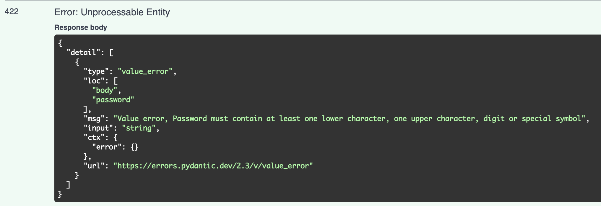

---
hide:
  - navigation
---

# FastAPI 最佳实践

FastAPI Best Practices

=== "中文"

    以下是我在初创公司中使用的一套带有主观倾向的最佳实践与约定列表。

    在过去几年的生产环境中，  
    我们做出过一些好决策，也犯过一些错误，而这些决策极大地影响了开发者体验。  
    其中有些经验值得分享。

=== "英文"

    Opinionated list of best practices and conventions I use in startups.

    For the last several years in production,
    we have been making good and bad decisions that impacted our developer experience dramatically.
    Some of them are worth sharing.

## 项目结构

Project Structure

=== "中文"

    项目结构有很多种方式，但最好的结构是**一致的、直接的，并且不会令人惊讶的**。

    很多示例项目和教程倾向于按文件类型（例如 crud、routers、models）划分项目结构，这种方式适用于微服务或业务范围较小的项目。  
    但对于拥有多个领域和模块的单体应用来说，这种结构就不太合适了。

    我发现一种更适合这类场景的结构，它具有更好的可扩展性和可演化性，灵感来自 Netflix 的 [Dispatch](https://github.com/Netflix/dispatch)，并在此基础上做了一些小的改动：

    ```text
    fastapi-project
    ├── alembic/
    ├── src
    │   ├── auth
    │   │   ├── router.py
    │   │   ├── schemas.py  # pydantic 模型
    │   │   ├── models.py  # 数据库模型
    │   │   ├── dependencies.py
    │   │   ├── config.py  # 本地配置
    │   │   ├── constants.py
    │   │   ├── exceptions.py
    │   │   ├── service.py
    │   │   └── utils.py
    │   ├── aws
    │   │   ├── client.py  # 用于外部服务通信的客户端模型
    │   │   ├── schemas.py
    │   │   ├── config.py
    │   │   ├── constants.py
    │   │   ├── exceptions.py
    │   │   └── utils.py
    │   └── posts
    │   │   ├── router.py
    │   │   ├── schemas.py
    │   │   ├── models.py
    │   │   ├── dependencies.py
    │   │   ├── constants.py
    │   │   ├── exceptions.py
    │   │   ├── service.py
    │   │   └── utils.py
    │   ├── config.py  # 全局配置
    │   ├── models.py  # 全局模型
    │   ├── exceptions.py  # 全局异常
    │   ├── pagination.py  # 全局模块，例如分页
    │   ├── database.py  # 数据库连接相关
    │   └── main.py
    ├── tests/
    │   ├── auth
    │   ├── aws
    │   └── posts
    ├── templates/
    │   └── index.html
    ├── requirements
    │   ├── base.txt
    │   ├── dev.txt
    │   └── prod.txt
    ├── .env
    ├── .gitignore
    ├── logging.ini
    └── alembic.ini
    ```

    1. 将所有领域模块目录存放于 `src` 文件夹中  
        1. `src/` - 应用的最高层级，包含通用模型、配置项和常量等  
        2. `src/main.py` - 项目入口，初始化 FastAPI 应用  

    2. 每个包（模块）都拥有自己的 router、schemas、models 等：
        1. `router.py` - 每个模块的核心，包含所有接口定义  
        2. `schemas.py` - 定义 Pydantic 模型  
        3. `models.py` - 定义数据库模型  
        4. `service.py` - 模块内的业务逻辑  
        5. `dependencies.py` - 路由依赖  
        6. `constants.py` - 模块常量和错误码  
        7. `config.py` - 模块配置项（例如环境变量）  
        8.  `utils.py` - 非业务逻辑函数，例如响应格式化、数据补充等  
        9.  `exceptions.py` - 模块自定义异常，例如 `PostNotFound`、`InvalidUserData`  

    3.  当某个模块需要使用其他模块的服务、依赖或常量时——请使用**显式模块名进行导入**。

    ```python
    from src.auth import constants as auth_constants
    from src.notifications import service as notification_service
    from src.posts.constants import ErrorCode as PostsErrorCode  # 如果我们在每个包的常量模块中都有标准错误代码
    ```

=== "英文"

    There are many ways to structure a project, but the best structure is one that is consistent, straightforward, and free of surprises.

    Many example projects and tutorials divide the project by file type (e.g., crud, routers, models), which works well for microservices or projects with fewer scopes. However, this approach didn't fit our monolith with many domains and modules.

    The structure I found more scalable and evolvable for these cases is inspired by Netflix's [Dispatch](https://github.com/Netflix/dispatch), with some minor modifications.

    ```text
    fastapi-project
    ├── alembic/
    ├── src
    │   ├── auth
    │   │   ├── router.py
    │   │   ├── schemas.py  # pydantic models
    │   │   ├── models.py  # db models
    │   │   ├── dependencies.py
    │   │   ├── config.py  # local configs
    │   │   ├── constants.py
    │   │   ├── exceptions.py
    │   │   ├── service.py
    │   │   └── utils.py
    │   ├── aws
    │   │   ├── client.py  # client model for external service communication
    │   │   ├── schemas.py
    │   │   ├── config.py
    │   │   ├── constants.py
    │   │   ├── exceptions.py
    │   │   └── utils.py
    │   └── posts
    │   │   ├── router.py
    │   │   ├── schemas.py
    │   │   ├── models.py
    │   │   ├── dependencies.py
    │   │   ├── constants.py
    │   │   ├── exceptions.py
    │   │   ├── service.py
    │   │   └── utils.py
    │   ├── config.py  # global configs
    │   ├── models.py  # global models
    │   ├── exceptions.py  # global exceptions
    │   ├── pagination.py  # global module e.g. pagination
    │   ├── database.py  # db connection related stuff
    │   └── main.py
    ├── tests/
    │   ├── auth
    │   ├── aws
    │   └── posts
    ├── templates/
    │   └── index.html
    ├── requirements
    │   ├── base.txt
    │   ├── dev.txt
    │   └── prod.txt
    ├── .env
    ├── .gitignore
    ├── logging.ini
    └── alembic.ini
    ```

    1. Store all domain directories inside `src` folder
       1. `src/` - highest level of an app, contains common models, configs, and constants, etc.
       2. `src/main.py` - root of the project, which inits the FastAPI app
    2. Each package has its own router, schemas, models, etc.
       1. `router.py` - is a core of each module with all the endpoints
       2. `schemas.py` - for pydantic models
       3. `models.py` - for db models
       4. `service.py` - module specific business logic  
       5. `dependencies.py` - router dependencies
       6. `constants.py` - module specific constants and error codes
       7. `config.py` - e.g. env vars
       8. `utils.py` - non-business logic functions, e.g. response normalization, data enrichment, etc.
       9. `exceptions.py` - module specific exceptions, e.g. `PostNotFound`, `InvalidUserData`
    3. When package requires services or dependencies or constants from other packages - import them with an explicit module name

    ```python
    from src.auth import constants as auth_constants
    from src.notifications import service as notification_service
    from src.posts.constants import ErrorCode as PostsErrorCode  # in case we have Standard ErrorCode in constants module of each package
    ```

## 异步路由

Async Routes

=== "中文"

    FastAPI 本质上是一个异步框架。它设计用来配合异步 I/O 操作运行，这也是它如此高效的原因。

    不过，FastAPI 并不会强制你只能使用 `async` 路由，开发者同样可以使用 `sync` 路由。这可能会让初学者误以为二者是等价的，但实际上并不是。

=== "英文"

    FastAPI is an async framework, in the first place. It is designed to work with async I/O operations and that is the reason it is so fast.

    However, FastAPI doesn't restrict you to use only `async` routes, and the developer can use `sync` routes as well. This might confuse beginner developers into believing that they are the same, but they are not.

### I/O密集型任务

I/O Intensive Tasks

=== "中文"

    在底层，FastAPI 可以[高效地处理](https://fastapi.tiangolo.com/async/#path-operation-functions)异步和同步 I/O 操作：
    
    - FastAPI 会将 `sync` 路由放入[线程池](https://en.wikipedia.org/wiki/Thread_pool)中运行，  
      阻塞型 I/O 操作不会阻止 [事件循环](https://docs.python.org/3/library/asyncio-eventloop.html) 执行其他任务。
    - 如果路由定义为 `async`，则会通过 `await` 正常调用，  
      FastAPI 会信任你只执行非阻塞的 I/O 操作。
    
    但问题是，如果你辜负了这份信任，在异步路由中执行了阻塞操作，  
    那么事件循环将无法继续执行其他任务，直到该阻塞操作完成。
    
    ```python
    import asyncio
    import time
    
    from fastapi import APIRouter
    
    
    router = APIRouter()
    
    
    @router.get("/terrible-ping")
    async def terrible_ping():
        time.sleep(10) # 阻塞 10 秒的 I/O 操作，整个进程都会被卡住
        
        return {"pong": True}
    
    @router.get("/good-ping")
    def good_ping():
        time.sleep(10) # 阻塞 10 秒的 I/O 操作，但在单独线程中执行，不影响主线程
    
        return {"pong": True}
    
    @router.get("/perfect-ping")
    async def perfect_ping():
        await asyncio.sleep(10) # 非阻塞的 I/O 操作
    
        return {"pong": True}
    
    ```
    
    **当我们调用以下路由时会发生什么：**
    
    1. `GET /terrible-ping`
        1. FastAPI 服务器接收到请求，开始处理
        2. 服务器的事件循环以及队列中的所有任务都会等待 `time.sleep()` 执行完成  
            1. 服务器认为 `time.sleep()` 不是 I/O 操作，因此会等待它执行完毕  
            2. 等待期间服务器不会接受新请求  
        3. 执行完毕后服务器返回响应  
            1. 响应完成后服务器开始接受新的请求  
    2. `GET /good-ping`
        1. FastAPI 服务器接收到请求，开始处理  
        2. FastAPI 将整个 `good_ping` 路由发送到线程池，由其中一个工作线程执行  
        3. `good_ping` 在执行期间，事件循环会从队列中选择下一个任务继续处理（如：接收新请求、调用数据库）  
            - 工作线程会独立于主线程（也就是我们的 FastAPI 应用）等待 `time.sleep` 完成  
            - 同步操作只会阻塞该工作线程，而不会影响主线程  
        4. `good_ping` 执行完成后，服务器返回响应给客户端  
    3. `GET /perfect-ping`
        1. FastAPI 服务器接收到请求，开始处理  
        2. FastAPI 调用 `await asyncio.sleep(10)`  
        3. 事件循环会继续选择队列中的下一个任务继续处理（如：接收新请求、调用数据库）  
        4. 当 `asyncio.sleep(10)` 执行完成后，服务器继续执行路由逻辑，并将响应返回给客户端  
    
    
    !!! warning "关于线程池的注意事项："

        - 线程比协程消耗更多资源，因此它们不像异步 I/O 操作那样廉价。
        - 线程池中的线程数量是有限的，也就是说你可能会耗尽线程资源，导致应用变慢。[进一步阅读](https://github.com/Kludex/fastapi-tips?tab=readme-ov-file#2-be-careful-with-non-async-functions)（外部链接）

=== "英文"

    Under the hood, FastAPI can [effectively handle](https://fastapi.tiangolo.com/async/#path-operation-functions) both async and sync I/O operations.
    
    - FastAPI runs `sync` routes in the [threadpool](https://en.wikipedia.org/wiki/Thread_pool)
    and blocking I/O operations won't stop the [event loop](https://docs.python.org/3/library/asyncio-eventloop.html)
    from executing the tasks.
    - If the route is defined `async` then it's called regularly via `await`
    and FastAPI trusts you to do only non-blocking I/O operations.
    
    The caveat is if you fail that trust and execute blocking operations within async routes,
    the event loop will not be able to run the next tasks until that blocking operation is done.
    
    ```python
    import asyncio
    import time
    
    from fastapi import APIRouter
    
    
    router = APIRouter()
    
    
    @router.get("/terrible-ping")
    async def terrible_ping():
        time.sleep(10) # I/O blocking operation for 10 seconds, the whole process will be blocked
        
        return {"pong": True}
    
    @router.get("/good-ping")
    def good_ping():
        time.sleep(10) # I/O blocking operation for 10 seconds, but in a separate thread for the whole `good_ping` route
    
        return {"pong": True}
    
    @router.get("/perfect-ping")
    async def perfect_ping():
        await asyncio.sleep(10) # non-blocking I/O operation
    
        return {"pong": True}
    
    ```
    
    **What happens when we call:**
    
    1. `GET /terrible-ping`
        1. FastAPI server receives a request and starts handling it
        2. Server's event loop and all the tasks in the queue will be waiting until `time.sleep()` is finished
            1. Server thinks `time.sleep()` is not an I/O task, so it waits until it is finished
            2. Server won't accept any new requests while waiting
        3. Server returns the response.
            1. After a response, server starts accepting new requests
    2. `GET /good-ping`
        1. FastAPI server receives a request and starts handling it
        2. FastAPI sends the whole route `good_ping` to the threadpool, where a worker thread will run the function
        3. While `good_ping` is being executed, event loop selects next tasks from the queue and works on them (e.g. accept new request, call db)
            - Independently of main thread (i.e. our FastAPI app),
                worker thread will be waiting for `time.sleep` to finish.
            - Sync operation blocks only the side thread, not the main one.
        4. When `good_ping` finishes its work, server returns a response to the client
    3. `GET /perfect-ping`
        1. FastAPI server receives a request and starts handling it
        2. FastAPI awaits `asyncio.sleep(10)`
        3. Event loop selects next tasks from the queue and works on them (e.g. accept new request, call db)
        4. When `asyncio.sleep(10)` is done, servers finishes the execution of the route and returns a response to the client
    
    !!! warning "Notes on the thread pool:"

        - Threads require more resources than coroutines, so they are not as cheap as async I/O operations.
        - Thread pool has a limited number of threads, i.e. you might run out of threads and your app will become slow. [Read more](https://github.com/Kludex/fastapi-tips?tab=readme-ov-file#2-be-careful-with-non-async-functions) (external link)

### CPU 密集型任务

CPU Intensive Tasks

=== "中文"

    第二个注意事项是，非阻塞的可等待任务或被发送到线程池的操作必须是 I/O 密集型任务（例如：打开文件、数据库调用、外部 API 调用）。
    
    - 等待 CPU 密集型任务（例如：重计算、数据处理、视频转码）是没有意义的，因为 CPU 需要工作才能完成这些任务，而 I/O 操作则是外部任务，服务器在等待 I/O 操作完成时不做任何事情，因此可以继续执行下一个任务。
    - 在其他线程中运行 CPU 密集型任务也不有效，因为存在 [GIL](https://realpython.com/python-gil/)。  
      简而言之，GIL 只允许一个线程同时工作，这使得它对于 CPU 密集型任务无效。
    - 如果你想优化 CPU 密集型任务，应该将它们发送到其他进程中的工作线程。
    
    **相关的 StackOverflow 问题：**
    
    1. <https://stackoverflow.com/questions/62976648/architecture-flask-vs-fastapi/70309597#70309597>  
       - 你也可以查看 [我的回答](https://stackoverflow.com/a/70309597/6927498)
    2. <https://stackoverflow.com/questions/65342833/fastapi-uploadfile-is-slow-compared-to-flask>
    3. <https://stackoverflow.com/questions/71516140/fastapi-runs-api-calls-in-serial-instead-of-parallel-fashion>

=== "英文"

    The second caveat is that operations that are non-blocking awaitables or are sent to the thread pool must be I/O intensive tasks (e.g. open file, db call, external API call).
    
    - Awaiting CPU-intensive tasks (e.g. heavy calculations, data processing, video transcoding) is worthless since the CPU has to work to finish the tasks,
    while I/O operations are external and server does nothing while waiting for that operations to finish, thus it can go to the next tasks.
    - Running CPU-intensive tasks in other threads also isn't effective, because of [GIL](https://realpython.com/python-gil/).
    In short, GIL allows only one thread to work at a time, which makes it useless for CPU tasks.
    - If you want to optimize CPU intensive tasks you should send them to workers in another process.
    
    **Related StackOverflow questions of confused users**
    
    1. <https://stackoverflow.com/questions/62976648/architecture-flask-vs-fastapi/70309597#70309597>
       - Here you can also check [my answer](https://stackoverflow.com/a/70309597/6927498)
    2. <https://stackoverflow.com/questions/65342833/fastapi-uploadfile-is-slow-compared-to-flask>
    3. <https://stackoverflow.com/questions/71516140/fastapi-runs-api-calls-in-serial-instead-of-parallel-fashion>

## Pydantic

### 积极使用 Pydantic

Excessively use Pydantic

=== "中文"

    Pydantic 提供了一整套功能来验证和转换数据。

    除了常规的字段要求（如必需字段、非必需字段、默认值等），  
    Pydantic 还内置了全面的数据处理工具，如正则表达式、枚举、字符串操作、电子邮件验证等。

    ```python
    from enum import Enum
    from pydantic import AnyUrl, BaseModel, EmailStr, Field


    class MusicBand(str, Enum):
    AEROSMITH = "AEROSMITH"
    QUEEN = "QUEEN"
    ACDC = "AC/DC"


    class UserBase(BaseModel):
        first_name: str = Field(min_length=1, max_length=128)
        username: str = Field(min_length=1, max_length=128, pattern="^[A-Za-z0-9-_]+$")
        email: EmailStr
        age: int = Field(ge=18, default=None)  # 必须大于或等于 18
        favorite_band: MusicBand | None = None  # 只允许输入 "AEROSMITH", "QUEEN", "AC/DC"
        website: AnyUrl | None = None
    ```

=== "英文"

    Pydantic has a rich set of features to validate and transform data.

    In addition to regular features like required & non-required fields with default values,
    Pydantic has built-in comprehensive data processing tools like regex, enums, strings manipulation, emails validation, etc.

    ```python
    from enum import Enum
    from pydantic import AnyUrl, BaseModel, EmailStr, Field


    class MusicBand(str, Enum):
    AEROSMITH = "AEROSMITH"
    QUEEN = "QUEEN"
    ACDC = "AC/DC"


    class UserBase(BaseModel):
        first_name: str = Field(min_length=1, max_length=128)
        username: str = Field(min_length=1, max_length=128, pattern="^[A-Za-z0-9-_]+$")
        email: EmailStr
        age: int = Field(ge=18, default=None)  # must be greater or equal to 18
        favorite_band: MusicBand | None = None  # only "AEROSMITH", "QUEEN", "AC/DC" values are allowed to be inputted
        website: AnyUrl | None = None
    ```

### 自定义基础模型

Custom Base Model

=== "中文"

    拥有一个可控的全局基础模型可以让我们自定义应用中的所有模型。例如，我们可以强制执行标准的日期时间格式或为所有基础模型的子类引入一个通用方法。

    ```python
    from datetime import datetime
    from zoneinfo import ZoneInfo

    from fastapi.encoders import jsonable_encoder
    from pydantic import BaseModel, ConfigDict


    def datetime_to_gmt_str(dt: datetime) -> str:
        if not dt.tzinfo:
            dt = dt.replace(tzinfo=ZoneInfo("UTC"))

        return dt.strftime("%Y-%m-%dT%H:%M:%S%z")


    class CustomModel(BaseModel):
        model_config = ConfigDict(
            json_encoders={datetime: datetime_to_gmt_str},
            populate_by_name=True,
        )

        def serializable_dict(self, **kwargs):
            """返回一个只包含可序列化字段的字典。"""
            default_dict = self.model_dump()

            return jsonable_encoder(default_dict)
    ```

    在上面的示例中，我们决定创建一个全局基础模型，该模型：

    - 将所有的日期时间字段序列化为具有明确时区的标准格式
    - 提供一个方法来返回只包含可序列化字段的字典

=== "英文"

    Having a controllable global base model allows us to customize all the models within the app. For instance, we can enforce a standard datetime format or introduce a common method for all subclasses of the base model.

    ```python
    from datetime import datetime
    from zoneinfo import ZoneInfo

    from fastapi.encoders import jsonable_encoder
    from pydantic import BaseModel, ConfigDict


    def datetime_to_gmt_str(dt: datetime) -> str:
        if not dt.tzinfo:
            dt = dt.replace(tzinfo=ZoneInfo("UTC"))

        return dt.strftime("%Y-%m-%dT%H:%M:%S%z")


    class CustomModel(BaseModel):
        model_config = ConfigDict(
            json_encoders={datetime: datetime_to_gmt_str},
            populate_by_name=True,
        )

        def serializable_dict(self, **kwargs):
            """Return a dict which contains only serializable fields."""
            default_dict = self.model_dump()

            return jsonable_encoder(default_dict)


    ```

    In the example above, we have decided to create a global base model that:

    - Serializes all datetime fields to a standard format with an explicit timezone
    - Provides a method to return a dict with only serializable fields

### 解耦 Pydantic BaseSettings

Decouple Pydantic BaseSettings

=== "中文"

    BaseSettings 是读取环境变量的一个伟大创新，但如果整个应用只有一个 BaseSettings，随着时间推移可能会变得凌乱。为了提高可维护性和组织性，我们将 BaseSettings 拆分到不同的模块和领域中。

    ```python
    # src.auth.config
    from datetime import timedelta

    from pydantic_settings import BaseSettings


    class AuthConfig(BaseSettings):
        JWT_ALG: str
        JWT_SECRET: str
        JWT_EXP: int = 5  # 分钟

        REFRESH_TOKEN_KEY: str
        REFRESH_TOKEN_EXP: timedelta = timedelta(days=30)

        SECURE_COOKIES: bool = True


    auth_settings = AuthConfig()


    # src.config
    from pydantic import PostgresDsn, RedisDsn, model_validator
    from pydantic_settings import BaseSettings

    from src.constants import Environment


    class Config(BaseSettings):
        DATABASE_URL: PostgresDsn
        REDIS_URL: RedisDsn

        SITE_DOMAIN: str = "myapp.com"

        ENVIRONMENT: Environment = Environment.PRODUCTION

        SENTRY_DSN: str | None = None

        CORS_ORIGINS: list[str]
        CORS_ORIGINS_REGEX: str | None = None
        CORS_HEADERS: list[str]

        APP_VERSION: str = "1.0"


    settings = Config()

    ```

=== "英文"

    BaseSettings was a great innovation for reading environment variables, but having a single BaseSettings for the whole app can become messy over time. To improve maintainability and organization, we have split the BaseSettings across different modules and domains.

    ```python
    # src.auth.config
    from datetime import timedelta

    from pydantic_settings import BaseSettings


    class AuthConfig(BaseSettings):
        JWT_ALG: str
        JWT_SECRET: str
        JWT_EXP: int = 5  # minutes

        REFRESH_TOKEN_KEY: str
        REFRESH_TOKEN_EXP: timedelta = timedelta(days=30)

        SECURE_COOKIES: bool = True


    auth_settings = AuthConfig()


    # src.config
    from pydantic import PostgresDsn, RedisDsn, model_validator
    from pydantic_settings import BaseSettings

    from src.constants import Environment


    class Config(BaseSettings):
        DATABASE_URL: PostgresDsn
        REDIS_URL: RedisDsn

        SITE_DOMAIN: str = "myapp.com"

        ENVIRONMENT: Environment = Environment.PRODUCTION

        SENTRY_DSN: str | None = None

        CORS_ORIGINS: list[str]
        CORS_ORIGINS_REGEX: str | None = None
        CORS_HEADERS: list[str]

        APP_VERSION: str = "1.0"


    settings = Config()

    ```

## 依赖项

Dependencies

### 依赖注入之外

Beyond Dependency Injection

=== "中文"

    Pydantic 是一个很棒的模式验证器，但对于涉及调用数据库或外部服务的复杂验证，它并不够充分。

    FastAPI 文档大多将依赖关系呈现为端点的 DI（依赖注入），但它们同样非常适合请求验证。

    依赖关系可以用来根据数据库约束验证数据（例如，检查电子邮件是否已存在、确保用户已找到等）。

    ```python
    # dependencies.py
    async def valid_post_id(post_id: UUID4) -> dict[str, Any]:
        post = await service.get_by_id(post_id)
        if not post:
            raise PostNotFound()

        return post


    # router.py
    @router.get("/posts/{post_id}", response_model=PostResponse)
    async def get_post_by_id(post: dict[str, Any] = Depends(valid_post_id)):
        return post


    @router.put("/posts/{post_id}", response_model=PostResponse)
    async def update_post(
        update_data: PostUpdate,  
        post: dict[str, Any] = Depends(valid_post_id), 
    ):
        updated_post = await service.update(id=post["id"], data=update_data)
        return updated_post


    @router.get("/posts/{post_id}/reviews", response_model=list[ReviewsResponse])
    async def get_post_reviews(post: dict[str, Any] = Depends(valid_post_id)):
        post_reviews = await reviews_service.get_by_post_id(post["id"])
        return post_reviews
    ```

=== "英文"

    Pydantic is a great schema validator, but for complex validations that involve calling a database or external services, it is not sufficient.

    FastAPI documentation mostly presents dependencies as DI for endpoints, but they are also excellent for request validation.

    Dependencies can be used to validate data against database constraints (e.g., checking if an email already exists, ensuring a user is found, etc.).

    ```python
    # dependencies.py
    async def valid_post_id(post_id: UUID4) -> dict[str, Any]:
        post = await service.get_by_id(post_id)
        if not post:
            raise PostNotFound()

        return post


    # router.py
    @router.get("/posts/{post_id}", response_model=PostResponse)
    async def get_post_by_id(post: dict[str, Any] = Depends(valid_post_id)):
        return post


    @router.put("/posts/{post_id}", response_model=PostResponse)
    async def update_post(
        update_data: PostUpdate,  
        post: dict[str, Any] = Depends(valid_post_id), 
    ):
        updated_post = await service.update(id=post["id"], data=update_data)
        return updated_post


    @router.get("/posts/{post_id}/reviews", response_model=list[ReviewsResponse])
    async def get_post_reviews(post: dict[str, Any] = Depends(valid_post_id)):
        post_reviews = await reviews_service.get_by_post_id(post["id"])
        return post_reviews
    ```

    If we didn't put data validation to dependency, we would have to validate `post_id` exists
    for every endpoint and write the same tests for each of them.

### 链式依赖

Chain Dependencies

=== "中文"

    如果我们没有将数据验证放到依赖关系中，我们将不得不在每个端点中验证 `post_id` 是否存在，并为每个端点编写相同的测试。

    依赖关系可以使用其他依赖关系，避免类似逻辑的代码重复。

    ```python
    # dependencies.py
    from fastapi.security import OAuth2PasswordBearer
    from jose import JWTError, jwt

    async def valid_post_id(post_id: UUID4) -> dict[str, Any]:
        post = await service.get_by_id(post_id)
        if not post:
            raise PostNotFound()

        return post


    async def parse_jwt_data(
        token: str = Depends(OAuth2PasswordBearer(tokenUrl="/auth/token"))
    ) -> dict[str, Any]:
        try:
            payload = jwt.decode(token, "JWT_SECRET", algorithms=["HS256"])
        except JWTError:
            raise InvalidCredentials()

        return {"user_id": payload["id"]}


    async def valid_owned_post(
        post: dict[str, Any] = Depends(valid_post_id), 
        token_data: dict[str, Any] = Depends(parse_jwt_data),
    ) -> dict[str, Any]:
        if post["creator_id"] != token_data["user_id"]:
            raise UserNotOwner()

        return post

    # router.py
    @router.get("/users/{user_id}/posts/{post_id}", response_model=PostResponse)
    async def get_user_post(post: dict[str, Any] = Depends(valid_owned_post)):
        return post
    ```

=== "英文"

    Dependencies can use other dependencies and avoid code repetition for the similar logic.

    ```python
    # dependencies.py
    from fastapi.security import OAuth2PasswordBearer
    from jose import JWTError, jwt

    async def valid_post_id(post_id: UUID4) -> dict[str, Any]:
        post = await service.get_by_id(post_id)
        if not post:
            raise PostNotFound()

        return post


    async def parse_jwt_data(
        token: str = Depends(OAuth2PasswordBearer(tokenUrl="/auth/token"))
    ) -> dict[str, Any]:
        try:
            payload = jwt.decode(token, "JWT_SECRET", algorithms=["HS256"])
        except JWTError:
            raise InvalidCredentials()

        return {"user_id": payload["id"]}


    async def valid_owned_post(
        post: dict[str, Any] = Depends(valid_post_id), 
        token_data: dict[str, Any] = Depends(parse_jwt_data),
    ) -> dict[str, Any]:
        if post["creator_id"] != token_data["user_id"]:
            raise UserNotOwner()

        return post

    # router.py
    @router.get("/users/{user_id}/posts/{post_id}", response_model=PostResponse)
    async def get_user_post(post: dict[str, Any] = Depends(valid_owned_post)):
        return post

    ```

### 解耦并重用依赖项。依赖项调用会被缓存

Decouple & Reuse dependencies. Dependency calls are cached

=== "中文"

    依赖关系可以多次复用，并且它们不会被重新计算——FastAPI 默认会在请求的范围内缓存依赖关系的结果，  
    即如果 `valid_post_id` 在一个路由中被调用多次，它只会被调用一次。

    了解这一点后，我们可以将依赖关系解耦成多个操作于小范围的函数，这些函数更容易在其他路由中复用。  
    例如，在下面的代码中，我们三次使用了 `parse_jwt_data`：

    1. `valid_owned_post`
    2. `valid_active_creator`
    3. `get_user_post`,

    但 `parse_jwt_data` 只在第一次调用时被调用。

    ```python
    # dependencies.py
    from fastapi import BackgroundTasks
    from fastapi.security import OAuth2PasswordBearer
    from jose import JWTError, jwt

    async def valid_post_id(post_id: UUID4) -> Mapping:
        post = await service.get_by_id(post_id)
        if not post:
            raise PostNotFound()

        return post


    async def parse_jwt_data(
        token: str = Depends(OAuth2PasswordBearer(tokenUrl="/auth/token"))
    ) -> dict:
        try:
            payload = jwt.decode(token, "JWT_SECRET", algorithms=["HS256"])
        except JWTError:
            raise InvalidCredentials()

        return {"user_id": payload["id"]}


    async def valid_owned_post(
        post: Mapping = Depends(valid_post_id), 
        token_data: dict = Depends(parse_jwt_data),
    ) -> Mapping:
        if post["creator_id"] != token_data["user_id"]:
            raise UserNotOwner()

        return post


    async def valid_active_creator(
        token_data: dict = Depends(parse_jwt_data),
    ):
        user = await users_service.get_by_id(token_data["user_id"])
        if not user["is_active"]:
            raise UserIsBanned()
        
        if not user["is_creator"]:
        raise UserNotCreator()
        
        return user
            

    # router.py
    @router.get("/users/{user_id}/posts/{post_id}", response_model=PostResponse)
    async def get_user_post(
        worker: BackgroundTasks,
        post: Mapping = Depends(valid_owned_post),
        user: Mapping = Depends(valid_active_creator),
    ):
        """获取属于活跃用户的帖子。"""
        worker.add_task(notifications_service.send_email, user["id"])
        return post
    ```

=== "英文"

    Dependencies can be reused multiple times, and they won't be recalculated - FastAPI caches dependency's result within a request's scope by default,
    i.e. if `valid_post_id` gets called multiple times in one route, it will be called only once.

    Knowing this, we can decouple dependencies onto multiple smaller functions that operate on a smaller domain and are easier to reuse in other routes.
    For example, in the code below we are using `parse_jwt_data` three times:

    1. `valid_owned_post`
    2. `valid_active_creator`
    3. `get_user_post`,

    but `parse_jwt_data` is called only once, in the very first call.

    ```python
    # dependencies.py
    from fastapi import BackgroundTasks
    from fastapi.security import OAuth2PasswordBearer
    from jose import JWTError, jwt

    async def valid_post_id(post_id: UUID4) -> Mapping:
        post = await service.get_by_id(post_id)
        if not post:
            raise PostNotFound()

        return post


    async def parse_jwt_data(
        token: str = Depends(OAuth2PasswordBearer(tokenUrl="/auth/token"))
    ) -> dict:
        try:
            payload = jwt.decode(token, "JWT_SECRET", algorithms=["HS256"])
        except JWTError:
            raise InvalidCredentials()

        return {"user_id": payload["id"]}


    async def valid_owned_post(
        post: Mapping = Depends(valid_post_id), 
        token_data: dict = Depends(parse_jwt_data),
    ) -> Mapping:
        if post["creator_id"] != token_data["user_id"]:
            raise UserNotOwner()

        return post


    async def valid_active_creator(
        token_data: dict = Depends(parse_jwt_data),
    ):
        user = await users_service.get_by_id(token_data["user_id"])
        if not user["is_active"]:
            raise UserIsBanned()
        
        if not user["is_creator"]:
        raise UserNotCreator()
        
        return user
            

    # router.py
    @router.get("/users/{user_id}/posts/{post_id}", response_model=PostResponse)
    async def get_user_post(
        worker: BackgroundTasks,
        post: Mapping = Depends(valid_owned_post),
        user: Mapping = Depends(valid_active_creator),
    ):
        """Get post that belong the active user."""
        worker.add_task(notifications_service.send_email, user["id"])
        return post

    ```

### 首选 `async` 依赖项

Prefer `async` dependencies

=== "中文"

    FastAPI 支持 `sync` 和 `async` 依赖关系，当你不需要等待任何内容时，使用 `sync` 依赖关系可能很诱人，但这可能不是最好的选择。

    就像路由一样，`sync` 依赖关系是在线程池中运行的。而线程也有一定的成本和限制，如果你只是执行一个小的非 I/O 操作，那么使用线程池是多余的。

    [查看更多](https://github.com/Kludex/fastapi-tips?tab=readme-ov-file#9-your-dependencies-may-be-running-on-threads) (外部链接)

=== "英文"

    FastAPI supports both `sync` and `async` dependencies, and there is a temptation to use `sync` dependencies, when you don't have to await anything, but that might not be the best choice.

    Just as with routes, `sync` dependencies are run in the thread pool. And threads here also come with a price and limitations, that are redundant, if you just make a small non-I/O operation.

    [See more](https://github.com/Kludex/fastapi-tips?tab=readme-ov-file#9-your-dependencies-may-be-running-on-threads) (external link)

## 其他

Miscellaneous

### 遵循 REST

Follow the REST

=== "中文"

    开发 RESTful API 可以更方便地在路由中重用依赖关系，例如：

    1. `GET /courses/:course_id`
    2. `GET /courses/:course_id/chapters/:chapter_id/lessons`
    3. `GET /chapters/:chapter_id`

    唯一需要注意的是路径中使用相同的变量名：

    - 如果你有两个端点 `GET /profiles/:profile_id` 和 `GET /creators/:creator_id`，  
    它们都验证给定的 `profile_id` 是否存在，但 `GET /creators/:creator_id` 还会检查该个人是否为创作者，  
    那么最好将 `creator_id` 路径变量重命名为 `profile_id` 并将这两个依赖关系链式调用。

    ```python
    # src.profiles.dependencies
    async def valid_profile_id(profile_id: UUID4) -> Mapping:
        profile = await service.get_by_id(profile_id)
        if not profile:
            raise ProfileNotFound()

        return profile

    # src.creators.dependencies
    async def valid_creator_id(profile: Mapping = Depends(valid_profile_id)) -> Mapping:
        if not profile["is_creator"]:
        raise ProfileNotCreator()

        return profile

    # src.profiles.router.py
    @router.get("/profiles/{profile_id}", response_model=ProfileResponse)
    async def get_user_profile_by_id(profile: Mapping = Depends(valid_profile_id)):
        """根据 ID 获取个人资料。"""
        return profile

    # src.creators.router.py
    @router.get("/creators/{profile_id}", response_model=ProfileResponse)
    async def get_user_profile_by_id(
        creator_profile: Mapping = Depends(valid_creator_id)
    ):
        """根据 ID 获取创作者的个人资料。"""
        return creator_profile
    ```

=== "英文"

    Developing RESTful API makes it easier to reuse dependencies in routes like these:

        1. `GET /courses/:course_id`
        2. `GET /courses/:course_id/chapters/:chapter_id/lessons`
        3. `GET /chapters/:chapter_id`

    The only caveat is to use the same variable names in the path:

    - If you have two endpoints `GET /profiles/:profile_id` and `GET /creators/:creator_id`
    that both validate whether the given `profile_id` exists,  but `GET /creators/:creator_id`
    also checks if the profile is creator, then it's better to rename `creator_id` path variable to `profile_id` and chain those two dependencies.

    ```python
    # src.profiles.dependencies
    async def valid_profile_id(profile_id: UUID4) -> Mapping:
        profile = await service.get_by_id(profile_id)
        if not profile:
            raise ProfileNotFound()

        return profile

    # src.creators.dependencies
    async def valid_creator_id(profile: Mapping = Depends(valid_profile_id)) -> Mapping:
        if not profile["is_creator"]:
        raise ProfileNotCreator()

        return profile

    # src.profiles.router.py
    @router.get("/profiles/{profile_id}", response_model=ProfileResponse)
    async def get_user_profile_by_id(profile: Mapping = Depends(valid_profile_id)):
        """Get profile by id."""
        return profile

    # src.creators.router.py
    @router.get("/creators/{profile_id}", response_model=ProfileResponse)
    async def get_user_profile_by_id(
        creator_profile: Mapping = Depends(valid_creator_id)
    ):
        """Get creator's profile by id."""
        return creator_profile

    ```

### FastAPI 响应序列化

FastAPI response serialization

=== "中文"

    如果你认为可以返回与路由的 `response_model` 匹配的 Pydantic 对象以进行优化，那么这是错误的。

    FastAPI 首先使用 `jsonable_encoder` 将该 Pydantic 对象转换为字典，然后使用你的 `response_model` 验证数据，  
    最后才将对象序列化为 JSON。

    ```python
    from fastapi import FastAPI
    from pydantic import BaseModel, root_validator

    app = FastAPI()


    class ProfileResponse(BaseModel):
        @model_validator(mode="after")
        def debug_usage(self):
            print("创建了 Pydantic 模型")

            return self


    @app.get("/", response_model=ProfileResponse)
    async def root():
        return ProfileResponse()
    ```

    **日志输出：**

    ```text
    [INFO] [2022-08-28 12:00:00.000000] 创建了 Pydantic 模型
    [INFO] [2022-08-28 12:00:00.000020] 创建了 Pydantic 模型
    ```

=== "英文"

    If you think you can return Pydantic object that matches your route's `response_model` to make some optimizations,
    then it's wrong.

    FastAPI firstly converts that pydantic object to dict with its `jsonable_encoder`, then validates
    data with your `response_model`, and only then serializes your object to JSON.

    ```python
    from fastapi import FastAPI
    from pydantic import BaseModel, root_validator

    app = FastAPI()


    class ProfileResponse(BaseModel):
        @model_validator(mode="after")
        def debug_usage(self):
            print("created pydantic model")

            return self


    @app.get("/", response_model=ProfileResponse)
    async def root():
        return ProfileResponse()
    ```

    **Logs Output:**

    ```text
    [INFO] [2022-08-28 12:00:00.000000] created pydantic model
    [INFO] [2022-08-28 12:00:00.000020] created pydantic model
    ```

### 如果必须使用同步 SDK，则在线程池中运行它

If you must use sync SDK, then run it in a thread pool

=== "中文"

    如果你必须使用一个与外部服务交互的库，并且它不是 `async`，  
    那么应该在外部工作线程中进行 HTTP 调用。

    我们可以使用 Starlette 中著名的 `run_in_threadpool`。

    ```python
    from fastapi import FastAPI
    from fastapi.concurrency import run_in_threadpool
    from my_sync_library import SyncAPIClient 

    app = FastAPI()


    @app.get("/")
    async def call_my_sync_library():
        my_data = await service.get_my_data()

        client = SyncAPIClient()
        await run_in_threadpool(client.make_request, data=my_data)
    ```

=== "英文"

    If you must use a library to interact with external services, and it's not `async`,
    then make the HTTP calls in an external worker thread.

    We can use the well-known `run_in_threadpool` from starlette.

    ```python
    from fastapi import FastAPI
    from fastapi.concurrency import run_in_threadpool
    from my_sync_library import SyncAPIClient 

    app = FastAPI()


    @app.get("/")
    async def call_my_sync_library():
        my_data = await service.get_my_data()

        client = SyncAPIClient()
        await run_in_threadpool(client.make_request, data=my_data)
    ```

### ValueErrors 可能会变成 Pydantic ValidationError

ValueErrors might become Pydantic ValidationError

=== "中文"

    如果在 Pydantic 模式中引发 `ValueError`，且该模式直接暴露给客户端，FastAPI 会返回一个详细的响应给用户。

    ```python
    # src.profiles.schemas
    from pydantic import BaseModel, field_validator

    class ProfileCreate(BaseModel):
        username: str
        
        @field_validator("password", mode="after")
        @classmethod
        def valid_password(cls, password: str) -> str:
            if not re.match(STRONG_PASSWORD_PATTERN, password):
                raise ValueError(
                    "密码必须包含至少一个小写字母、"
                    "一个大写字母、"
                    "一个数字或"
                    "一个特殊符号"
                )

            return password


    # src.profiles.routes
    from fastapi import APIRouter

    router = APIRouter()


    @router.post("/profiles")
    async def get_creator_posts(profile_data: ProfileCreate):
    pass
    ```

    **响应示例：**

    

=== "英文"

    If you raise a `ValueError` in a Pydantic schema that is directly faced by the client, it will return a nice detailed response to users.

    ```python
    # src.profiles.schemas
    from pydantic import BaseModel, field_validator

    class ProfileCreate(BaseModel):
        username: str
        
        @field_validator("password", mode="after")
        @classmethod
        def valid_password(cls, password: str) -> str:
            if not re.match(STRONG_PASSWORD_PATTERN, password):
                raise ValueError(
                    "Password must contain at least "
                    "one lower character, "
                    "one upper character, "
                    "digit or "
                    "special symbol"
                )

            return password


    # src.profiles.routes
    from fastapi import APIRouter

    router = APIRouter()


    @router.post("/profiles")
    async def get_creator_posts(profile_data: ProfileCreate):
    pass
    ```

    **Response Example:**

    

### 文档

Docs

=== "中文"

    1. 除非你的 API 是公开的，否则默认隐藏文档。仅在选定的环境中显式显示它。

        ```python
        from fastapi import FastAPI
        from starlette.config import Config

        config = Config(".env")  # 解析 .env 文件中的环境变量

        ENVIRONMENT = config("ENVIRONMENT")  # 获取当前环境名称
        SHOW_DOCS_ENVIRONMENT = ("local", "staging")  # 显式列出允许的环境

        app_configs = {"title": "My Cool API"}
        if ENVIRONMENT not in SHOW_DOCS_ENVIRONMENT:
        app_configs["openapi_url"] = None  # 将文档的 URL 设置为 None

        app = FastAPI(**app_configs)
        ```

    2. 帮助 FastAPI 生成易于理解的文档
        1. 设置 `response_model`、`status_code`、`description` 等。
        2. 如果模型和状态不同，使用 `responses` 路由属性为不同的响应添加文档

        ```python
        from fastapi import APIRouter, status

        router = APIRouter()

        @router.post(
            "/endpoints",
            response_model=DefaultResponseModel,  # 默认的响应 Pydantic 模型 
            status_code=status.HTTP_201_CREATED,  # 默认状态码
            description="详细描述该端点",
            tags=["Endpoint Category"],
            summary="端点概述",
            responses={
                status.HTTP_200_OK: {
                    "model": OkResponse, # 自定义 Pydantic 模型用于 200 响应
                    "description": "成功响应",
                },
                status.HTTP_201_CREATED: {
                    "model": CreatedResponse,  # 自定义 Pydantic 模型用于 201 响应
                    "description": "根据用户请求创建某物",
                },
                status.HTTP_202_ACCEPTED: {
                    "model": AcceptedResponse,  # 自定义 Pydantic 模型用于 202 响应
                    "description": "接受请求并稍后处理",
                },
            },
        )
        async def documented_route():
            pass
        ```

    这将生成类似这样的文档：
    

=== "英文"

    1. Unless your API is public, hide docs by default. Show it explicitly on the selected envs only.

    ```python
    from fastapi import FastAPI
    from starlette.config import Config

    config = Config(".env")  # parse .env file for env variables

    ENVIRONMENT = config("ENVIRONMENT")  # get current env name
    SHOW_DOCS_ENVIRONMENT = ("local", "staging")  # explicit list of allowed envs

    app_configs = {"title": "My Cool API"}
    if ENVIRONMENT not in SHOW_DOCS_ENVIRONMENT:
    app_configs["openapi_url"] = None  # set url for docs as null

    app = FastAPI(**app_configs)
    ```

    2. Help FastAPI to generate an easy-to-understand docs
        1. Set `response_model`, `status_code`, `description`, etc.
        2. If models and statuses vary, use `responses` route attribute to add docs for different responses

    ```python
    from fastapi import APIRouter, status

    router = APIRouter()

    @router.post(
        "/endpoints",
        response_model=DefaultResponseModel,  # default response pydantic model 
        status_code=status.HTTP_201_CREATED,  # default status code
        description="Description of the well documented endpoint",
        tags=["Endpoint Category"],
        summary="Summary of the Endpoint",
        responses={
            status.HTTP_200_OK: {
                "model": OkResponse, # custom pydantic model for 200 response
                "description": "Ok Response",
            },
            status.HTTP_201_CREATED: {
                "model": CreatedResponse,  # custom pydantic model for 201 response
                "description": "Creates something from user request ",
            },
            status.HTTP_202_ACCEPTED: {
                "model": AcceptedResponse,  # custom pydantic model for 202 response
                "description": "Accepts request and handles it later",
            },
        },
    )
    async def documented_route():
        pass
    ```

    Will generate docs like this:
    

### 设置数据库键命名约定

Set DB keys naming conventions

=== "中文"

    显式设置索引命名以符合数据库的约定优于使用 SQLAlchemy 的默认命名。

    ```python
    from sqlalchemy import MetaData

    POSTGRES_INDEXES_NAMING_CONVENTION = {
        "ix": "%(column_0_label)s_idx",
        "uq": "%(table_name)s_%(column_0_name)s_key",
        "ck": "%(table_name)s_%(constraint_name)s_check",
        "fk": "%(table_name)s_%(column_0_name)s_fkey",
        "pk": "%(table_name)s_pkey",
    }
    metadata = MetaData(naming_convention=POSTGRES_INDEXES_NAMING_CONVENTION)
    ```

=== "英文"

    Explicitly setting the indexes' namings according to your database's convention is preferable over sqlalchemy's.

    ```python
    from sqlalchemy import MetaData

    POSTGRES_INDEXES_NAMING_CONVENTION = {
        "ix": "%(column_0_label)s_idx",
        "uq": "%(table_name)s_%(column_0_name)s_key",
        "ck": "%(table_name)s_%(constraint_name)s_check",
        "fk": "%(table_name)s_%(column_0_name)s_fkey",
        "pk": "%(table_name)s_pkey",
    }
    metadata = MetaData(naming_convention=POSTGRES_INDEXES_NAMING_CONVENTION)
    ```

### 迁移. Alembic

Migrations. Alembic

=== "中文"

    1. 迁移必须是静态的且可回退的。
    如果你的迁移依赖于动态生成的数据，确保唯一动态的部分是数据本身，而不是它的结构。
    2. 使用描述性名称和简短的描述生成迁移文件。描述是必需的，并且应该解释更改内容。
    3. 为新的迁移文件设置易读的文件模板。我们使用 `*date*_*slug*.py` 模式，例如 `2022-08-24_post_content_idx.py`

    ```
    # alembic.ini
    file_template = %%(year)d-%%(month).2d-%%(day).2d_%%(slug)s
    ```

=== "英文"

    1. Migrations must be static and revertable.
    If your migrations depend on dynamically generated data, then
    make sure the only thing that is dynamic is the data itself, not its structure.
    2. Generate migrations with descriptive names & slugs. Slug is required and should explain the changes.
    3. Set human-readable file template for new migrations. We use `*date*_*slug*.py` pattern, e.g. `2022-08-24_post_content_idx.py`

    ```
    # alembic.ini
    file_template = %%(year)d-%%(month).2d-%%(day).2d_%%(slug)s
    ```

### 设置数据库命名约定

Set DB naming conventions

=== "中文"

    保持名称的一致性非常重要。我们遵循的一些规则：

    1. 使用小写蛇形命名法（lower_case_snake）
    2. 使用单数形式（例如 `post`、`post_like`、`user_playlist`）
    3. 将相似的表分组在同一个模块前缀下，例如 `payment_account`、`payment_bill`、`post`、`post_like`
    4. 在所有表中保持一致性，但具体命名是可以接受的，例如：
        1. 在所有表中使用 `profile_id`，但如果某些表只需要创作者的个人资料，则使用 `creator_id`
        2. 对于所有抽象表（如 `post_like`、`post_view`）使用 `post_id`，但在相关模块中使用具体命名，如在 `chapters.course_id` 中使用 `course_id`
    5. 对于日期时间，使用 `_at` 后缀
    6. 对于日期，使用 `_date` 后缀

=== "英文"

    Being consistent with names is important. Some rules we followed:

    1. lower_case_snake
    2. singular form (e.g. `post`, `post_like`, `user_playlist`)
    3. group similar tables with module prefix, e.g. `payment_account`, `payment_bill`, `post`, `post_like`
    4. stay consistent across tables, but concrete namings are ok, e.g.
        1. use `profile_id` in all tables, but if some of them need only profiles that are creators, use `creator_id`
        2. use `post_id` for all abstract tables like `post_like`, `post_view`, but use concrete naming in relevant modules like `course_id` in `chapters.course_id`
    5. `_at` suffix for datetime
    6. `_date` suffix for date

### SQL 优先，Pydantic 其次

SQL-first. Pydantic-second

=== "中文"

    - 通常，数据库处理数据的速度和清晰度要远远快于 CPython。
    - 最好通过 SQL 来执行所有复杂的联接和简单的数据操作。
    - 最好将嵌套对象的 JSON 聚合到数据库中，以便更高效地响应。

    ```python
    # src.posts.service
    from typing import Any

    from pydantic import UUID4
    from sqlalchemy import desc, func, select, text
    from sqlalchemy.sql.functions import coalesce

    from src.database import database, posts, profiles, post_review, products

    async def get_posts(
        creator_id: UUID4, *, limit: int = 10, offset: int = 0
    ) -> list[dict[str, Any]]: 
        select_query = (
            select(
                (
                    posts.c.id,
                    posts.c.slug,
                    posts.c.title,
                    func.json_build_object(
                    text("'id', profiles.id"),
                    text("'first_name', profiles.first_name"),
                    text("'last_name', profiles.last_name"),
                    text("'username', profiles.username"),
                    ).label("creator"),
                )
            )
            .select_from(posts.join(profiles, posts.c.owner_id == profiles.c.id))
            .where(posts.c.owner_id == creator_id)
            .limit(limit)
            .offset(offset)
            .group_by(
                posts.c.id,
                posts.c.type,
                posts.c.slug,
                posts.c.title,
                profiles.c.id,
                profiles.c.first_name,
                profiles.c.last_name,
                profiles.c.username,
                profiles.c.avatar,
            )
            .order_by(
                desc(coalesce(posts.c.updated_at, posts.c.published_at, posts.c.created_at))
            )
        )
        
        return await database.fetch_all(select_query)

    # src.posts.schemas
    from typing import Any

    from pydantic import BaseModel, UUID4

    
    class Creator(BaseModel):
        id: UUID4
        first_name: str
        last_name: str
        username: str


    class Post(BaseModel):
        id: UUID4
        slug: str
        title: str
        creator: Creator

        
    # src.posts.router
    from fastapi import APIRouter, Depends

    router = APIRouter()


    @router.get("/creators/{creator_id}/posts", response_model=list[Post])
    async def get_creator_posts(creator: dict[str, Any] = Depends(valid_creator_id)):
    posts = await service.get_posts(creator["id"])

    return posts
    ```

=== "英文"

    - Usually, database handles data processing much faster and cleaner than CPython will ever do.
    - It's preferable to do all the complex joins and simple data manipulations with SQL.
    - It's preferable to aggregate JSONs in DB for responses with nested objects.

    ```python
    # src.posts.service
    from typing import Any

    from pydantic import UUID4
    from sqlalchemy import desc, func, select, text
    from sqlalchemy.sql.functions import coalesce

    from src.database import database, posts, profiles, post_review, products

    async def get_posts(
        creator_id: UUID4, *, limit: int = 10, offset: int = 0
    ) -> list[dict[str, Any]]: 
        select_query = (
            select(
                (
                    posts.c.id,
                    posts.c.slug,
                    posts.c.title,
                    func.json_build_object(
                    text("'id', profiles.id"),
                    text("'first_name', profiles.first_name"),
                    text("'last_name', profiles.last_name"),
                    text("'username', profiles.username"),
                    ).label("creator"),
                )
            )
            .select_from(posts.join(profiles, posts.c.owner_id == profiles.c.id))
            .where(posts.c.owner_id == creator_id)
            .limit(limit)
            .offset(offset)
            .group_by(
                posts.c.id,
                posts.c.type,
                posts.c.slug,
                posts.c.title,
                profiles.c.id,
                profiles.c.first_name,
                profiles.c.last_name,
                profiles.c.username,
                profiles.c.avatar,
            )
            .order_by(
                desc(coalesce(posts.c.updated_at, posts.c.published_at, posts.c.created_at))
            )
        )
        
        return await database.fetch_all(select_query)

    # src.posts.schemas
    from typing import Any

    from pydantic import BaseModel, UUID4

    
    class Creator(BaseModel):
        id: UUID4
        first_name: str
        last_name: str
        username: str


    class Post(BaseModel):
        id: UUID4
        slug: str
        title: str
        creator: Creator

        
    # src.posts.router
    from fastapi import APIRouter, Depends

    router = APIRouter()


    @router.get("/creators/{creator_id}/posts", response_model=list[Post])
    async def get_creator_posts(creator: dict[str, Any] = Depends(valid_creator_id)):
    posts = await service.get_posts(creator["id"])

    return posts
    ```

### 从第 0 天开始设置测试客户端异步

Set tests client async from day 0

=== "中文"

    编写带有数据库的集成测试很可能会导致将来出现事件循环错误。
    请立即设置异步测试客户端，例如 [httpx](https://github.com/encode/starlette/issues/652)。

    ```python
    import pytest
    from async_asgi_testclient import TestClient

    from src.main import app  # 初始化的 FastAPI 应用


    @pytest.fixture
    async def client() -> AsyncGenerator[TestClient, None]:
        host, port = "127.0.0.1", "9000"

        async with AsyncClient(transport=ASGITransport(app=app, client=(host, port)), base_url="http://test") as client:
            yield client


    @pytest.mark.asyncio
    async def test_create_post(client: TestClient):
        resp = await client.post("/posts")

        assert resp.status_code == 201
    ```

    除非你有同步数据库连接（抱歉？）或者不打算编写集成测试。

=== "英文"

    Writing integration tests with DB will most likely lead to messed up event loop errors in the future.
    Set the async test client immediately, e.g. [httpx](https://github.com/encode/starlette/issues/652)

    ```python
    import pytest
    from async_asgi_testclient import TestClient

    from src.main import app  # inited FastAPI app


    @pytest.fixture
    async def client() -> AsyncGenerator[TestClient, None]:
        host, port = "127.0.0.1", "9000"

        async with AsyncClient(transport=ASGITransport(app=app, client=(host, port)), base_url="http://test") as client:
            yield client


    @pytest.mark.asyncio
    async def test_create_post(client: TestClient):
        resp = await client.post("/posts")

        assert resp.status_code == 201
    ```

    Unless you have sync db connections (excuse me?) or aren't planning to write integration tests.

### 使用ruff

Use ruff

=== "中文"

    使用 linter，可以忘记格式化代码，专注于编写业务逻辑。

    [Ruff](https://github.com/astral-sh/ruff) 是一个 "极速" 的新 linter，取代了 black、autoflake、isort，并支持超过 600 条 lint 规则。

    使用 pre-commit 钩子是一个流行的好做法，但仅使用脚本对我们来说也可以。

    ```shell
    #!/bin/sh -e
    set -x

    ruff check --fix src
    ruff format src
    ```

=== "英文"

    With linters, you can forget about formatting the code and focus on writing the business logic.

    [Ruff](https://github.com/astral-sh/ruff) is "blazingly-fast" new linter that replaces black, autoflake, isort, and supports more than 600 lint rules.

    It's a popular good practice to use pre-commit hooks, but just using the script was ok for us.

    ```shell
    #!/bin/sh -e
    set -x

    ruff check --fix src
    ruff format src
    ```

## 奖励部分

Bonus Section

=== "中文"

    一些非常友善的人分享了他们的经验和最佳实践，绝对值得一读。
    请查看项目的 [issues](https://github.com/zhanymkanov/fastapi-best-practices/issues) 部分。

    例如， [lowercase00](https://github.com/zhanymkanov/fastapi-best-practices/issues/4) 
    详细描述了他们在处理权限与认证、基于类的服务与视图、任务队列、自定义响应序列化器、使用 dynaconf 配置等方面的最佳实践。

    如果你有关于使用 FastAPI 的经验，无论是好是坏，都非常欢迎创建一个新的 issue。我们很高兴阅读它。

=== "英文"

    Some very kind people shared their own experience and best practices that are definitely worth reading.
    Check them out at [issues](https://github.com/zhanymkanov/fastapi-best-practices/issues) section of the project.

    For instance, [lowercase00](https://github.com/zhanymkanov/fastapi-best-practices/issues/4)
    has described in details their best practices working with permissions & auth, class-based services & views,
    task queues, custom response serializers, configuration with dynaconf, etc.  

    If you have something to share about your experience working with FastAPI, whether it's good or bad,
    you are very welcome to create a new issue. It is our pleasure to read it.
